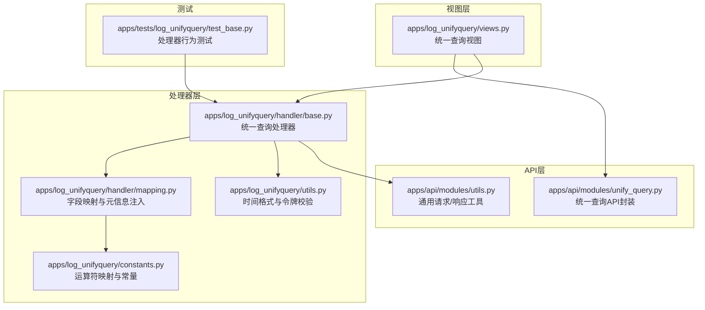
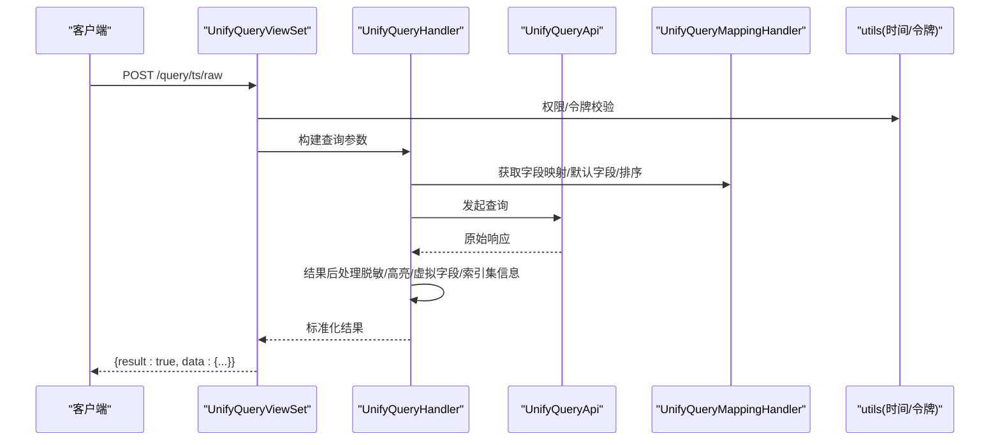
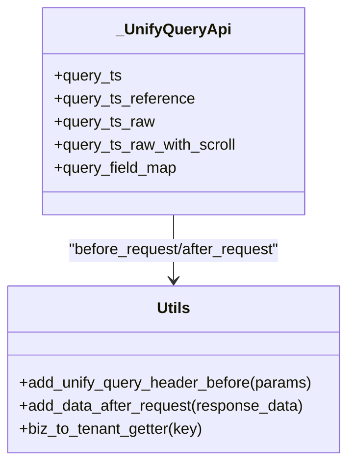
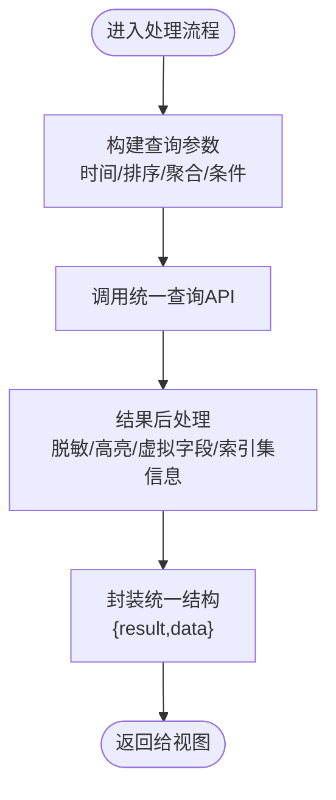
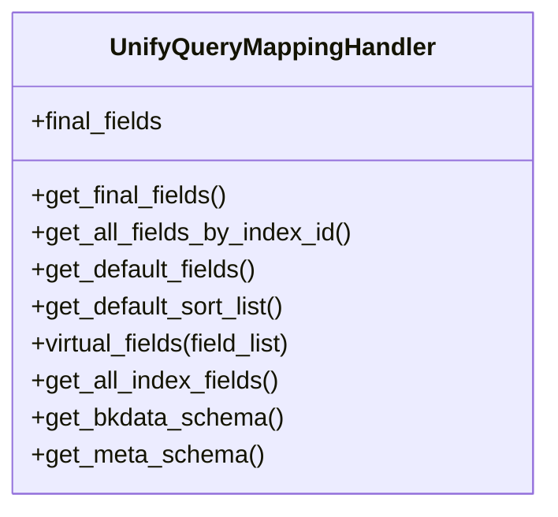
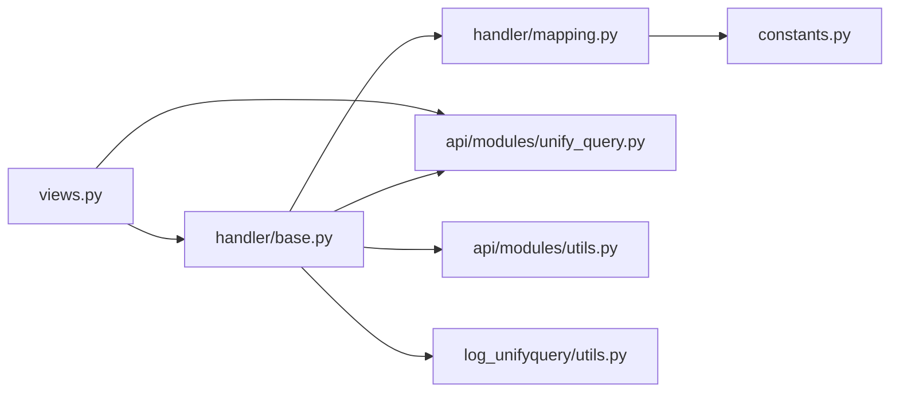

# 查询结果归一化处理

<cite>
**本文引用的文件**
- [unify_query.py](file://bklog/apps/api/modules/unify_query.py)
- [utils.py](file://bklog/apps/api/modules/utils.py)
- [views.py](file://bklog/apps/log_unifyquery/views.py)
- [base.py](file://bklog/apps/log_unifyquery/handler/base.py)
- [mapping.py](file://bklog/apps/log_unifyquery/handler/mapping.py)
- [constants.py](file://bklog/apps/log_unifyquery/constants.py)
- [utils.py](file://bklog/apps/log_unifyquery/utils.py)
- [test_base.py](file://bklog/apps/tests/log_unifyquery/test_base.py)
</cite>

## 目录
1. [简介](#简介)
2. [项目结构](#项目结构)
3. [核心组件](#核心组件)
4. [架构总览](#架构总览)
5. [详细组件分析](#详细组件分析)
6. [依赖关系分析](#依赖关系分析)
7. [性能考量](#性能考量)
8. [故障排查指南](#故障排查指南)
9. [结论](#结论)
10. [附录](#附录)

## 简介
本文件聚焦“查询结果归一化处理”，系统性说明如何将来自不同数据源（如 ES、BKData 等）的异构响应数据转换为统一标准格式，覆盖字段映射、时间戳标准化、元信息注入、脱敏与高亮处理、以及前后端一致的数据结构保障机制。同时给出扩展新数据源时结果处理器的实现方法与实践建议。

## 项目结构
围绕统一查询模块，相关代码分布在以下位置：
- API 层：封装统一查询接口与请求头注入、响应包装
- 视图层：对外暴露统一查询接口，负责鉴权与返回标准化响应
- 处理器层：构建查询参数、字段映射、时间字段处理、结果后处理与脱敏
- 工具层：通用工具函数（时间格式处理、鉴权信息注入、租户转换等）

图表来源
- [unify_query.py](file://bklog/apps/api/modules/unify_query.py#L1-L108)
- [utils.py](file://bklog/apps/api/modules/utils.py#L1-L406)
- [views.py](file://bklog/apps/log_unifyquery/views.py#L1-L184)
- [base.py](file://bklog/apps/log_unifyquery/handler/base.py#L1-L800)
- [mapping.py](file://bklog/apps/log_unifyquery/handler/mapping.py#L1-L846)
- [constants.py](file://bklog/apps/log_unifyquery/constants.py#L1-L98)
- [utils.py](file://bklog/apps/log_unifyquery/utils.py#L1-L83)
- [test_base.py](file://bklog/apps/tests/log_unifyquery/test_base.py#L1-L200)

章节来源
- [unify_query.py](file://bklog/apps/api/modules/unify_query.py#L1-L108)
- [utils.py](file://bklog/apps/api/modules/utils.py#L1-L406)
- [views.py](file://bklog/apps/log_unifyquery/views.py#L1-L184)
- [base.py](file://bklog/apps/log_unifyquery/handler/base.py#L1-L800)
- [mapping.py](file://bklog/apps/log_unifyquery/handler/mapping.py#L1-L846)
- [constants.py](file://bklog/apps/log_unifyquery/constants.py#L1-L98)
- [utils.py](file://bklog/apps/log_unifyquery/utils.py#L1-L83)
- [test_base.py](file://bklog/apps/tests/log_unifyquery/test_base.py#L1-L200)

## 核心组件
- 统一查询API封装：负责请求头注入（业务域、查询来源）、响应包装（统一 result/data 结构）、多接口声明（时序/非时序/原始日志/字段映射）。
- 统一查询视图：对外暴露接口，执行白名单与令牌校验，调用底层处理器或API。
- 统一查询处理器：构建查询参数、字段映射、时间字段处理、结果后处理（脱敏、高亮、虚拟字段、索引集信息注入）、导出字段处理。
- 字段映射与元信息注入：按场景组合字段、注入描述/别名/时间字段元信息、生成默认显示字段与排序规则。
- 通用工具：时间戳标准化、鉴权信息注入、租户ID转换、业务域适配。

章节来源
- [unify_query.py](file://bklog/apps/api/modules/unify_query.py#L24-L108)
- [views.py](file://bklog/apps/log_unifyquery/views.py#L33-L184)
- [base.py](file://bklog/apps/log_unifyquery/handler/base.py#L98-L265)
- [mapping.py](file://bklog/apps/log_unifyquery/handler/mapping.py#L188-L245)
- [utils.py](file://bklog/apps/log_unifyquery/utils.py#L47-L59)

## 架构总览
统一查询整体流程如下：
- 视图接收请求，执行权限校验；
- 构建查询参数（时间范围、排序、聚合字段、条件表达式等）；
- 调用统一查询API或处理器；
- 对响应进行后处理（字段映射、时间字段标准化、脱敏、高亮、虚拟字段、索引集信息注入）；
- 返回统一的 result/data 标准结构。

图表来源
- [views.py](file://bklog/apps/log_unifyquery/views.py#L33-L184)
- [base.py](file://bklog/apps/log_unifyquery/handler/base.py#L580-L700)
- [mapping.py](file://bklog/apps/log_unifyquery/handler/mapping.py#L418-L430)
- [utils.py](file://bklog/apps/log_unifyquery/utils.py#L47-L59)

## 详细组件分析

### 组件A：统一查询API封装（unify_query.py）
- 请求头注入：自动注入业务域空间UID、查询来源（用户名或后台）、应用信息；支持租户ID转换。
- 响应包装：将原始响应包裹为 {data: ..., result: ...}，便于前端统一处理。
- 多接口声明：时序检索、非时序检索、原始日志检索、滚动检索、字段映射查询。

图表来源
- [unify_query.py](file://bklog/apps/api/modules/unify_query.py#L24-L108)
- [utils.py](file://bklog/apps/api/modules/utils.py#L147-L248)

章节来源
- [unify_query.py](file://bklog/apps/api/modules/unify_query.py#L24-L108)
- [utils.py](file://bklog/apps/api/modules/utils.py#L147-L248)

### 组件B：统一查询视图（views.py）
- 权限校验：白名单应用跳过校验；非白名单应用需校验统一查询令牌。
- 接口暴露：时序检索、非时序检索、原始日志检索，均返回统一结构。

章节来源
- [views.py](file://bklog/apps/log_unifyquery/views.py#L33-L184)
- [utils.py](file://bklog/apps/log_unifyquery/utils.py#L61-L83)

### 组件C：统一查询处理器（base.py）
- 参数构建：时间范围标准化、排序规则、聚合字段、条件表达式转换、IP/主机ID合并、参考名生成。
- 结果后处理：字段脱敏、高亮处理、虚拟字段注入、索引集ID注入、导出字段映射、时间字段标准化、统计字段分析。
- 数据源适配：根据索引集场景（ES/BKDATA/LOG）选择不同的时间字段与字段映射策略。

图表来源
- [base.py](file://bklog/apps/log_unifyquery/handler/base.py#L580-L700)

章节来源
- [base.py](file://bklog/apps/log_unifyquery/handler/base.py#L98-L265)
- [base.py](file://bklog/apps/log_unifyquery/handler/base.py#L638-L700)

### 组件D：字段映射与元信息注入（mapping.py）
- 字段组合：按场景（BKDATA/ES）组合字段顺序，确保关键字段优先展示。
- 元信息注入：从 BKData Schema 或 Meta 接口获取字段描述、别名、时间字段时区与格式。
- 默认字段与排序：生成默认显示字段与排序规则，兼容对象字段与文本字段。
- 虚拟字段：根据现有字段推导生成虚拟字段（模块、集群、IPv6、BCS集群名等）。

图表来源
- [mapping.py](file://bklog/apps/log_unifyquery/handler/mapping.py#L188-L245)
- [mapping.py](file://bklog/apps/log_unifyquery/handler/mapping.py#L418-L430)

章节来源
- [mapping.py](file://bklog/apps/log_unifyquery/handler/mapping.py#L188-L245)
- [mapping.py](file://bklog/apps/log_unifyquery/handler/mapping.py#L418-L515)

### 组件E：通用工具（utils.py）
- 时间戳标准化：将输入时间转换为毫秒时间戳，统一各数据源时间字段。
- 令牌校验：基于业务域与应用信息校验统一查询令牌有效性。
- 鉴权注入：根据运行环境注入应用信息、用户信息、权限信息，支持 BKData Token/User 两种鉴权模式。

章节来源
- [utils.py](file://bklog/apps/log_unifyquery/utils.py#L47-L59)
- [utils.py](file://bklog/apps/log_unifyquery/utils.py#L61-L83)
- [utils.py](file://bklog/apps/api/modules/utils.py#L147-L248)

### 组件F：运算符与字段类型映射（constants.py）
- 基础运算符映射：将前端传入的运算符映射为统一内部表示。
- 高级运算符映射：支持短语匹配、通配符、存在性等复杂条件。
- 字段类型映射：兼容不同存储的字段类型差异。

章节来源
- [constants.py](file://bklog/apps/log_unifyquery/constants.py#L36-L98)

## 依赖关系分析
- 视图依赖处理器与API封装，处理器依赖映射与工具模块。
- 映射模块依赖统一查询API与元数据接口，以获取字段描述与时区格式。
- API封装依赖通用工具完成请求头注入与响应包装。

图表来源
- [views.py](file://bklog/apps/log_unifyquery/views.py#L33-L184)
- [base.py](file://bklog/apps/log_unifyquery/handler/base.py#L580-L700)
- [mapping.py](file://bklog/apps/log_unifyquery/handler/mapping.py#L418-L430)
- [unify_query.py](file://bklog/apps/api/modules/unify_query.py#L24-L108)
- [utils.py](file://bklog/apps/api/modules/utils.py#L147-L248)
- [utils.py](file://bklog/apps/log_unifyquery/utils.py#L47-L59)

章节来源
- [views.py](file://bklog/apps/log_unifyquery/views.py#L33-L184)
- [base.py](file://bklog/apps/log_unifyquery/handler/base.py#L580-L700)
- [mapping.py](file://bklog/apps/log_unifyquery/handler/mapping.py#L418-L430)
- [unify_query.py](file://bklog/apps/api/modules/unify_query.py#L24-L108)
- [utils.py](file://bklog/apps/api/modules/utils.py#L147-L248)
- [utils.py](file://bklog/apps/log_unifyquery/utils.py#L47-L59)

## 性能考量
- 字段映射缓存：映射与Schema获取使用缓存装饰器，降低重复请求成本。
- 多线程并发：字段获取阶段采用并发执行，提升大规模索引集字段聚合效率。
- 预查询优化：针对时序原始日志检索，支持预查询窗口以减少跨时间范围扫描。
- 脱敏与高亮：仅在需要时进行脱敏与高亮处理，避免不必要的数据变换。

章节来源
- [mapping.py](file://bklog/apps/log_unifyquery/handler/mapping.py#L520-L563)
- [mapping.py](file://bklog/apps/log_unifyquery/handler/mapping.py#L531-L562)
- [base.py](file://bklog/apps/log_unifyquery/handler/base.py#L221-L265)

## 故障排查指南
- 令牌校验失败：确认业务域与应用信息是否正确，令牌是否有效且未过期。
- 时间字段不一致：检查时间字段类型与时区配置，确保统一为毫秒时间戳。
- 字段缺失或排序异常：核对字段映射与默认排序规则，确认字段是否具备 doc_values 支持。
- 聚类代理场景：当关键词包含特定模式或条件命中聚类代理时，索引集场景会切换至 BKData。

章节来源
- [utils.py](file://bklog/apps/log_unifyquery/utils.py#L61-L83)
- [base.py](file://bklog/apps/log_unifyquery/handler/base.py#L295-L346)
- [test_base.py](file://bklog/apps/tests/log_unifyquery/test_base.py#L498-L528)

## 结论
通过统一查询API封装、视图层权限校验、处理器参数构建与结果后处理、映射与元信息注入，系统实现了对 ES、BKData 等多数据源的异构响应归一化。统一的 {result, data} 结构、时间戳标准化、字段映射与虚拟字段注入、脱敏与高亮处理，确保前端获得一致、稳定、可扩展的数据体验。扩展新数据源时，遵循“参数构建—字段映射—结果后处理—响应包装”的路径即可快速接入。

## 附录

### 实际响应对比示例（概念性说明）
- 归一化前（各数据源原生响应差异较大，字段命名、时间字段、元信息不一致）
- 归一化后（统一字段命名、统一时间戳、统一元信息、统一结构体），前端无需感知数据源差异

章节来源
- [views.py](file://bklog/apps/log_unifyquery/views.py#L47-L183)
- [base.py](file://bklog/apps/log_unifyquery/handler/base.py#L638-L700)

### 扩展新数据源时结果处理器的实现方法
- 参数构建：在处理器中根据新数据源特性补充时间字段、排序规则、聚合字段与条件表达式转换。
- 字段映射：在映射模块中增加场景分支，按新数据源字段类型与命名规范进行组合与排序。
- 元信息注入：对接新数据源的元数据接口，注入描述、别名、时间字段时区与格式。
- 结果后处理：在处理器的后处理阶段，补充新数据源特有的字段标准化、脱敏与高亮逻辑。
- 响应包装：保持统一 {result, data} 结构，确保前端无侵入式适配。

章节来源
- [base.py](file://bklog/apps/log_unifyquery/handler/base.py#L580-L700)
- [mapping.py](file://bklog/apps/log_unifyquery/handler/mapping.py#L564-L648)
- [constants.py](file://bklog/apps/log_unifyquery/constants.py#L36-L98)