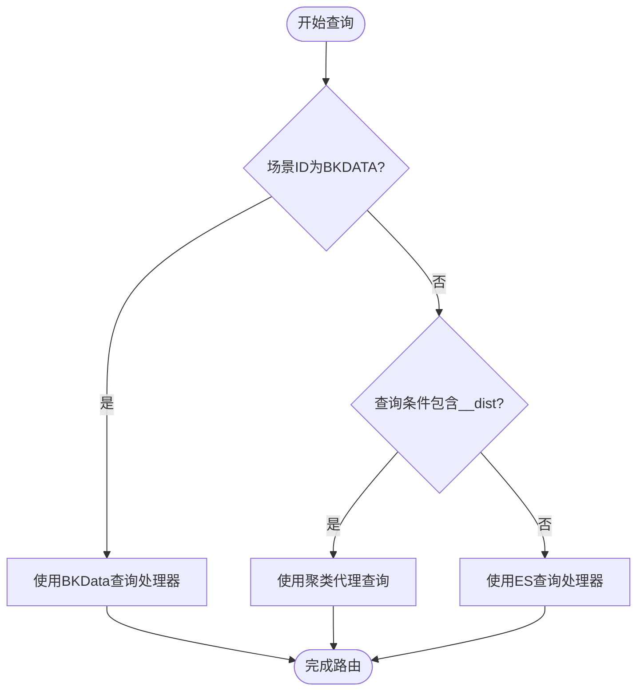
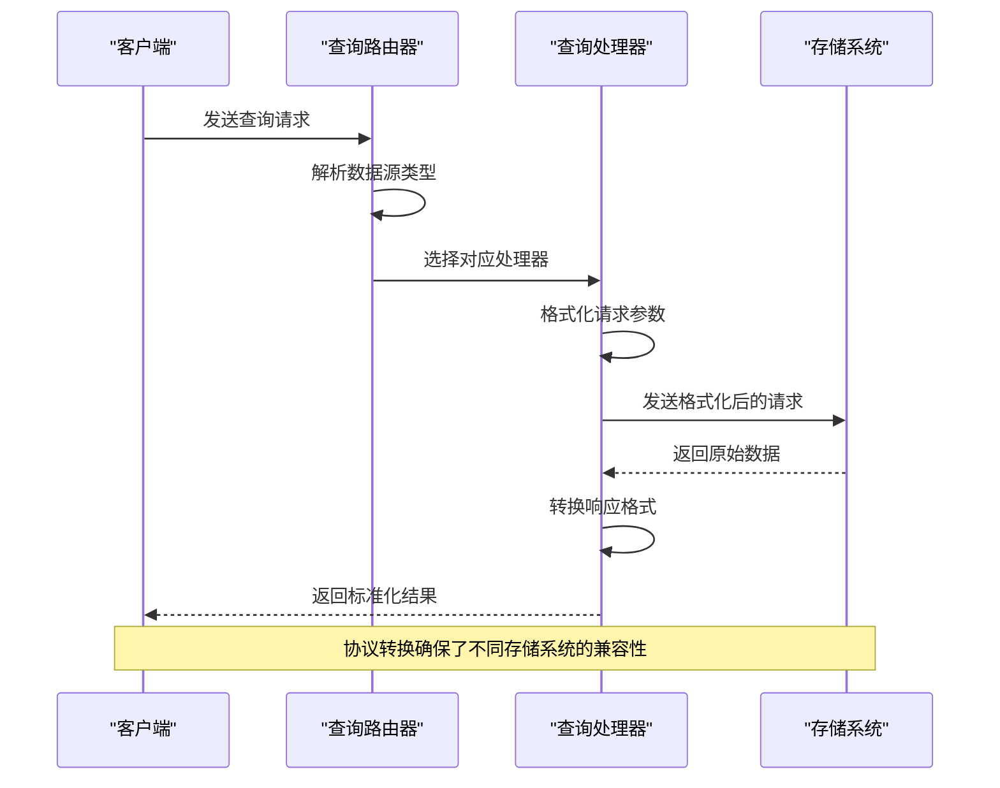
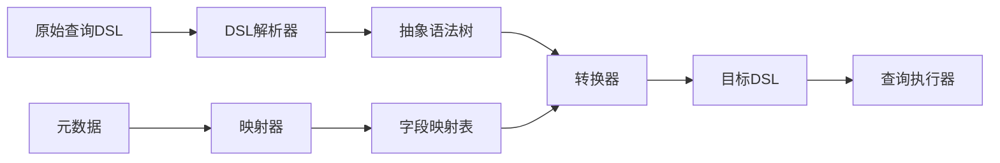
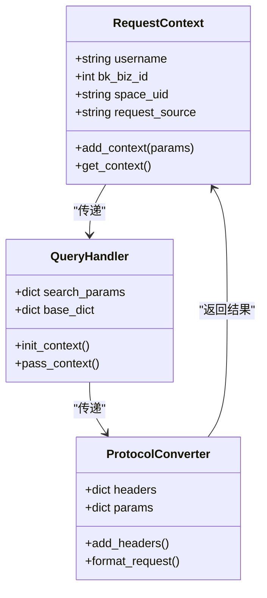
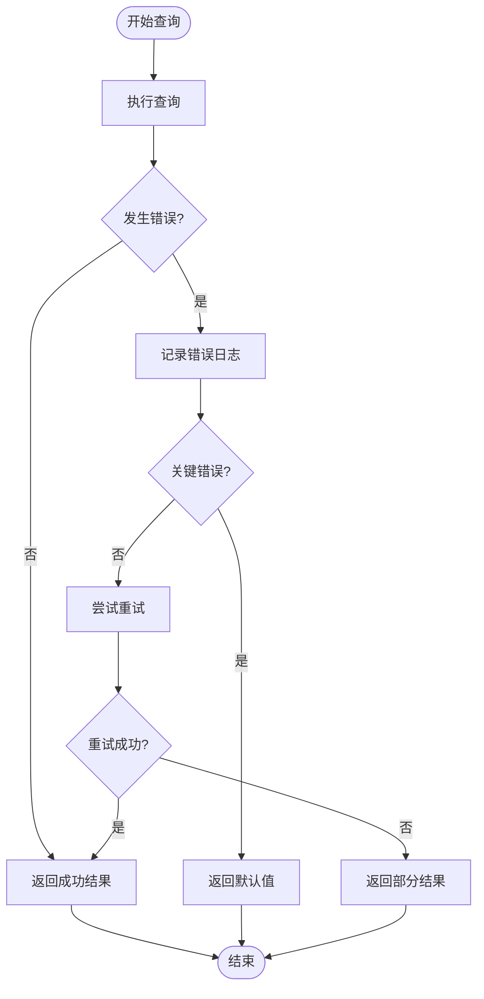
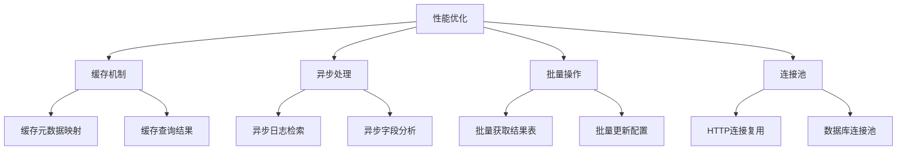

# 查询路由与协议转换

<cite>
**本文档引用的文件**   
- [unify_query.py](file://bklog/apps/api/modules/unify_query.py)
- [transfer.py](file://bklog/apps/api/modules/transfer.py)
- [base.py](file://bklog/apps/log_unifyquery/handler/base.py)
- [chart.py](file://bklog/apps/log_unifyquery/handler/chart.py)
- [mapping.py](file://bklog/apps/log_unifyquery/handler/mapping.py)
- [constants.py](file://bklog/apps/log_unifyquery/constants.py)
- [utils.py](file://bklog/apps/log_unifyquery/utils.py)
- [views.py](file://bklog/apps/log_unifyquery/views.py)
</cite>

## 目录
1. [简介](#简介)
2. [查询路由机制](#查询路由机制)
3. [协议转换与请求格式化](#协议转换与请求格式化)
4. [查询DSL转换与元数据映射](#查询dsl转换与元数据映射)
5. [上下文传递机制](#上下文传递机制)
6. [错误处理与降级策略](#错误处理与降级策略)
7. [性能考量](#性能考量)
8. [总结](#总结)

## 简介
本文档详细解析了统一查询系统中的查询路由与协议转换机制。系统根据数据源类型和查询参数智能选择合适的查询处理器，并通过协议转换完成对不同存储系统的请求格式化。核心功能包括基于数据源类型（如ES或BKData）的智能路由、查询DSL的转换逻辑、元数据映射规则以及上下文传递机制。文档还涵盖了错误处理、降级策略和性能优化方面的设计考量。

## 查询路由机制

系统实现了基于数据源类型和查询参数的智能路由机制，能够根据目标存储系统选择合适的查询处理器。路由决策主要依赖于索引集的场景ID（scenario_id）和查询条件中的特殊字段。

**Diagram sources**
- [base.py](file://bklog/apps/log_unifyquery/handler/base.py#L336-L345)

**Section sources**
- [base.py](file://bklog/apps/log_unifyquery/handler/base.py#L336-L345)

## 协议转换与请求格式化

协议转换机制通过`transfer.py`文件中的`_TransferApi`类实现，该类封装了对不同存储系统的API调用。系统根据数据源类型自动选择相应的协议转换规则，并格式化请求参数。

**Diagram sources**
- [transfer.py](file://bklog/apps/api/modules/transfer.py#L131-L492)
- [unify_query.py](file://bklog/apps/api/modules/unify_query.py#L52-L107)

**Section sources**
- [transfer.py](file://bklog/apps/api/modules/transfer.py#L131-L492)

## 查询DSL转换与元数据映射

查询DSL转换和元数据映射是系统的核心功能之一，通过`mapping.py`文件中的`UnifyQueryMappingHandler`类实现。该机制负责将通用查询语言转换为特定存储系统可理解的查询语句，并处理字段映射。

**Diagram sources**
- [mapping.py](file://bklog/apps/log_unifyquery/handler/mapping.py#L78-L82)
- [constants.py](file://bklog/apps/log_unifyquery/constants.py#L49-L66)

**Section sources**
- [mapping.py](file://bklog/apps/log_unifyquery/handler/mapping.py#L78-L82)

## 上下文传递机制

上下文传递机制确保了查询过程中的用户信息、业务ID和其他关键参数能够在各个组件间正确传递。系统通过请求头和参数包装的方式实现上下文传递。

**Diagram sources**
- [unify_query.py](file://bklog/apps/api/modules/unify_query.py#L24-L43)
- [base.py](file://bklog/apps/log_unifyquery/handler/base.py#L99-L106)

**Section sources**
- [unify_query.py](file://bklog/apps/api/modules/unify_query.py#L24-L43)

## 错误处理与降级策略

系统实现了完善的错误处理和降级策略，确保在异常情况下仍能提供基本服务。错误处理主要通过异常捕获和日志记录实现，而降级策略则在关键服务不可用时启用备用方案。

**Diagram sources**
- [base.py](file://bklog/apps/log_unifyquery/handler/base.py#L197-L251)
- [utils.py](file://bklog/apps/log_unifyquery/utils.py#L61-L82)

**Section sources**
- [base.py](file://bklog/apps/log_unifyquery/handler/base.py#L197-L251)

## 性能考量

在路由决策和协议转换过程中，系统考虑了多项性能优化措施。这些措施包括缓存机制、异步处理和批量操作，以确保系统在高负载下仍能保持良好的响应性能。

**Diagram sources**
- [mapping.py](file://bklog/apps/log_unifyquery/handler/mapping.py#L521-L528)
- [base.py](file://bklog/apps/log_unifyquery/handler/base.py#L581-L585)

**Section sources**
- [mapping.py](file://bklog/apps/log_unifyquery/handler/mapping.py#L521-L528)

## 总结
本文档详细解析了统一查询系统中的查询路由与协议转换机制。系统通过智能路由决策、协议转换、DSL转换和上下文传递等机制，实现了对多种数据源的统一查询支持。同时，完善的错误处理和性能优化策略确保了系统的稳定性和高效性。这些设计使得系统能够灵活应对不同的查询需求，为用户提供一致的查询体验。