# 统一查询架构设计

<cite>
**本文档引用的文件**
- [unify_query.py](file://bklog/apps/api/modules/unify_query.py)
- [utils.py](file://bklog/apps/api/modules/utils.py)
- [views.py](file://bklog/apps/log_unifyquery/views.py)
- [base.py](file://bklog/apps/log_unifyquery/handler/base.py)
- [mapping.py](file://bklog/apps/log_unifyquery/handler/mapping.py)
- [constants.py](file://bklog/apps/log_unifyquery/constants.py)
</cite>

## 目录
1. [引言](#引言)
2. [统一查询架构概述](#统一查询架构概述)
3. [核心组件分析](#核心组件分析)
4. [架构交互图](#架构交互图)
5. [查询请求时序图](#查询请求时序图)
6. [高内聚低耦合设计原则](#高内聚低耦合设计原则)
7. [请求适配器模式](#请求适配器模式)
8. [结果归一化处理器](#结果归一化处理器)
9. [后端路由策略](#后端路由策略)
10. [与工具函数的协作关系](#与工具函数的协作关系)
11. [系统数据流中的位置和作用](#系统数据流中的位置和作用)
12. [结论](#结论)

## 引言
统一查询架构是蓝鲸监控平台中的核心组件，旨在为跨数据源查询提供抽象层。该架构通过屏蔽底层存储差异，支持ES、BKData等多种数据源的统一访问。本文档详细描述了`unify_query.py`实现的跨数据源查询抽象层的整体架构，包括其作为查询中介层的设计原理、核心组件、交互关系以及在系统整体数据流中的位置和作用。

## 统一查询架构概述
统一查询架构通过一个中介层来屏蔽底层存储系统的差异，使得上层应用可以使用统一的接口进行数据查询。该架构主要由以下几个部分组成：
- **请求适配器**：负责将上层应用的查询请求转换为底层数据源可以理解的格式。
- **结果归一化处理器**：将不同数据源返回的结果统一为标准格式，便于上层应用处理。
- **后端路由策略**：根据查询请求的特性，选择合适的后端数据源进行查询。

该架构的设计遵循高内聚低耦合的原则，确保各个组件之间的独立性和可维护性。

## 核心组件分析

### 统一查询API
`unify_query.py`文件定义了`_UnifyQueryApi`类，该类封装了对统一查询服务的各种API调用。这些API包括时序型检索、非时序型检索、原始日志检索等。每个API方法都通过`DataAPI`对象进行封装，确保了请求的标准化和一致性。

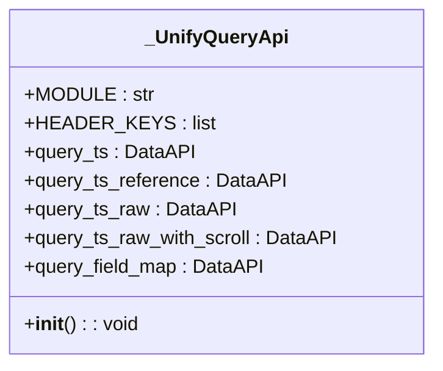

**Diagram sources**
- [unify_query.py](file://bklog/apps/api/modules/unify_query.py#L52-L107)

### 视图层
`views.py`文件中的`UnifyQueryViewSet`类负责处理HTTP请求，并调用相应的查询方法。该类通过`@list_route`装饰器定义了多个API端点，如`/query/ts/`用于时序型检索，`/query/ts/reference/`用于非时序型检索等。

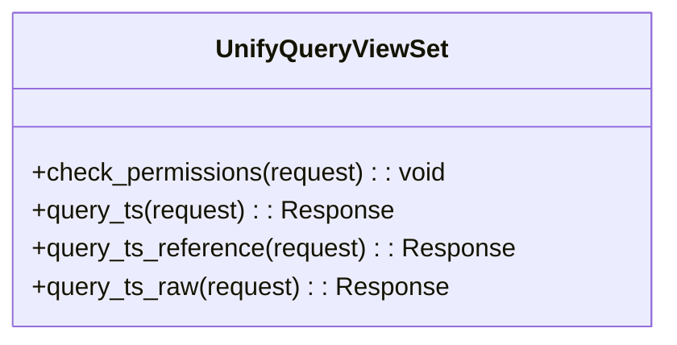

**Diagram sources**
- [views.py](file://bklog/apps/log_unifyquery/views.py#L33-L183)

### 查询处理器
`base.py`文件中的`UnifyQueryHandler`类是统一查询的核心处理器。该类负责初始化查询参数、处理查询请求、调用底层API并处理返回结果。`UnifyQueryHandler`类通过`search`、`date_histogram`等方法提供了丰富的查询功能。

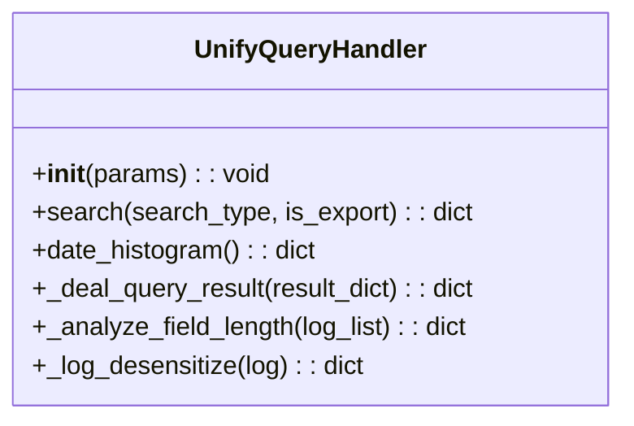

**Diagram sources**
- [base.py](file://bklog/apps/log_unifyquery/handler/base.py#L98-L1485)

### 字段映射处理器
`mapping.py`文件中的`UnifyQueryMappingHandler`类负责处理字段映射。该类通过`get_all_fields_by_index_id`、`get_default_sort_list`等方法提供了字段映射和排序功能。`UnifyQueryMappingHandler`类还支持虚拟字段的生成，如`__module__`、`__set__`等。

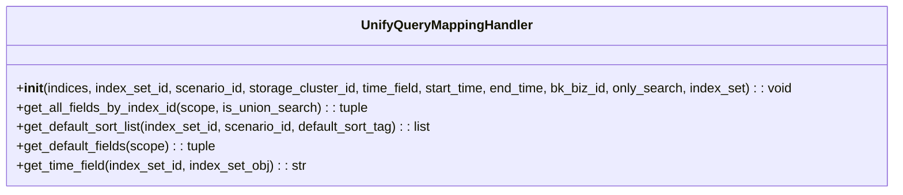

**Diagram sources**
- [mapping.py](file://bklog/apps/log_unifyquery/handler/mapping.py#L78-L845)

### 常量定义
`constants.py`文件定义了统一查询架构中使用的各种常量，如`MAX_LEN_DICT`、`BODY_DATA_FOR_CONTEXT`、`FIELD_TYPE_MAP`等。这些常量为其他组件提供了基础支持。

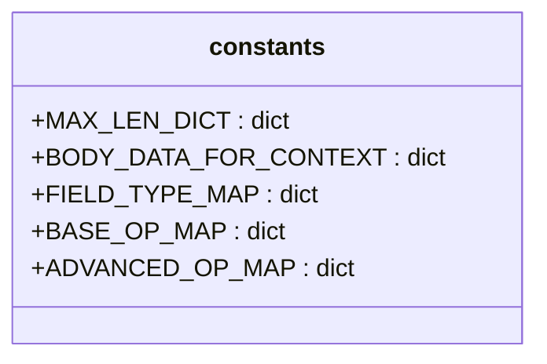

**Diagram sources**
- [constants.py](file://bklog/apps/log_unifyquery/constants.py#L1-L97)

## 架构交互图
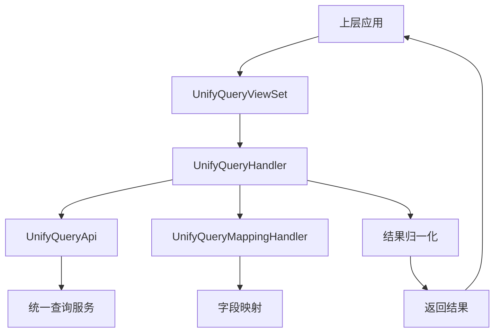

**Diagram sources**
- [views.py](file://bklog/apps/log_unifyquery/views.py#L33-L183)
- [base.py](file://bklog/apps/log_unifyquery/handler/base.py#L98-L1485)
- [unify_query.py](file://bklog/apps/api/modules/unify_query.py#L52-L107)
- [mapping.py](file://bklog/apps/log_unifyquery/handler/mapping.py#L78-L845)

## 查询请求时序图
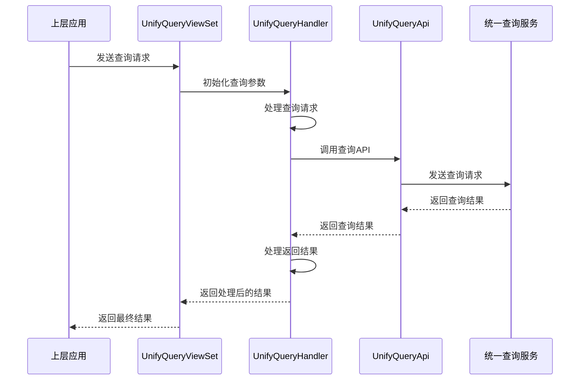

**Diagram sources**
- [views.py](file://bklog/apps/log_unifyquery/views.py#L33-L183)
- [base.py](file://bklog/apps/log_unifyquery/handler/base.py#L98-L1485)
- [unify_query.py](file://bklog/apps/api/modules/unify_query.py#L52-L107)

## 高内聚低耦合设计原则
统一查询架构遵循高内聚低耦合的设计原则，确保各个组件之间的独立性和可维护性。具体体现在以下几个方面：
- **高内聚**：每个组件都有明确的职责，如`UnifyQueryHandler`负责处理查询请求，`UnifyQueryMappingHandler`负责字段映射。
- **低耦合**：组件之间通过清晰的接口进行通信，减少了直接依赖，提高了系统的灵活性和可扩展性。

## 请求适配器模式
请求适配器模式通过`unify_query.py`中的`add_unify_query_header_before`和`add_data_after_request`函数实现。这些函数在请求发送前和响应接收后对数据进行处理，确保请求和响应的格式符合统一查询服务的要求。

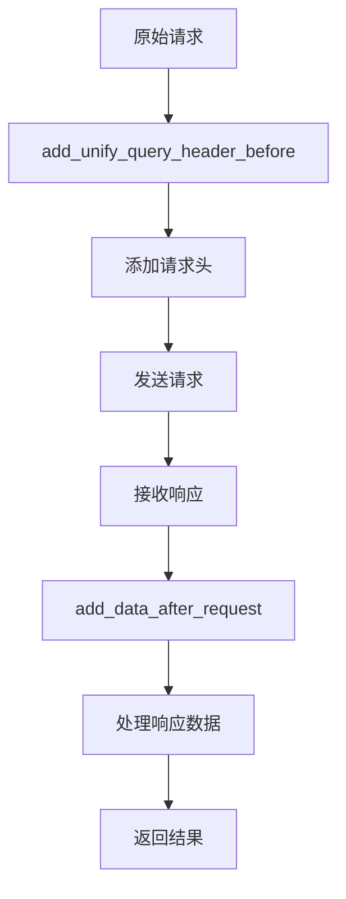

**Diagram sources**
- [unify_query.py](file://bklog/apps/api/modules/unify_query.py#L24-L49)

## 结果归一化处理器
结果归一化处理器通过`base.py`中的`_deal_query_result`方法实现。该方法将不同数据源返回的结果统一为标准格式，便于上层应用处理。处理过程包括脱敏、添加CMDB字段、添加BCS集群字段等。

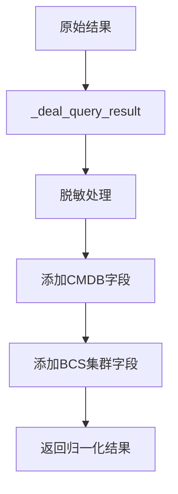

**Diagram sources**
- [base.py](file://bklog/apps/log_unifyquery/handler/base.py#L638-L699)

## 后端路由策略
后端路由策略通过`base.py`中的`_init_index_info_list`方法实现。该方法根据查询请求的索引集ID列表，初始化索引信息，并根据索引集的场景ID选择合适的后端数据源进行查询。

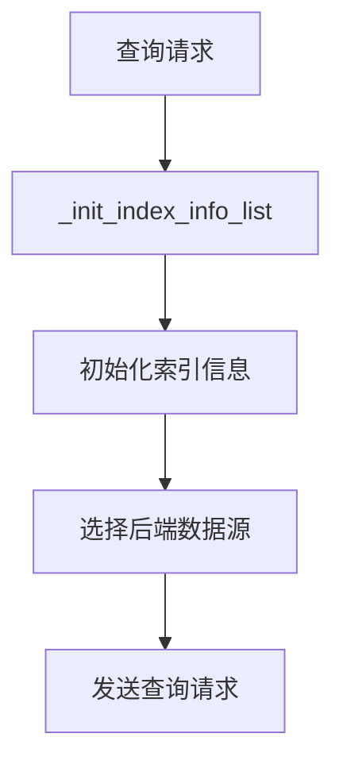

**Diagram sources**
- [base.py](file://bklog/apps/log_unifyquery/handler/base.py#L295-L334)

## 与工具函数的协作关系
统一查询架构与`utils.py`中的工具函数紧密协作。例如，`adapt_non_bkcc`函数用于适配非CC业务的查询请求，`update_bkdata_auth_info`函数用于更新数据平台的鉴权信息。这些工具函数为统一查询架构提供了必要的支持。

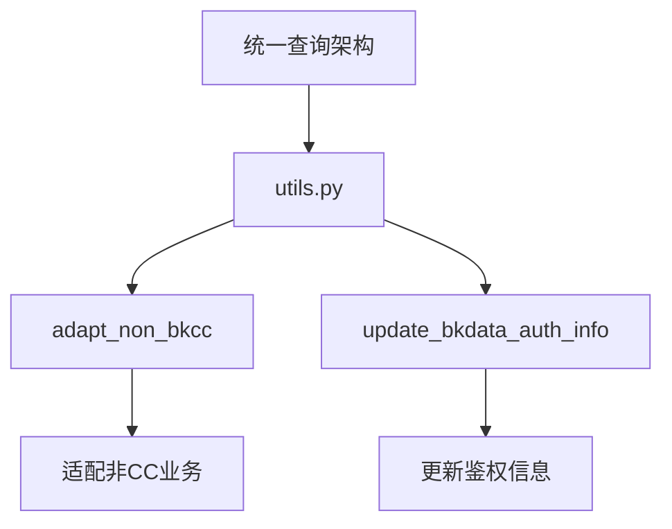

**Diagram sources**
- [utils.py](file://bklog/apps/api/modules/utils.py#L62-L135)

## 系统数据流中的位置和作用
统一查询架构在系统数据流中位于上层应用和底层数据源之间，起到中介层的作用。它接收上层应用的查询请求，通过请求适配器模式转换为底层数据源可以理解的格式，然后通过后端路由策略选择合适的后端数据源进行查询。查询结果经过结果归一化处理器处理后，返回给上层应用。

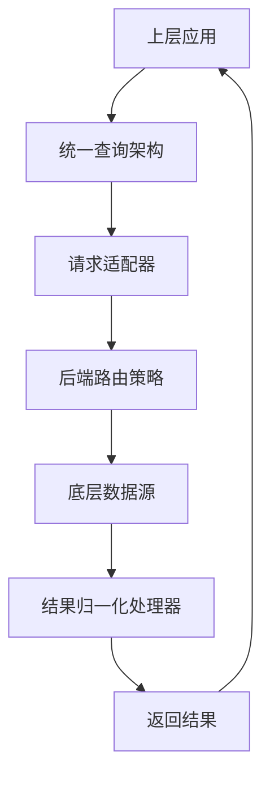

**Diagram sources**
- [views.py](file://bklog/apps/log_unifyquery/views.py#L33-L183)
- [base.py](file://bklog/apps/log_unifyquery/handler/base.py#L98-L1485)
- [unify_query.py](file://bklog/apps/api/modules/unify_query.py#L52-L107)

## 结论
统一查询架构通过屏蔽底层存储差异，支持ES、BKData等多种数据源的统一访问，为上层应用提供了简洁、一致的查询接口。该架构遵循高内聚低耦合的设计原则，确保了系统的灵活性和可维护性。通过请求适配器模式、结果归一化处理器和后端路由策略，统一查询架构有效地实现了跨数据源查询的抽象层，提升了系统的整体性能和用户体验。