# 统一查询集成

<cite>
**本文档引用的文件**   
- [unify_query.py](file://bklog/apps/api/modules/unify_query.py)
- [transfer.py](file://bklog/apps/api/modules/transfer.py)
- [base.py](file://bklog/apps/log_unifyquery/handler/base.py)
- [mapping.py](file://bklog/apps/log_unifyquery/handler/mapping.py)
- [views.py](file://bklog/apps/log_unifyquery/views.py)
- [constants.py](file://bklog/apps/log_unifyquery/constants.py)
</cite>

## 目录
1. [简介](#简介)
2. [统一查询架构](#统一查询架构)
3. [核心组件分析](#核心组件分析)
4. [多数据源联合查询](#多数据源联合查询)
5. [与transfer模块的集成关系](#与transfer模块的集成关系)
6. [应用场景](#应用场景)
7. [性能优化建议](#性能优化建议)
8. [配置方法](#配置方法)
9. [结论](#结论)

## 简介
统一查询集成文档深入解析了`unify_query.py`实现的跨数据源查询抽象层。该系统通过统一接口查询ES、BKData等不同后端存储的数据，实现了查询请求的路由、协议转换和结果归一化等处理流程。文档详细描述了与`transfer.py`的集成关系，以及在日志检索、数据分析等场景中的应用。同时提供了多数据源联合查询的配置方法和性能优化建议，包括连接池管理、查询缓存、超时控制等机制。

**Section sources**
- [unify_query.py](file://bklog/apps/api/modules/unify_query.py#L1-L108)
- [views.py](file://bklog/apps/log_unifyquery/views.py#L1-L184)

## 统一查询架构
统一查询系统通过抽象层实现了对不同数据源的统一访问，其核心架构包括查询处理器、协议转换器、结果归一化器等组件。系统通过统一的API接口接收查询请求，根据数据源类型进行路由，并将查询结果标准化后返回。

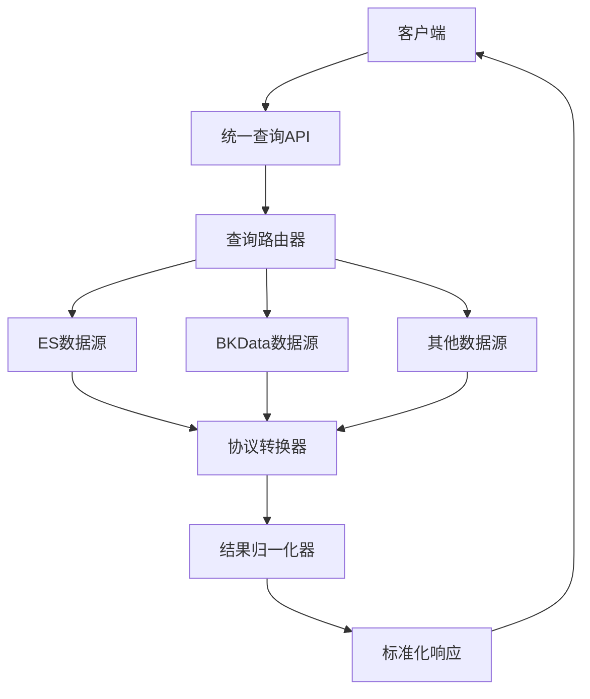

**Diagram sources**
- [unify_query.py](file://bklog/apps/api/modules/unify_query.py#L52-L107)
- [base.py](file://bklog/apps/log_unifyquery/handler/base.py#L98-L800)

## 核心组件分析

### 查询处理器
查询处理器是统一查询系统的核心组件，负责处理所有查询请求。它通过`UnifyQueryHandler`类实现，该类初始化时会解析查询参数，设置查询条件，并根据索引集信息确定查询场景。

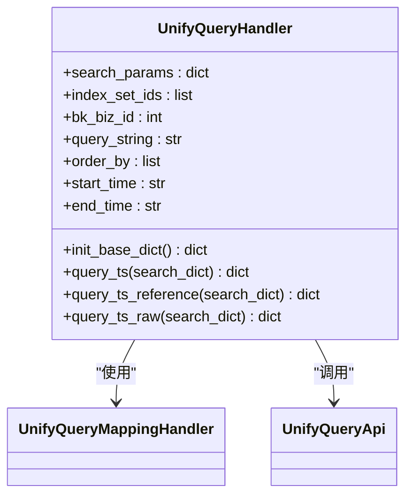

**Diagram sources**
- [base.py](file://bklog/apps/log_unifyquery/handler/base.py#L98-L800)
- [mapping.py](file://bklog/apps/log_unifyquery/handler/mapping.py#L78-L846)

### 协议转换器
协议转换器负责将统一查询协议转换为特定数据源的查询协议。对于BKData数据源，系统通过`QueryClientBkData`类实现协议转换，将查询请求转发到BKData的查询接口。

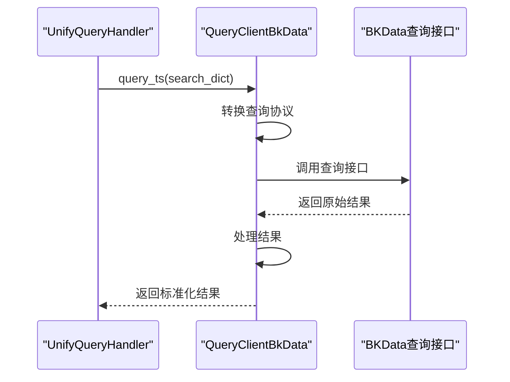

**Diagram sources**
- [base.py](file://bklog/apps/log_unifyquery/handler/base.py#L197-L264)
- [QueryClientBkData.py](file://bklog/apps/log_esquery/esquery/client/QueryClientBkData.py#L39-L264)

### 结果归一化器
结果归一化器负责将来自不同数据源的查询结果转换为统一的格式。系统通过`_deal_query_result`方法实现结果归一化，包括字段脱敏、CMDB字段添加、BCS集群字段添加等处理。

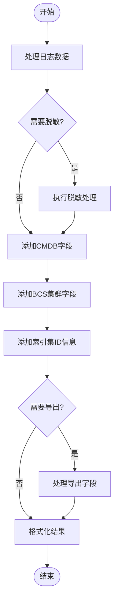

**Diagram sources**
- [base.py](file://bklog/apps/log_unifyquery/handler/base.py#L638-L699)
- [desensitize.py](file://bklog/apps/log_desensitize/handlers/desensitize.py)

## 多数据源联合查询
统一查询系统支持多数据源联合查询，通过`is_multi_rt`标志位判断是否为联合查询。系统会为每个索引集生成独立的查询参数，并在结果合并时进行统一处理。

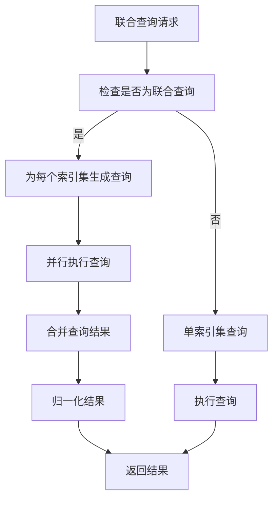

**Diagram sources**
- [base.py](file://bklog/apps/log_unifyquery/handler/base.py#L137-L138)
- [base.py](file://bklog/apps/log_unifyquery/handler/base.py#L616-L625)

**Section sources**
- [base.py](file://bklog/apps/log_unifyquery/handler/base.py#L137-L138)
- [base.py](file://bklog/apps/log_unifyquery/handler/base.py#L616-L625)

## 与transfer模块的集成关系
统一查询系统与`transfer.py`模块紧密集成，通过`TransferApi`调用元数据管理接口，获取结果表信息、存储信息等。这种集成关系使得统一查询能够动态获取数据源的元数据信息。

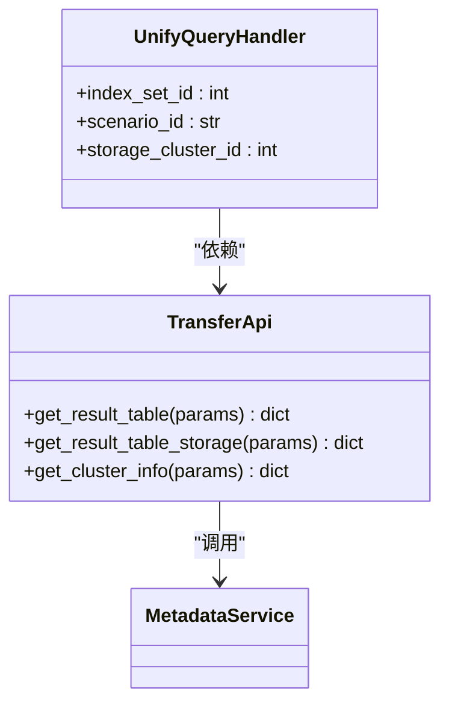

**Diagram sources**
- [base.py](file://bklog/apps/log_unifyquery/handler/base.py#L18-L19)
- [transfer.py](file://bklog/apps/api/modules/transfer.py#L131-L492)

**Section sources**
- [base.py](file://bklog/apps/log_unifyquery/handler/base.py#L18-L19)
- [transfer.py](file://bklog/apps/api/modules/transfer.py#L131-L492)

## 应用场景

### 日志检索
在日志检索场景中，统一查询系统通过`query_ts_raw`接口提供原始日志查询功能。系统支持关键字搜索、时间范围过滤、字段过滤等多种查询方式。

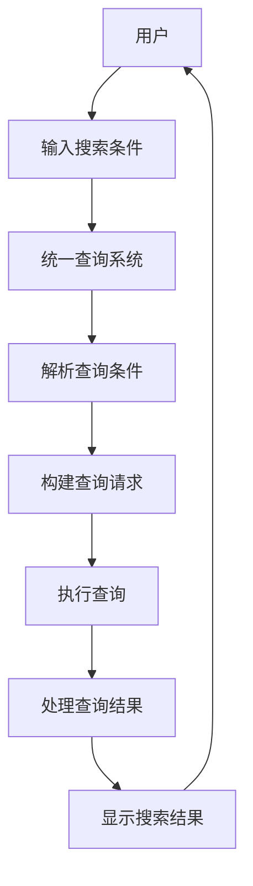

**Diagram sources**
- [views.py](file://bklog/apps/log_unifyquery/views.py#L138-L183)
- [base.py](file://bklog/apps/log_unifyquery/handler/base.py#L221-L251)

### 数据分析
在数据分析场景中，统一查询系统通过`query_ts`接口提供时序型数据查询功能。系统支持聚合查询、指标计算、趋势分析等数据分析功能。

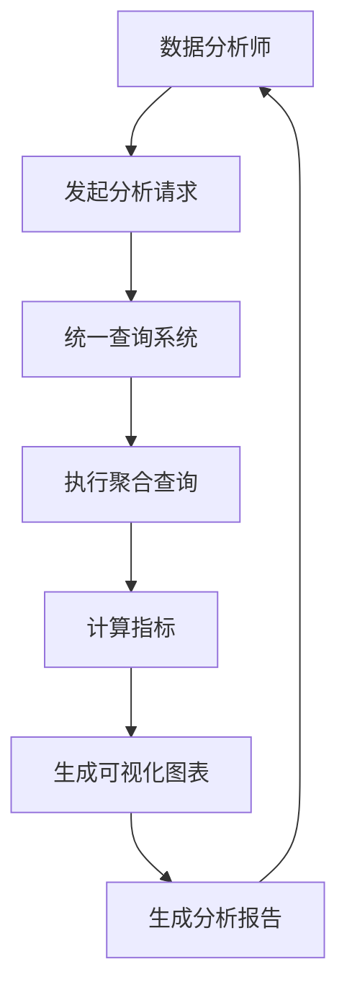

**Diagram sources**
- [views.py](file://bklog/apps/log_unifyquery/views.py#L46-L89)
- [base.py](file://bklog/apps/log_unifyquery/handler/base.py#L197-L207)

## 性能优化建议

### 连接池管理
统一查询系统通过连接池管理机制优化数据库连接性能。系统使用Redis Sentinel作为连接池管理器，实现连接的复用和故障转移。

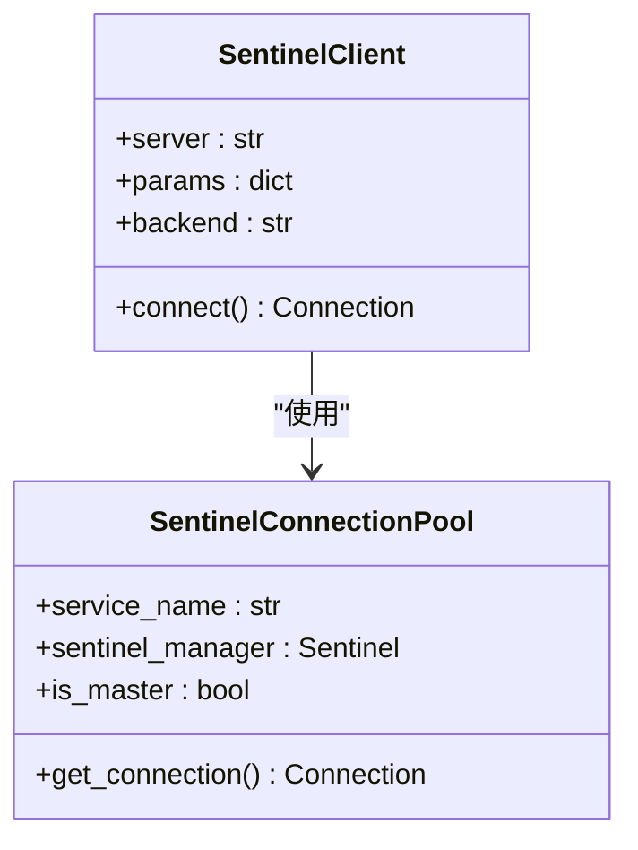

**Diagram sources**
- [sentinel.py](file://bklog/apps/utils/sentinel.py#L78-L106)
- [base.py](file://bklog/apps/log_unifyquery/handler/base.py)

### 查询缓存
系统实现了多级查询缓存机制，包括字段映射缓存、结果表信息缓存等。通过缓存机制减少对后端存储的重复查询，提高查询性能。

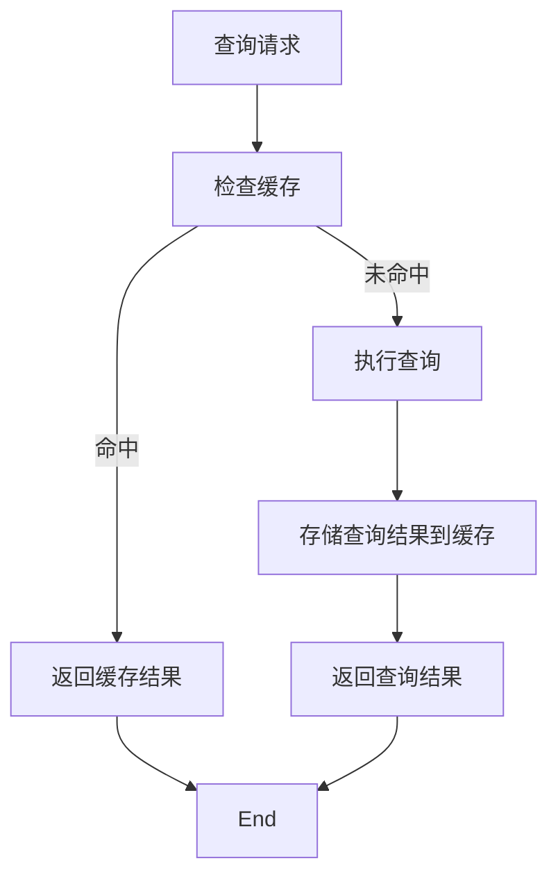

**Diagram sources**
- [mapping.py](file://bklog/apps/log_unifyquery/handler/mapping.py#L521-L528)
- [mapping.py](file://bklog/apps/log_unifyquery/handler/mapping.py#L531-L562)

### 超时控制
系统实现了查询超时控制机制，防止长时间运行的查询影响系统性能。通过设置合理的超时时间，确保查询请求在规定时间内完成。

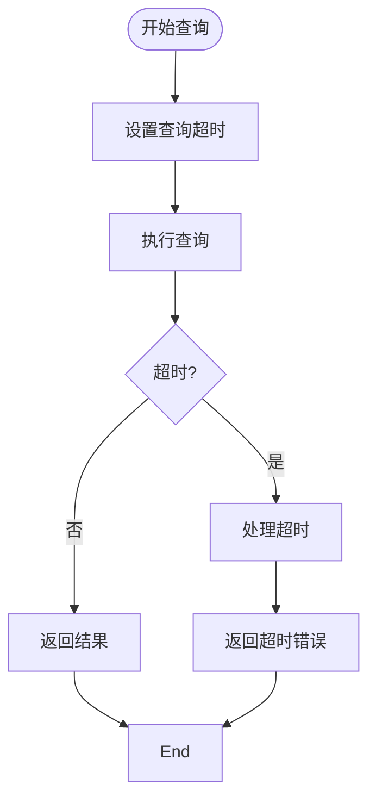

**Diagram sources**
- [base.py](file://bklog/apps/log_unifyquery/handler/base.py)
- [constants.py](file://bklog/apps/log_unifyquery/constants.py)

## 配置方法
多数据源联合查询的配置主要通过索引集配置实现。系统支持通过API或管理界面配置索引集，指定数据源类型、存储集群、查询字段等参数。

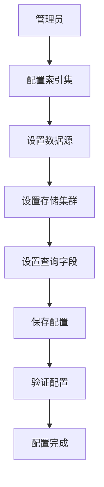

**Diagram sources**
- [base.py](file://bklog/apps/log_unifyquery/handler/base.py#L106-L111)
- [mapping.py](file://bklog/apps/log_unifyquery/handler/mapping.py#L79-L107)

**Section sources**
- [base.py](file://bklog/apps/log_unifyquery/handler/base.py#L106-L111)
- [mapping.py](file://bklog/apps/log_unifyquery/handler/mapping.py#L79-L107)

## 结论
统一查询集成系统通过抽象层实现了对ES、BKData等不同后端存储的统一访问，提供了强大的跨数据源查询能力。系统通过查询处理器、协议转换器、结果归一化器等组件实现了查询请求的路由、协议转换和结果归一化。与`transfer.py`模块的集成使得系统能够动态获取数据源的元数据信息。在日志检索、数据分析等场景中，系统提供了丰富的查询功能和性能优化机制。通过合理的配置和优化，可以充分发挥统一查询系统的潜力，满足多样化的数据查询需求。