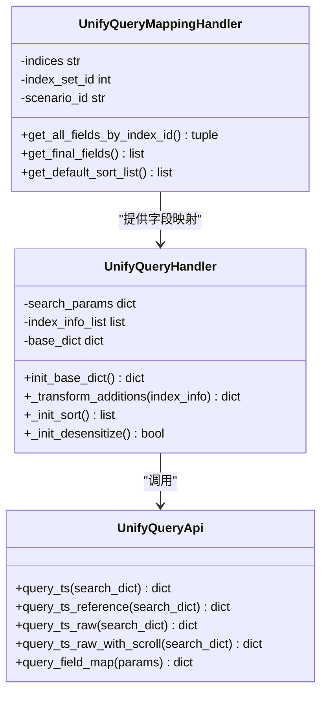
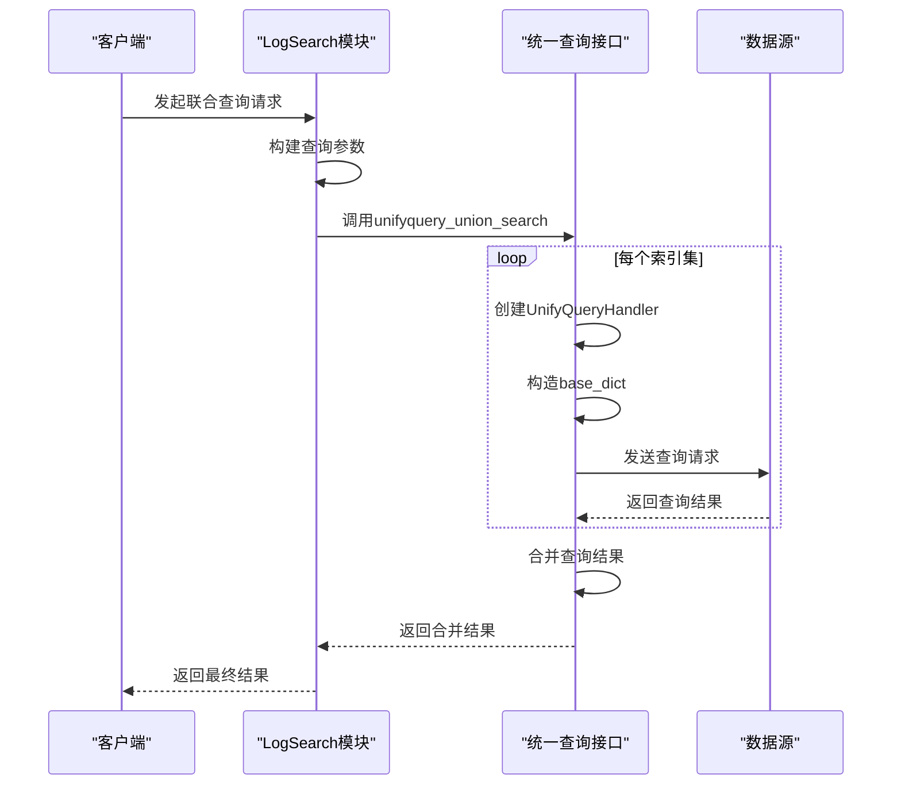
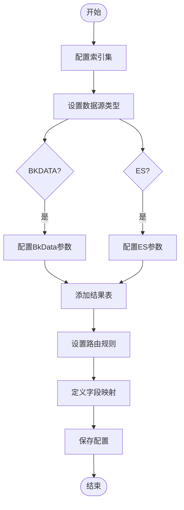

# 集成应用场景与配置

<cite>
**本文档引用的文件**   
- [unify_query.py](file://bklog/apps/api/modules/unify_query.py)
- [views.py](file://bklog/apps/log_unifyquery/views.py)
- [base.py](file://bklog/apps/log_unifyquery/handler/base.py)
- [utils.py](file://bklog/apps/log_unifyquery/utils.py)
- [constants.py](file://bklog/apps/log_unifyquery/constants.py)
- [mapping.py](file://bklog/apps/log_unifyquery/handler/mapping.py)
- [search_handlers_esquery.py](file://bklog/apps/log_search/handlers/search/search_handlers_esquery.py)
</cite>

## 目录
1. [简介](#简介)
2. [统一查询接口核心功能](#统一查询接口核心功能)
3. [日志检索模块集成](#日志检索模块集成)
4. [多数据源联合查询配置](#多数据源联合查询配置)
5. [最佳实践与配置模式](#最佳实践与配置模式)

## 简介
统一查询接口（unify_query）是蓝鲸监控平台的核心组件，为日志检索、数据分析等场景提供统一的数据查询能力。该接口通过封装底层数据源的复杂性，为上层应用提供标准化的查询服务。本文档详细说明unify_query.py在日志检索、数据分析等核心功能中的实际应用，描述log_search和log_unifyquery模块如何调用统一查询接口，并提供多数据源联合查询的配置示例和最佳实践。

## 统一查询接口核心功能
统一查询接口提供多种查询能力，包括时序型检索、非时序型检索和原始日志查询。接口通过_data_source_参数支持多种数据源，通过_table_id_参数指定具体的数据表。查询请求的构造遵循统一的格式，包含查询列表、时间范围、排序规则等核心参数。

**图表来源**
- [unify_query.py](file://bklog/apps/api/modules/unify_query.py#L52-L107)
- [base.py](file://bklog/apps/log_unifyquery/handler/base.py#L98-L800)
- [mapping.py](file://bklog/apps/log_unifyquery/handler/mapping.py#L78-L846)

**章节来源**
- [unify_query.py](file://bklog/apps/api/modules/unify_query.py#L1-L108)
- [base.py](file://bklog/apps/log_unifyquery/handler/base.py#L1-L800)

## 日志检索模块集成
log_search模块通过调用统一查询接口实现日志检索功能。在联合查询场景下，log_search模块会为每个索引集创建独立的查询请求，并将结果进行合并。查询请求的构造包括IP选择器、附加条件、时间范围等参数的处理。

**图表来源**
- [search_handlers_esquery.py](file://bklog/apps/log_search/handlers/search/search_handlers_esquery.py#L2906-L3070)
- [base.py](file://bklog/apps/log_unifyquery/handler/base.py#L98-L800)

**章节来源**
- [search_handlers_esquery.py](file://bklog/apps/log_search/handlers/search/search_handlers_esquery.py#L2906-L3070)

## 多数据源联合查询配置
多数据源联合查询通过配置索引集（index set）实现。每个索引集可以关联多个数据表，系统根据场景ID（scenario_id）确定数据源类型。配置包括数据源连接信息、路由规则和字段映射等。

**图表来源**
- [mapping.py](file://bklog/apps/log_unifyquery/handler/mapping.py#L78-L846)
- [constants.py](file://bklog/apps/log_unifyquery/constants.py#L1-L98)

**章节来源**
- [mapping.py](file://bklog/apps/log_unifyquery/handler/mapping.py#L1-L800)

## 最佳实践与配置模式
在实际应用中，建议遵循以下最佳实践：使用统一的查询参数格式，合理配置索引集的字段映射，优化查询性能。对于敏感数据，应启用脱敏功能。联合查询时，应注意不同索引集的时间字段格式一致性。

**章节来源**
- [base.py](file://bklog/apps/log_unifyquery/handler/base.py#L98-L800)
- [utils.py](file://bklog/apps/log_unifyquery/utils.py#L1-L83)
- [constants.py](file://bklog/apps/log_unifyquery/constants.py#L1-L98)