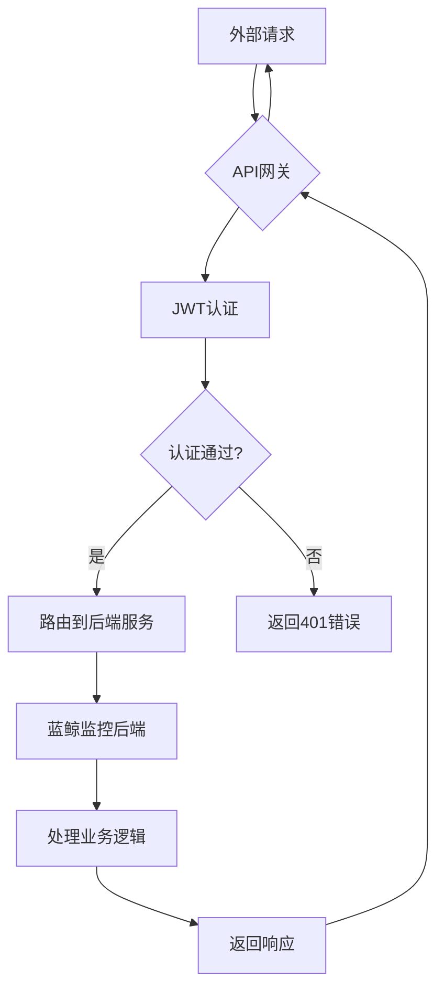
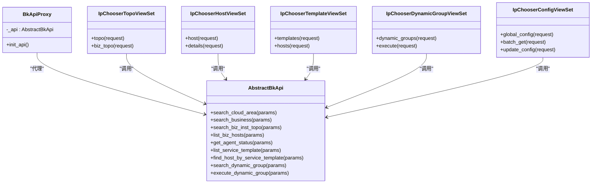
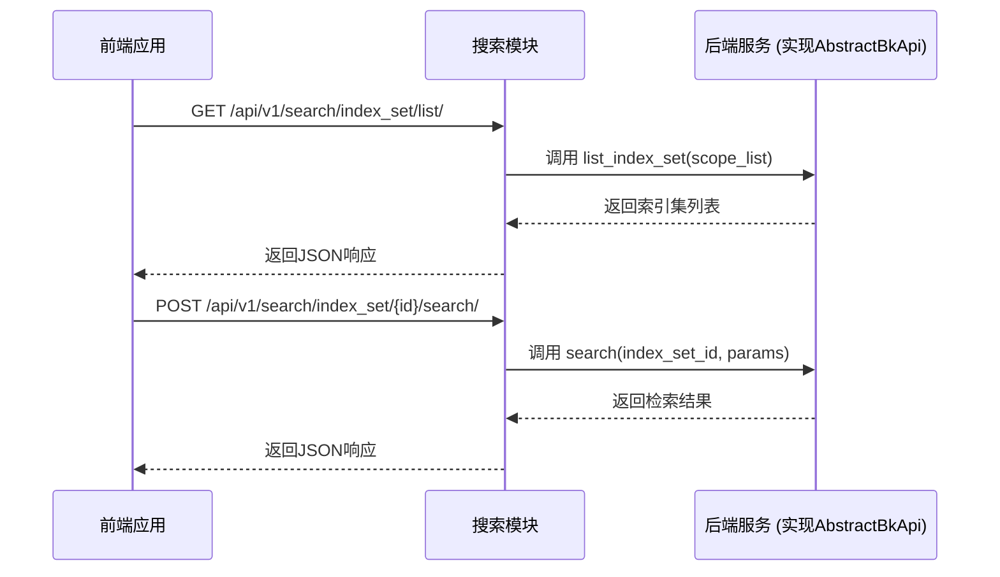

# 系统集成

<cite>
**本文档引用文件**   
- [README.md](file://bklog/README.md)
- [api.py](file://bklog/bkm_ipchooser/api.py)
- [api.py](file://bklog/bkm_search_module/api.py)
- [apigw.py](file://bklog/apps/middleware/apigw.py)
- [definition.yaml](file://bklog/support-files/apigw/definition.yaml)
- [resources.yaml](file://bklog/support-files/apigw/resources.yaml)
- [sync_apigw.py](file://bklog/apps/api/management/commands/sync_apigw.py)
- [views.py](file://bklog/bkm_ipchooser/views.py)
- [views.py](file://bklog/bkm_search_module/views.py)
- [README.md](file://bklog/bkm_ipchooser/README.md)
- [README.md](file://bklog/blueking/component/README.md)
- [config.md](file://bklog/bkm_ipchooser/docs/apidocs/config.md)
- [template.md](file://bklog/bkm_ipchooser/docs/apidocs/template.md)
</cite>

## 目录
1. [引言](#引言)
2. [蓝鲸生态组件集成](#蓝鲸生态组件集成)
3. [API网关集成](#api网关集成)
4. [IP选择器集成](#ip选择器集成)
5. [搜索模块集成](#搜索模块集成)
6. [第三方系统集成指南](#第三方系统集成指南)
7. [集成最佳实践与常见问题](#集成最佳实践与常见问题)

## 引言
本文档旨在详细介绍蓝鲸监控系统与其他系统的集成方式，重点阐述与蓝鲸生态组件（如CMDB、作业平台等）的集成方案。文档将深入解析API网关的配置与使用、IP选择器（IPChooser）和搜索模块的集成方法，并提供第三方系统集成的通用指南。通过本文档，开发者和运维人员可以全面了解如何将蓝鲸监控系统无缝集成到现有IT环境中，实现高效的系统协同与数据交互。

## 蓝鲸生态组件集成
蓝鲸监控系统深度集成了蓝鲸生态的多个核心组件，包括配置管理平台（CMDB）、作业平台（Job）、节点管理（NodeMan）等，以实现统一的运维管理和自动化操作。

系统通过`blueking.component` SDK与蓝鲸生态组件进行交互。该SDK提供了两种主要的访问方式：`get_client_by_request`和`get_client_by_user`，允许系统根据HTTP请求或指定用户身份来调用其他蓝鲸组件的API。例如，通过`client.cc.get_app_host_list(kwargs)`可以调用配置平台（CC）的API来获取业务主机列表。

在代码实现上，系统通过`apps/api/modules/`目录下的模块（如`cc.py`, `job.py`, `bk_node.py`）封装了对各个蓝鲸组件的API调用。这些模块利用`DataAPI`类定义了具体的API端点、请求方法和描述信息，实现了对CMDB、作业平台、节点管理等服务的标准化访问。例如，`bk_node.py`模块定义了创建、更新和查询节点管理订阅配置的API。

此外，系统在`home_application/utils/third_party.py`中定义了对第三方组件的健康检查机制，通过调用`CCApi.get_app_list`、`JobApi.get_public_script_list`等方法，确保与CMDB和作业平台等关键组件的连接正常。

**Section sources**
- [README.md](file://bklog/docs/wiki/faq.md#L17-L29)
- [third_party.py](file://bklog/home_application/utils/third_party.py#L53-L78)
- [bk_node.py](file://bklog/apps/api/modules/bk_node.py#L55-L82)

## API网关集成
API网关是蓝鲸监控系统对外提供服务的核心入口，负责统一管理、认证和路由所有外部API请求。

### API网关配置
API网关的配置主要通过`support-files/apigw/`目录下的两个YAML文件进行管理：
- `definition.yaml`：定义网关的基本信息，如描述、版本号、是否公开等。
- `resources.yaml`：定义了所有对外暴露的API资源，包括路径、HTTP方法、后端服务映射和认证配置。

`resources.yaml`文件中，每个API资源都通过`x-bk-apigateway-resource`字段进行详细配置。例如，`/esquery_search/`资源被配置为公开（`isPublic: true`），并映射到内部的`/api/v1/esquery/search/`路径。该文件还定义了速率限制（`bk-rate-limit`插件）和认证要求（`appVerifiedRequired: true`）。

### API网关同步
系统通过Django管理命令`sync_apigw.py`来同步API网关的配置。该命令会依次执行以下操作：
1.  `sync_apigw_config`：同步网关配置。
2.  `sync_apigw_stage`：同步网关环境。
3.  `sync_apigw_resources`：同步API资源。
4.  `create_version_and_release_apigw`：创建版本并发布网关。

此流程确保了代码中的API定义与API网关的实际配置始终保持一致。

### JWT认证
系统实现了基于JWT（JSON Web Token）的认证机制。`apigw.py`中的`ApiGatewayJWTMiddleware`中间件负责处理JWT令牌的验证。它通过`CustomCachePublicKeyProvider`从配置中获取公钥，对请求中的JWT令牌进行解码和验证，从而确保请求的合法性和安全性。系统支持内部和外部API网关的不同公钥配置，以适应不同的部署场景。

**Diagram sources **
- [definition.yaml](file://bklog/support-files/apigw/definition.yaml#L1-L31)
- [resources.yaml](file://bklog/support-files/apigw/resources.yaml#L1-L800)
- [sync_apigw.py](file://bklog/apps/api/management/commands/sync_apigw.py#L23-L50)
- [apigw.py](file://bklog/apps/middleware/apigw.py#L60-L125)

## IP选择器集成
IP选择器（IPChooser）是蓝鲸监控系统中用于统一选择主机、服务模板、动态分组等资源的核心组件。

### 核心功能与API
IP选择器提供了一套统一的RESTful API，主要功能包括：
- **拓扑查询**：通过`/api/v1/ipchooser/topo/`接口查询业务拓扑结构。
- **主机查询**：通过`/api/v1/ipchooser/host/`接口查询主机信息，支持根据条件筛选。
- **模板查询**：通过`/api/v1/ipchooser/template/`接口查询服务模板和集群模板下的主机。
- **动态分组**：通过`/api/v1/ipchooser/dynamic_group/`接口查询和执行动态分组。
- **配置管理**：通过`/api/v1/ipchooser/config/`接口管理用户的个性化配置，如窗口大小、显示字段等。

### 集成方式
IP选择器以Django App的形式集成到系统中。其核心是`bkm_ipchooser.api.AbstractBkApi`抽象类，该类定义了所有与蓝鲸底层服务（如CMDB、GSE）交互的静态方法。系统使用者需要实现这个抽象类，并通过`BKM_IPCHOOSER_BKAPI_CLASS`设置项指定实现类的路径。

`bkm_ipchooser.views`模块中的视图集（如`IpChooserTopoViewSet`, `IpChooserHostViewSet`）负责处理HTTP请求，并调用`handlers`目录下的处理器（如`topo_handler`, `host_handler`）来执行具体的业务逻辑。这些处理器最终会通过`AbstractBkApi`的实现来调用CMDB和GSE的API。

### 使用场景
IP选择器广泛应用于需要选择主机的场景，例如在创建采集任务、执行日志提取或配置监控策略时，用户可以通过IP选择器直观地从复杂的业务拓扑中选择目标主机。

**Diagram sources **
- [api.py](file://bklog/bkm_ipchooser/api.py#L8-L122)
- [views.py](file://bklog/bkm_ipchooser/views.py#L194-L292)
- [README.md](file://bklog/bkm_ipchooser/README.md#L1-L16)

## 搜索模块集成
搜索模块为系统提供了强大的日志检索和分析能力，并可作为独立组件嵌入到其他系统中。

### 核心功能与API
搜索模块通过`bkm_search_module.api.AbstractBkApi`抽象类定义了一套标准的API接口，主要包括：
- **索引集管理**：`list_index_set`用于获取用户有权限的索引集列表。
- **检索功能**：`search`用于执行日志检索，`context`用于查看上下文日志，`tail_f`用于查看实时日志。
- **辅助功能**：`search_condition`获取查询条件，`search_history`获取历史查询，`search_inspect`进行检索语句语法检测。
- **导出功能**：`export`和`download_url`用于日志下载。

### 集成方法
搜索模块同样以Django App的形式提供。使用者需要实现`AbstractBkApi`抽象类，并通过`BKM_SEARCH_MODULE_BKAPI_CLASS`设置项指定实现类。`bkm_search_module.views`中的视图集（如`SearchModuleIndexSetViewSet`）负责将HTTP请求转换为对`AbstractBkApi`接口的调用。

该模块的设计使其易于嵌入。其他系统只需调用其提供的RESTful API，并实现相应的`AbstractBkApi`接口来对接自身的数据源和权限系统，即可获得完整的日志搜索功能。

### 嵌入场景
搜索模块可以被嵌入到运维门户、告警中心或自定义报表系统中，为这些系统提供统一的日志查询入口，避免功能重复开发。

**Diagram sources **
- [api.py](file://bklog/bkm_search_module/api.py#L10-L113)
- [views.py](file://bklog/bkm_search_module/views.py#L1-L277)

## 第三方系统集成指南
蓝鲸监控系统支持通过REST API与其他第三方平台进行交互，实现数据共享和流程自动化。

### REST API交互
系统通过API网关暴露了大量RESTful API，涵盖了日志采集、查询、告警、权限管理等各个方面。第三方系统可以通过以下步骤进行集成：
1.  **获取凭证**：向蓝鲸平台申请应用（App）的`bk_app_code`和`bk_app_secret`。
2.  **构造请求**：在HTTP请求头`X-Bkapi-Authorization`中携带应用凭证和用户信息（`bk_username`）。
3.  **调用API**：根据`resources.yaml`文件中的定义，调用相应的API端点。
4.  **处理响应**：解析返回的JSON数据，其中`result`字段表示操作是否成功。

### 集成示例
一个典型的集成场景是，一个CI/CD平台在部署完成后，调用蓝鲸监控的API来创建或更新相关的日志采集配置。CI/CD平台作为客户端，使用`ComponentClient`发起请求，蓝鲸监控系统作为服务端接收并处理请求。

### 注意事项
- **认证安全**：始终使用HTTPS协议，并妥善保管应用密钥。
- **版本管理**：关注API版本变化，避免因接口升级导致集成中断。
- **错误处理**：实现健壮的错误处理机制，应对网络超时、认证失败等异常情况。

**Section sources**
- [resources.yaml](file://bklog/support-files/apigw/resources.yaml#L1-L800)
- [client.py](file://bklog/blueking/component/client.py#L1-L205)

## 集成最佳实践与常见问题
### 最佳实践
1.  **使用SDK**：优先使用`blueking.component` SDK进行集成，它封装了认证、签名等复杂逻辑，简化开发。
2.  **合理使用缓存**：对于频繁调用且数据变化不频繁的API（如业务列表），应在客户端实现缓存，以减轻服务端压力。
3.  **遵循速率限制**：遵守API网关定义的速率限制策略，避免因请求过于频繁而被限流。
4.  **优雅降级**：在调用第三方API时，应设计降级方案，当依赖服务不可用时，系统仍能提供基本功能。

### 常见问题与解决方案
- **问题：API调用返回403 Forbidden错误。**
  **解决方案**：检查`X-Bkapi-Authorization`请求头是否正确构造，确认`bk_app_code`和`bk_app_secret`有效，并确保该应用已申请并获得了调用目标API的权限。

- **问题：无法获取到主机列表。**
  **解决方案**：首先检查IP选择器的`BKM_IPCHOOSER_BKAPI_CLASS`配置是否正确指向了实现了`AbstractBkApi`的类。其次，确认该实现类能够成功调用CMDB和GSE的API，检查网络连通性和API凭证。

- **问题：API网关配置未生效。**
  **解决方案**：运行`python manage.py sync_apigw`命令，强制同步配置。检查`definition.yaml`和`resources.yaml`文件的语法是否正确。

**Section sources**
- [README.md](file://bklog/blueking/component/README.md#L1-L79)
- [apigw.py](file://bklog/apps/middleware/apigw.py#L60-L125)