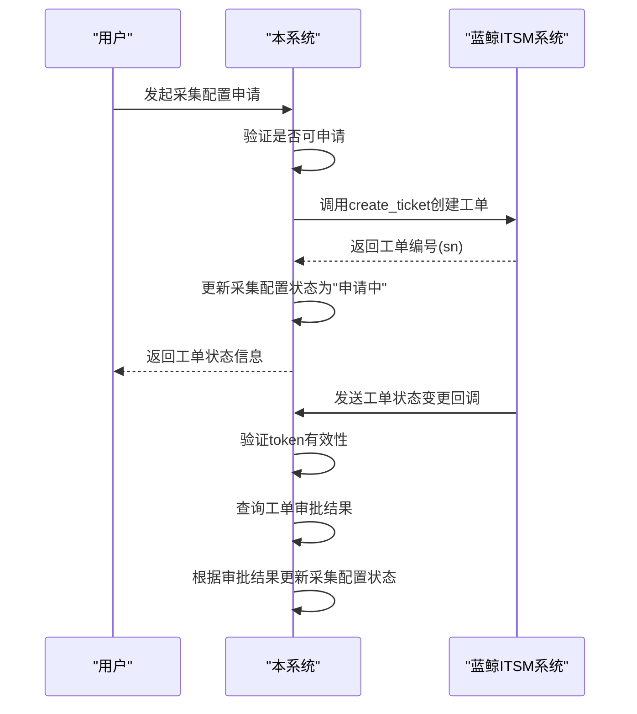
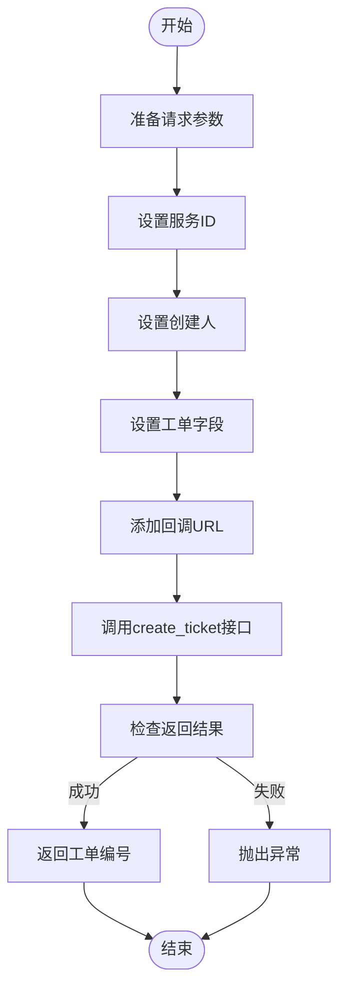
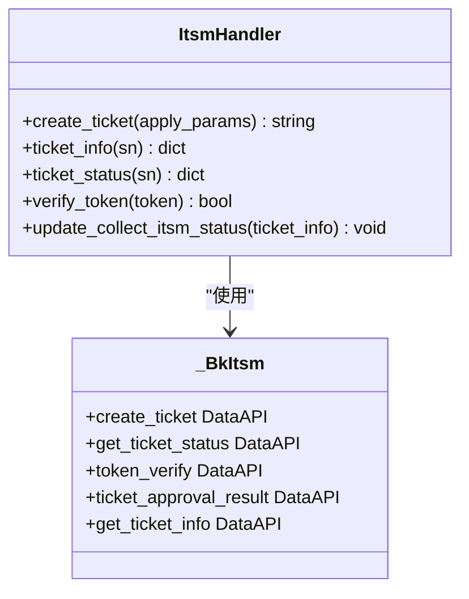
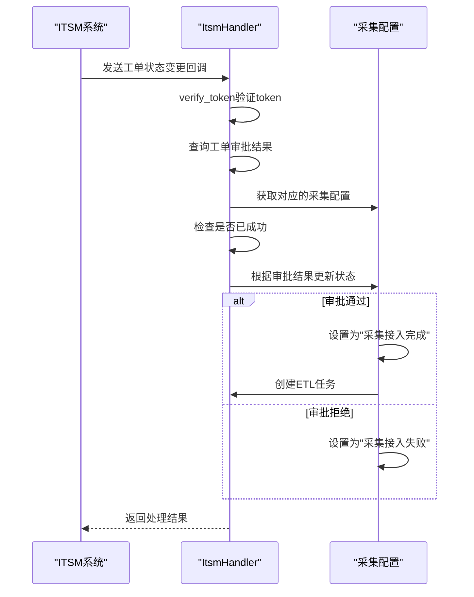
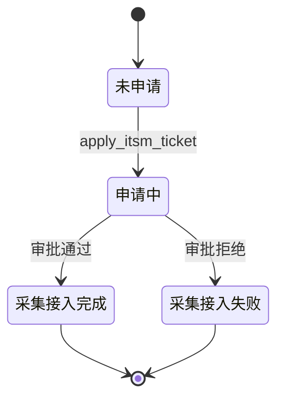
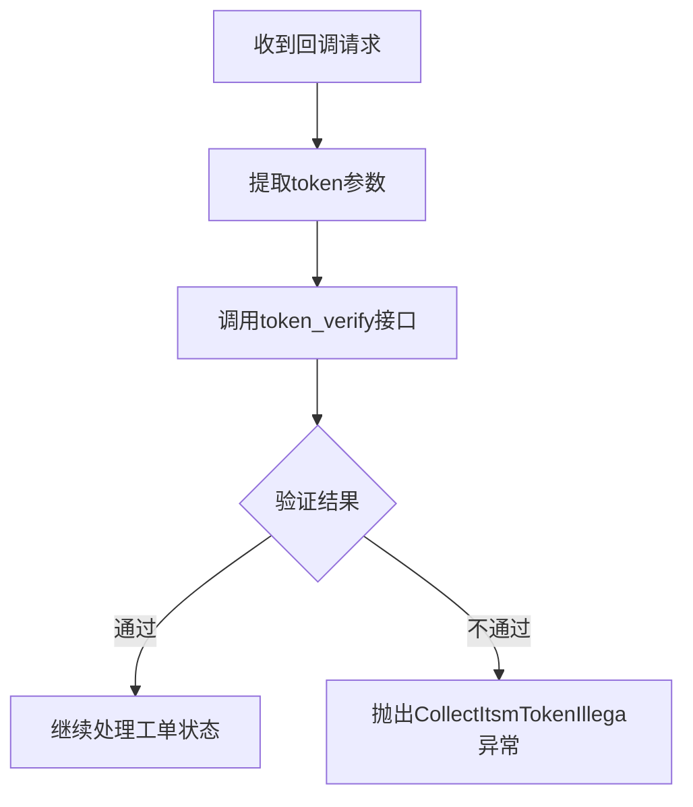

# IT服务管理(ITSM)集成

<cite>
**本文档引用文件**   
- [bk_itsm.py](file://bklog/apps/api/modules/bk_itsm.py)
- [itsm.py](file://bklog/apps/log_databus/handlers/itsm.py)
- [itsm_views.py](file://bklog/apps/log_databus/views/itsm_views.py)
- [constants.py](file://bklog/apps/feature_toggle/plugins/constants.py)
- [domains.py](file://bklog/config/domains.py)
- [log_databus/models.py](file://bklog/apps/log_databus/models.py)
- [log_databus/constants.py](file://bklog/apps/log_databus/constants.py)
- [itsm.py](file://bklog/blueking/component/apis/itsm.py)
- [log_commons/models.py](file://bklog/apps/log_commons/models.py)
</cite>

## 目录
1. [引言](#引言)
2. [核心功能实现](#核心功能实现)
3. [关键接口调用示例](#关键接口调用示例)
4. [运维操作流程化管控](#运维操作流程化管控)
5. [数据总线模块中的ITSM处理器](#数据总线模块中的itsm处理器)
6. [工单状态同步机制](#工单状态同步机制)
7. [配置与参数说明](#配置与参数说明)
8. [错误处理与异常情况](#错误处理与异常情况)

## 引言
本文档详细说明了本系统与蓝鲸ITSM的对接方案，重点描述服务工单创建、审批流程对接、工单状态同步等核心功能的实现方式。文档提供了`create_ticket`、`get_ticket_status`等关键接口的调用示例、参数配置和返回数据解析，并解释了如何将日志采集、存储扩容等操作与ITSM审批流程集成，实现运维操作的流程化管控。

**Section sources**
- [bk_itsm.py](file://bklog/apps/api/modules/bk_itsm.py#L1-L86)
- [itsm.py](file://bklog/apps/log_databus/handlers/itsm.py#L1-L214)

## 核心功能实现
系统通过ITSM模块实现了与蓝鲸ITSM系统的深度集成，主要功能包括服务工单创建、审批流程对接和工单状态同步。核心功能由`bklog/apps/api/modules/bk_itsm.py`中的`_BkItsm`类提供，该类封装了与ITSM系统交互的所有API接口。

工单创建功能通过`create_ticket`接口实现，该接口向ITSM系统发送POST请求创建新的服务工单。工单状态查询通过`get_ticket_status`接口实现，支持根据单号查询工单的当前状态。系统还提供了`token_verify`接口用于token校验，确保回调请求的安全性。

在数据总线模块中，`log_databus/handlers/itsm.py`文件中的`ItsmHandler`类负责处理具体的ITSM集成逻辑。该类通过`apply_itsm_ticket`方法处理采集配置的ITSM申请流程，包括创建工单、更新采集配置状态等操作。



**Diagram sources**
- [bk_itsm.py](file://bklog/apps/api/modules/bk_itsm.py#L34-L85)
- [itsm.py](file://bklog/apps/log_databus/handlers/itsm.py#L52-L63)

**Section sources**
- [bk_itsm.py](file://bklog/apps/api/modules/bk_itsm.py#L30-L85)
- [itsm.py](file://bklog/apps/log_databus/handlers/itsm.py#L47-L63)

## 关键接口调用示例
### create_ticket接口
`create_ticket`接口用于创建ITSM服务工单，是整个审批流程的起点。该接口需要提供服务ID、创建人、工单字段等参数。



**Diagram sources**
- [itsm.py](file://bklog/apps/log_databus/handlers/itsm.py#L88-L103)
- [bk_itsm.py](file://bklog/apps/api/modules/bk_itsm.py#L34-L40)

### get_ticket_status接口
`get_ticket_status`接口用于查询工单的当前状态，支持根据单号查询工单的基本信息和状态。



**Diagram sources**
- [itsm.py](file://bklog/apps/log_databus/handlers/itsm.py#L108-L109)
- [bk_itsm.py](file://bklog/apps/api/modules/bk_itsm.py#L48-L54)

## 运维操作流程化管控
系统将日志采集、存储扩容等运维操作与ITSM审批流程集成，实现了运维操作的流程化管控。当用户申请新的日志采集配置时，系统会自动触发ITSM审批流程。

对于日志采集操作，系统通过`apply_itsm_ticket`方法处理采集配置的ITSM申请。该方法首先验证采集配置是否可以申请ITSM，然后调用`create_ticket`接口创建工单，并更新采集配置的状态为"申请中"。

```mermaid
flowchart TD
A[用户申请日志采集] --> B{是否已申请ITSM?}
B --> |是| C[抛出CollectItsmHasApply异常]
B --> |否| D[准备工单参数]
D --> E[调用create_ticket创建工单]
E --> F[获取工单编号(sn)]
F --> G[更新采集配置状态]
G --> H[返回工单状态信息]
```

**Diagram sources**
- [itsm.py](file://bklog/apps/log_databus/handlers/itsm.py#L52-L63)
- [models.py](file://bklog/apps/log_databus/models.py#L165-L171)

## 数据总线模块中的ITSM处理器
在数据总线模块中，ITSM处理器实现了工单驱动的配置变更功能。`ItsmHandler`类是核心处理器，负责处理所有与ITSM相关的操作。

处理器通过`update_collect_itsm_status`方法处理工单状态变更回调。当ITSM系统发送工单状态变更通知时，该方法会验证token的有效性，查询工单详情，并根据审批结果更新采集配置的状态。



**Diagram sources**
- [itsm.py](file://bklog/apps/log_databus/handlers/itsm.py#L137-L150)
- [itsm_views.py](file://bklog/apps/log_databus/views/itsm_views.py#L93-L99)

**Section sources**
- [itsm.py](file://bklog/apps/log_databus/handlers/itsm.py#L137-L150)
- [itsm_views.py](file://bklog/apps/log_databus/views/itsm_views.py#L93-L99)

## 工单状态同步机制
系统实现了工单状态的自动同步机制，确保本地采集配置状态与ITSM系统中的工单状态保持一致。状态同步通过两种方式实现：主动查询和被动回调。

被动回调是主要的同步方式，通过`ItsmCallbackViewSet`类的`collect_itsm_callback`方法处理ITSM系统的回调请求。该方法首先验证token的有效性，然后调用`update_collect_itsm_status`方法更新采集配置的状态。



**Diagram sources**
- [itsm.py](file://bklog/apps/log_databus/handlers/itsm.py#L137-L150)
- [constants.py](file://bklog/apps/log_databus/constants.py#L189-L200)

## 配置与参数说明
系统提供了多个配置项用于控制ITSM集成的行为。在`feature_toggle/plugins/constants.py`文件中定义了ITSM相关的特性开关。

| 配置项 | 说明 | 默认值 |
|-------|------|-------|
| FEATURE_COLLECTOR_ITSM | 是否开启ITSM特性开关 | collect_itsm |
| ITSM_SERVICE_ID | ITSM服务ID配置键 | itsm_service_id |
| COLLECTOR_ITSM_SERVICE_ID | 采集ITSM服务ID | 从settings获取 |

在`domains.py`文件中配置了ITSM API网关的根地址，系统通过`ITSM_APIGATEWAY_ROOT_V2`变量获取ITSM服务的API入口。

**Section sources**
- [constants.py](file://bklog/apps/feature_toggle/plugins/constants.py#L26-L27)
- [domains.py](file://bklog/config/domains.py#L55)

## 错误处理与异常情况
系统实现了完善的错误处理机制，能够处理各种异常情况。在ITSM集成过程中可能遇到的主要异常包括：

- `CollectItsmHasApply`：采集配置已申请ITSM，不能重复申请
- `CollectItsmNotExists`：ITSM服务不存在
- `CollectItsmTokenIllega`：token验证失败

系统通过`verify_token`方法验证回调请求的token，确保请求的合法性。如果token验证失败，会抛出`CollectItsmTokenIllega`异常。



**Diagram sources**
- [itsm.py](file://bklog/apps/log_databus/handlers/itsm.py#L114-L119)
- [exceptions.py](file://bklog/apps/log_databus/exceptions.py#L37-L39)

**Section sources**
- [itsm.py](file://bklog/apps/log_databus/handlers/itsm.py#L114-L119)
- [exceptions.py](file://bklog/apps/log_databus/exceptions.py#L37-L39)