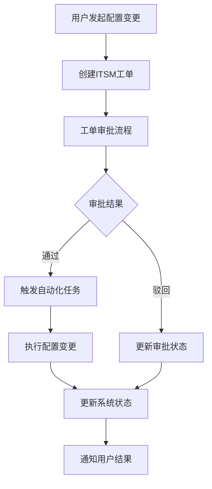
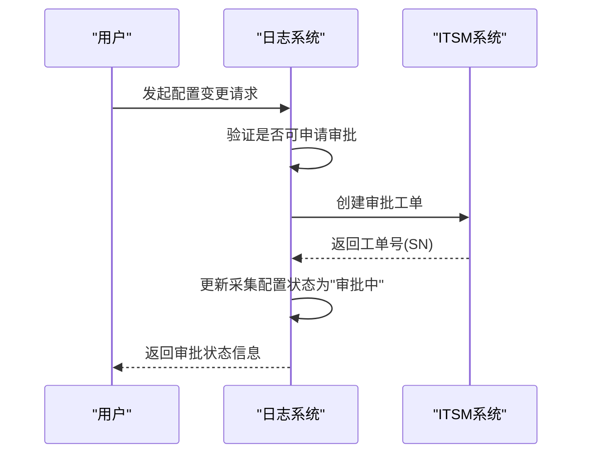
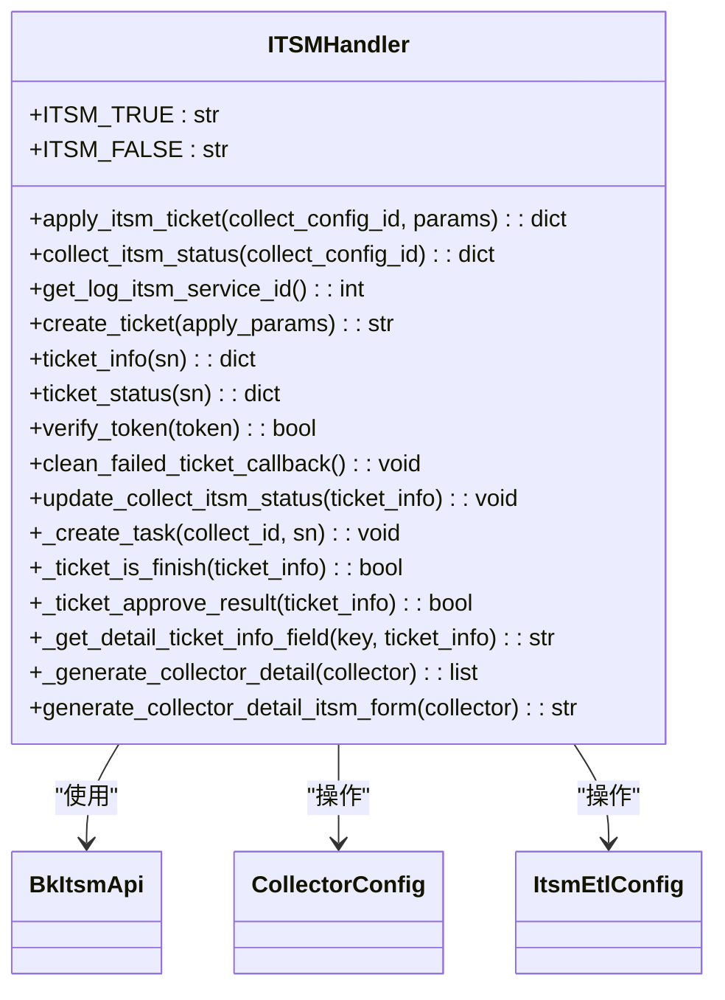
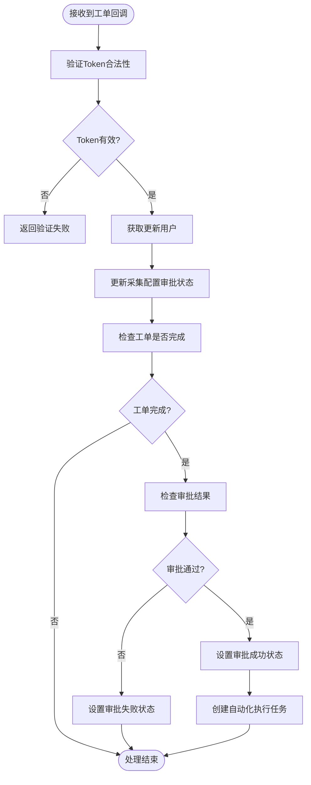
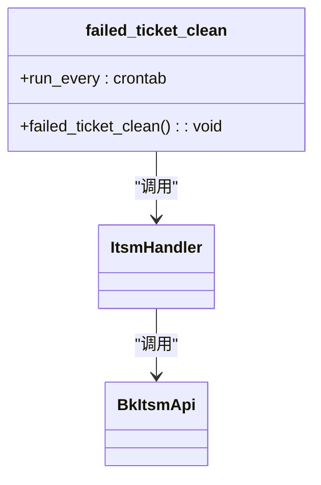
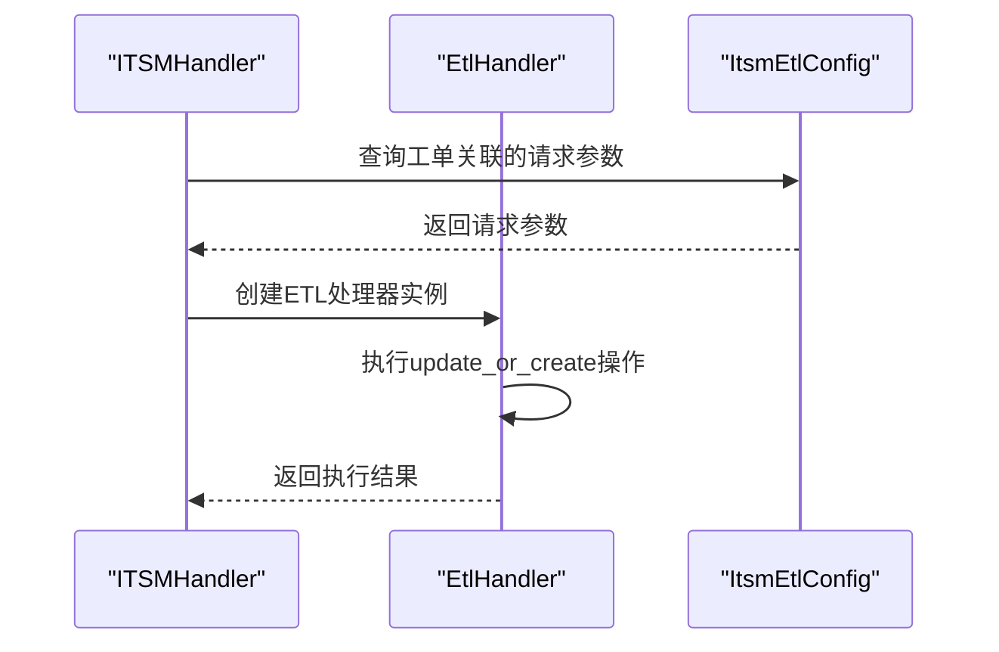
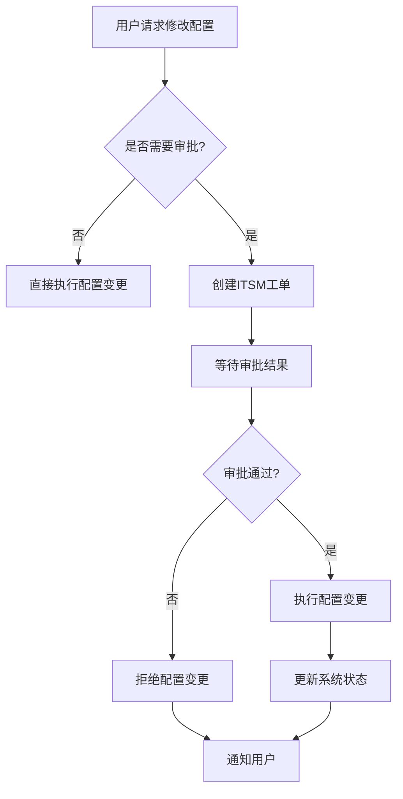

# 审批流程集成

<cite>
**本文档引用的文件**   
- [itsm.py](file://bklog/apps/log_databus/handlers/itsm.py)
- [itsm_views.py](file://bklog/apps/log_databus/views/itsm_views.py)
- [tasks.py](file://bklog/apps/log_databus/tasks/itsm.py)
- [bk_itsm.py](file://bklog/apps/api/modules/bk_itsm.py)
- [models.py](file://bklog/apps/log_databus/models.py)
- [constants.py](file://bklog/apps/log_databus/constants.py)
- [exceptions.py](file://bklog/apps/log_databus/exceptions.py)
- [base.py](file://bklog/apps/log_databus/handlers/etl/base.py)
</cite>

## 目录
1. [简介](#简介)
2. [审批流程集成架构](#审批流程集成架构)
3. [ITSM审批流程实现机制](#itsm审批流程实现机制)
4. [ITSMHandler处理器分析](#itsmhandler处理器分析)
5. [Celery任务处理机制](#celery任务处理机制)
6. [边界情况处理方案](#边界情况处理方案)
7. [配置变更与存储扩容集成](#配置变更与存储扩容集成)
8. [总结](#总结)

## 简介
本文档详细说明日志系统操作与ITSM审批流程的集成机制。重点描述如何将日志采集配置变更、存储扩容等敏感操作与ITSM审批流程绑定，实现工单驱动的配置变更。文档将深入分析`ITSMHandler`处理器如何监听工单状态变化并触发相应的配置更新操作，以及Celery任务如何处理审批通过后的自动化执行逻辑，包括错误处理和状态回写。同时，结合实际代码说明审批流程超时处理、驳回处理等边界情况的实现方案。

## 审批流程集成架构
日志系统与ITSM审批流程的集成采用事件驱动架构，通过工单状态变化触发相应的配置更新操作。整个流程包括工单创建、状态监听、审批结果处理和自动化执行等关键环节。



**图示来源**
- [itsm.py](file://bklog/apps/log_databus/handlers/itsm.py#L51-L169)
- [itsm_views.py](file://bklog/apps/log_databus/views/itsm_views.py#L36-L100)

## ITSM审批流程实现机制
日志系统通过ITSMHandler处理器实现与ITSM系统的深度集成，将敏感操作与审批流程绑定。当用户发起日志采集配置变更或存储扩容等操作时，系统会自动创建ITSM工单，并在审批通过后自动执行相应的配置更新。

### 工单创建与状态管理
系统通过`apply_itsm_ticket`方法创建ITSM工单，该方法首先验证当前采集配置是否可以申请审批，然后调用ITSM API创建工单，并记录工单号和状态。



**图示来源**
- [itsm.py](file://bklog/apps/log_databus/handlers/itsm.py#L51-L63)
- [models.py](file://bklog/apps/log_databus/models.py#L305-L329)

### 审批状态监听
系统通过`collect_itsm_status`方法定期查询工单状态，获取最新的审批进度和结果。该方法会从ITSM系统获取工单详细信息，并将其与本地采集配置状态进行同步。

**审批状态定义**
| 状态代码 | 状态名称 | 说明 |
|---------|--------|------|
| not_apply | 未申请采集接入 | 尚未发起审批申请 |
| applying | 采集接入进行中 | 工单已创建，正在审批中 |
| fail_apply | 采集接入失败 | 审批被驳回或超时 |
| success_apply | 采集接入完成 | 审批通过，配置已更新 |

**表来源**
- [constants.py](file://bklog/apps/log_databus/constants.py#L189-L200)

## ITSMHandler处理器分析
`ITSMHandler`是审批流程集成的核心处理器，负责工单的创建、状态查询、结果处理和自动化执行等关键操作。

### 核心功能实现
`ITSMHandler`类实现了完整的审批流程处理逻辑，包括工单创建、状态查询、审批结果验证和任务触发等功能。



**图示来源**
- [itsm.py](file://bklog/apps/log_databus/handlers/itsm.py#L47-L214)

### 工单回调处理
`ItsmCallbackViewSet`负责处理ITSM系统的工单状态回调，验证回调token的合法性，并更新本地审批状态。



**图示来源**
- [itsm_views.py](file://bklog/apps/log_databus/views/itsm_views.py#L88-L100)
- [itsm.py](file://bklog/apps/log_databus/handlers/itsm.py#L137-L169)

## Celery任务处理机制
系统使用Celery实现异步任务处理，确保审批通过后的配置变更操作能够可靠执行。

### 任务调度与执行
`failed_ticket_clean`任务定期检查失败的工单回调，确保所有工单状态都能得到正确处理。



**图示来源**
- [tasks.py](file://bklog/apps/log_databus/tasks/itsm.py#L28-L34)
- [default.py](file://bklog/config/default.py#L223)

### 自动化执行流程
当审批通过后，`_create_task`方法会创建相应的ETL处理任务，执行配置变更操作。



**图示来源**
- [itsm.py](file://bklog/apps/log_databus/handlers/itsm.py#L151-L163)
- [base.py](file://bklog/apps/log_databus/handlers/etl/base.py#L150-L259)

## 边界情况处理方案
系统对审批流程中的各种边界情况进行了完善的处理，确保流程的健壮性和可靠性。

### 超时处理
系统通过`_ticket_is_finish`方法判断工单是否已完成，如果工单长时间处于运行状态，则视为超时。

```python
def _ticket_is_finish(self, ticket_info: dict):
    return "RUNNING" != ticket_info["current_status"]
```

**代码来源**
- [itsm.py](file://bklog/apps/log_databus/handlers/itsm.py#L164-L165)

### 驳回处理
当审批被驳回时，系统会调用`set_itsm_fail`方法更新采集配置状态为"采集接入失败"。

```python
def set_itsm_fail(self):
    self.itsm_ticket_status = CollectItsmStatus.FAIL_APPLY.value
    self.save()
```

**代码来源**
- [models.py](file://bklog/apps/log_databus/models.py#L322-L324)

### 重复申请处理
系统通过`can_apply_itsm`方法防止重复申请审批，确保同一采集配置在同一时间只能有一个审批流程。

```python
def can_apply_itsm(self):
    return self.itsm_ticket_status == "" or self.itsm_ticket_status in [
        CollectItsmStatus.NOT_APPLY.value,
        CollectItsmStatus.FAIL_APPLY.value,
        CollectItsmStatus.SUCCESS_APPLY.value,
    ]
```

**代码来源**
- [models.py](file://bklog/apps/log_databus/models.py#L305-L310)

### 回调失败处理
系统定期执行`failed_ticket_clean`任务，清理失败的工单回调，确保所有工单状态都能得到正确处理。

```python
@periodic_task(run_every=crontab(minute="*/5"))
def failed_ticket_clean():
    """
    处理回调失败的单据
    """
    ItsmHandler().clean_failed_ticket_callback()
```

**代码来源**
- [tasks.py](file://bklog/apps/log_databus/tasks/itsm.py#L28-L34)

## 配置变更与存储扩容集成
系统将日志采集配置变更和存储扩容等敏感操作与ITSM审批流程深度集成，实现工单驱动的配置变更。

### 配置变更流程
当用户需要修改采集配置时，系统会触发审批流程，只有审批通过后才能执行配置变更。



**图示来源**
- [base.py](file://bklog/apps/log_databus/handlers/etl/base.py#L125-L148)

### 存储扩容处理
存储扩容操作同样需要经过ITSM审批流程，系统会在审批通过后自动执行扩容操作。

```python
def itsm_pre_hook(self, data, collect_config_id):
    if not FeatureToggleObject.switch(name=FEATURE_COLLECTOR_ITSM):
        return data, True

    collect_config = CollectorConfig.objects.get(collector_config_id=collect_config_id)
    if data["need_assessment"]:
        itsm_handler = ItsmHandler()
        sn = itsm_handler.create_ticket({
            "title": collect_config.generate_itsm_title(),
            "bk_biz_id": collect_config.bk_biz_id,
            "approvals": ",".join(data["assessment_config"]["approvals"]),
            "log_assessment": data["assessment_config"]["log_assessment"],
            "collector_detail": itsm_handler.generate_collector_detail_itsm_form(collect_config),
        })
        collect_config.set_itsm_applying(sn)
        if data["assessment_config"]["need_approval"]:
            ItsmEtlConfig.objects.create(ticket_sn=sn, request_param=data)
            return itsm_handler.collect_itsm_status(collect_config_id), False
        collect_config.set_itsm_success()
    return data, True
```

**代码来源**
- [base.py](file://bklog/apps/log_databus/handlers/etl/base.py#L125-L148)

## 总结
本文档详细说明了日志系统与ITSM审批流程的集成机制。通过`ITSMHandler`处理器，系统实现了工单驱动的配置变更，将日志采集配置变更、存储扩容等敏感操作与审批流程绑定。系统采用事件驱动架构，通过Celery任务处理审批通过后的自动化执行逻辑，并对超时、驳回等边界情况进行了完善的处理。这种集成方式不仅提高了系统的安全性，还实现了操作的可追溯性和合规性。

**文档来源**
- [itsm.py](file://bklog/apps/log_databus/handlers/itsm.py)
- [itsm_views.py](file://bklog/apps/log_databus/views/itsm_views.py)
- [tasks.py](file://bklog/apps/log_databus/tasks/itsm.py)
- [bk_itsm.py](file://bklog/apps/api/modules/bk_itsm.py)
- [models.py](file://bklog/apps/log_databus/models.py)
- [constants.py](file://bklog/apps/log_databus/constants.py)
- [exceptions.py](file://bklog/apps/log_databus/exceptions.py)
- [base.py](file://bklog/apps/log_databus/handlers/etl/base.py)