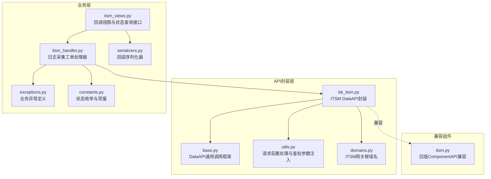
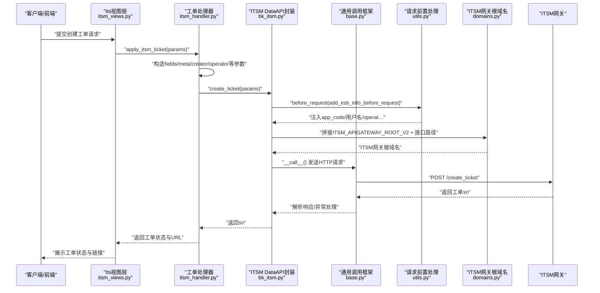
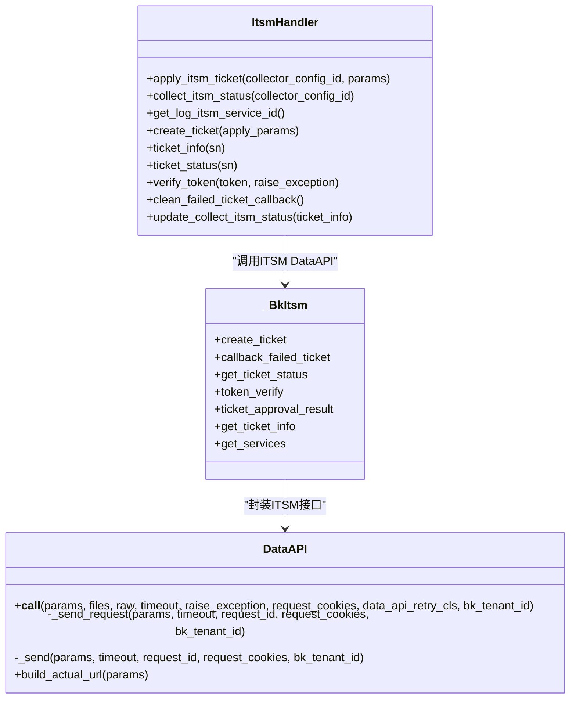
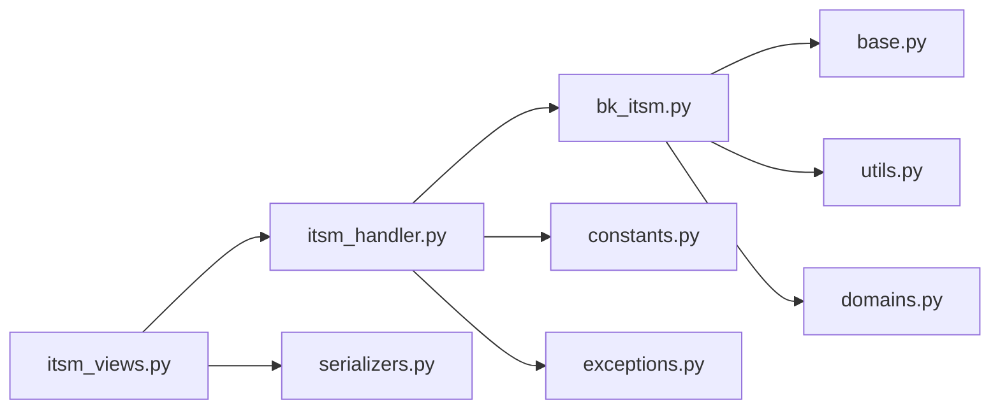

# 工单接口调用

<cite>
**本文引用的文件**
- [bk_itsm.py](file://bklog/apps/api/modules/bk_itsm.py)
- [base.py](file://bklog/apps/api/base.py)
- [utils.py](file://bklog/apps/api/modules/utils.py)
- [domains.py](file://bklog/config/domains.py)
- [itsm.py](file://bklog/blueking/component/apis/itsm.py)
- [itsm_handler.py](file://bklog/apps/log_databus/handlers/itsm.py)
- [itsm_views.py](file://bklog/apps/log_databus/views/itsm_views.py)
- [exceptions.py](file://bklog/apps/log_databus/exceptions.py)
- [constants.py](file://bklog/apps/log_databus/constants.py)
- [serializers.py](file://bklog/apps/log_databus/serializers.py)
- [exception.py](file://bklog/apps/api/exception.py)
</cite>

## 目录
1. [简介](#简介)
2. [项目结构](#项目结构)
3. [核心组件](#核心组件)
4. [架构总览](#架构总览)
5. [详细组件分析](#详细组件分析)
6. [依赖关系分析](#依赖关系分析)
7. [性能与稳定性考量](#性能与稳定性考量)
8. [故障排查指南](#故障排查指南)
9. [结论](#结论)
10. [附录](#附录)

## 简介
本文件面向需要对接蓝鲸ITSM系统的开发者，系统化梳理了与ITSM工单相关的API调用实现，包括：
- 核心接口：创建工单、查询工单状态、回调校验、查询服务列表、查询工单详情、查询审批结果、回调失败单据清理等
- Python调用示例：如何通过API模块调用ITSM接口创建“日志采集变更”工单
- 关键实现细节：认证机制、请求签名、重试策略、错误码处理、回调校验与幂等

目标是帮助读者快速理解并稳定地在业务中复用ITSM工单能力。

## 项目结构
围绕ITSM工单调用的相关模块分布如下：
- API封装层：ITSM接口的DataAPI封装与通用HTTP调用框架
- 业务处理器：日志采集场景下的工单生命周期编排
- 回调与校验：回调URL生成、token校验、状态同步与清理
- 配置与常量：ITSM服务ID、显示角色、状态枚举、异常定义

图表来源
- [bk_itsm.py](file://bklog/apps/api/modules/bk_itsm.py#L1-L86)
- [base.py](file://bklog/apps/api/base.py#L191-L600)
- [utils.py](file://bklog/apps/api/modules/utils.py#L140-L248)
- [domains.py](file://bklog/config/domains.py#L54-L60)
- [itsm_handler.py](file://bklog/apps/log_databus/handlers/itsm.py#L1-L200)
- [itsm_views.py](file://bklog/apps/log_databus/views/itsm_views.py#L26-L100)
- [serializers.py](file://bklog/apps/log_databus/serializers.py#L954-L962)
- [exceptions.py](file://bklog/apps/log_databus/exceptions.py#L291-L338)
- [constants.py](file://bklog/apps/log_databus/constants.py#L189-L200)
- [itsm.py](file://bklog/blueking/component/apis/itsm.py#L31-L90)

章节来源
- [bk_itsm.py](file://bklog/apps/api/modules/bk_itsm.py#L1-L86)
- [base.py](file://bklog/apps/api/base.py#L191-L600)
- [utils.py](file://bklog/apps/api/modules/utils.py#L140-L248)
- [domains.py](file://bklog/config/domains.py#L54-L60)
- [itsm_handler.py](file://bklog/apps/log_databus/handlers/itsm.py#L1-L200)
- [itsm_views.py](file://bklog/apps/log_databus/views/itsm_views.py#L26-L100)
- [serializers.py](file://bklog/apps/log_databus/serializers.py#L954-L962)
- [exceptions.py](file://bklog/apps/log_databus/exceptions.py#L291-L338)
- [constants.py](file://bklog/apps/log_databus/constants.py#L189-L200)
- [itsm.py](file://bklog/blueking/component/apis/itsm.py#L31-L90)

## 核心组件
- ITSM DataAPI封装：在模块中声明了创建工单、查询工单状态、token校验、查询服务列表、查询工单详情、查询审批结果、回调失败单据清理等接口，均通过DataAPI进行统一封装，便于统一注入鉴权参数、超时、重试、缓存等能力。
- DataAPI通用框架：负责发送HTTP请求、统一错误处理、结果清洗、缓存、日志记录、重试策略等。
- 请求前置处理：add_esb_info_before_request在不同运行环境下自动注入app_code、用户名、operator、auth_info等参数，确保ITSM网关鉴权通过。
- ITSM网关根域名：ITSM_APIGATEWAY_ROOT_V2来自环境配置，拼接具体接口路径。
- 业务处理器：ItsmHandler封装了日志采集场景下的工单创建、状态查询、回调校验、状态同步、失败单据清理等完整流程。
- 回调与校验：回调视图接收ITSM回调，先校验token，再更新采集配置状态；同时提供状态查询接口。
- 异常与常量：定义了ITSM相关异常与状态枚举，便于统一处理与展示。

章节来源
- [bk_itsm.py](file://bklog/apps/api/modules/bk_itsm.py#L30-L85)
- [base.py](file://bklog/apps/api/base.py#L191-L600)
- [utils.py](file://bklog/apps/api/modules/utils.py#L140-L248)
- [domains.py](file://bklog/config/domains.py#L54-L60)
- [itsm_handler.py](file://bklog/apps/log_databus/handlers/itsm.py#L47-L169)
- [itsm_views.py](file://bklog/apps/log_databus/views/itsm_views.py#L26-L100)
- [exceptions.py](file://bklog/apps/log_databus/exceptions.py#L291-L338)
- [constants.py](file://bklog/apps/log_databus/constants.py#L189-L200)

## 架构总览
下图展示了从应用层到ITSM网关的整体调用链路与关键交互点。

图表来源
- [itsm_views.py](file://bklog/apps/log_databus/views/itsm_views.py#L26-L85)
- [itsm_handler.py](file://bklog/apps/log_databus/handlers/itsm.py#L51-L103)
- [bk_itsm.py](file://bklog/apps/api/modules/bk_itsm.py#L34-L40)
- [base.py](file://bklog/apps/api/base.py#L277-L482)
- [utils.py](file://bklog/apps/api/modules/utils.py#L175-L217)
- [domains.py](file://bklog/config/domains.py#L54-L60)

## 详细组件分析

### ITSM DataAPI封装（bk_itsm.py）
- 接口清单
  - create_ticket：创建工单
  - get_ticket_status：查询工单状态
  - token_verify：token校验
  - get_ticket_info：查询工单详情
  - ticket_approval_result：查询审批结果
  - callback_failed_ticket：回调失败的单号
  - get_services：查询服务列表
- 关键点
  - 使用DataAPI统一封装，每个接口均设置HTTP方法、URL、模块描述、请求前处理函数（注入ESB鉴权信息）
  - URL通过ITSM_APIGATEWAY_ROOT_V2拼接，确保与环境配置一致
  - 支持use_superuser、no_query_params、cache_time、pagination_style等高级配置

章节来源
- [bk_itsm.py](file://bklog/apps/api/modules/bk_itsm.py#L30-L85)
- [domains.py](file://bklog/config/domains.py#L54-L60)

### DataAPI通用调用框架（base.py）
- 职责
  - 统一封装HTTP请求发送、结果解析、异常处理、日志记录、缓存、重试、并发批量请求等
  - 提供DataResponse统一响应包装，暴露is_success/message/code/data/errors等属性
  - 支持before_request/after_request钩子、header_keys、method_override、bk_tenant_id等
- 重试与异常
  - 通过DataApiRetryClass与retrying库实现指数退避重试
  - 对HTTP状态码异常、JSON解析异常、DataAPIException等进行统一捕获与抛出
- 认证与签名
  - 自动注入X-Bkapi-Authorization头，包含app_code、app_secret、username等
  - 支持多租户场景下的X-Bk-Tenant-Id头

章节来源
- [base.py](file://bklog/apps/api/base.py#L191-L600)
- [base.py](file://bklog/apps/api/base.py#L602-L771)
- [exception.py](file://bklog/apps/api/exception.py#L29-L41)

### 请求前置处理与鉴权（utils.py）
- add_esb_info_before_request
  - 在后台任务/测试/普通WEB请求等不同场景下，自动注入bk_username、operator、auth_info、语言等参数
  - 支持no_request模式，强制使用后台用户身份
- add_app_info_before_request
  - 注入app_code与X-Bk-App-Code，确保网关鉴权通过
- 作用于ITSM DataAPI封装，确保每次调用都带有正确的ESB鉴权信息

章节来源
- [utils.py](file://bklog/apps/api/modules/utils.py#L140-L248)

### 日志采集工单处理器（itsm_handler.py）
- 主要职责
  - apply_itsm_ticket：对外入口，构造fields、meta、creator/operator等参数，调用create_ticket并持久化工单状态
  - collect_itsm_status：汇总当前采集配置的ITSM状态、展示URL、附加表单字段
  - get_log_itsm_service_id：查询ITSM服务ID（通过get_services）
  - create_ticket：封装ITSM创建工单请求
  - ticket_info/ticket_status：查询工单详情与状态
  - verify_token：校验回调token
  - clean_failed_ticket_callback/update_collect_itsm_status：清理失败回调并同步审批结果
- 关键参数
  - service_id：来自特性开关或配置
  - creator/operator：取自当前请求用户
  - fields：动态表单字段，包含采集配置详情
  - meta.callback_url：回调地址，指向itsm_views中的回调接口
  - 特殊处理：为绕过权限限制，使用bk_username=admin，operator与creator保持一致

章节来源
- [itsm_handler.py](file://bklog/apps/log_databus/handlers/itsm.py#L51-L169)
- [constants.py](file://bklog/apps/log_databus/constants.py#L189-L200)

### 回调与校验（itsm_views.py、serializers.py）
- 回调视图
  - collect_itsm_callback：接收ITSM回调，校验token，更新采集配置状态
- 回调序列化器
  - CollectItsmCallbackSerializer：约束回调字段（sn、title、ticket_url、current_status、updated_by、update_at、approve_result、token）

章节来源
- [itsm_views.py](file://bklog/apps/log_databus/views/itsm_views.py#L88-L100)
- [serializers.py](file://bklog/apps/log_databus/serializers.py#L954-L962)

### 错误码与异常（exceptions.py、exception.py）
- 业务异常
  - CollectItsmTokenIllega：ITSM回调token非法
  - CollectItsmNotExists：ITSM流程服务不存在
  - CollectItsmHasApply：已提交采集接入申请
- DataAPI异常
  - DataAPIException：统一包装底层异常，便于上层捕获与处理

章节来源
- [exceptions.py](file://bklog/apps/log_databus/exceptions.py#L291-L338)
- [exception.py](file://bklog/apps/api/exception.py#L29-L41)

### 类关系图（代码级）

图表来源
- [bk_itsm.py](file://bklog/apps/api/modules/bk_itsm.py#L30-L85)
- [base.py](file://bklog/apps/api/base.py#L191-L600)
- [itsm_handler.py](file://bklog/apps/log_databus/handlers/itsm.py#L47-L169)

## 依赖关系分析
- 模块耦合
  - itsm_handler依赖bk_itsm封装与utils注入的鉴权参数
  - itsm_views依赖itsm_handler与回调序列化器
  - base.py为所有DataAPI提供统一的网络与异常处理
- 外部依赖
  - ITSM网关根域名来自环境配置
  - ESB鉴权参数通过utils注入
- 循环依赖
  - 未发现循环导入；各模块职责清晰

图表来源
- [itsm_handler.py](file://bklog/apps/log_databus/handlers/itsm.py#L1-L200)
- [bk_itsm.py](file://bklog/apps/api/modules/bk_itsm.py#L30-L85)
- [base.py](file://bklog/apps/api/base.py#L191-L600)
- [utils.py](file://bklog/apps/api/modules/utils.py#L140-L248)
- [domains.py](file://bklog/config/domains.py#L54-L60)
- [itsm_views.py](file://bklog/apps/log_databus/views/itsm_views.py#L26-L100)
- [serializers.py](file://bklog/apps/log_databus/serializers.py#L954-L962)
- [constants.py](file://bklog/apps/log_databus/constants.py#L189-L200)
- [exceptions.py](file://bklog/apps/log_databus/exceptions.py#L291-L338)

## 性能与稳定性考量
- 重试策略
  - DataApiRetryClass支持配置最大尝试次数与随机等待区间，可通过接口定义时传入data_api_retry_cls实现
  - 对读超时、RetryError等异常进行统一捕获与抛出
- 缓存
  - DataAPI支持cache_time配置，对GET类接口可开启缓存以降低重复请求开销
- 并发与批量
  - base.py提供batch_request与bulk_request，支持并发切片与分页批量请求
- 超时与日志
  - 统一default_timeout与请求耗时记录，便于定位慢请求
- 审计与可观测
  - DataAPI在finally中输出详细日志，包含URL、方法、参数、响应、耗时、错误等

章节来源
- [base.py](file://bklog/apps/api/base.py#L108-L174)
- [base.py](file://bklog/apps/api/base.py#L332-L482)
- [base.py](file://bklog/apps/api/base.py#L632-L741)

## 故障排查指南
- 常见问题与定位
  - 401/403鉴权失败：确认app_code/app_secret、用户名、operator、auth_info是否正确注入
  - JSON解析失败：检查DataAPI返回格式是否符合预期
  - 读超时：调整default_timeout或启用重试策略
  - 回调token非法：核对回调token与verify_token返回值
- 定位手段
  - 查看DataAPI日志输出，关注url、method、response_code、response_message、errors
  - 检查ITSM网关根域名配置是否正确
  - 核对回调URL是否可达、是否被防火墙拦截
- 相关异常
  - CollectItsmTokenIllega：回调token校验失败
  - CollectItsmNotExists：ITSM服务不存在
  - DataAPIException：底层异常包装

章节来源
- [exception.py](file://bklog/apps/api/exception.py#L29-L41)
- [exceptions.py](file://bklog/apps/log_databus/exceptions.py#L291-L338)
- [base.py](file://bklog/apps/api/base.py#L332-L482)

## 结论
通过对ITSM DataAPI封装、通用调用框架、请求前置处理与业务处理器的系统化梳理，本文提供了从接口定义到调用实现、从认证签名到重试与异常处理的完整参考。建议在实际接入时：
- 明确ITSM服务ID来源（特性开关或配置）
- 严格遵循回调token校验与幂等处理
- 合理配置重试与缓存，提升稳定性
- 通过日志与异常体系快速定位问题

## 附录

### 接口定义与调用要点（create_ticket、get_ticket_status、operate_ticket）
- create_ticket
  - 方法：POST
  - URL：ITSM_APIGATEWAY_ROOT_V2 + "create_ticket/"
  - 请求参数要点：service_id、creator、fields、meta.callback_url、operator、bk_username（admin）
  - 响应：返回sn（工单号）
- get_ticket_status
  - 方法：POST
  - URL：ITSM_APIGATEWAY_ROOT_V2 + "get_ticket_status/"
  - 请求参数要点：{"sn": "..."}
  - 响应：包含current_status、ticket_url、iframe_ticket_url等
- token_verify
  - 方法：POST
  - URL：ITSM_APIGATEWAY_ROOT_V2 + "token/verify/"
  - 请求参数要点：{"token": "..."}
  - 响应：{"is_passed": true/false}
- get_ticket_info / ticket_approval_result / get_services / callback_failed_ticket
  - 详见模块接口定义与业务处理器调用

章节来源
- [bk_itsm.py](file://bklog/apps/api/modules/bk_itsm.py#L34-L82)
- [itsm_handler.py](file://bklog/apps/log_databus/handlers/itsm.py#L88-L119)

### Python调用示例（创建“日志采集变更”工单）
- 入口：Its视图层调用ItsmHandler.apply_itsm_ticket
- 关键步骤
  - 构造fields（采集配置详情）、meta.callback_url（回调地址）
  - 调用BkItsmApi.create_ticket(params)
  - 返回sn并持久化状态
- 参考路径
  - [itsm_views.py](file://bklog/apps/log_databus/views/itsm_views.py#L26-L85)
  - [itsm_handler.py](file://bklog/apps/log_databus/handlers/itsm.py#L51-L103)

章节来源
- [itsm_views.py](file://bklog/apps/log_databus/views/itsm_views.py#L26-L85)
- [itsm_handler.py](file://bklog/apps/log_databus/handlers/itsm.py#L51-L103)

### 认证机制与请求签名
- 自动注入
  - X-Bkapi-Authorization：包含app_code、app_secret、username等
  - X-Bk-App-Code、X-Bk-App-Secret：用于网关鉴权
  - X-Bk-Tenant-Id：多租户场景
- 请求前置处理
  - add_esb_info_before_request：注入bk_username、operator、auth_info、语言等
  - add_app_info_before_request：注入app_code与X-Bk-App-Code

章节来源
- [utils.py](file://bklog/apps/api/modules/utils.py#L140-L248)
- [base.py](file://bklog/apps/api/base.py#L518-L554)

### 重试策略
- DataApiRetryClass
  - 支持配置最大尝试次数、随机等待区间
  - 可添加异常类型与结果检查函数，决定是否重试
- DataAPI.__call__
  - 在内部通过retrying库执行重试，捕获ReadTimeout、RetryError等

章节来源
- [base.py](file://bklog/apps/api/base.py#L108-L174)
- [base.py](file://bklog/apps/api/base.py#L360-L386)

### 回调校验与幂等
- 回调视图
  - 先校验token，再更新状态，最后返回
- 幂等性
  - 通过状态判断与失败单据清理，避免重复处理

章节来源
- [itsm_views.py](file://bklog/apps/log_databus/views/itsm_views.py#L88-L100)
- [itsm_handler.py](file://bklog/apps/log_databus/handlers/itsm.py#L121-L169)