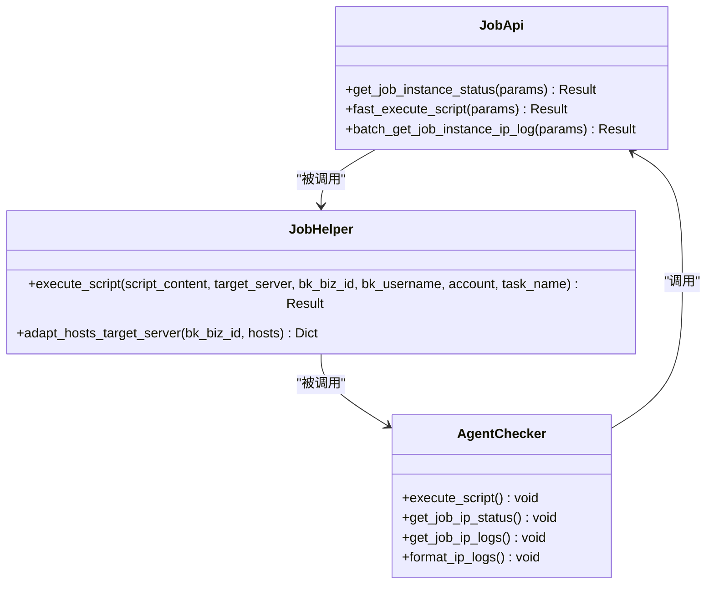
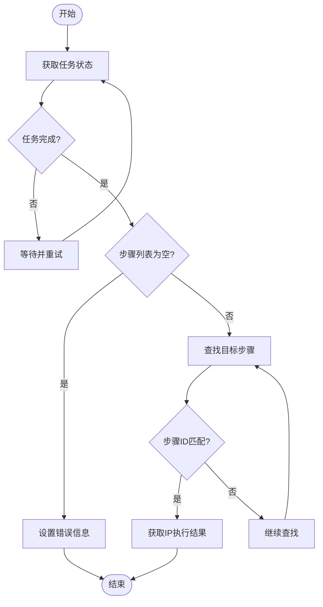
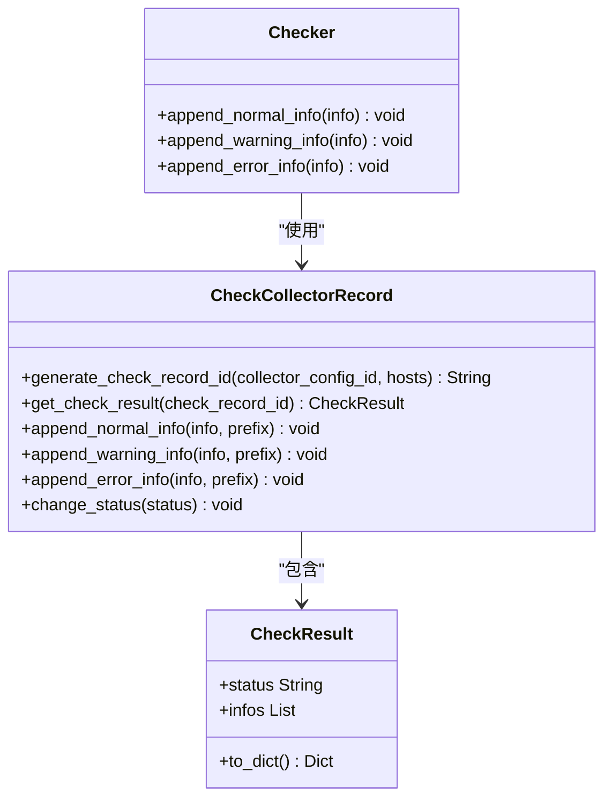

# 任务状态监控

<cite>
**本文档引用的文件**  
- [job.py](file://bklog/apps/api/modules/job.py)
- [job.py](file://bklog/apps/log_commons/job.py)
- [agent_checker.py](file://bklog/apps/log_databus/handlers/check_collector/checker/agent_checker.py)
- [constants.py](file://bklog/apps/log_databus/constants.py)
- [base.py](file://bklog/apps/log_databus/handlers/check_collector/base.py)
</cite>

## 目录
1. [简介](#简介)
2. [核心API接口](#核心api接口)
3. [任务状态监控流程](#任务状态监控流程)
4. [任务状态码解析](#任务状态码解析)
5. [执行结果处理与关联](#执行结果处理与关联)
6. [轮询与回调机制](#轮询与回调机制)
7. [错误处理与重试策略](#错误处理与重试策略)
8. [告警通知机制](#告警通知机制)
9. [总结](#总结)

## 简介

任务状态监控是蓝鲸日志平台的核心功能之一，主要用于监控通过JOB平台远程执行任务的实时状态和执行结果。本系统通过调用JOB平台的API接口，实现对采集任务、脚本执行等远程操作的全生命周期监控。监控系统能够获取任务的执行进度、各步骤状态、执行日志等关键信息，并基于这些信息进行后续处理，如自动重试、告警通知等。该功能在系统运维、故障排查和自动化管理中发挥着重要作用。

## 核心API接口

系统通过`get_job_instance_status`接口来监控远程执行任务的状态。该接口是JOB平台提供的标准API，用于根据作业实例ID查询作业的执行状态。接口通过HTTP GET请求方式调用，返回JSON格式的数据结构，包含任务的整体执行状态、各个步骤的详细状态以及每台主机的执行结果。



**接口来源**  
- [job.py](file://bklog/apps/api/modules/job.py#L87-L94)

## 任务状态监控流程

任务状态监控流程是一个完整的闭环系统，从任务执行开始到结果处理结束。首先，系统通过`JobHelper.execute_script`方法调用JOB平台的`fast_execute_script`接口快速执行脚本，获取作业实例ID和步骤实例ID。然后，系统使用`get_job_instance_status`接口轮询任务状态，直到任务完成。最后，系统通过`batch_get_job_instance_ip_log`接口获取详细的执行日志，并对结果进行格式化处理。

```mermaid
sequenceDiagram
participant 用户 as "用户"
participant AgentChecker as "AgentChecker"
participant JobHelper as "JobHelper"
participant JobApi as "JobApi"
用户->>AgentChecker : 发起检查请求
AgentChecker->>JobHelper : execute_script()
JobHelper->>JobApi : fast_execute_script()
JobApi-->>JobHelper : 返回job_instance_id
JobHelper-->>AgentChecker : 返回执行结果
AgentChecker->>JobApi : get_job_instance_status()
loop 轮询状态
JobApi-->>AgentChecker : 返回执行状态
alt 任务未完成
AgentChecker->>JobApi : 继续轮询
else 任务完成
break
end
end
AgentChecker->>JobApi : batch_get_job_instance_ip_log()
JobApi-->>AgentChecker : 返回执行日志
AgentChecker->>用户 : 返回格式化结果
```

**流程来源**  
- [agent_checker.py](file://bklog/apps/log_databus/handlers/check_collector/checker/agent_checker.py#L77-L82)

## 任务状态码解析

系统定义了明确的任务状态码，用于表示任务的执行结果。成功状态码为9，表示任务执行成功。系统还定义了其他状态码，如310表示Agent异常。这些状态码在任务执行完成后用于判断任务的最终结果，并决定后续的处理逻辑。



**状态码来源**  
- [constants.py](file://bklog/apps/log_databus/constants.py#L536-L541)

## 执行结果处理与关联

执行结果处理是任务监控的重要环节。系统将JOB平台返回的原始执行结果进行格式化处理，提取关键信息并与系统内的采集任务进行关联。处理过程包括将执行状态和执行日志按主机进行分组，解析JSON格式的日志内容，并根据状态码生成相应的提示信息。成功的结果会显示"成功"，而失败的结果会显示具体的错误原因。



**处理来源**  
- [agent_checker.py](file://bklog/apps/log_databus/handlers/check_collector/checker/agent_checker.py#L185-L236)

## 轮询与回调机制

系统采用轮询机制来监控任务状态。通过设置固定的重试次数（5次）和等待间隔（20秒），系统会定期调用`get_job_instance_status`接口查询任务状态。如果在指定时间内任务未完成，则认为任务超时。系统还实现了回调机制，当任务状态发生变化时，会自动更新数据库中的任务状态，并触发相应的后续处理流程。

```mermaid
sequenceDiagram
participant AgentChecker as "AgentChecker"
participant JobApi as "JobApi"
AgentChecker->>JobApi : get_job_instance_status()
loop 5次重试
JobApi-->>AgentChecker : 返回状态
alt 任务未完成
AgentChecker->>AgentChecker : 等待20秒
AgentChecker->>JobApi : 继续查询
else 任务完成
break
end
end
alt 超时
AgentChecker->>AgentChecker : 设置超时错误
else 成功
AgentChecker->>AgentChecker : 处理执行结果
end
```

**轮询来源**  
- [agent_checker.py](file://bklog/apps/log_databus/handlers/check_collector/checker/agent_checker.py#L126-L157)

## 错误处理与重试策略

系统具有完善的错误处理机制。在任务执行过程中，任何异常都会被捕获并记录为错误信息。系统定义了多种错误场景，包括API调用失败、执行状态为空、数据不完整等。对于可恢复的错误，系统会自动进行重试；对于不可恢复的错误，则会记录详细的错误信息供后续分析。重试策略包括固定次数的轮询和适当的等待间隔，以平衡监控效率和系统负载。

**错误处理来源**  
- [agent_checker.py](file://bklog/apps/log_databus/handlers/check_collector/checker/agent_checker.py#L147-L157)

## 告警通知机制

基于任务执行结果，系统可以触发告警通知。当任务执行失败或出现异常时，系统会生成相应的告警信息，并通过预定义的通知渠道发送给相关人员。告警信息包括任务ID、执行时间、错误原因等关键信息，帮助运维人员快速定位和解决问题。系统还支持根据任务结果自动执行后续操作，如自动重试失败的任务或启动应急处理流程。

**告警来源**  
- [agent_checker.py](file://bklog/apps/log_databus/handlers/check_collector/checker/agent_checker.py#L156-L157)

## 总结

任务状态监控系统通过集成JOB平台API，实现了对远程执行任务的全面监控。系统采用轮询机制获取任务状态，通过状态码判断执行结果，并对执行日志进行格式化处理。完善的错误处理和重试策略确保了监控的可靠性，而告警通知机制则能及时发现和响应问题。该系统为蓝鲸日志平台的自动化运维提供了坚实的基础，有效提升了运维效率和系统稳定性。