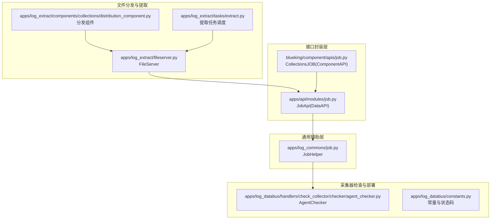
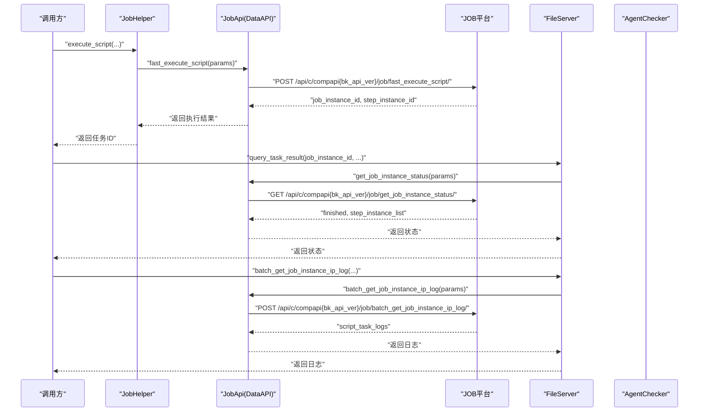
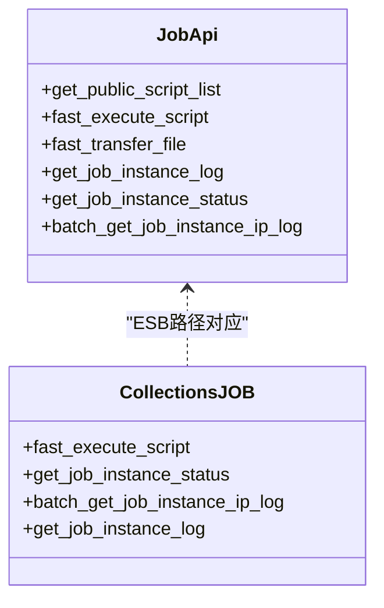
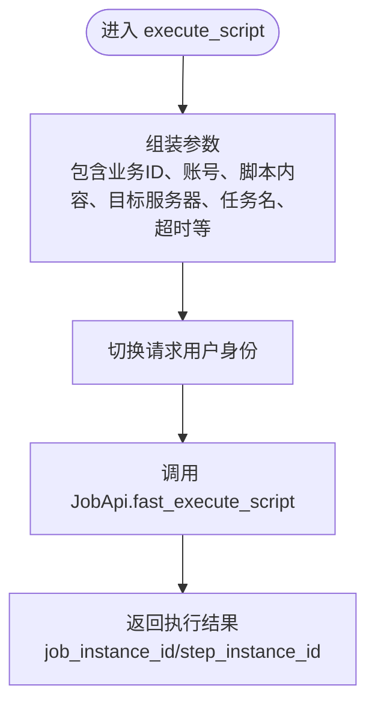
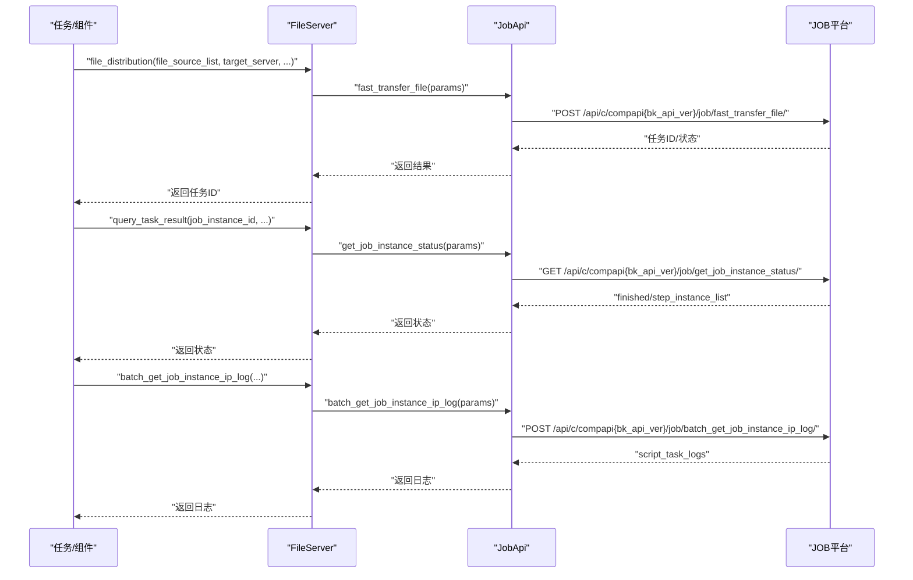
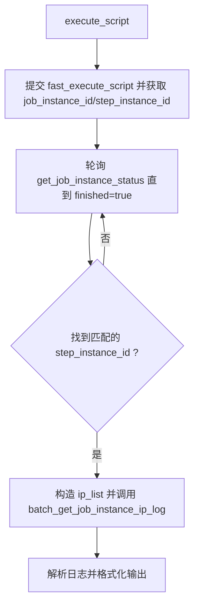
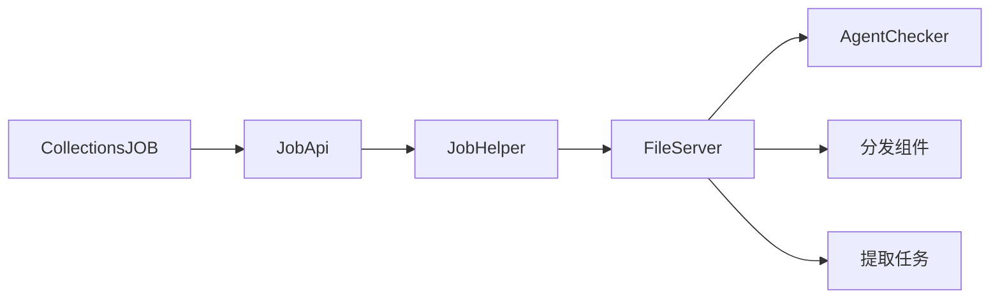

# 作业平台(JOB)集成

<cite>
**本文引用的文件**
- [bklog/apps/api/modules/job.py](file://bklog/apps/api/modules/job.py)
- [bklog/apps/log_commons/job.py](file://bklog/apps/log_commons/job.py)
- [bklog/apps/log_extract/fileserver.py](file://bklog/apps/log_extract/fileserver.py)
- [bklog/apps/log_databus/handlers/check_collector/checker/agent_checker.py](file://bklog/apps/log_databus/handlers/check_collector/checker/agent_checker.py)
- [bklog/blueking/component/apis/job.py](file://bklog/blueking/component/apis/job.py)
- [bklog/apps/log_databus/constants.py](file://bklog/apps/log_databus/constants.py)
- [bklog/apps/log_extract/components/collections/distribution_component.py](file://bklog/apps/log_extract/components/collections/distribution_component.py)
- [bklog/apps/log_extract/tasks/extract.py](file://bklog/apps/log_extract/tasks/extract.py)
</cite>

## 目录
1. [简介](#简介)
2. [项目结构](#项目结构)
3. [核心组件](#核心组件)
4. [架构总览](#架构总览)
5. [详细组件分析](#详细组件分析)
6. [依赖关系分析](#依赖关系分析)
7. [性能考量](#性能考量)
8. [故障排查指南](#故障排查指南)
9. [结论](#结论)
10. [附录](#附录)

## 简介
本文件面向蓝鲸日志平台（bk-log）与蓝鲸作业平台（JOB）的集成，聚焦于采集器管理与日志提取场景中的自动化运维能力。文档详细说明了如何通过JOB平台实现：
- 作业模板调用与脚本快速执行
- 任务执行与状态查询
- 执行记录与IP维度日志查询
- 日志采集配置的批量部署
- Agent安装脚本的远程执行

同时，文档给出关键接口（如 fast_execute_script、get_job_instance_status、batch_get_job_instance_ip_log 等）的调用路径、参数要点与返回结构解析，并结合采集器管理模块中的实际调用流程，帮助读者快速落地自动化部署任务。

## 项目结构
围绕JOB集成的关键代码分布在以下模块：
- 接口封装层：统一对外暴露JOB API，支持网关直连与ESB注入两种模式
- 通用辅助层：对目标主机适配、脚本执行入口等进行抽象
- 采集器检查与部署层：Agent检查、脚本执行、状态轮询、日志拉取
- 文件分发与提取链路：通过JOB进行文件分发与打包

图表来源
- [bklog/apps/api/modules/job.py](file://bklog/apps/api/modules/job.py#L41-L105)
- [bklog/blueking/component/apis/job.py](file://bklog/blueking/component/apis/job.py#L25-L178)
- [bklog/apps/log_commons/job.py](file://bklog/apps/log_commons/job.py#L11-L75)
- [bklog/apps/log_databus/handlers/check_collector/checker/agent_checker.py](file://bklog/apps/log_databus/handlers/check_collector/checker/agent_checker.py#L28-L237)
- [bklog/apps/log_databus/constants.py](file://bklog/apps/log_databus/constants.py#L527-L560)
- [bklog/apps/log_extract/fileserver.py](file://bklog/apps/log_extract/fileserver.py#L1-L249)
- [bklog/apps/log_extract/components/collections/distribution_component.py](file://bklog/apps/log_extract/components/collections/distribution_component.py#L54-L151)
- [bklog/apps/log_extract/tasks/extract.py](file://bklog/apps/log_extract/tasks/extract.py#L282-L338)

章节来源
- [bklog/apps/api/modules/job.py](file://bklog/apps/api/modules/job.py#L41-L105)
- [bklog/blueking/component/apis/job.py](file://bklog/blueking/component/apis/job.py#L25-L178)

## 核心组件
- JobApi（DataAPI）：封装JOB系统API，包括快速执行脚本、快速分发文件、查询作业实例状态、批量查询IP日志等；支持通过网关直连或ESB注入方式调用。
- JobHelper：提供目标主机适配（IPv4/IPv6差异）、脚本执行入口（fast_execute_script），并以指定用户身份发起请求。
- FileServer：封装文件分发（fast_transfer_file）、脚本执行结果查询、IP日志批量查询、任务状态轮询等。
- AgentChecker：采集器Agent检查流程，包含脚本执行、状态轮询、IP日志拉取与结果格式化输出。
- 常量与状态码：定义JOB成功/失败状态、重试次数与等待间隔、默认账户、默认用户名等。

章节来源
- [bklog/apps/api/modules/job.py](file://bklog/apps/api/modules/job.py#L41-L105)
- [bklog/apps/log_commons/job.py](file://bklog/apps/log_commons/job.py#L11-L75)
- [bklog/apps/log_extract/fileserver.py](file://bklog/apps/log_extract/fileserver.py#L1-L249)
- [bklog/apps/log_databus/handlers/check_collector/checker/agent_checker.py](file://bklog/apps/log_databus/handlers/check_collector/checker/agent_checker.py#L28-L237)
- [bklog/apps/log_databus/constants.py](file://bklog/apps/log_databus/constants.py#L527-L560)

## 架构总览
下图展示从采集器检查到文件分发的端到端调用链路，体现各模块之间的协作关系与数据流向。

图表来源
- [bklog/apps/log_commons/job.py](file://bklog/apps/log_commons/job.py#L29-L75)
- [bklog/apps/api/modules/job.py](file://bklog/apps/api/modules/job.py#L55-L105)
- [bklog/apps/log_extract/fileserver.py](file://bklog/apps/log_extract/fileserver.py#L110-L131)
- [bklog/blueking/component/apis/job.py](file://bklog/blueking/component/apis/job.py#L58-L120)

## 详细组件分析

### 组件A：JobApi（DataAPI）与CollectionsJOB（ComponentAPI）
- 功能定位
  - JobApi：封装系统API，支持网关直连（USE_APIGW）与ESB注入（before_request），提供快速执行脚本、快速分发文件、查询作业实例状态、批量查询IP日志等。
  - CollectionsJOB：蓝鲸ESB组件集合，提供传统ESB路径的JOB API（如 fast_execute_script、get_job_instance_status、batch_get_job_instance_ip_log 等）。
- 关键接口
  - 快速执行脚本：fast_execute_script
  - 快速分发文件：fast_transfer_file
  - 查询作业实例状态：get_job_instance_status
  - 批量查询IP日志：batch_get_job_instance_ip_log
- 参数与返回
  - 参数：通常包含业务ID、执行账号、脚本内容/文件源、目标服务器、任务名、超时时间、操作人等；具体字段以各接口定义为准。
  - 返回：包含任务实例ID、步骤实例ID、执行状态、IP维度日志等；字段结构以接口返回为准。

图表来源
- [bklog/apps/api/modules/job.py](file://bklog/apps/api/modules/job.py#L41-L105)
- [bklog/blueking/component/apis/job.py](file://bklog/blueking/component/apis/job.py#L25-L178)

章节来源
- [bklog/apps/api/modules/job.py](file://bklog/apps/api/modules/job.py#L41-L105)
- [bklog/blueking/component/apis/job.py](file://bklog/blueking/component/apis/job.py#L25-L178)

### 组件B：JobHelper（目标主机适配与脚本执行）
- 功能定位
  - 适配目标主机：在IPv6环境下强制使用host_id_list，在IPv4环境下支持ip_list或host_id_list。
  - 脚本执行入口：统一构造fast_execute_script所需参数，切换请求用户身份后调用JobApi。
- 关键参数
  - 脚本内容、目标服务器、业务ID、操作人、执行账号、任务名、脚本参数、脚本语言、超时时间。
- 返回结构
  - 包含job_instance_id、step_instance_id等任务标识，用于后续状态查询与日志拉取。

图表来源
- [bklog/apps/log_commons/job.py](file://bklog/apps/log_commons/job.py#L29-L75)

章节来源
- [bklog/apps/log_commons/job.py](file://bklog/apps/log_commons/job.py#L11-L75)

### 组件C：FileServer（文件分发与任务查询）
- 功能定位
  - 文件分发：通过fast_transfer_file将文件分发至目标主机或中转服务器。
  - 任务查询：根据job_instance_id查询作业实例状态，判断是否完成。
  - IP日志批量查询：根据ip_list/host_id_list、job_instance_id、step_instance_id批量拉取IP维度日志。
- 关键流程
  - 分发组件/提取任务调度调用file_distribution，完成后轮询query_task_result，最终批量拉取IP日志。

图表来源
- [bklog/apps/log_extract/fileserver.py](file://bklog/apps/log_extract/fileserver.py#L133-L175)
- [bklog/apps/log_extract/fileserver.py](file://bklog/apps/log_extract/fileserver.py#L110-L131)
- [bklog/apps/log_extract/fileserver.py](file://bklog/apps/log_extract/fileserver.py#L87-L109)
- [bklog/apps/api/modules/job.py](file://bklog/apps/api/modules/job.py#L72-L105)

章节来源
- [bklog/apps/log_extract/fileserver.py](file://bklog/apps/log_extract/fileserver.py#L1-L249)

### 组件D：AgentChecker（采集器Agent检查）
- 功能定位
  - 通过脚本执行触发Agent检查流程，轮询作业实例状态，拉取IP维度日志并格式化输出。
- 关键流程
  - 执行脚本：构造脚本参数与内容，调用JobHelper.execute_script。
  - 获取状态：循环调用get_job_instance_status，直到finished为真并匹配step_instance_id。
  - 拉取日志：根据ip_list与job_instance_id、step_instance_id调用batch_get_job_instance_ip_log。
  - 结果格式化：解析每台主机的日志，输出成功/失败明细。

图表来源
- [bklog/apps/log_databus/handlers/check_collector/checker/agent_checker.py](file://bklog/apps/log_databus/handlers/check_collector/checker/agent_checker.py#L83-L113)
- [bklog/apps/log_databus/handlers/check_collector/checker/agent_checker.py](file://bklog/apps/log_databus/handlers/check_collector/checker/agent_checker.py#L115-L187)
- [bklog/apps/log_databus/handlers/check_collector/checker/agent_checker.py](file://bklog/apps/log_databus/handlers/check_collector/checker/agent_checker.py#L188-L237)

章节来源
- [bklog/apps/log_databus/handlers/check_collector/checker/agent_checker.py](file://bklog/apps/log_databus/handlers/check_collector/checker/agent_checker.py#L28-L237)
- [bklog/apps/log_databus/constants.py](file://bklog/apps/log_databus/constants.py#L527-L560)

### 组件E：分发组件与提取任务（文件分发与打包）
- 功能定位
  - 分发组件：将文件分发到中转服务器，轮询任务状态，校验成功后继续后续流程。
  - 提取任务：在任务调度中调用file_distribution，设置任务状态与输出参数，轮询并校验分发结果。
- 关键点
  - 使用FileServer.file_distribution进行文件分发。
  - 通过FileServer.query_task_result轮询状态，使用FileServer.get_job_instance_status校验成功与否。

章节来源
- [bklog/apps/log_extract/components/collections/distribution_component.py](file://bklog/apps/log_extract/components/collections/distribution_component.py#L54-L151)
- [bklog/apps/log_extract/tasks/extract.py](file://bklog/apps/log_extract/tasks/extract.py#L282-L338)

## 依赖关系分析
- 模块耦合
  - JobApi/DataAPI与CollectionsJOB(ComponentAPI)形成双通道：前者支持网关直连，后者兼容ESB路径。
  - JobHelper依赖JobApi，负责参数组装与用户身份切换。
  - FileServer依赖JobApi与JobHelper，提供更高层的封装。
  - AgentChecker依赖JobHelper与JobApi，贯穿脚本执行、状态轮询、日志拉取与格式化。
- 外部依赖
  - JOB平台API：fast_execute_script、get_job_instance_status、batch_get_job_instance_ip_log、fast_transfer_file等。
  - 配置与常量：业务ID、默认用户名、默认账号、重试次数与等待间隔、成功状态码等。

图表来源
- [bklog/blueking/component/apis/job.py](file://bklog/blueking/component/apis/job.py#L25-L178)
- [bklog/apps/api/modules/job.py](file://bklog/apps/api/modules/job.py#L41-L105)
- [bklog/apps/log_commons/job.py](file://bklog/apps/log_commons/job.py#L11-L75)
- [bklog/apps/log_extract/fileserver.py](file://bklog/apps/log_extract/fileserver.py#L1-L249)
- [bklog/apps/log_databus/handlers/check_collector/checker/agent_checker.py](file://bklog/apps/log_databus/handlers/check_collector/checker/agent_checker.py#L28-L237)

## 性能考量
- 轮询策略
  - AgentChecker采用固定重试次数与等待间隔，避免频繁轮询导致JOB平台压力过大。
- 超时控制
  - 脚本执行超时参数在JobHelper与AgentChecker中均有体现，建议结合业务场景合理设置。
- IPv6适配
  - 在IPv6环境下强制使用host_id_list，减少CMDB映射问题带来的额外开销。
- 批量查询
  - 使用batch_get_job_instance_ip_log批量拉取IP日志，降低多次请求的网络开销。

[本节为通用指导，无需列出章节来源]

## 故障排查指南
- 常见问题
  - 作业未完成：确认finished标志与step_instance_id匹配，必要时增加重试次数或延长等待间隔。
  - IP日志为空：检查ip_list/host_id_list构造是否正确，确认job_instance_id与step_instance_id一致。
  - Agent异常状态：参考JOB状态码映射，定位Agent异常或脚本执行失败原因。
- 定位手段
  - 通过FileServer.query_task_result获取作业实例状态，再调用batch_get_job_instance_ip_log拉取IP日志。
  - 在AgentChecker中查看格式化输出，逐项核对模块检查结果与消息。

章节来源
- [bklog/apps/log_databus/constants.py](file://bklog/apps/log_databus/constants.py#L527-L560)
- [bklog/apps/log_extract/fileserver.py](file://bklog/apps/log_extract/fileserver.py#L110-L131)
- [bklog/apps/log_extract/fileserver.py](file://bklog/apps/log_extract/fileserver.py#L87-L109)
- [bklog/apps/log_databus/handlers/check_collector/checker/agent_checker.py](file://bklog/apps/log_databus/handlers/check_collector/checker/agent_checker.py#L115-L187)

## 结论
通过JobApi/DataAPI与JobHelper的统一封装，结合FileServer与AgentChecker的高层抽象，蓝鲸日志平台实现了对JOB平台的稳定集成。在采集器管理与日志提取场景中，能够高效完成脚本执行、文件分发、状态轮询与日志拉取等关键动作，满足批量部署与自动化运维需求。

[本节为总结性内容，无需列出章节来源]

## 附录

### API使用方法与参数说明（基于代码实现）
- fast_execute_script（快速执行脚本）
  - 调用路径：JobHelper.execute_script -> JobApi.fast_execute_script
  - 关键参数：业务ID、执行账号、脚本内容、脚本语言、任务名、目标服务器、超时时间、操作人、脚本参数
  - 返回结构：包含job_instance_id、step_instance_id等任务标识
  - 参考路径
    - [bklog/apps/log_commons/job.py](file://bklog/apps/log_commons/job.py#L29-L75)
    - [bklog/apps/api/modules/job.py](file://bklog/apps/api/modules/job.py#L64-L71)

- get_job_instance_status（查询作业实例状态）
  - 调用路径：FileServer.query_task_result -> JobApi.get_job_instance_status
  - 关键参数：作业实例ID、业务ID/租户、操作人、是否返回IP结果
  - 返回结构：finished标志、step_instance_list（包含IP维度结果）
  - 参考路径
    - [bklog/apps/log_extract/fileserver.py](file://bklog/apps/log_extract/fileserver.py#L110-L131)
    - [bklog/apps/api/modules/job.py](file://bklog/apps/api/modules/job.py#L87-L94)

- batch_get_job_instance_ip_log（批量查询IP日志）
  - 调用路径：FileServer.get_host_list_log -> JobApi.batch_get_job_instance_ip_log
  - 关键参数：业务ID、ip_list/host_id_list、作业实例ID、步骤实例ID
  - 返回结构：script_task_logs（IP维度日志列表）
  - 参考路径
    - [bklog/apps/log_extract/fileserver.py](file://bklog/apps/log_extract/fileserver.py#L87-L109)
    - [bklog/apps/api/modules/job.py](file://bklog/apps/api/modules/job.py#L95-L102)

- fast_transfer_file（快速分发文件）
  - 调用路径：FileServer.file_distribution -> JobApi.fast_transfer_file
  - 关键参数：文件源列表、目标路径、目标服务器（ip_list/host_id_list）、任务名、执行账号、业务ID/租户
  - 返回结构：任务ID与数据
  - 参考路径
    - [bklog/apps/log_extract/fileserver.py](file://bklog/apps/log_extract/fileserver.py#L133-L175)
    - [bklog/apps/api/modules/job.py](file://bklog/apps/api/modules/job.py#L72-L79)

### 实战场景示例（基于代码调用）
- 日志采集配置的批量部署
  - 步骤：构造文件分发参数 -> 调用fast_transfer_file -> 轮询get_job_instance_status -> 批量拉取IP日志
  - 参考路径
    - [bklog/apps/log_extract/fileserver.py](file://bklog/apps/log_extract/fileserver.py#L133-L175)
    - [bklog/apps/log_extract/fileserver.py](file://bklog/apps/log_extract/fileserver.py#L110-L131)
    - [bklog/apps/log_extract/fileserver.py](file://bklog/apps/log_extract/fileserver.py#L87-L109)

- Agent安装脚本的远程执行
  - 步骤：构造脚本参数与内容 -> 调用JobHelper.execute_script -> 轮询状态 -> 拉取IP日志并格式化
  - 参考路径
    - [bklog/apps/log_databus/handlers/check_collector/checker/agent_checker.py](file://bklog/apps/log_databus/handlers/check_collector/checker/agent_checker.py#L83-L113)
    - [bklog/apps/log_databus/handlers/check_collector/checker/agent_checker.py](file://bklog/apps/log_databus/handlers/check_collector/checker/agent_checker.py#L115-L187)
    - [bklog/apps/log_databus/handlers/check_collector/checker/agent_checker.py](file://bklog/apps/log_databus/handlers/check_collector/checker/agent_checker.py#L188-L237)