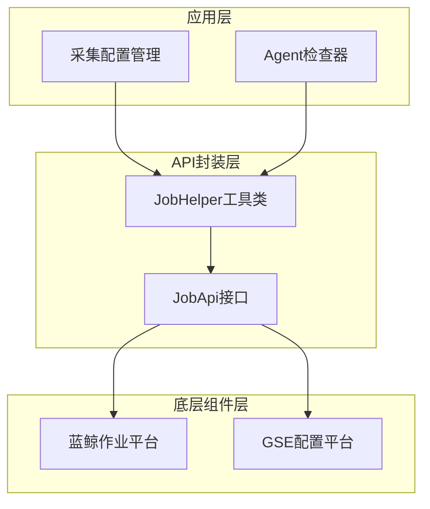
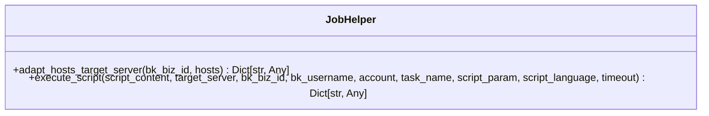
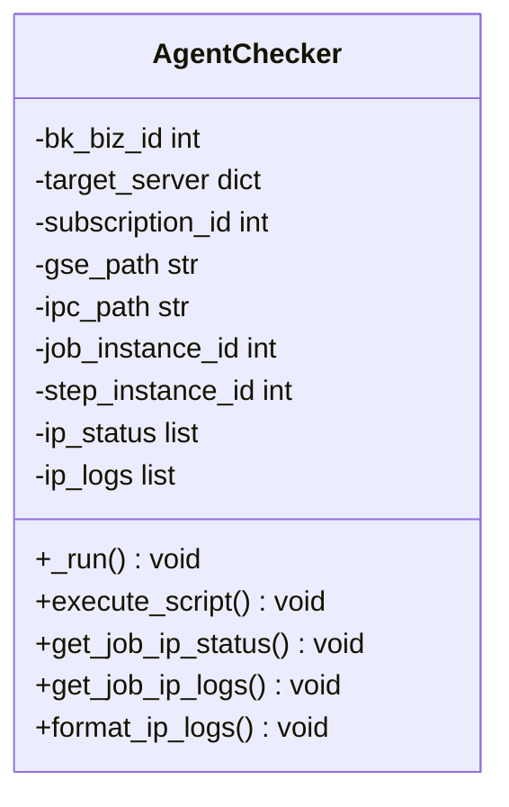
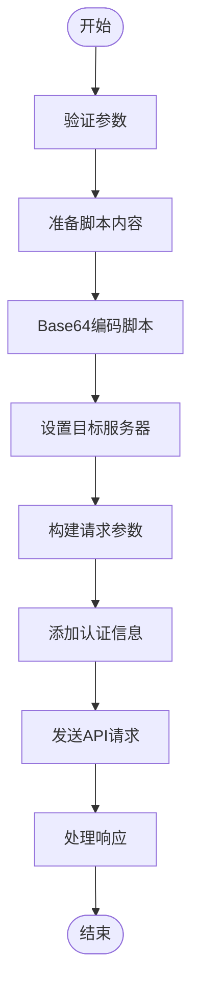
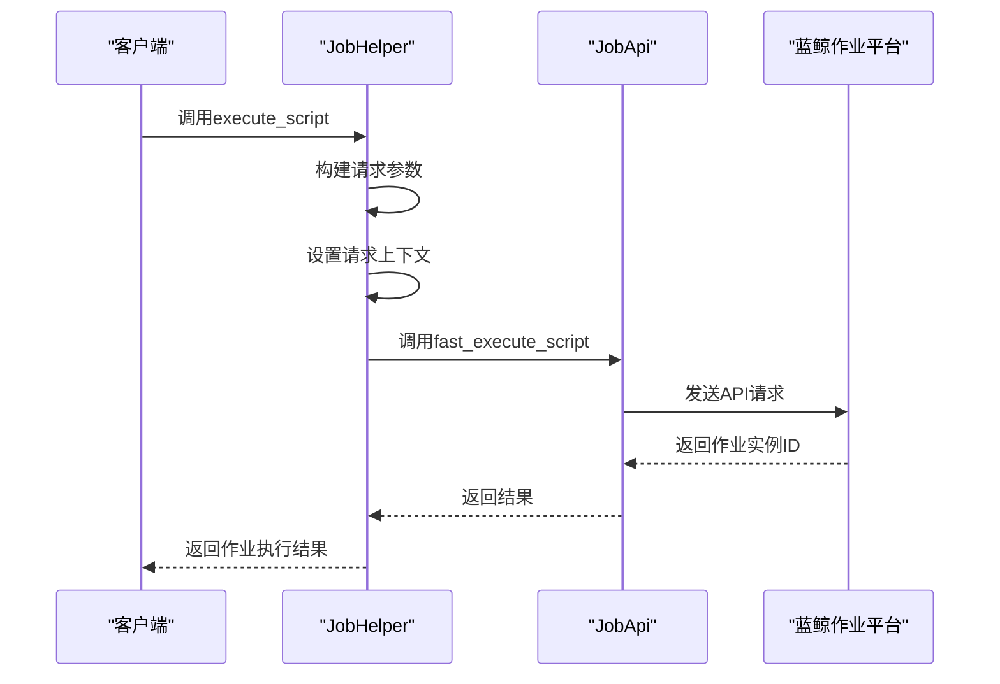
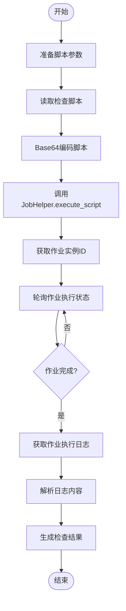
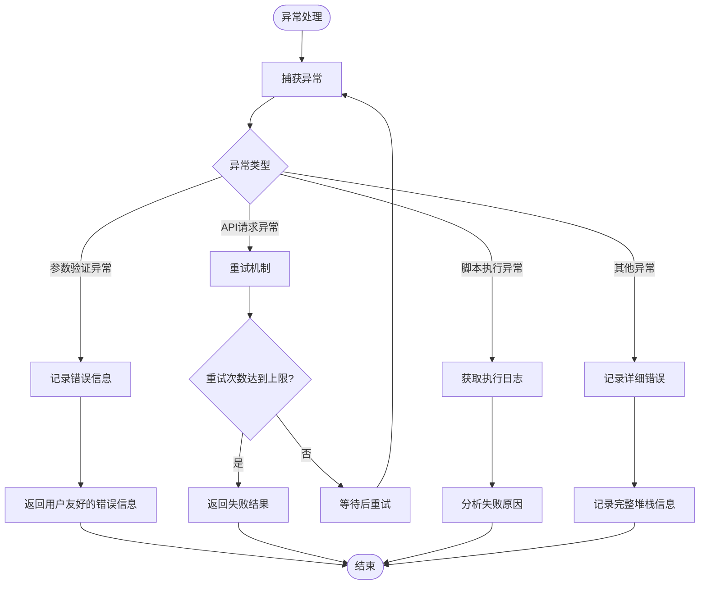

# 作业模板调用

<cite>
**本文档引用的文件**  
- [job.py](file://bklog/apps/log_commons/job.py)
- [job.py](file://bklog/apps/api/modules/job.py)
- [job.py](file://bklog/blueking/component/apis/job.py)
- [agent_checker.py](file://bklog/apps/log_databus/handlers/check_collector/checker/agent_checker.py)
- [constants.py](file://bklog/apps/constants.py)
- [exceptions.py](file://bklog/apps/exceptions.py)
</cite>

## 目录
1. [简介](#简介)
2. [作业模板调用架构](#作业模板调用架构)
3. [核心组件分析](#核心组件分析)
4. [fast_execute_script接口详解](#fast_execute_script接口详解)
5. [采集器管理模块中的作业调用实现](#采集器管理模块中的作业调用实现)
6. [作业模板管理与版本控制](#作业模板管理与版本控制)
7. [异常处理与错误码](#异常处理与错误码)
8. [最佳实践](#最佳实践)

## 简介

本文档详细说明了蓝鲸监控系统中作业模板调用功能的实现机制，重点介绍如何通过API调用蓝鲸作业平台的作业模板来实现日志采集配置的批量部署和Agent安装。文档涵盖了`fast_execute_script`接口的使用方法、参数配置、认证机制和调用流程，并提供了实际代码示例。

## 作业模板调用架构

蓝鲸监控系统通过集成蓝鲸作业平台（JOB）实现远程脚本执行和文件分发功能，主要用于日志采集器的批量部署和配置管理。系统架构分为三层：应用层、API封装层和底层组件层。



**图源**  
- [job.py](file://bklog/apps/log_commons/job.py#L11-L75)
- [job.py](file://bklog/apps/api/modules/job.py#L41-L106)

## 核心组件分析

### JobHelper类

`JobHelper`类是作业调用的核心工具类，提供了适配目标服务器和执行脚本的方法。该类位于`bklog/apps/log_commons/job.py`文件中。



**图源**  
- [job.py](file://bklog/apps/log_commons/job.py#L11-L75)

### AgentChecker类

`AgentChecker`类用于检查非容器采集项的Agent状态，通过调用作业平台执行检查脚本。该类实现了完整的作业调用流程，包括脚本执行、状态获取和日志分析。



**图源**  
- [agent_checker.py](file://bklog/apps/log_databus/handlers/check_collector/checker/agent_checker.py#L49-L237)

## fast_execute_script接口详解

### 接口参数配置

`fast_execute_script`接口是蓝鲸作业平台提供的快速执行脚本的核心接口，用于在目标主机上执行指定的脚本。接口参数包括：

- **bk_biz_id**: 业务ID，标识作业执行的业务范围
- **bk_username**: 操作人，执行作业的用户账号
- **account_alias**: 执行账号，目标主机上的操作系统账号
- **script_content**: 脚本内容，Base64编码的脚本内容
- **script_language**: 脚本语言，支持SHELL(1)、BAT(2)、PERL(3)、PYTHON(4)、POWERSHELL(5)
- **task_name**: 任务名称，作业实例的显示名称
- **target_server**: 目标服务器，指定作业执行的目标主机
- **timeout**: 超时时间，默认600秒
- **script_param**: 脚本参数，Base64编码的脚本参数



**图源**  
- [job.py](file://bklog/apps/log_commons/job.py#L30-L75)
- [constants.py](file://bklog/apps/constants.py#L216-L229)

### 认证机制

作业调用采用蓝鲸标准的认证机制，通过`activate_request`和`generate_request`函数设置请求上下文，确保API调用具有正确的用户身份。



**图源**  
- [job.py](file://bklog/apps/log_commons/job.py#L72-L74)
- [job.py](file://bklog/apps/api/modules/job.py#L64-L71)

## 采集器管理模块中的作业调用实现

### 作业调用流程

在采集器管理模块中，作业调用主要用于检查采集配置和Agent状态。以`AgentChecker`类为例，其实现了完整的作业调用流程：

1. 准备脚本参数，包括订阅ID、IPC套接字文件路径和GSE路径
2. 读取检查脚本内容并进行Base64编码
3. 调用`JobHelper.execute_script`执行脚本
4. 获取作业执行状态
5. 获取作业执行日志
6. 格式化和分析日志内容



**图源**  
- [agent_checker.py](file://bklog/apps/log_databus/handlers/check_collector/checker/agent_checker.py#L77-L237)

### 代码示例

以下是采集器管理模块中调用作业平台的代码示例：

```python
def execute_script(self):
    script_param = f"--subscription_id={self.subscription_id} --ipc_socket_file={self.ipc_path} --gse_path={self.gse_path}"
    params = {
        "bk_biz_id": self.bk_biz_id,
        "bk_username": DEFAULT_BK_USERNAME,
        "account": DEFAULT_EXECUTE_SCRIPT_ACCOUNT,
        "script_content": "",
        "target_server": self.target_server,
        "script_language": ScriptType.PYTHON.value,
        "script_param": base64.b64encode(script_param.encode()).decode(),
        "timeout": CHECK_COLLECTOR_SCRIPT_TIMEOUT,
        "task_name": _("检查采集项配置"),
    }
    script_pwd = os.path.join(BASE_DIR, "apps/log_databus/scripts/check_bkunifylogbeat/check.py")
    try:
        with open(script_pwd, "r") as f:
            params["script_content"] = base64.b64encode(f.read().encode()).decode()
            f.close()
    except Exception as e:
        self.append_error_info(_("[快速执行脚本] 打开脚本{script_pwd}失败, 报错为: {e}").format(script_pwd=script_pwd, e=e))
        return

    try:
        result = JobHelper.execute_script(**params)
        self.job_instance_id = result.get("job_instance_id", 0)
        self.step_instance_id = result.get("step_instance_id", 0)
    except Exception as e:
        self.append_error_info(_("[快速执行脚本], 报错为: {e}").format(e=e))
        return
```

**节源**  
- [agent_checker.py](file://bklog/apps/log_databus/handlers/check_collector/checker/agent_checker.py#L83-L113)

## 作业模板管理与版本控制

### 作业模板创建

作业模板的创建遵循以下最佳实践：

1. **模板命名规范**: 使用清晰、描述性的名称，便于识别和管理
2. **参数化设计**: 将可变参数提取为模板变量，提高模板的复用性
3. **版本管理**: 为每个模板维护版本号，记录变更历史
4. **权限控制**: 设置适当的访问权限，确保模板的安全性

### 作业模板版本控制

系统通过以下机制实现作业模板的版本控制：

- **版本号管理**: 每个模板变更都会生成新的版本号
- **变更记录**: 记录每次变更的详细信息，包括变更人、变更时间和变更内容
- **回滚机制**: 支持快速回滚到之前的版本
- **审批流程**: 重要模板的变更需要经过审批流程

## 异常处理与错误码

### 异常处理机制

系统实现了完善的异常处理机制，确保作业调用过程中的各种异常情况都能被正确处理：



**图源**  
- [agent_checker.py](file://bklog/apps/log_databus/handlers/check_collector/checker/agent_checker.py#L103-L113)
- [agent_checker.py](file://bklog/apps/log_databus/handlers/check_collector/checker/agent_checker.py#L147-L158)

### 错误码说明

系统定义了统一的错误码体系，便于问题定位和处理：

| 错误码 | 描述 | 处理建议 |
|--------|------|----------|
| 500001 | 参数验证失败 | 检查输入参数是否符合要求 |
| 500002 | 远程服务请求结果异常 | 检查组件健康状况 |
| 500003 | 组件调用异常 | 检查组件配置和网络连接 |
| 500004 | 业务不存在 | 确认业务ID是否正确 |
| 500005 | 语言不支持 | 使用支持的语言 |
| 500006 | 获取锁失败 | 稍后重试 |

**节源**  
- [exceptions.py](file://bklog/apps/exceptions.py#L84-L143)

## 最佳实践

### 参数配置最佳实践

1. **超时时间设置**: 根据脚本复杂度合理设置超时时间，避免过短导致作业失败，过长影响系统性能
2. **脚本内容优化**: 尽量减小脚本体积，避免Base64编码后超过API限制
3. **目标服务器选择**: 根据实际需求选择合适的服务器选择方式（IP列表、主机ID列表、动态分组或拓扑节点）
4. **并发控制**: 对于大规模作业，合理控制并发数，避免对系统造成过大压力

### 安全最佳实践

1. **最小权限原则**: 使用具有最小必要权限的账号执行作业
2. **脚本内容审计**: 对执行的脚本内容进行安全审计，防止恶意代码执行
3. **日志审计**: 记录所有作业执行的详细日志，便于安全审计和问题追踪
4. **网络隔离**: 在可能的情况下，将作业执行限制在安全的网络环境中

### 性能优化建议

1. **批量执行**: 对于相同操作，尽量使用批量执行而非逐个执行
2. **异步处理**: 对于长时间运行的作业，使用异步方式处理，避免阻塞主线程
3. **结果缓存**: 对于重复性查询，适当使用缓存机制减少API调用
4. **连接复用**: 在可能的情况下，复用API连接，减少连接建立开销