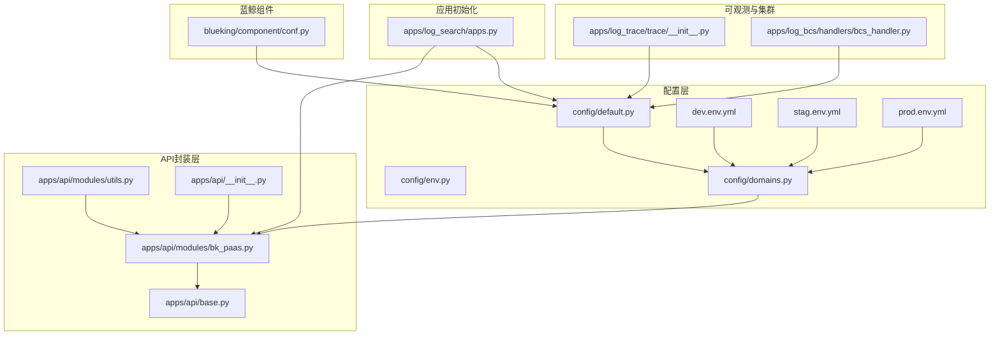
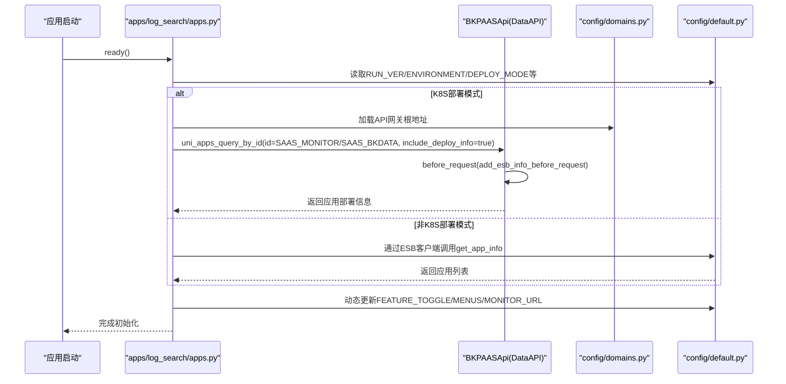
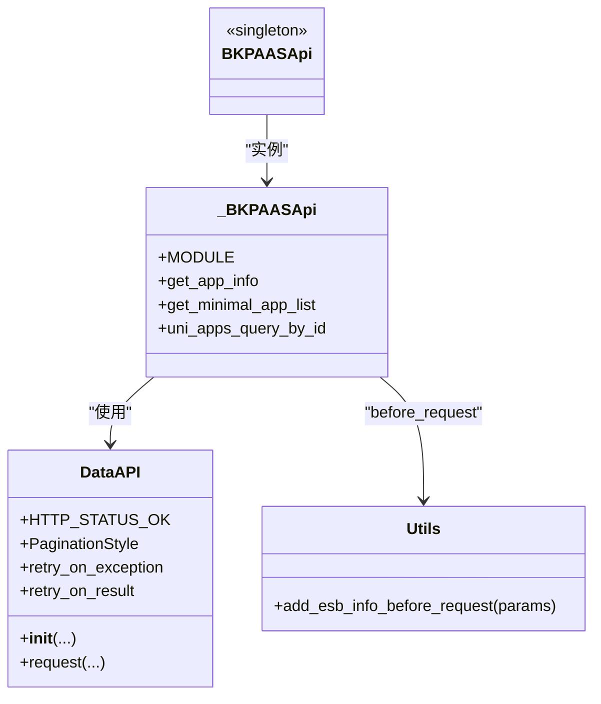
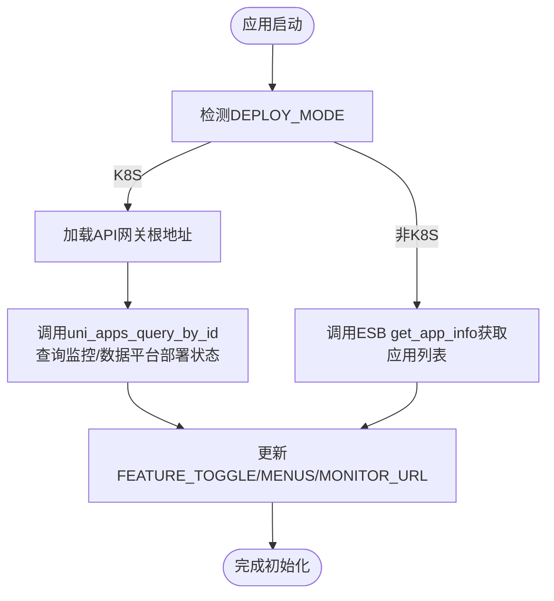
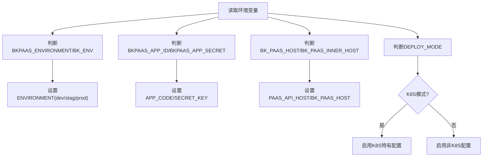
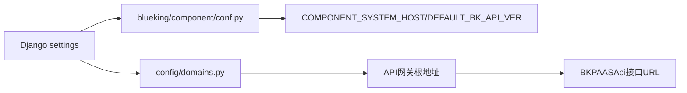
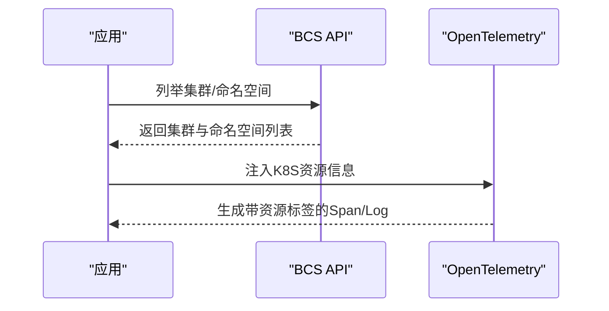
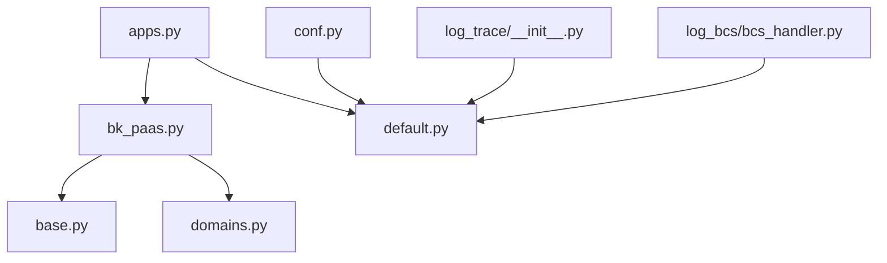

# PaaS应用集成

<cite>
**本文引用的文件**
- [bk_paas.py](file://bklog/apps/api/modules/bk_paas.py)
- [__init__.py](file://bklog/apps/api/__init__.py)
- [base.py](file://bklog/apps/api/base.py)
- [utils.py](file://bklog/apps/api/modules/utils.py)
- [apps.py](file://bklog/apps/log_search/apps.py)
- [domains.py](file://bklog/config/domains.py)
- [default.py](file://bklog/config/default.py)
- [env.py](file://bklog/config/env.py)
- [conf.py](file://bklog/blueking/component/conf.py)
- [bcs_handler.py](file://bklog/apps/log_bcs/handlers/bcs_handler.py)
- [__init__.py](file://bklog/apps/log_trace/trace/__init__.py)
- [test_env.sh](file://bklog/scripts/test_env.sh)
- [dev.env.yml](file://bklog/dev.env.yml)
- [stag.env.yml](file://bklog/stag.env.yml)
- [prod.env.yml](file://bklog/prod.env.yml)
</cite>

## 目录
1. [简介](#简介)
2. [项目结构](#项目结构)
3. [核心组件](#核心组件)
4. [架构总览](#架构总览)
5. [详细组件分析](#详细组件分析)
6. [依赖关系分析](#依赖关系分析)
7. [性能考量](#性能考量)
8. [故障排查指南](#故障排查指南)
9. [结论](#结论)
10. [附录](#附录)

## 简介
本文件面向蓝鲸PaaS平台集成场景，系统性阐述本项目与PaaS平台的对接方式，覆盖应用信息获取、环境变量配置、部署信息查询、服务状态检查、初始化流程加载PaaS配置、服务发现与负载均衡等关键能力。文档基于仓库实际代码进行分析，提供接口调用示例路径、配置说明与最佳实践，帮助开发者快速理解并正确集成PaaS平台能力。

## 项目结构
围绕PaaS集成的关键文件与模块分布如下：
- API封装与调用：apps/api/modules/bk_paas.py、apps/api/base.py、apps/api/modules/utils.py
- PaaS域名与网关：config/domains.py、dev/stag/prod环境YAML
- 应用初始化与特性开关：apps/log_search/apps.py
- 环境变量与运行模式：config/default.py、config/env.py、scripts/test_env.sh
- 蓝鲸组件配置：blueking/component/conf.py
- BCS集群与命名空间：apps/log_bcs/handlers/bcs_handler.py
- OpenTelemetry观测：apps/log_trace/trace/__init__.py

图表来源
- [default.py](file://bklog/config/default.py#L370-L420)
- [domains.py](file://bklog/config/domains.py#L24-L83)
- [bk_paas.py](file://bklog/apps/api/modules/bk_paas.py#L23-L62)
- [base.py](file://bklog/apps/api/base.py#L191-L260)
- [utils.py](file://bklog/apps/api/modules/utils.py#L200-L242)
- [apps.py](file://bklog/apps/log_search/apps.py#L100-L155)
- [conf.py](file://bklog/blueking/component/conf.py#L26-L39)
- [bcs_handler.py](file://bklog/apps/log_bcs/handlers/bcs_handler.py#L26-L72)
- [__init__.py](file://bklog/apps/log_trace/trace/__init__.py#L244-L264)

章节来源
- [default.py](file://bklog/config/default.py#L370-L420)
- [domains.py](file://bklog/config/domains.py#L24-L83)

## 核心组件
- PaaS API封装（BKPAASApi）
  - 提供应用信息查询、最小应用列表、按ID查询应用等接口封装，统一走API网关。
  - 关键接口：get_app_info、get_minimal_app_list、uni_apps_query_by_id。
- API调用基类（DataAPI）
  - 封装HTTP请求、重试、鉴权头、语言头、请求ID等通用逻辑。
- 请求前置处理（utils.add_esb_info_before_request）
  - 统一注入蓝鲸ESB鉴权信息、语言、操作人等参数。
- PaaS域名与网关（config.domains）
  - 从环境变量动态加载各模块API网关根地址，支持PAAS V2/V3。
- 应用初始化与特性开关（apps.log_search.apps）
  - 启动阶段通过PaaS API查询监控/数据平台是否已部署，动态调整菜单与特性开关。
- 环境变量与运行模式（config.default、config.env）
  - 读取BKPAAS_*系列环境变量，兼容V2/V3环境标识；决定运行版本、部署模式、服务名等。
- 蓝鲸组件配置（blueking.component.conf）
  - 从settings读取APP_CODE、SECRET_KEY、PAAS_API_HOST等，作为组件调用的基础。
- BCS集群与命名空间（apps/log_bcs/handlers/bcs_handler.py）
  - 通过BCS API列举集群、命名空间，支撑多租户与共享集群场景。
- OpenTelemetry观测（apps/log_trace/trace/__init__.py）
  - 在K8s部署模式下，注入BCS集群ID、命名空间等资源信息，便于服务发现与负载均衡观测。

章节来源
- [bk_paas.py](file://bklog/apps/api/modules/bk_paas.py#L23-L62)
- [base.py](file://bklog/apps/api/base.py#L191-L260)
- [utils.py](file://bklog/apps/api/modules/utils.py#L200-L242)
- [domains.py](file://bklog/config/domains.py#L24-L83)
- [apps.py](file://bklog/apps/log_search/apps.py#L100-L155)
- [default.py](file://bklog/config/default.py#L370-L420)
- [env.py](file://bklog/config/env.py#L24-L70)
- [conf.py](file://bklog/blueking/component/conf.py#L26-L39)
- [bcs_handler.py](file://bklog/apps/log_bcs/handlers/bcs_handler.py#L26-L72)
- [__init__.py](file://bklog/apps/log_trace/trace/__init__.py#L244-L264)

## 架构总览
下图展示应用初始化阶段如何加载PaaS配置、查询部署信息并影响菜单与特性开关的流程。

图表来源
- [apps.py](file://bklog/apps/log_search/apps.py#L100-L155)
- [domains.py](file://bklog/config/domains.py#L24-L83)
- [bk_paas.py](file://bklog/apps/api/modules/bk_paas.py#L23-L62)
- [utils.py](file://bklog/apps/api/modules/utils.py#L200-L242)
- [default.py](file://bklog/config/default.py#L370-L420)

## 详细组件分析

### PaaS API封装与调用
- BKPAASApi
  - get_app_info：调用PAAS V2 ESB接口获取应用信息。
  - get_minimal_app_list：调用PAAS V3 API网关获取最小应用列表。
  - uni_apps_query_by_id：调用PAAS V3 API网关按ID查询应用并包含部署信息。
- DataAPI
  - 统一封装HTTP请求、超时、重试、鉴权头、语言头、请求ID等。
- 请求前置处理
  - add_esb_info_before_request：注入蓝鲸ESB鉴权信息、语言、操作人等参数，确保API网关鉴权通过。

图表来源
- [base.py](file://bklog/apps/api/base.py#L191-L260)
- [bk_paas.py](file://bklog/apps/api/modules/bk_paas.py#L23-L62)
- [utils.py](file://bklog/apps/api/modules/utils.py#L200-L242)

章节来源
- [bk_paas.py](file://bklog/apps/api/modules/bk_paas.py#L23-L62)
- [base.py](file://bklog/apps/api/base.py#L191-L260)
- [utils.py](file://bklog/apps/api/modules/utils.py#L200-L242)

### 应用初始化与部署信息查询
- 初始化流程
  - 读取RUN_VER、ENVIRONMENT、DEPLOY_MODE等环境变量，决定是否启用K8S部署模式。
  - 在K8S模式下，通过BKPAASApi.uni_apps_query_by_id查询监控/数据平台应用的部署状态，动态更新FEATURE_TOGGLE与MENUS。
  - 在非K8S模式下，通过ESB客户端调用get_app_info获取应用列表，判断部署情况。
- 影响范围
  - 菜单“监控策略”、“数据平台”等特性开关根据部署状态动态开启或关闭。
  - MONITOR_URL根据BK_PAAS_HOST与SAAS_MONITOR拼接生成。

图表来源
- [apps.py](file://bklog/apps/log_search/apps.py#L100-L155)
- [domains.py](file://bklog/config/domains.py#L24-L83)
- [bk_paas.py](file://bklog/apps/api/modules/bk_paas.py#L23-L62)

章节来源
- [apps.py](file://bklog/apps/log_search/apps.py#L100-L155)
- [default.py](file://bklog/config/default.py#L370-L420)

### 环境变量与运行模式
- 环境变量来源
  - BKPAAS_ENVIRONMENT/BK_ENV：决定ENVIRONMENT(dev/stag/prod)。
  - BKPAAS_APP_ID/BKPAAS_APP_SECRET：决定APP_CODE/SECRET_KEY。
  - BKPAAS_URL/BK_PAAS_HOST/BK_PAAS_INNER_HOST：决定平台URL与API Host。
  - DEPLOY_MODE：决定是否启用K8S部署模式。
  - BKAPP_*系列：控制特性开关、API网关、日志/链路追踪等。
- 运行模式
  - K8S部署模式下，日志格式、OTLP上报、服务名等均按K8S规范配置。
  - 非K8S模式下，通过ESB客户端与PAAS API Host交互。

图表来源
- [env.py](file://bklog/config/env.py#L24-L70)
- [default.py](file://bklog/config/default.py#L370-L420)
- [test_env.sh](file://bklog/scripts/test_env.sh#L1-L5)

章节来源
- [env.py](file://bklog/config/env.py#L24-L70)
- [default.py](file://bklog/config/default.py#L370-L420)
- [test_env.sh](file://bklog/scripts/test_env.sh#L1-L5)

### 蓝鲸组件配置与API网关
- 组件配置
  - 从settings读取APP_CODE、SECRET_KEY、COMPONENT_SYSTEM_HOST、DEFAULT_BK_API_VER。
- API网关根地址
  - config/domains从环境变量加载BK_PAAS_APIGATEWAY_ROOT、BK_PAAS_V3_APIGATEWAY_ROOT等，BKPAASApi使用这些根地址拼接具体接口。

图表来源
- [conf.py](file://bklog/blueking/component/conf.py#L26-L39)
- [domains.py](file://bklog/config/domains.py#L24-L83)
- [bk_paas.py](file://bklog/apps/api/modules/bk_paas.py#L23-L62)

章节来源
- [conf.py](file://bklog/blueking/component/conf.py#L26-L39)
- [domains.py](file://bklog/config/domains.py#L24-L83)
- [bk_paas.py](file://bklog/apps/api/modules/bk_paas.py#L23-L62)

### 服务发现与负载均衡
- BCS集群与命名空间
  - 通过BCS API列举集群与命名空间，支持多租户与共享集群场景，便于服务发现与资源隔离。
- OpenTelemetry资源信息
  - 在K8S模式下，注入k8s.bcs.cluster.id、k8s.namespace.name、k8s.pod.ip、k8s.pod.name等，便于链路追踪与负载均衡观测。

图表来源
- [bcs_handler.py](file://bklog/apps/log_bcs/handlers/bcs_handler.py#L26-L72)
- [__init__.py](file://bklog/apps/log_trace/trace/__init__.py#L244-L264)

章节来源
- [bcs_handler.py](file://bklog/apps/log_bcs/handlers/bcs_handler.py#L26-L72)
- [__init__.py](file://bklog/apps/log_trace/trace/__init__.py#L244-L264)

## 依赖关系分析
- 模块耦合
  - BKPAASApi依赖DataAPI与config.domains提供的API网关根地址。
  - apps.log_search.apps在K8S模式下依赖BKPAASApi，在非K8S模式下依赖ESB客户端。
  - blueking.component.conf为组件调用提供基础配置。
- 外部依赖
  - API网关根地址来自环境变量，不同环境(dev/stag/prod)由对应YAML文件注入。
  - PaaS API Host与BK_PAAS_HOST影响ESB与API调用路径。

图表来源
- [bk_paas.py](file://bklog/apps/api/modules/bk_paas.py#L23-L62)
- [base.py](file://bklog/apps/api/base.py#L191-L260)
- [domains.py](file://bklog/config/domains.py#L24-L83)
- [apps.py](file://bklog/apps/log_search/apps.py#L100-L155)
- [default.py](file://bklog/config/default.py#L370-L420)
- [conf.py](file://bklog/blueking/component/conf.py#L26-L39)
- [bcs_handler.py](file://bklog/apps/log_bcs/handlers/bcs_handler.py#L26-L72)
- [__init__.py](file://bklog/apps/log_trace/trace/__init__.py#L244-L264)

章节来源
- [bk_paas.py](file://bklog/apps/api/modules/bk_paas.py#L23-L62)
- [apps.py](file://bklog/apps/log_search/apps.py#L100-L155)
- [default.py](file://bklog/config/default.py#L370-L420)

## 性能考量
- 缓存策略
  - uni_apps_query_by_id接口设置了缓存时间，减少频繁查询PaaS部署状态带来的压力。
- 重试与超时
  - DataAPI内置重试与超时机制，建议在高并发场景下合理配置重试次数与等待间隔。
- K8S模式优化
  - K8S模式下采用JSON日志格式与标准输出，有利于容器日志收集与性能观测。

章节来源
- [bk_paas.py](file://bklog/apps/api/modules/bk_paas.py#L52-L60)
- [base.py](file://bklog/apps/api/base.py#L108-L175)
- [default.py](file://bklog/config/default.py#L290-L363)

## 故障排查指南
- 环境变量缺失
  - APP_ID/APP_TOKEN/BKPAAS_APP_ID/BKPAAS_APP_SECRET等缺失会导致初始化失败。可通过脚本或环境配置补充。
- API网关根地址为空
  - BK_PAAS_APIGATEWAY_ROOT/BK_PAAS_V3_APIGATEWAY_ROOT未正确注入，需检查对应环境YAML文件。
- 部署信息查询失败
  - uni_apps_query_by_id可能因网络或权限问题失败，应用层已忽略异常避免启动失败，但会影响菜单与特性开关。
- K8S模式下资源信息缺失
  - BKAPP_OTLP_BCS_CLUSTER_ID/BKAPP_OTLP_BCS_CLUSTER_NAMESPACE等未设置，将无法注入K8S资源信息。

章节来源
- [test_env.sh](file://bklog/scripts/test_env.sh#L1-L5)
- [dev.env.yml](file://bklog/dev.env.yml#L69-L86)
- [stag.env.yml](file://bklog/stag.env.yml#L69-L86)
- [prod.env.yml](file://bklog/prod.env.yml#L69-L86)
- [apps.py](file://bklog/apps/log_search/apps.py#L120-L155)
- [__init__.py](file://bklog/apps/log_trace/trace/__init__.py#L244-L264)

## 结论
本项目通过统一的API封装与环境变量配置，实现了与蓝鲸PaaS平台的深度集成。应用初始化阶段可自动查询部署信息并动态调整功能开关，K8S模式下进一步完善了服务发现与负载均衡观测能力。建议在生产环境中严格管理API网关根地址与环境变量，确保API调用稳定可靠。

## 附录
- 环境变量清单（节选）
  - BKPAAS_ENVIRONMENT/BK_ENV：决定ENVIRONMENT(dev/stag/prod)
  - BKPAAS_APP_ID/BKPAAS_APP_SECRET：决定APP_CODE/SECRET_KEY
  - BKPAAS_URL/BK_PAAS_HOST/BK_PAAS_INNER_HOST：决定平台URL与API Host
  - DEPLOY_MODE：决定是否启用K8S部署模式
  - BKAPP_*系列：控制特性开关、API网关、日志/链路追踪等
- API网关根地址（节选）
  - BK_PAAS_APIGATEWAY_ROOT、BK_PAAS_V3_APIGATEWAY_ROOT
  - 各模块API网关根地址由对应环境YAML注入

章节来源
- [default.py](file://bklog/config/default.py#L370-L420)
- [dev.env.yml](file://bklog/dev.env.yml#L69-L86)
- [stag.env.yml](file://bklog/stag.env.yml#L69-L86)
- [prod.env.yml](file://bklog/prod.env.yml#L69-L86)