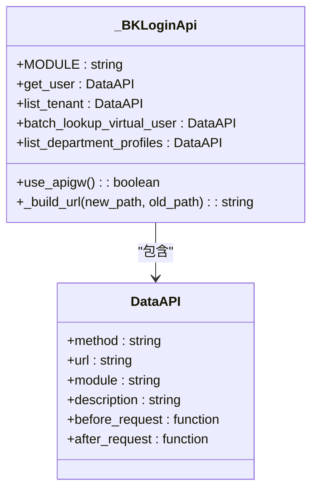
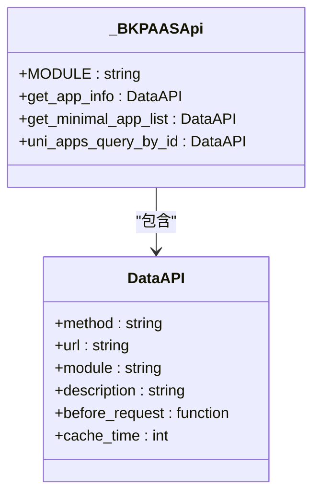
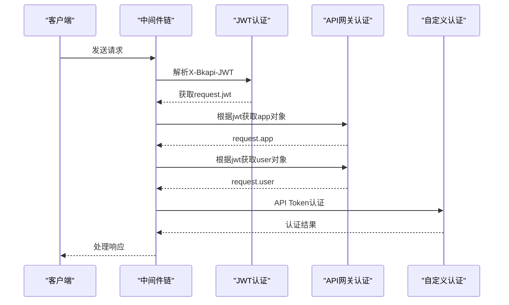
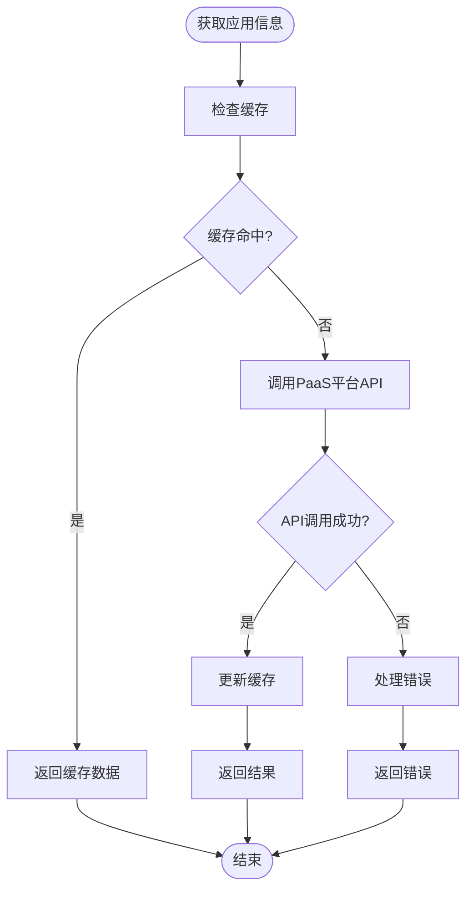
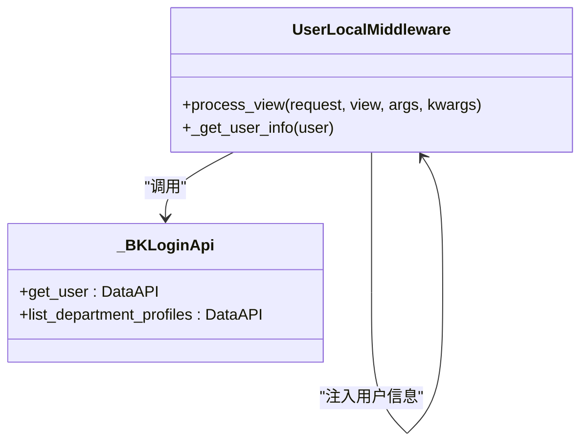
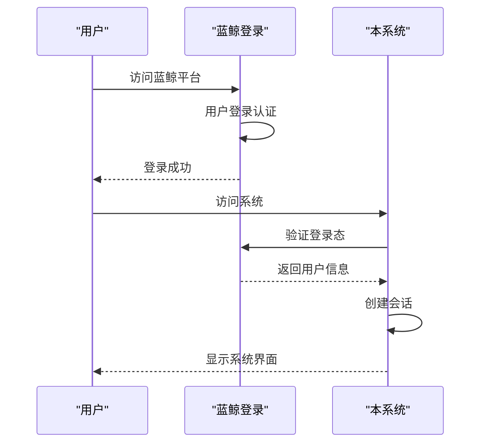
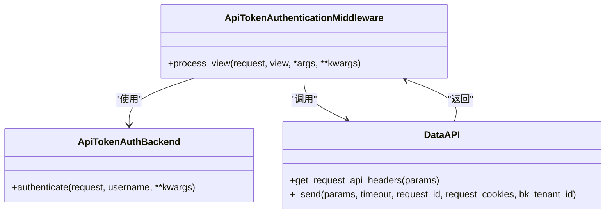
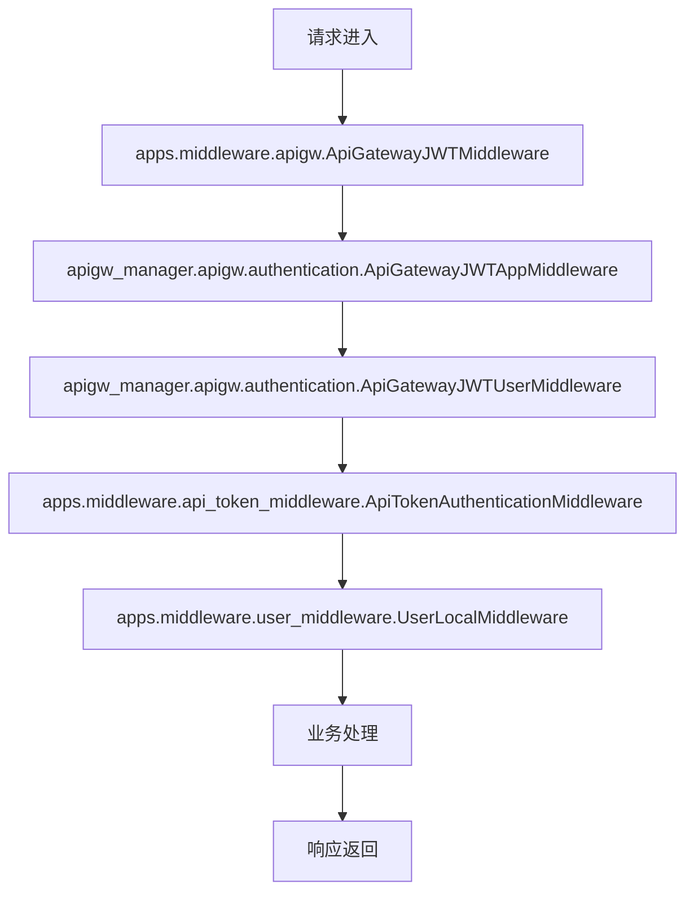
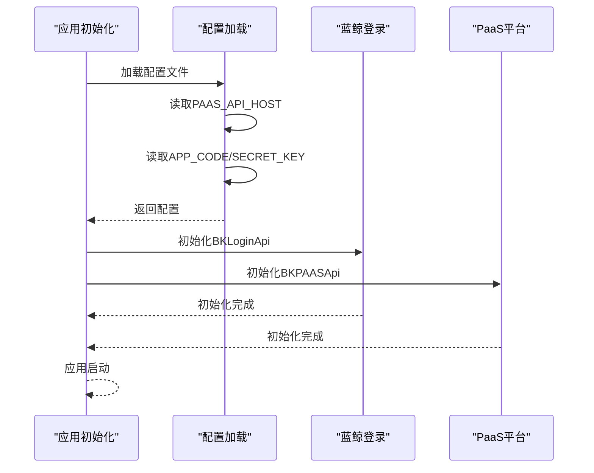

# 登录与PaaS平台集成

<cite>
**本文档引用文件**   
- [bk_login.py](file://bklog/apps/api/modules/bk_login.py)
- [bk_paas.py](file://bklog/apps/api/modules/bk_paas.py)
- [user_middleware.py](file://bklog/apps/middleware/user_middleware.py)
- [api_token_middleware.py](file://bklog/apps/middleware/api_token_middleware.py)
- [default.py](file://bklog/config/default.py)
- [domains.py](file://bklog/config/domains.py)
- [base.py](file://bklog/apps/api/base.py)
</cite>

## 目录
1. [简介](#简介)
2. [蓝鲸登录组件集成](#蓝鲸登录组件集成)
3. [PaaS平台集成](#paas平台集成)
4. [用户身份认证机制](#用户身份认证机制)
5. [应用信息获取](#应用信息获取)
6. [开发者账号管理](#开发者账号管理)
7. [单点登录实现](#单点登录实现)
8. [安全配置说明](#安全配置说明)
9. [中间件集成](#中间件集成)
10. [应用初始化集成](#应用初始化集成)

## 简介
本文档详细说明蓝鲸监控系统与蓝鲸登录组件和PaaS平台的集成方式。重点描述用户身份认证、应用信息获取、开发者账号管理等核心功能的实现机制。提供用户登录态验证、用户信息查询、应用配置获取等接口的调用示例和安全配置说明。

## 蓝鲸登录组件集成
蓝鲸登录组件提供了统一的用户身份认证服务，通过API网关与系统进行集成。系统通过`bk_login.py`模块封装了与蓝鲸登录组件的交互接口。

**图示来源**
- [bk_login.py](file://bklog/apps/api/modules/bk_login.py#L62-L109)

## PaaS平台集成
PaaS平台集成为系统提供了应用信息获取和管理能力。通过`bk_paas.py`模块，系统可以获取应用信息、查询应用列表等。

**图示来源**
- [bk_paas.py](file://bklog/apps/api/modules/bk_paas.py#L31-L62)

## 用户身份认证机制
系统通过中间件链实现用户身份认证，包括JWT认证、API网关认证和自定义认证等多种方式。

**图示来源**
- [default.py](file://bklog/config/default.py#L136-L141)
- [api_token_middleware.py](file://bklog/apps/middleware/api_token_middleware.py#L22-L39)

## 应用信息获取
系统通过PaaS平台API获取应用部署信息和环境变量，支持缓存机制以提高性能。

**图示来源**
- [bk_paas.py](file://bklog/apps/api/modules/bk_paas.py#L44-L59)
- [base.py](file://bklog/apps/api/base.py#L347-L354)

## 开发者账号管理
系统通过蓝鲸登录组件管理开发者账号，包括用户信息查询、部门信息获取等功能。

**图示来源**
- [user_middleware.py](file://bklog/apps/middleware/user_middleware.py#L45-L79)
- [bk_login.py](file://bklog/apps/api/modules/bk_login.py#L73-L80)

## 单点登录实现
系统通过蓝鲸登录组件实现单点登录(SSO)，用户在蓝鲸平台登录后可直接访问本系统。

**图示来源**
- [bk_login.py](file://bklog/apps/api/modules/bk_login.py#L73-L80)
- [user_middleware.py](file://bklog/apps/middleware/user_middleware.py#L64-L70)

## 安全配置说明
系统通过多层次的安全配置确保认证过程的安全性，包括API密钥、令牌验证等机制。

**图示来源**
- [api_token_middleware.py](file://bklog/apps/middleware/api_token_middleware.py#L10-L39)
- [base.py](file://bklog/apps/api/base.py#L64-L74)

## 中间件集成
系统通过中间件链实现与蓝鲸认证体系的集成，包括JWT解析、用户信息注入等功能。

**图示来源**
- [default.py](file://bklog/config/default.py#L136-L141)
- [user_middleware.py](file://bklog/apps/middleware/user_middleware.py#L45-L70)

## 应用初始化集成
在应用初始化过程中，系统加载蓝鲸认证相关配置，建立与PaaS平台的连接。

**图示来源**
- [settings.py](file://bklog/settings.py#L24-L47)
- [bk_login.py](file://bklog/apps/api/modules/bk_login.py#L62-L109)
- [bk_paas.py](file://bklog/apps/api/modules/bk_paas.py#L31-L62)

**章节来源**
- [settings.py](file://bklog/settings.py#L24-L47)
- [bk_login.py](file://bklog/apps/api/modules/bk_login.py#L62-L109)
- [bk_paas.py](file://bklog/apps/api/modules/bk_paas.py#L31-L62)