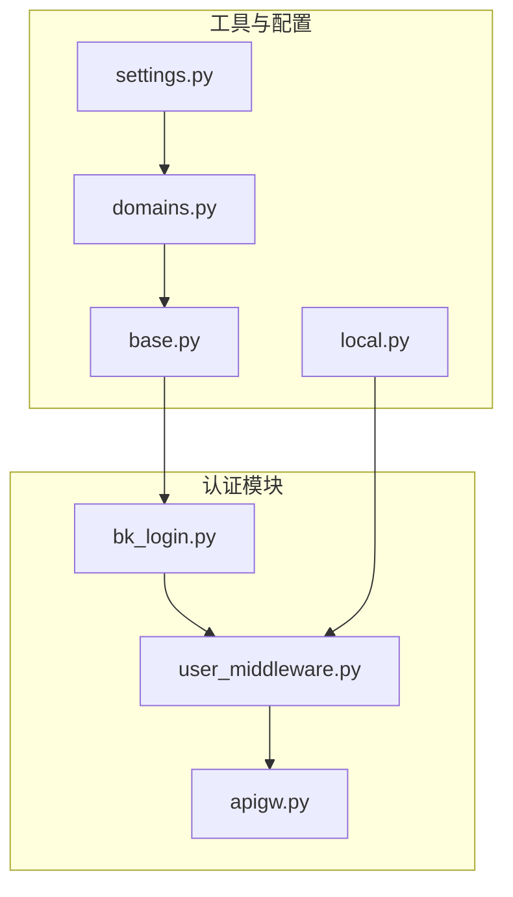
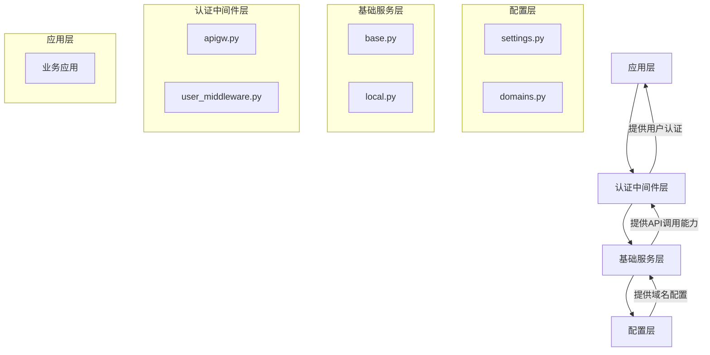
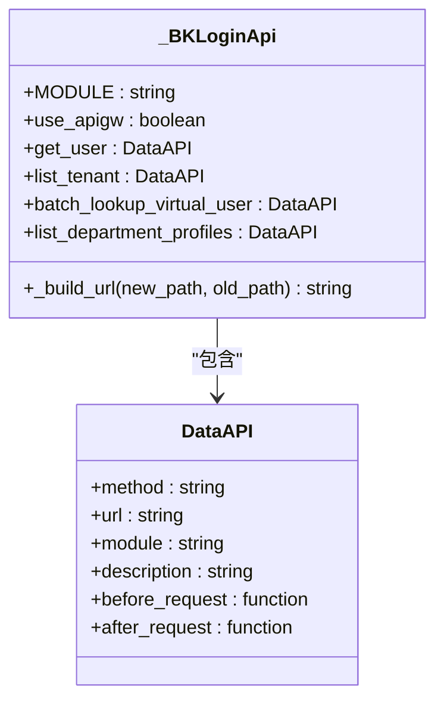
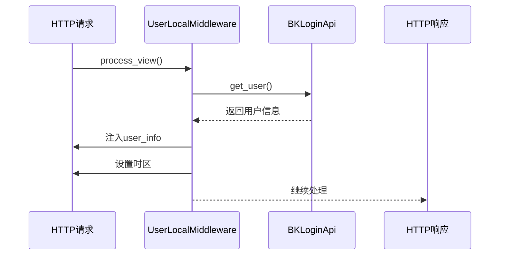
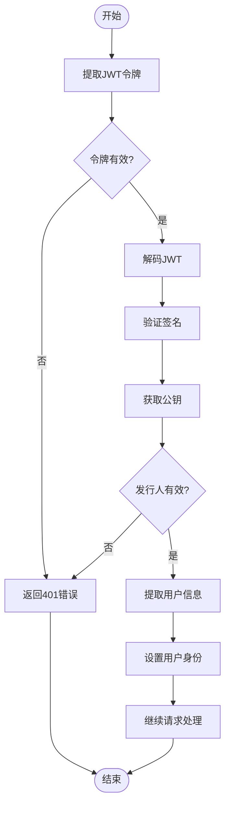
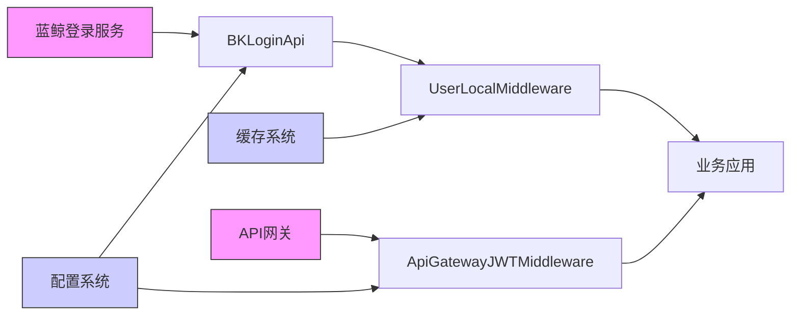

# 统一登录认证

<cite>
**本文档引用的文件**  
- [bk_login.py](file://bklog/apps/api/modules/bk_login.py)
- [user_middleware.py](file://bklog/apps/middleware/user_middleware.py)
- [apigw.py](file://bklog/apps/middleware/apigw.py)
- [base.py](file://bklog/apps/api/base.py)
- [local.py](file://bklog/apps/utils/local.py)
- [domains.py](file://bklog/config/domains.py)
- [settings.py](file://bklog/settings.py)
- [exceptions.py](file://bklog/apps/exceptions.py)
</cite>

## 目录
1. [简介](#简介)
2. [项目结构](#项目结构)
3. [核心组件](#核心组件)
4. [架构概述](#架构概述)
5. [详细组件分析](#详细组件分析)
6. [依赖分析](#依赖分析)
7. [性能考虑](#性能考虑)
8. [故障排除指南](#故障排除指南)
9. [结论](#结论)

## 简介
本文档详细说明了系统与蓝鲸登录组件的集成实现，重点描述基于JWT的用户身份验证机制、登录态管理、用户信息获取等核心功能。文档提供了用户登录验证、用户信息查询、登录态刷新等接口的调用示例和安全配置说明，并结合代码实例说明在中间件中如何验证API网关的用户身份信息，以及如何处理认证失败和权限不足的情况。同时，解释了单点登录(SSO)的实现原理和配置要点，包括Cookie域设置、Token有效期管理、跨域认证等安全考虑。

## 项目结构
本项目采用模块化设计，将认证相关功能分散在多个模块中。核心认证逻辑位于`bklog/apps/api/modules/bk_login.py`，中间件处理位于`bklog/apps/middleware/`目录下，配置信息分布在`config/`目录中。

**图示来源**
- [bk_login.py](file://bklog/apps/api/modules/bk_login.py)
- [user_middleware.py](file://bklog/apps/middleware/user_middleware.py)
- [apigw.py](file://bklog/apps/middleware/apigw.py)
- [base.py](file://bklog/apps/api/base.py)
- [local.py](file://bklog/apps/utils/local.py)
- [domains.py](file://bklog/config/domains.py)
- [settings.py](file://bklog/settings.py)

## 核心组件

系统的核心认证组件包括蓝鲸登录API封装、用户中间件和API网关JWT中间件。这些组件协同工作，实现了完整的用户认证和授权流程。

**本节来源**
- [bk_login.py](file://bklog/apps/api/modules/bk_login.py#L1-L110)
- [user_middleware.py](file://bklog/apps/middleware/user_middleware.py#L1-L157)
- [apigw.py](file://bklog/apps/middleware/apigw.py#L1-L125)

## 架构概述

系统采用分层架构实现统一登录认证，从下到上分别为配置层、基础服务层、认证中间件层和应用层。这种架构设计确保了认证逻辑的可维护性和可扩展性。

**图示来源**
- [settings.py](file://bklog/settings.py#L1-L47)
- [domains.py](file://bklog/config/domains.py#L1-L83)
- [base.py](file://bklog/apps/api/base.py#L1-L800)
- [local.py](file://bklog/apps/utils/local.py#L1-L243)
- [apigw.py](file://bklog/apps/middleware/apigw.py#L1-L125)
- [user_middleware.py](file://bklog/apps/middleware/user_middleware.py#L1-L157)

## 详细组件分析

### 蓝鲸登录API组件分析
该组件封装了与蓝鲸登录服务的交互，提供了获取用户信息、验证登录状态等核心功能。

**图示来源**
- [bk_login.py](file://bklog/apps/api/modules/bk_login.py#L62-L109)

**本节来源**
- [bk_login.py](file://bklog/apps/api/modules/bk_login.py#L1-L110)

### 用户中间件分析
用户中间件负责在请求处理过程中注入用户信息和时区设置，确保每个请求都能正确识别用户身份。

**图示来源**
- [user_middleware.py](file://bklog/apps/middleware/user_middleware.py#L45-L79)

**本节来源**
- [user_middleware.py](file://bklog/apps/middleware/user_middleware.py#L1-L157)

### API网关JWT中间件分析
该中间件负责验证API网关传递的JWT令牌，确保请求来源的合法性。

**图示来源**
- [apigw.py](file://bklog/apps/middleware/apigw.py#L95-L120)

**本节来源**
- [apigw.py](file://bklog/apps/middleware/apigw.py#L1-L125)

## 依赖分析

系统认证功能依赖于多个外部组件和内部模块，这些依赖关系确保了认证流程的完整性和安全性。

**图示来源**
- [bk_login.py](file://bklog/apps/api/modules/bk_login.py)
- [user_middleware.py](file://bklog/apps/middleware/user_middleware.py)
- [apigw.py](file://bklog/apps/middleware/apigw.py)
- [domains.py](file://bklog/config/domains.py)

**本节来源**
- [bk_login.py](file://bklog/apps/api/modules/bk_login.py#L1-L110)
- [user_middleware.py](file://bklog/apps/middleware/user_middleware.py#L1-L157)
- [apigw.py](file://bklog/apps/middleware/apigw.py#L1-L125)
- [domains.py](file://bklog/config/domains.py#L1-L83)

## 性能考虑

在认证系统的设计中，性能是一个关键考虑因素。系统通过多种机制来优化认证流程的性能：

1. **缓存机制**：用户信息通过`@cache_five_minute`装饰器进行五分钟缓存，减少对蓝鲸登录服务的频繁调用。
2. **异步处理**：在可能的情况下，认证相关的操作被设计为异步执行，避免阻塞主线程。
3. **连接复用**：使用`requests.session()`来复用HTTP连接，减少连接建立的开销。
4. **批量请求**：对于需要获取多个用户信息的场景，支持批量请求以减少网络往返次数。

这些优化措施确保了即使在高并发场景下，认证系统也能保持良好的响应性能。

## 故障排除指南

当遇到认证相关问题时，可以按照以下步骤进行排查：

1. **检查配置**：确认`settings.py`和`domains.py`中的配置是否正确，特别是API网关的URL和密钥配置。
2. **验证令牌**：检查JWT令牌是否有效，包括签名、发行人和有效期。
3. **查看日志**：检查系统日志，特别是认证中间件产生的日志，以获取详细的错误信息。
4. **测试连接**：直接调用蓝鲸登录API，验证服务是否正常运行。
5. **检查网络**：确保应用服务器能够正常访问蓝鲸登录服务和API网关。

对于常见的错误代码，系统定义了详细的异常类，如`ApiRequestError`表示服务不稳定，`ApiResultError`表示远程服务请求结果异常，这些异常可以帮助快速定位问题。

**本节来源**
- [exceptions.py](file://bklog/apps/exceptions.py#L1-L144)
- [apigw.py](file://bklog/apps/middleware/apigw.py#L116-L119)
- [user_middleware.py](file://bklog/apps/middleware/user_middleware.py#L77-L78)

## 结论

本文档详细介绍了系统与蓝鲸登录组件的集成实现，涵盖了从配置到具体实现的各个方面。通过分层架构设计和模块化实现，系统提供了一套完整、安全且高性能的统一登录认证解决方案。该方案不仅满足了基本的用户认证需求，还通过JWT令牌、中间件拦截等机制确保了系统的安全性和可扩展性。未来可以考虑进一步优化缓存策略和增加更多的监控指标，以提升系统的稳定性和可观测性。