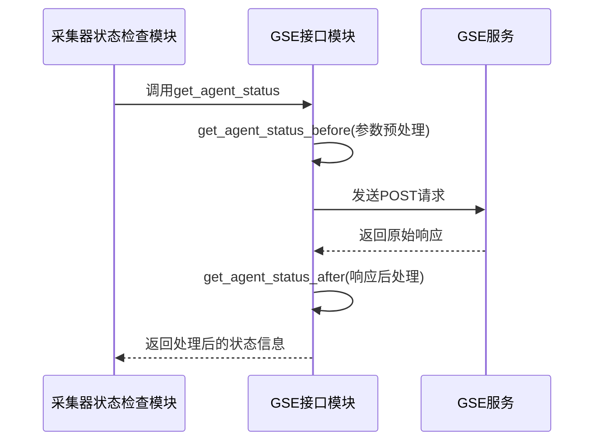
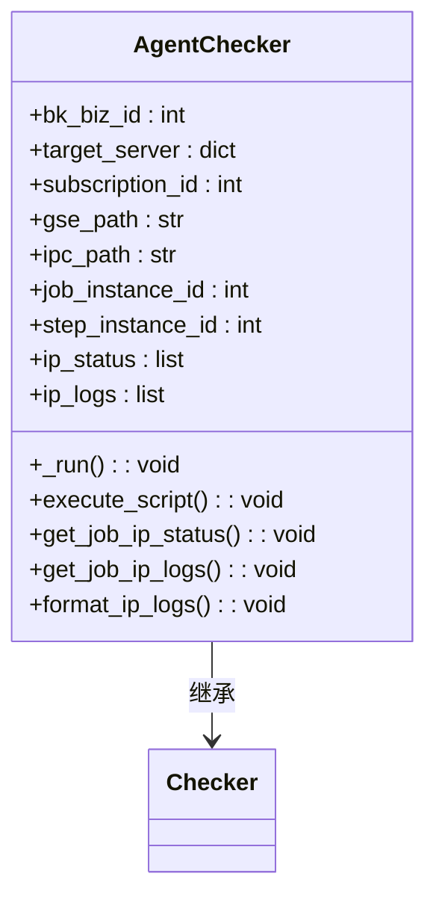
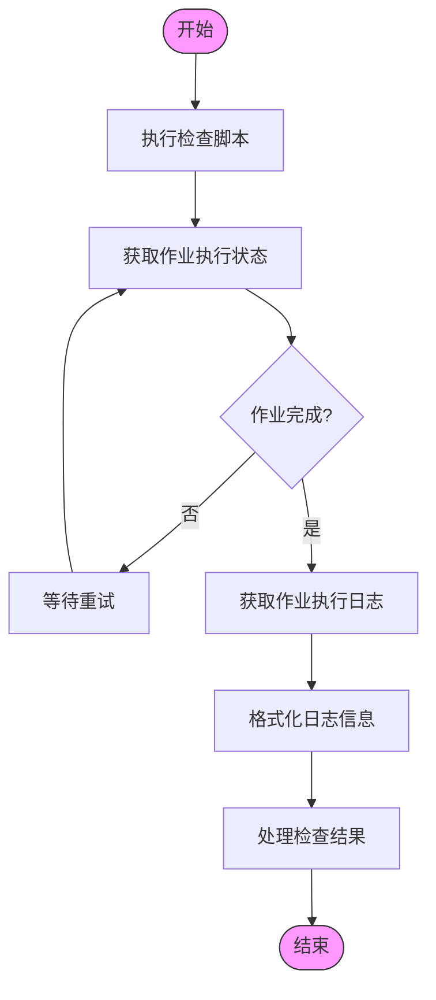
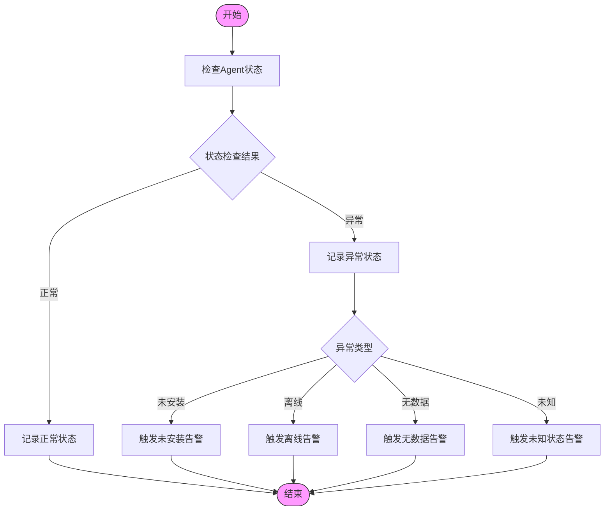

# Agent状态管理

<cite>
**本文档引用的文件**
- [agent_checker.py](file://bklog/apps/log_databus/handlers/check_collector/checker/agent_checker.py)
- [gse.py](file://bklog/apps/api/modules/gse.py)
- [gse.py](file://bklog/blueking/component/apis/gse.py)
- [constants.py](file://bklog/apps/log_search/constants.py)
- [biz.py](file://bklog/apps/log_search/handlers/biz.py)
- [topo_handler.py](file://bklog/bkm_ipchooser/handlers/topo_handler.py)
- [dynamic_group_handler.py](file://bklog/bkm_ipchooser/handlers/dynamic_group_handler.py)
- [domains.py](file://bklog/config/domains.py)
</cite>

## 目录
1. [引言](#引言)
2. [GSE接口调用流程](#gse接口调用流程)
3. [Agent状态查询接口](#agent状态查询接口)
4. [状态检查模块实现](#状态检查模块实现)
5. [状态码与故障诊断](#状态码与故障诊断)
6. [结论](#结论)

## 引言
本文档详细说明了通过GSE接口实现日志采集Agent的健康检查和状态监控机制。重点描述了get_agent_status和get_agent_info接口的调用流程、请求参数和响应数据结构，解释了如何通过IP和云区域ID查询Agent在线状态和心跳信息。文档还提供了在采集器状态检查模块中调用这些接口的代码实例，包括参数预处理和响应数据后处理的实现逻辑。

## GSE接口调用流程



**图示来源**
- [gse.py](file://bklog/apps/api/modules/gse.py#L30-L48)

**本节来源**
- [gse.py](file://bklog/apps/api/modules/gse.py#L25-L73)
- [gse.py](file://bklog/blueking/component/apis/gse.py#L31-L42)

## Agent状态查询接口

### get_agent_status接口

`get_agent_status`接口用于查询Agent的在线状态，是Agent健康检查的核心接口。

**请求参数预处理 (get_agent_status_before)**
```python
def get_agent_status_before(params):
    hosts = [{"ip": ip_info["ip"], "bk_cloud_id": ip_info["plat_id"]} for ip_info in params["ip_infos"]]
    
    params = {
        "hosts": hosts,
    }
    params = add_esb_info_before_request(params)
    
    if settings.BK_SUPPLIER_ACCOUNT != "":
        params["bk_supplier_account"] = settings.BK_SUPPLIER_ACCOUNT
    return params
```

**响应数据后处理 (get_agent_status_after)**
```python
def get_agent_status_after(response_result):
    hosts = response_result.get("data", {})
    response_result["data"] = [
        {"ip": host["ip"], "plat_id": host["bk_cloud_id"], "status": host["bk_agent_alive"]} for host in hosts.values()
    ]
    return response_result
```

**接口调用示例**
```python
# GSE API定义
self.get_agent_status = ComponentAPI(
    client=self.client,
    method="POST",
    path="/api/c/compapi{bk_api_ver}/gse/get_agent_status/",
    description="Agent在线状态查询",
)
```

### get_agent_info接口

`get_agent_info`接口用于查询Agent的心跳信息。

```python
# GSE API定义
self.get_agent_info = ComponentAPI(
    client=self.client,
    method="POST",
    path="/api/c/compapi{bk_api_ver}/gse/get_agent_info/",
    description="Agent心跳信息查询",
)
```

**本节来源**
- [gse.py](file://bklog/apps/api/modules/gse.py#L30-L48)
- [gse.py](file://bklog/blueking/component/apis/gse.py#L31-L36)

## 状态检查模块实现

### Agent检查器实现

Agent检查器负责执行Agent状态检查的核心逻辑。



**图示来源**
- [agent_checker.py](file://bklog/apps/log_databus/handlers/check_collector/checker/agent_checker.py#L49-L237)

**本节来源**
- [agent_checker.py](file://bklog/apps/log_databus/handlers/check_collector/checker/agent_checker.py#L49-L237)

### 检查流程



**图示来源**
- [agent_checker.py](file://bklog/apps/log_databus/handlers/check_collector/checker/agent_checker.py#L77-L81)

### 业务处理中的Agent状态查询

在业务处理中，通过主机列表获取Agent状态的实现：

```python
def get_agent_status(self, host_list):
    """
    获取agent状态信息
    agent状态详细分成4个状态：正常，离线，未安装。已安装，无数据。
    """
    result = defaultdict(int)
    meta = BaseHandler.get_meta_data(self.bk_biz_id)
    ip_info_list = [{"host_id": host["bk_host_id"], "meta": meta} for host in host_list]
    if not ip_info_list:
        return {}
```

**本节来源**
- [biz.py](file://bklog/apps/log_search/handlers/biz.py#L1068-L1077)
- [agent_checker.py](file://bklog/apps/log_databus/handlers/check_collector/checker/agent_checker.py#L77-L81)

## 状态码与故障诊断

### Agent状态码定义

Agent状态通过`bk_agent_alive`字段表示，其值对应不同的状态：

```python
class AgentStatusEnum(ChoicesEnum):
    """
    agent状态
    """
    UNKNOWN = -1
    ON = 0
    OFF = 1
    NOT_EXIST = 2
    NO_DATA = 3

    _choices_labels = (
        (UNKNOWN, _("异常（未知）")),
        (ON, _("正常")),
        (OFF, _("关闭")),
        (NOT_EXIST, _("Agent未安装")),
        (NO_DATA, _("无数据")),
    )
```

### 状态码含义

| 状态码 | 含义 | 描述 |
|-------|------|------|
| -1 | 异常（未知） | Agent状态异常或未知 |
| 0 | 正常 | Agent在线且正常工作 |
| 1 | 关闭 | Agent处于关闭状态 |
| 2 | Agent未安装 | 主机上未安装Agent |
| 3 | 无数据 | Agent已安装但无数据上报 |

### 故障诊断与告警触发



**图示来源**
- [constants.py](file://bklog/apps/log_search/constants.py#L309-L326)
- [agent_checker.py](file://bklog/apps/log_databus/handlers/check_collector/checker/agent_checker.py#L200-L236)

**本节来源**
- [constants.py](file://bklog/apps/log_search/constants.py#L309-L326)
- [agent_checker.py](file://bklog/apps/log_databus/handlers/check_collector/checker/agent_checker.py#L156-L236)

## 结论
本文档详细介绍了通过GSE接口实现日志采集Agent健康检查和状态监控的完整机制。通过`get_agent_status`和`get_agent_info`接口，系统能够准确查询Agent的在线状态和心跳信息。参数预处理和响应后处理函数确保了请求和响应数据的正确格式化。状态检查模块实现了完整的检查流程，从脚本执行到结果处理。通过定义清晰的状态码，系统能够准确诊断Agent的各种状态，并根据诊断结果触发相应的告警，确保日志采集系统的稳定运行。