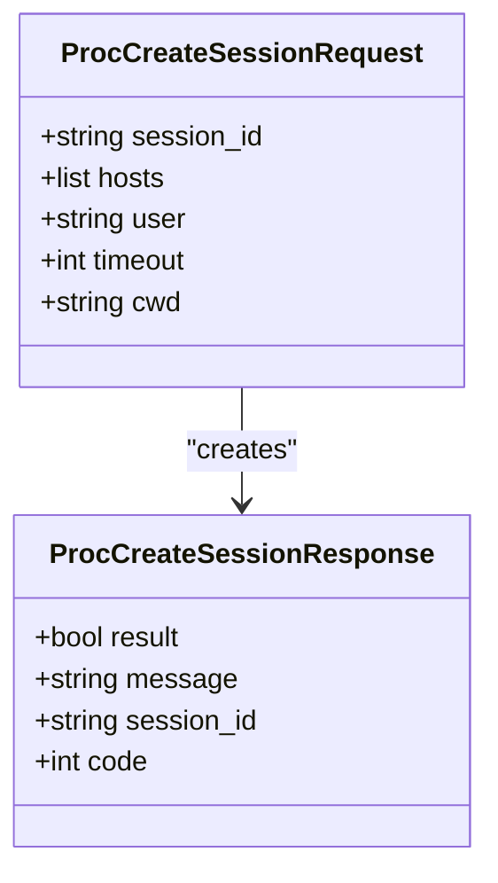
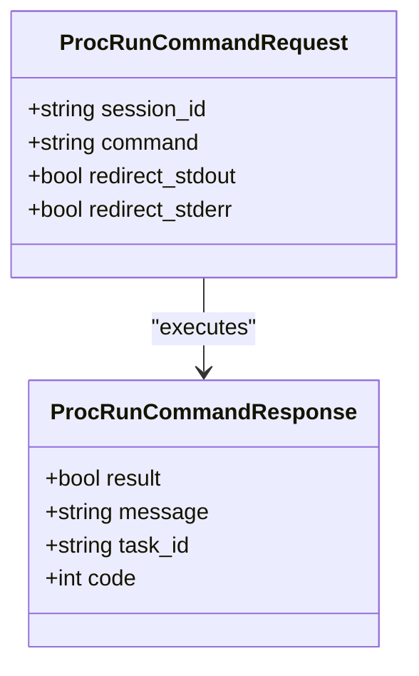
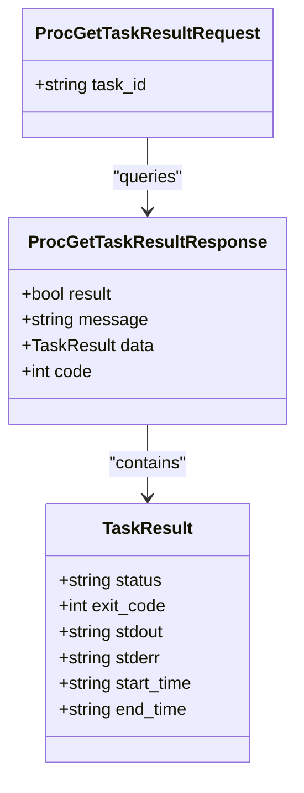
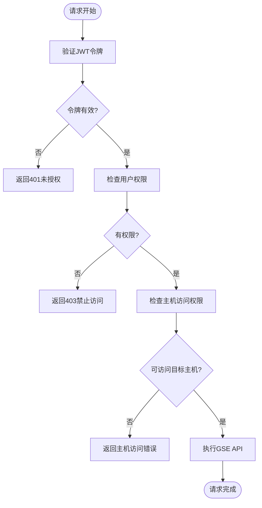
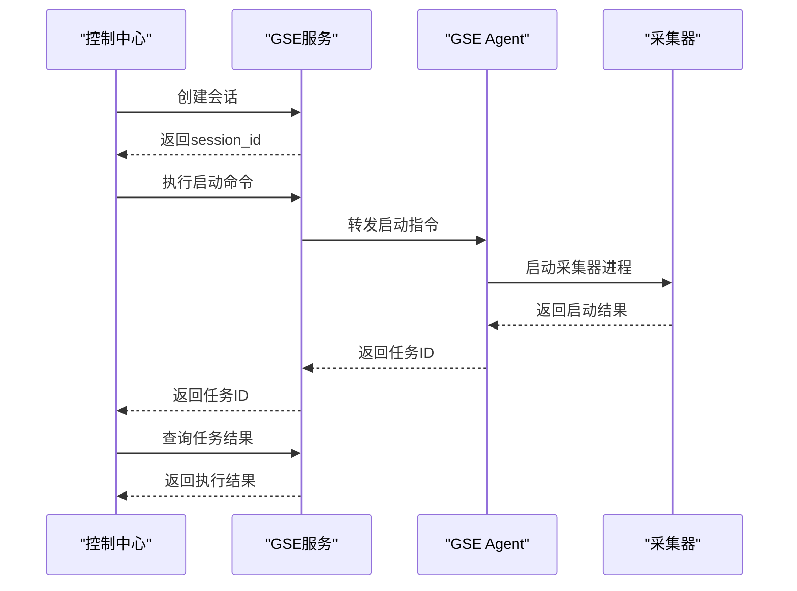
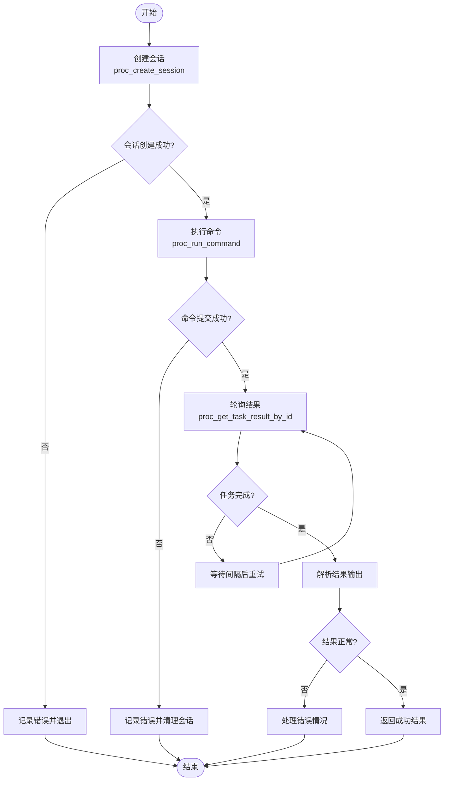

# 服务进程管理

<cite>
**本文档引用的文件**
- [gse.py](file://bklog/blueking/component/apis/gse.py#L25-L60)
- [gse.py](file://bklog/apps/api/modules/gse.py#L25-L73)
- [check.py](file://bklog/apps/log_databus/scripts/check_bkunifylogbeat/check.py#L1-L265)
- [base.py](file://bklog/blueking/component/base.py#L32-L127)
</cite>

## 目录
1. [引言](#引言)
2. [核心接口概述](#核心接口概述)
3. [进程管理接口调用流程](#进程管理接口调用流程)
4. [认证机制与权限要求](#认证机制与权限要求)
5. [日志采集场景应用](#日志采集场景应用)
6. [错误处理与安全限制](#错误处理与安全限制)
7. [完整操作示例](#完整操作示例)
8. [结论](#结论)

## 引言
本文档详细说明了通过GSE接口实现远程进程控制的功能。重点描述了`proc_create_session`、`proc_run_command`和`proc_get_task_result_by_id`三个核心接口的调用流程和使用场景，解释了如何通过这些接口在目标主机上执行命令、管理进程会话以及获取任务执行结果。

GSE（Game Server Engine）作为蓝鲸体系中的关键组件，提供了强大的进程管理能力，支持在分布式环境中对远程主机进行统一的进程控制。这些功能在日志采集、系统监控和自动化运维等场景中发挥着重要作用。

**Section sources**
- [gse.py](file://bklog/blueking/component/apis/gse.py#L25-L60)

## 核心接口概述
GSE提供的进程管理功能主要通过三个核心接口实现：

### proc_create_session 接口
该接口用于创建一个新的进程管理会话。在执行任何远程命令之前，必须先创建一个会话。会话包含了执行环境的上下文信息，如目标主机、执行用户、超时设置等。



**Diagram sources**
- [gse.py](file://bklog/blueking/component/apis/gse.py#L43-L48)

### proc_run_command 接口
该接口用于在已创建的会话中执行命令。它接收会话ID和要执行的命令字符串作为参数，在目标主机上运行指定的命令并返回任务ID。



**Diagram sources**
- [gse.py](file://bklog/blueking/component/apis/gse.py#L55-L60)

### proc_get_task_result_by_id 接口
该接口用于获取指定任务的执行结果。通过任务ID查询命令执行的状态、输出和退出码等信息。



**Diagram sources**
- [gse.py](file://bklog/blueking/component/apis/gse.py#L49-L54)

## 进程管理接口调用流程
进程管理操作遵循严格的时序流程，从会话创建到命令执行再到结果获取，形成一个完整的生命周期。

```mermaid
sequenceDiagram
participant Client as "客户端"
participant GSE as "GSE服务"
participant Target as "目标主机"
Client->>GSE : proc_create_session(会话参数)
GSE-->>Client : 返回session_id
Client->>GSE : proc_run_command(session_id, 命令)
GSE->>Target : 在目标主机执行命令
Target-->>GSE : 返回task_id
GSE-->>Client : 返回task_id
loop 轮询结果
Client->>GSE : proc_get_task_result_by_id(task_id)
GSE-->>Client : 返回任务状态
alt 任务完成
break
end
end
GSE->>Target : 清理会话资源
```

**Diagram sources**
- [gse.py](file://bklog/blueking/component/apis/gse.py#L43-L60)

**Section sources**
- [gse.py](file://bklog/blueking/component/apis/gse.py#L43-L60)

## 认证机制与权限要求
GSE接口调用需要严格的认证和权限控制，确保操作的安全性。

### 认证流程
1. 客户端通过API网关发起请求
2. 网关验证JWT令牌的有效性
3. 检查用户是否有访问GSE组件的权限
4. 验证目标主机的访问权限



**Diagram sources**
- [apigw.py](file://bklog/apps/middleware/apigw.py#L22-L57)

### 权限模型
GSE采用基于角色的访问控制（RBAC）模型，主要权限包括：
- 会话创建权限：允许创建新的进程管理会话
- 命令执行权限：允许在会话中执行命令
- 结果查询权限：允许获取任务执行结果
- 主机访问权限：针对特定主机或主机组的访问控制

**Section sources**
- [gse.py](file://bklog/blueking/component/apis/gse.py#L43-L60)
- [apigw.py](file://bklog/apps/middleware/apigw.py#L22-L57)

## 日志采集场景应用
在日志采集场景中，GSE的进程管理功能被广泛用于采集器的启停控制和配置重载。

### 采集器启停控制
通过GSE接口可以远程控制日志采集器（如bkunifylogbeat）的启动和停止：



**Diagram sources**
- [check.py](file://bklog/apps/log_databus/scripts/check_bkunifylogbeat/check.py#L178-L265)

### 配置重载流程
当需要更新采集配置时，通过GSE接口实现平滑的配置重载：

1. 创建新的会话
2. 执行配置更新命令
3. 发送SIGHUP信号重新加载配置
4. 验证配置生效状态

**Section sources**
- [check.py](file://bklog/apps/log_databus/scripts/check_bkunifylogbeat/check.py#L178-L265)

## 错误处理与安全限制
GSE接口在设计上考虑了各种错误场景和安全限制，确保系统的稳定性和安全性。

### 常见错误类型
- 会话创建失败：通常是由于目标主机不可达或权限不足
- 命令执行超时：命令执行时间超过预设的超时限制
- 资源限制：目标主机的CPU、内存或磁盘空间不足
- 安全策略阻止：命令违反了安全策略或白名单限制

### 安全限制措施
1. 命令白名单：限制可执行的命令范围
2. 资源配额：控制单个会话的资源使用
3. 执行时间限制：防止长时间运行的命令
4. 输出大小限制：防止大量输出导致的性能问题
5. 审计日志：记录所有进程管理操作

**Section sources**
- [gse.py](file://bklog/blueking/component/apis/gse.py#L43-L60)
- [base.py](file://bklog/blueking/component/base.py#L32-L127)

## 完整操作示例
以下是一个完整的进程管理操作示例，展示了从会话创建到结果获取的全过程。



**Diagram sources**
- [gse.py](file://bklog/blueking/component/apis/gse.py#L43-L60)

**Section sources**
- [gse.py](file://bklog/blueking/component/apis/gse.py#L43-L60)

## 结论
通过GSE提供的`proc_create_session`、`proc_run_command`和`proc_get_task_result_by_id`接口，实现了强大的远程进程管理能力。这些接口在日志采集、系统监控和自动化运维等场景中发挥着关键作用。

核心优势包括：
- 统一的进程管理接口，简化了分布式环境下的操作复杂性
- 完善的认证和权限控制机制，确保操作的安全性
- 详细的错误处理和审计功能，便于问题排查和合规性检查
- 灵活的配置选项，满足不同场景的需求

在实际应用中，应遵循最佳实践，合理设置超时时间和资源限制，确保系统的稳定运行。