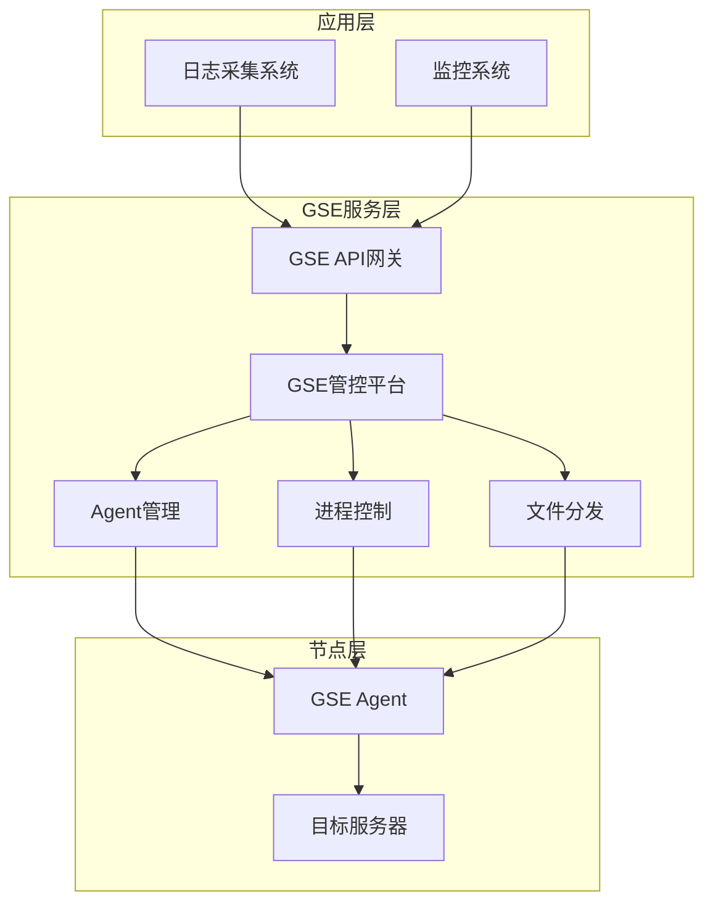
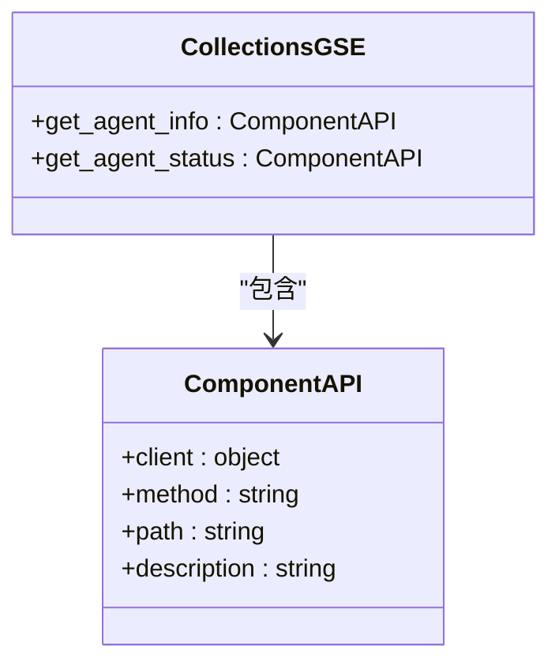
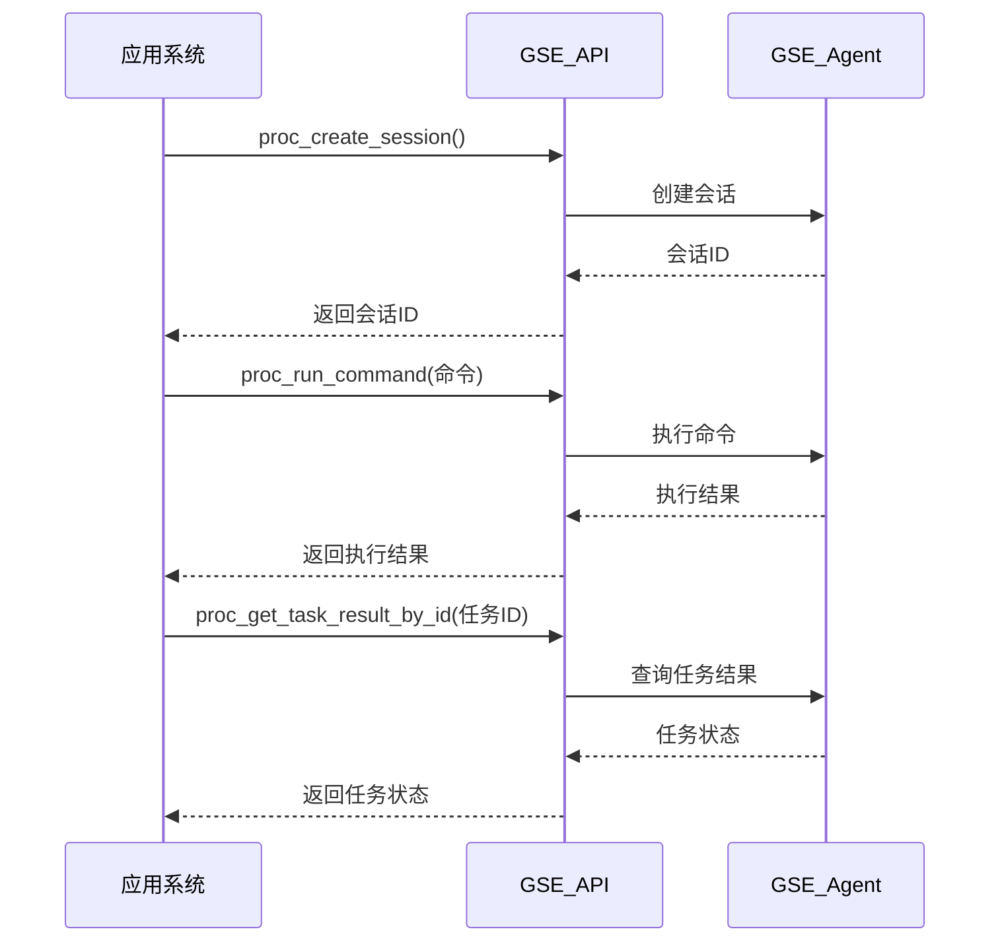
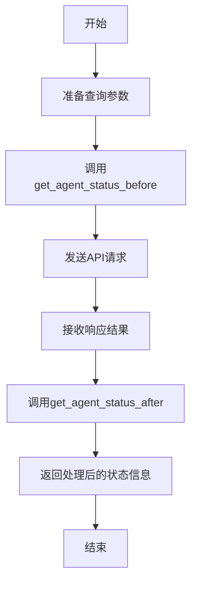
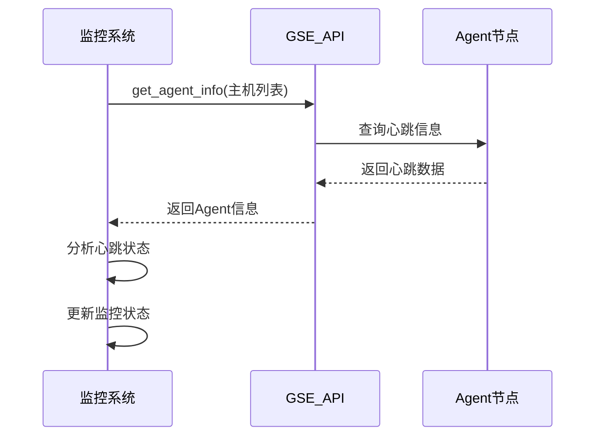
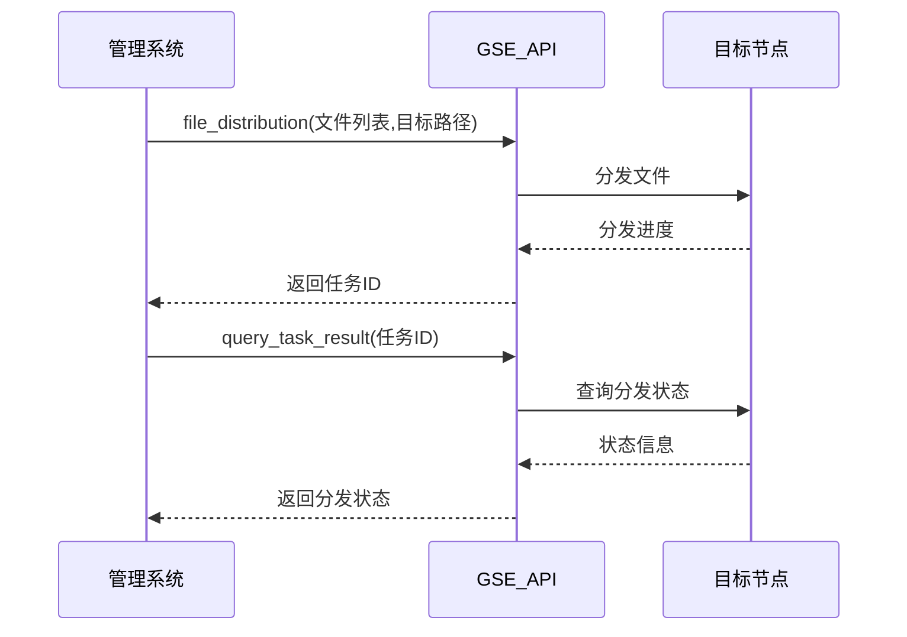
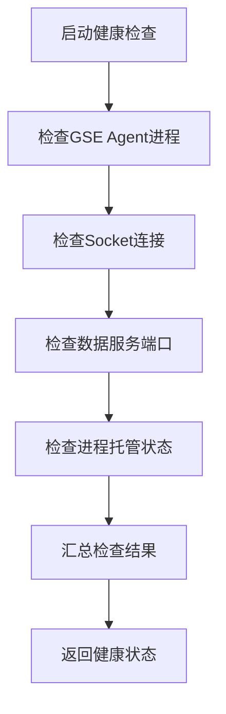

# 节点管理(GSE)集成

<cite>
**本文档引用的文件**   
- [gse.py](file://bklog/apps/api/modules/gse.py)
- [gse.py](file://bklog/blueking/component/apis/gse.py)
- [check.py](file://bklog/apps/log_databus/scripts/check_bkunifylogbeat/check.py)
- [constants.py](file://bklog/apps/log_databus/constants.py)
- [bk_node.py](file://bklog/apps/api/modules/bk_node.py)
- [topo_handler.py](file://bklog/bkm_ipchooser/handlers/topo_handler.py)
- [biz.py](file://bklog/apps/log_search/handlers/biz.py)
- [domains.py](file://bklog/config/domains.py)
- [dev.env.yml](file://bklog/dev.env.yml)
- [prod.env.yml](file://bklog/prod.env.yml)
- [stag.env.yml](file://bklog/stag.env.yml)
</cite>

## 目录
1. [简介](#简介)
2. [GSE集成架构](#gse集成架构)
3. [核心功能接口](#核心功能接口)
4. [Agent状态管理](#agent状态管理)
5. [进程管理](#进程管理)
6. [文件分发](#文件分发)
7. [健康检查与监控](#健康检查与监控)
8. [API使用示例](#api使用示例)
9. [配置参数说明](#配置参数说明)
10. [最佳实践](#最佳实践)

## 简介
本文档详细说明了本系统与蓝鲸GSE（Game Server Engine）的集成方式。重点描述了Agent状态查询、进程管理、文件分发等核心功能的接口调用流程。文档提供了Agent心跳检测、状态上报、指令下发等场景的API使用示例和参数配置说明，并解释了如何通过GSE接口实现日志采集Agent的健康检查和状态监控。

## GSE集成架构
系统通过GSE API网关与GSE管控平台进行通信，实现对Agent的统一管理和控制。GSE作为蓝鲸体系中的核心组件，负责节点管理、进程控制、文件分发等基础能力，为上层应用提供稳定的基础设施服务。



**图源**
- [gse.py](file://bklog/apps/api/modules/gse.py#L25-L73)
- [domains.py](file://bklog/config/domains.py#L24-L82)

**节源**
- [gse.py](file://bklog/apps/api/modules/gse.py#L1-L74)
- [domains.py](file://bklog/config/domains.py#L1-L83)

## 核心功能接口
系统通过GSE提供的API接口实现对Agent的全面管理，主要包括Agent状态查询、进程管理和文件分发三大核心功能。

### Agent状态查询接口
GSE提供了Agent心跳信息和在线状态查询接口，用于实时监控Agent的运行状态。



**图源**
- [gse.py](file://bklog/blueking/component/apis/gse.py#L25-L60)

**节源**
- [gse.py](file://bklog/blueking/component/apis/gse.py#L1-L61)

### 进程管理接口
GSE提供了完整的进程管理接口，包括新建会话、执行命令和获取任务结果等功能。



**图源**
- [gse.py](file://bklog/blueking/component/apis/gse.py#L25-L60)

**节源**
- [gse.py](file://bklog/blueking/component/apis/gse.py#L1-L61)

## Agent状态管理
系统通过GSE接口实现对Agent状态的全面监控和管理，包括在线状态查询、心跳检测和状态上报等功能。

### Agent在线状态查询
通过调用GSE的`get_agent_status`接口查询Agent的在线状态，接口参数和返回值经过预处理和后处理转换。



**图源**
- [gse.py](file://bklog/apps/api/modules/gse.py#L30-L48)

**节源**
- [gse.py](file://bklog/apps/api/modules/gse.py#L25-L73)

### Agent心跳检测
系统通过定期调用GSE接口检测Agent的心跳信息，确保Agent的正常运行。



**图源**
- [gse.py](file://bklog/blueking/component/apis/gse.py#L31-L36)

**节源**
- [gse.py](file://bklog/blueking/component/apis/gse.py#L25-L60)

## 进程管理
系统利用GSE的进程管理功能实现对远程节点的命令执行和进程控制。

### 进程控制流程
通过GSE的进程管理接口实现对远程节点的命令执行和进程控制。


**图源**
- [gse.py](file://bklog/blueking/component/apis/gse.py#L43-L59)

**节源**
- [gse.py](file://bklog/blueking/component/apis/gse.py#L25-L60)

## 文件分发
系统通过GSE通道实现配置文件的批量分发，确保配置的一致性和及时性。

### 文件分发流程


**图源**
- [distribution_component.py](file://bklog/apps/log_extract/components/collections/distribution_component.py#L88-L145)

**节源**
- [distribution_component.py](file://bklog/apps/log_extract/components/collections/distribution_component.py#L54-L151)

## 健康检查与监控
系统通过集成GSE功能实现对日志采集Agent的健康检查和状态监控。

### 健康检查实现


**图源**
- [check.py](file://bklog/apps/log_databus/scripts/check_bkunifylogbeat/check.py#L178-L221)

**节源**
- [check.py](file://bklog/apps/log_databus/scripts/check_bkunifylogbeat/check.py#L1-L306)

## API使用示例
### Agent状态查询示例
```python
# 调用GSE接口查询Agent状态
params = {
    "ip_infos": [
        {"ip": "192.168.1.1", "plat_id": 0},
        {"ip": "192.168.1.2", "plat_id": 0}
    ]
}
response = GseApi.get_agent_status(params)
```

**节源**
- [gse.py](file://bklog/apps/api/modules/gse.py#L30-L48)

### 进程管理示例
```python
# 通过GSE执行远程命令
session_params = {"bk_biz_id": 123}
session_result = gse_client.proc_create_session(session_params)

command_params = {
    "session_id": session_result["session_id"],
    "cmd": "ps -ef | grep bkunifylogbeat"
}
command_result = gse_client.proc_run_command(command_params)
```

**节源**
- [gse.py](file://bklog/blueking/component/apis/gse.py#L43-L59)

## 配置参数说明
### GSE API网关配置
系统通过环境变量配置GSE API网关地址，支持不同环境的部署。

| 参数 | 开发环境 | 测试环境 | 生产环境 |
|------|----------|----------|----------|
| GSE_APIGATEWAY_ROOT_V2 | {settings.PAAS_API_HOST}/api/c/compapi/v2/gse/ | {settings.PAAS_API_HOST}/api/c/compapi/v2/gse/ | {settings.PAAS_API_HOST}/api/c/compapi/v2/gse/ |
| GSE_APIGATEWAY_ROOT_V3 | {settings.PAAS_API_HOST}/api/bk-gse/dev/ | {settings.PAAS_API_HOST}/api/bk-gse/stag/ | {settings.PAAS_API_HOST}/api/bk-gse/prod/ |

**图源**
- [dev.env.yml](file://bklog/dev.env.yml#L69-L86)
- [stag.env.yml](file://bklog/stag.env.yml#L69-L86)
- [prod.env.yml](file://bklog/prod.env.yml#L69-L86)

**节源**
- [domains.py](file://bklog/config/domains.py#L24-L82)

### 常量配置
```python
# GSE相关常量配置
IPC_PATH = "/var/run/ipc.state.report"  # IPC通信路径
GSE_PATH = "/usr/local/gse/"  # GSE安装路径
DATASERVER_PORT = "58625"  # 数据服务端口
```

**节源**
- [constants.py](file://bklog/apps/log_databus/constants.py#L529-L531)

## 最佳实践
### 状态监控最佳实践
1. 定期调用`get_agent_status`接口获取Agent在线状态
2. 结合`get_agent_info`接口获取详细的心跳信息
3. 建立状态变化告警机制，及时发现异常节点

### 文件分发最佳实践
1. 使用批量分发接口提高效率
2. 分发后验证文件完整性
3. 记录分发日志便于追踪

### 健康检查最佳实践
1. 综合检查Agent进程、Socket连接和端口状态
2. 设置合理的检查频率，避免对系统造成过大压力
3. 提供详细的检查结果报告，便于问题定位

**节源**
- [check.py](file://bklog/apps/log_databus/scripts/check_bkunifylogbeat/check.py#L178-L221)
- [gse.py](file://bklog/apps/api/modules/gse.py#L30-L48)