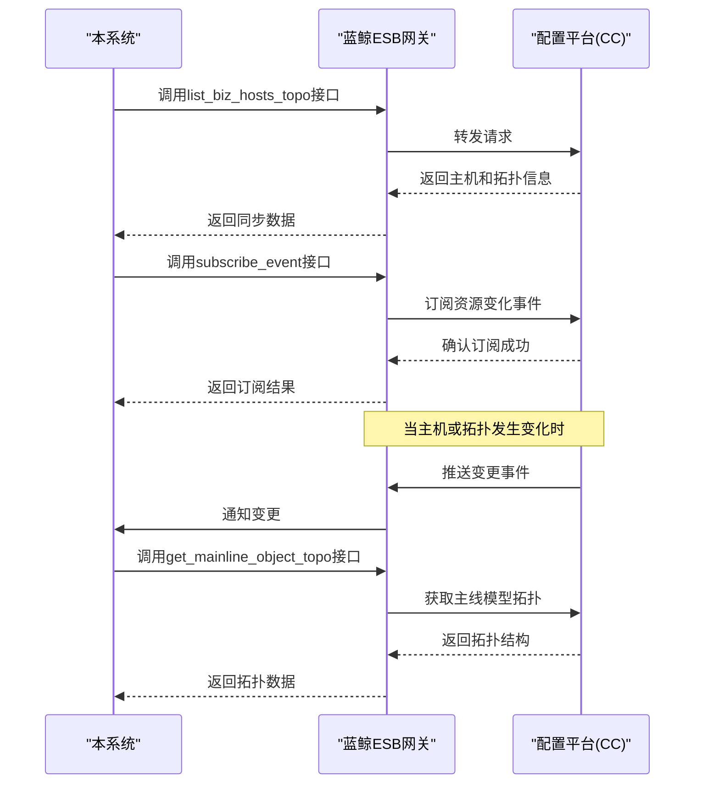
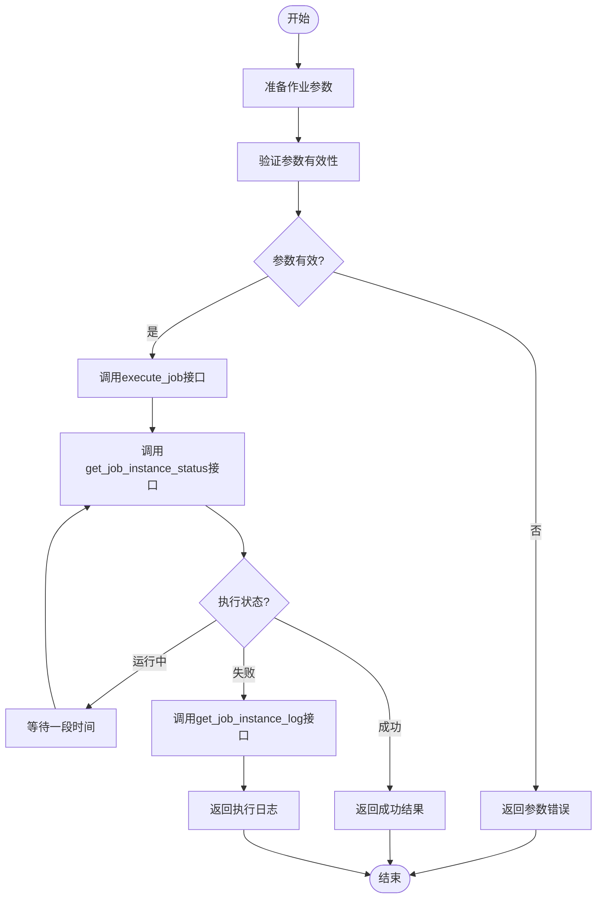
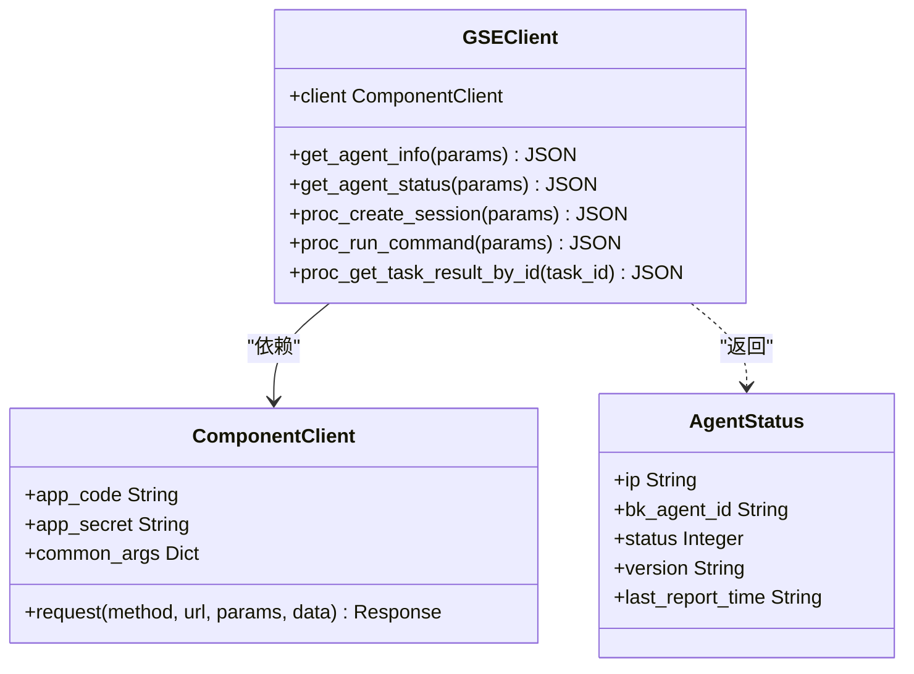
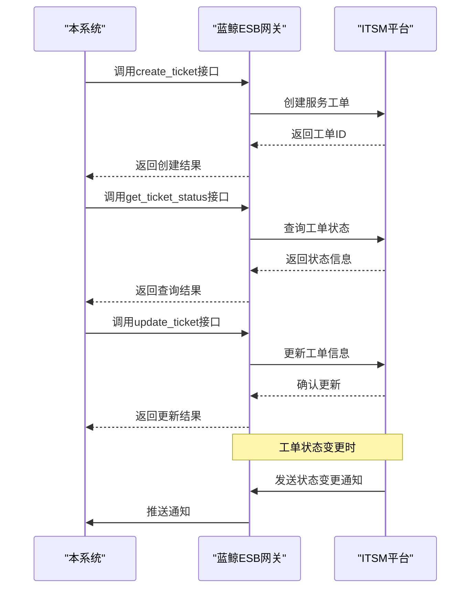
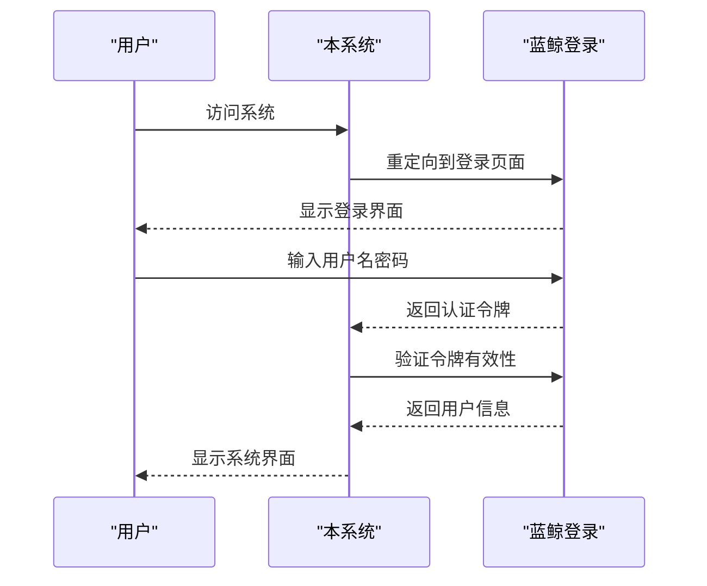
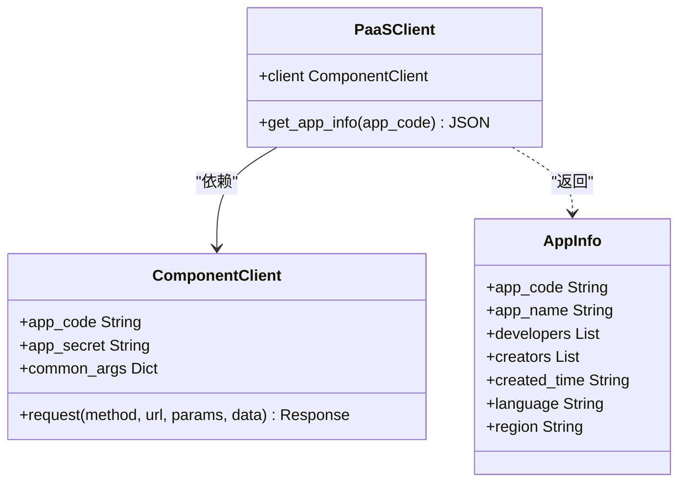
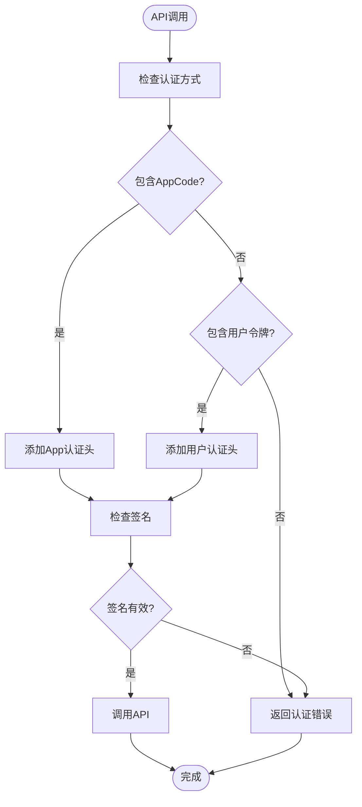
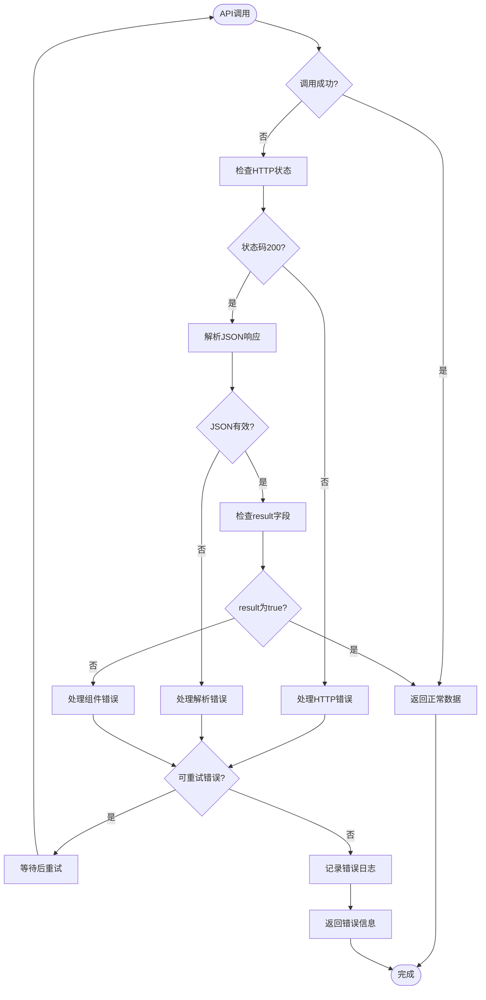

# 蓝鲸生态集成

<cite>
**本文档引用的文件**
- [client.py](file://bklog/blueking/component/client.py)
- [cc.py](file://bklog/blueking/component/apis/cc.py)
- [job.py](file://bklog/blueking/component/apis/job.py)
- [gse.py](file://bklog/blueking/component/apis/gse.py)
- [bk_login.py](file://bklog/blueking/component/apis/bk_login.py)
- [bk_paas.py](file://bklog/blueking/component/apis/bk_paas.py)
- [itsm.py](file://bklog/blueking/component/apis/itsm.py)
- [base.py](file://bklog/blueking/component/base.py)
</cite>

## 目录
1. [引言](#引言)
2. [蓝鲸ESB网关集成机制](#蓝鲸esb网关集成机制)
3. [配置平台（CC）集成](#配置平台cc集成)
4. [作业平台（JOB）集成](#作业平台job集成)
5. [节点管理（GSE）集成](#节点管理gse集成)
6. [ITSM服务流程集成](#itsm服务流程集成)
7. [蓝鲸登录与PaaS平台集成](#蓝鲸登录与paas平台集成)
8. [认证与安全机制](#认证与安全机制)
9. [错误处理策略](#错误处理策略)
10. [性能优化建议](#性能优化建议)
11. [代码集成示例](#代码集成示例)

## 引言
本文档详细说明了本系统与蓝鲸平台各核心组件的集成方式。重点描述了与配置平台（CC）的拓扑数据同步机制，与作业平台（JOB）的执行任务调用流程，与节点管理（GSE）的Agent状态查询接口，与ITSM的服务流程对接方案，以及与蓝鲸登录、PaaS平台的认证和应用管理集成。文档提供了各集成点的API调用示例、认证方式、错误处理策略和性能优化建议，并解释了如何利用蓝鲸ESB网关进行服务暴露和调用。

## 蓝鲸ESB网关集成机制
蓝鲸ESB（Enterprise Service Bus）网关是本系统与蓝鲸平台各组件通信的核心枢纽。通过ESB网关，系统能够安全、高效地调用蓝鲸平台提供的各种API服务。

```mermaid
graph TB
subgraph "本系统"
App[应用模块]
Client[ComponentClient]
end
subgraph "蓝鲸ESB网关"
ESB[ESB网关]
Auth[认证模块]
Route[路由模块]
end
subgraph "蓝鲸平台组件"
CC[配置平台(CC)]
JOB[作业平台(JOB)]
GSE[节点管理(GSE)]
ITSM[IT服务管理]
LOGIN[蓝鲸登录]
PAAS[蓝鲸PaaS]
end
App --> Client
Client --> ESB
ESB --> CC
ESB --> JOB
ESB --> GSE
ESB --> ITSM
ESB --> LOGIN
ESB --> PAAS
style App fill:#f9f,stroke:#333
style Client fill:#f9f,stroke:#333
style ESB fill:#bbf,stroke:#333
style CC fill:#f96,stroke:#333
style JOB fill:#f96,stroke:#333
style GSE fill:#f96,stroke:#333
style ITSM fill:#f96,stroke:#333
style LOGIN fill:#f96,stroke:#333
style PAAS fill:#f96,stroke:#333
```

**图示来源**
- [client.py](file://bklog/blueking/component/client.py#L47-L205)
- [base.py](file://bklog/blueking/component/base.py#L32-L127)

**本节来源**
- [client.py](file://bklog/blueking/component/client.py#L1-L205)
- [base.py](file://bklog/blueking/component/base.py#L1-L127)

## 配置平台（CC）集成
配置平台（Configuration Center，简称CC）是蓝鲸平台的核心组件之一，负责管理IT基础设施的配置信息和拓扑关系。本系统通过蓝鲸ESB网关与CC进行深度集成，实现拓扑数据的同步和管理。

### 拓扑数据同步机制
本系统通过调用CC提供的API接口，实现与配置平台的拓扑数据同步。主要同步机制包括：

1. **全量同步**：定期获取业务下的主机和拓扑信息
2. **增量同步**：通过订阅事件监听资源变化
3. **按需查询**：根据特定条件查询主机和拓扑信息



**图示来源**
- [cc.py](file://bklog/blueking/component/apis/cc.py#L25-L736)
- [client.py](file://bklog/blueking/component/client.py#L47-L205)

### 主要API接口
| API接口 | HTTP方法 | 描述 | 参数格式 | 返回结构 |
|--------|--------|------|---------|---------|
| list_biz_hosts_topo | POST | 查询业务下的主机和拓扑信息 | {"bk_biz_id": 123} | {"result": true, "data": [...]} |
| get_mainline_object_topo | GET | 查询主线模型的业务拓扑 | {"bk_obj_id": "biz"} | {"result": true, "data": {...}} |
| search_host | POST | 根据条件查询主机 | {"bk_host_innerip": "1.1.1.1"} | {"result": true, "data": {...}} |
| subscribe_event | POST | 订阅事件 | {"event_type": "host", "op_type": "create"} | {"result": true, "data": {"subscription_id": "123"}} |
| resource_watch | POST | 监听资源变化事件 | {"subscription_id": "123"} | {"result": true, "data": {...}} |

**常见错误码**
- 1200: 参数错误
- 1201: 业务不存在
- 1202: 主机不存在
- 1203: 权限不足
- 1204: 数据冲突

**本节来源**
- [cc.py](file://bklog/blueking/component/apis/cc.py#L1-L736)

## 作业平台（JOB）集成
作业平台（JOB）是蓝鲸平台的自动化运维核心组件，本系统通过与JOB平台集成，实现作业任务的远程调用和执行状态监控。

### 执行任务调用流程
本系统通过调用JOB平台的API接口，实现作业任务的创建、执行和状态查询。调用流程如下：



**图示来源**
- [job.py](file://bklog/blueking/component/apis/job.py#L25-L178)

### 主要API接口
| API接口 | HTTP方法 | 描述 | 参数格式 | 返回结构 |
|--------|--------|------|---------|---------|
| execute_job | POST | 启动作业 | {"job_id": 123, "global_vars": [...]} | {"result": true, "data": {"job_instance_id": 456}} |
| get_job_instance_status | GET | 查询作业执行状态 | {"job_instance_id": 456} | {"result": true, "data": {"job_instance": {...}}} |
| get_job_instance_log | GET | 查询作业执行日志 | {"job_instance_id": 456} | {"result": true, "data": [...]} |
| fast_execute_script | POST | 快速执行脚本 | {"script_content": "echo hello", "ip_list": [...]} | {"result": true, "data": {"job_instance_id": 789}} |
| get_script_list | GET | 查询脚本列表 | {"bk_biz_id": 123} | {"result": true, "data": [...]} |

**常见错误码**
- 1300: 作业模板不存在
- 1301: 执行账号无权限
- 1302: IP不在业务范围内
- 1303: 脚本内容为空
- 1304: 作业执行超时

**本节来源**
- [job.py](file://bklog/blueking/component/apis/job.py#L1-L178)

## 节点管理（GSE）集成
节点管理（GSE，Game Server Engine）是蓝鲸平台的Agent管理核心组件，本系统通过与GSE集成，实现对Agent状态的查询和管理。

### Agent状态查询接口
本系统通过调用GSE提供的API接口，实现对Agent状态的实时查询。主要接口包括：



**图示来源**
- [gse.py](file://bklog/blueking/component/apis/gse.py#L25-L61)
- [client.py](file://bklog/blueking/component/client.py#L47-L205)

### 主要API接口
| API接口 | HTTP方法 | 描述 | 参数格式 | 返回结构 |
|--------|--------|------|---------|---------|
| get_agent_status | POST | Agent在线状态查询 | {"hosts": [{"ip": "1.1.1.1", "bk_cloud_id": 0}]} | {"result": true, "data": {"1.1.1.1:0": {"status": 1}}} |
| get_agent_info | POST | Agent心跳信息查询 | {"hosts": [{"ip": "1.1.1.1", "bk_cloud_id": 0}]} | {"result": true, "data": {"1.1.1.1:0": {...}}} |
| proc_run_command | POST | 执行命令 | {"script_content": "df -h", "hosts": [...]} | {"result": true, "data": {"task_id": "123"}} |
| proc_get_task_result_by_id | GET | 获取任务结果 | {"task_id": "123"} | {"result": true, "data": {...}} |

**常见错误码**
- 1400: Agent未安装
- 1401: Agent离线
- 1402: 命令执行失败
- 1403: 任务不存在
- 1404: 参数格式错误

**本节来源**
- [gse.py](file://bklog/blueking/component/apis/gse.py#L1-L61)

## ITSM服务流程集成
ITSM（IT Service Management）是蓝鲸平台的服务流程管理组件，本系统通过与ITSM集成，实现工单的创建、查询和处理。

### 服务流程对接方案
本系统通过调用ITSM提供的API接口，实现与服务流程的对接。主要对接方案包括：

1. **工单创建**：通过API创建新的服务工单
2. **工单查询**：根据条件查询工单信息
3. **工单处理**：更新工单状态和处理意见
4. **流程审批**：实现自动化审批流程



**图示来源**
- [itsm.py](file://bklog/blueking/component/apis/itsm.py)
- [client.py](file://bklog/blueking/component/client.py#L47-L205)

### 主要API接口
| API接口 | HTTP方法 | 描述 | 参数格式 | 返回结构 |
|--------|--------|------|---------|---------|
| create_ticket | POST | 创建工单 | {"catalog_id": 1, "fields": [...]} | {"result": true, "data": {"sn": "REQ20230001"}} |
| get_ticket_status | GET | 查询工单状态 | {"sn": "REQ20230001"} | {"result": true, "data": {"current_status": "RUNNING"}} |
| update_ticket | POST | 更新工单 | {"sn": "REQ20230001", "fields": [...]} | {"result": true, "message": "更新成功"} |
| get_ticket_list | POST | 查询工单列表 | {"catalog_id": 1, "page": 1} | {"result": true, "data": [...]} |
| operate_ticket | POST | 操作工单 | {"sn": "REQ20230001", "action": "APPROVE"} | {"result": true, "message": "操作成功"} |

**常见错误码**
- 1500: 服务目录不存在
- 1501: 工单字段校验失败
- 1502: 工单状态不允许操作
- 1503: 审批人不存在
- 1504: 工单已关闭

**本节来源**
- [itsm.py](file://bklog/blueking/component/apis/itsm.py)

## 蓝鲸登录与PaaS平台集成
本系统与蓝鲸登录和PaaS平台深度集成，实现统一的用户认证和应用管理。

### 认证集成
通过蓝鲸登录组件，本系统实现了统一的用户认证机制：



**图示来源**
- [bk_login.py](file://bklog/blueking/component/apis/bk_login.py#L25-L67)
- [client.py](file://bklog/blueking/component/client.py#L47-L205)

### 应用管理集成
通过PaaS平台，本系统实现了应用信息的获取和管理：



**图示来源**
- [bk_paas.py](file://bklog/blueking/component/apis/bk_paas.py#L25-L37)
- [client.py](file://bklog/blueking/component/client.py#L47-L205)

### 主要API接口
| API接口 | HTTP方法 | 描述 | 参数格式 | 返回结构 |
|--------|--------|------|---------|---------|
| get_user | GET | 获取用户信息 | {"bk_username": "admin"} | {"result": true, "data": {...}} |
| is_login | GET | 判断用户是否登录 | {} | {"result": true, "data": {"is_login": true}} |
| get_app_info | GET | 获取应用信息 | {"app_code": "bk_monitor"} | {"result": true, "data": {...}} |

**常见错误码**
- 1600: 用户不存在
- 1601: 认证令牌无效
- 1602: 应用不存在
- 1603: 权限不足
- 1604: 会话超时

**本节来源**
- [bk_login.py](file://bklog/blueking/component/apis/bk_login.py#L1-L67)
- [bk_paas.py](file://bklog/blueking/component/apis/bk_paas.py#L1-L37)

## 认证与安全机制
本系统采用蓝鲸平台统一的认证与安全机制，确保API调用的安全性。

### 认证方式
系统支持两种认证方式：

1. **AppCode/AppSecret认证**：用于系统间调用
2. **用户令牌认证**：用于用户操作认证



**图示来源**
- [client.py](file://bklog/blueking/component/client.py#L125-L138)
- [base.py](file://bklog/blueking/component/base.py#L92-L95)

### 安全特性
- **HTTPS传输**：所有API调用均通过HTTPS加密传输
- **签名验证**：支持请求签名验证，防止重放攻击
- **IP白名单**：支持IP白名单限制，增强安全性
- **权限控制**：基于蓝鲸IAM的细粒度权限控制
- **审计日志**：记录所有API调用，便于审计追踪

**本节来源**
- [client.py](file://bklog/blueking/component/client.py#L1-L205)
- [base.py](file://bklog/blueking/component/base.py#L1-L127)

## 错误处理策略
本系统采用统一的错误处理策略，确保API调用的稳定性和可维护性。

### 错误处理流程


**图示来源**
- [base.py](file://bklog/blueking/component/base.py#L97-L126)

### 错误分类
| 错误类型 | 错误码范围 | 处理策略 |
|--------|----------|---------|
| 客户端错误 | 1000-1999 | 检查请求参数，修正后重试 |
| 服务端错误 | 2000-2999 | 记录日志，等待一段时间后重试 |
| 网络错误 | 3000-3999 | 指数退避重试，最多3次 |
| 认证错误 | 4000-4999 | 重新获取认证令牌，然后重试 |
| 限流错误 | 5000-5999 | 按照返回的重试时间等待后重试 |

**本节来源**
- [base.py](file://bklog/blueking/component/base.py#L1-L127)

## 性能优化建议
为确保系统与蓝鲸平台各组件的高效集成，建议采取以下性能优化措施：

### 批量操作
尽可能使用批量API接口，减少网络往返次数：

```python
# 推荐：使用批量接口
client.cc.list_biz_hosts({
    "bk_biz_id": 123,
    "ip": {
        "data": ["1.1.1.1", "1.1.1.2", "1.1.1.3"]
    }
})

# 不推荐：多次单个查询
for ip in ["1.1.1.1", "1.1.1.2", "1.1.1.3"]:
    client.cc.get_host_base_info({"ip": ip})
```

### 缓存机制
对频繁查询且变化不频繁的数据进行缓存：

```python
# 实现本地缓存
@cached(timeout=300)  # 缓存5分钟
def get_app_info(app_code):
    return client.bk_paas.get_app_info({"app_code": app_code})
```

### 异步调用
对于耗时较长的操作，使用异步调用模式：

```python
# 启动作业后，异步查询状态
job_instance = client.job.execute_job(job_params)
# 在后台线程中轮询状态
start_background_task(check_job_status, job_instance["job_instance_id"])
```

### 连接池
复用HTTP连接，减少连接建立开销：

```python
# 配置连接池
session = requests.Session()
adapter = requests.adapters.HTTPAdapter(
    pool_connections=20,
    pool_maxsize=20,
    max_retries=3
)
session.mount('http://', adapter)
session.mount('https://', adapter)
```

**本节来源**
- [client.py](file://bklog/blueking/component/client.py#L141-L142)
- [base.py](file://bklog/blueking/component/base.py#L92-L95)

## 代码集成示例
以下是在handlers和views中调用蓝鲸集成接口的代码示例：

### 在handlers中调用集成接口
```python
# 示例：在handlers中调用CC接口获取主机信息
def get_host_info_handler(biz_id, ip):
    """
    获取主机信息处理器
    """
    try:
        # 调用CC接口查询主机
        result = client.cc.list_biz_hosts({
            "bk_biz_id": biz_id,
            "ip": {
                "data": [ip]
            }
        })
        
        if result["result"]:
            return result["data"]["info"][0]
        else:
            raise Exception(f"获取主机信息失败: {result['message']}")
            
    except Exception as e:
        logger.error(f"查询主机信息异常: {str(e)}")
        raise
```

### 在views中调用集成接口
```python
# 示例：在views中调用JOB接口启动作业
class ExecuteJobView(APIView):
    """
    启动作业视图
    """
    def post(self, request):
        job_id = request.data.get("job_id")
        global_vars = request.data.get("global_vars", [])
        
        try:
            # 调用JOB接口启动作业
            result = client.job.execute_job({
                "job_id": job_id,
                "global_vars": global_vars
            })
            
            if result["result"]:
                return Response({
                    "success": True,
                    "job_instance_id": result["data"]["job_instance_id"]
                })
            else:
                return Response({
                    "success": False,
                    "message": result["message"]
                }, status=400)
                
        except Exception as e:
            logger.exception("启动作业异常")
            return Response({
                "success": False,
                "message": "系统异常"
            }, status=500)
```

### 统一的错误处理装饰器
```python
# 示例：统一的错误处理装饰器
def handle_bk_api_error(func):
    """
    蓝鲸API错误处理装饰器
    """
    @wraps(func)
    def wrapper(*args, **kwargs):
        try:
            return func(*args, **kwargs)
        except ComponentAPIException as e:
            logger.error(f"蓝鲸API调用失败: {e.error_message}")
            return {
                "result": False,
                "message": "服务调用失败，请稍后重试",
                "code": 500
            }
        except requests.exceptions.RequestException as e:
            logger.error(f"网络请求异常: {str(e)}")
            return {
                "result": False,
                "message": "网络连接异常，请检查网络",
                "code": 503
            }
        except Exception as e:
            logger.exception("未预期的异常")
            return {
                "result": False,
                "message": "系统内部错误",
                "code": 500
            }
    return wrapper
```

**本节来源**
- [client.py](file://bklog/blueking/component/client.py#L47-L205)
- [base.py](file://bklog/blueking/component/base.py#L32-L127)