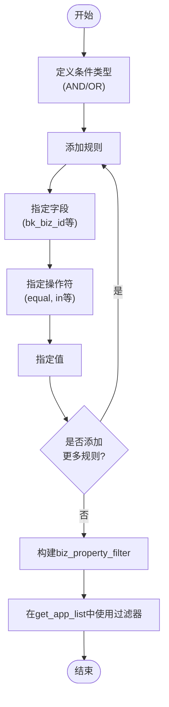
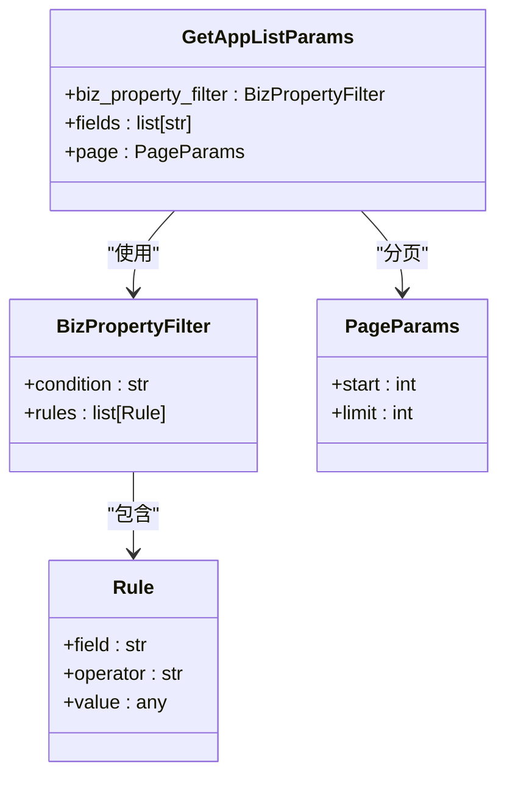
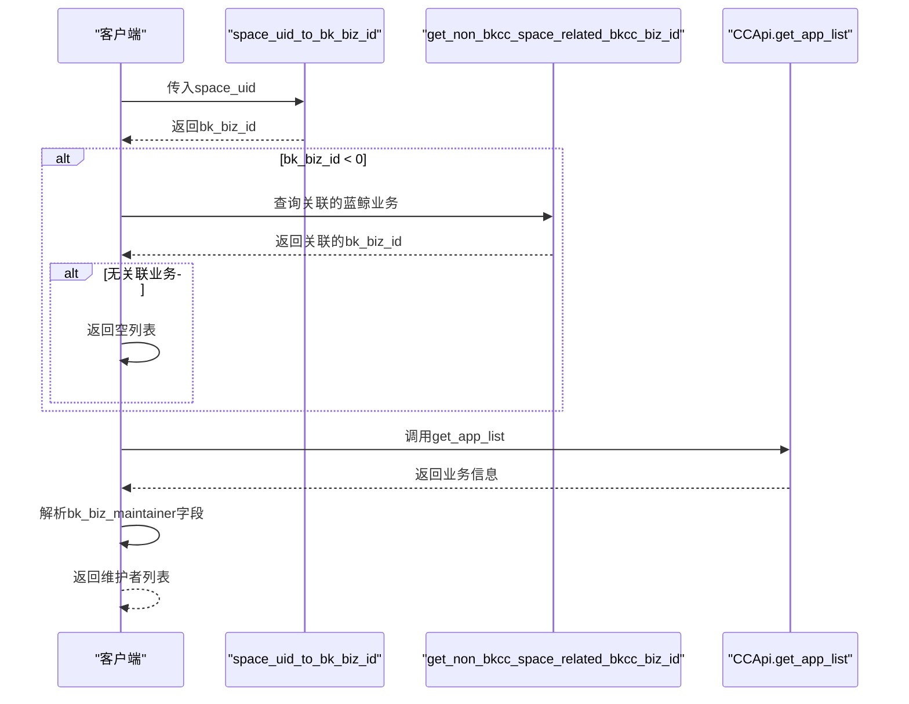
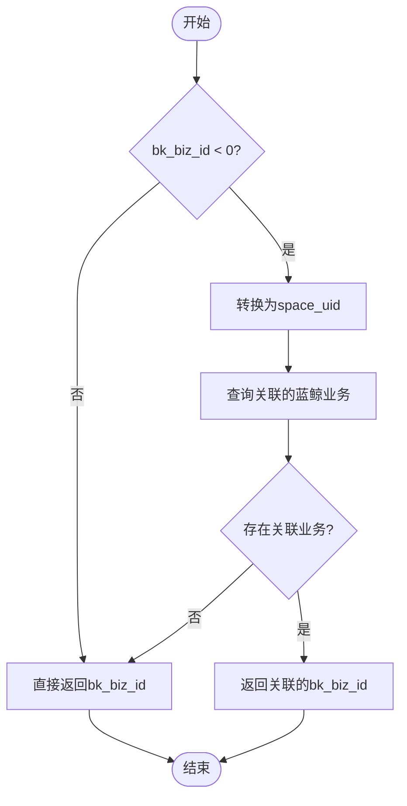
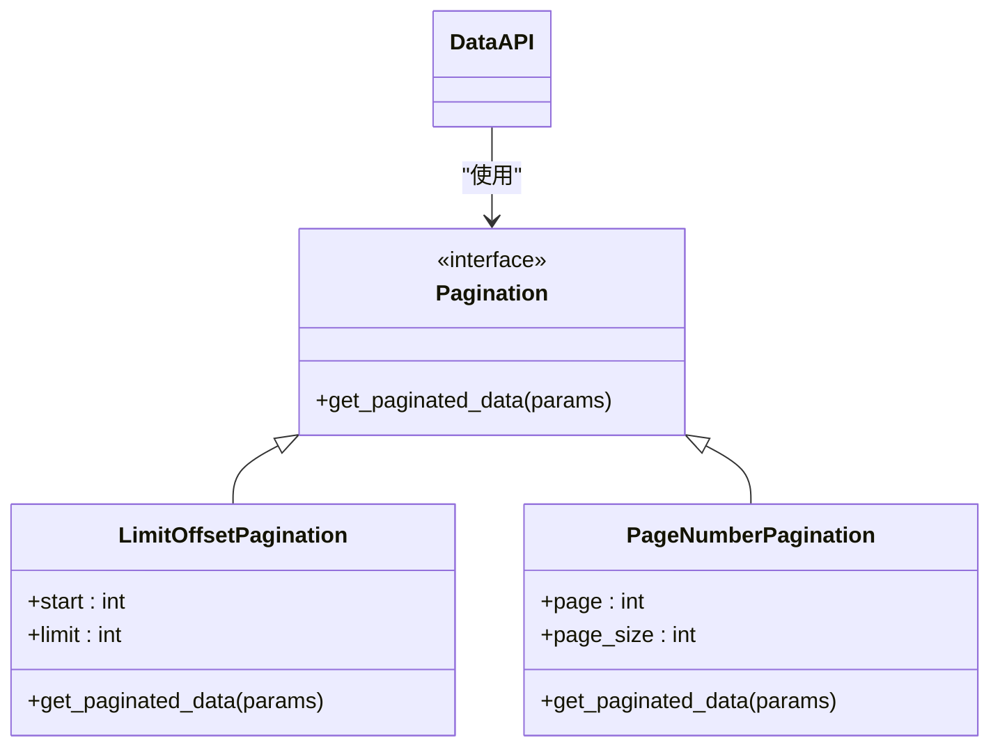
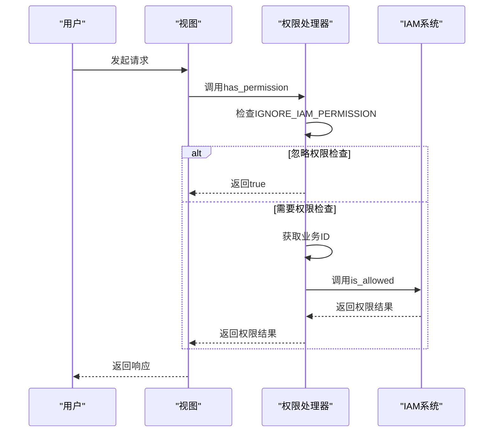
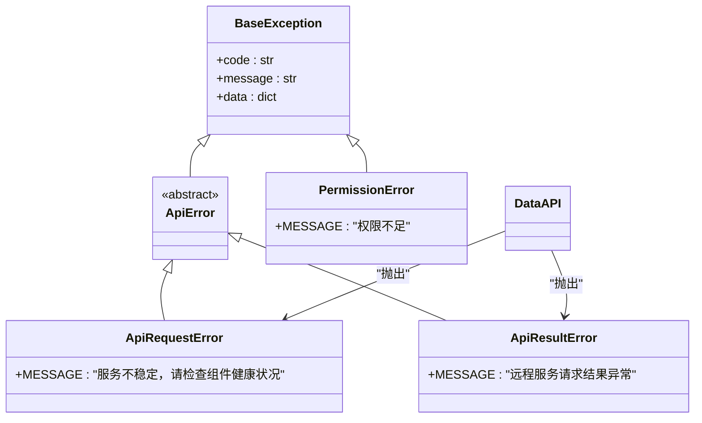

# 业务管理

<cite>
**本文档引用的文件**
- [cc.py](file://bklog/apps/api/modules/cc.py)
- [cc.py](file://bklog/apps/log_commons/cc.py)
- [utils.py](file://bklog/apps/api/modules/utils.py)
- [utils.py](file://bklog/bkm_space/utils.py)
- [base.py](file://bklog/apps/api/base.py)
- [bizs_views.py](file://bklog/apps/log_search/views/bizs_views.py)
- [exceptions.py](file://bklog/apps/exceptions.py)
- [drf.py](file://bklog/apps/iam/handlers/drf.py)
</cite>

## 目录
1. [业务列表查询机制](#业务列表查询机制)
2. [业务属性过滤与字段指定](#业务属性过滤与字段指定)
3. [获取业务维护者](#获取业务维护者)
4. [非蓝鲸业务场景下的ID转换](#非蓝鲸业务场景下的ID转换)
5. [分页查询机制](#分页查询机制)
6. [权限校验机制](#权限校验机制)
7. [错误处理机制](#错误处理机制)

## 业务列表查询机制

业务列表查询通过 `CCApi.get_app_list` 接口实现，该接口封装了对配置平台（CMDB）的调用。接口通过POST方法访问CMDB的业务搜索API，支持通过 `biz_property_filter` 条件过滤和 `fields` 参数指定返回字段。

`get_app_list` 接口在初始化时配置了缓存时间为60秒，使用超级用户权限调用，并在请求前通过 `get_supplier_account_before` 函数处理供应商账户信息。接口的URL根据是否使用API网关进行构建，确保在不同部署环境下都能正确访问。

**Section sources**
- [cc.py](file://bklog/apps/api/modules/cc.py#L74-L84)

## 业务属性过滤与字段指定

### 业务属性过滤 (biz_property_filter)

`biz_property_filter` 参数用于过滤业务属性，其结构包含 `condition` 和 `rules` 两个主要部分。`condition` 指定过滤条件的逻辑关系，支持 "AND" 和 "OR" 操作。`rules` 是一个规则列表，每个规则包含 `field`、`operator` 和 `value` 三个字段。

**Diagram sources**
- [cc.py](file://bklog/apps/api/modules/cc.py#L17-L25)
- [cc.py](file://bklog/apps/log_commons/cc.py#L17-L26)

### 字段指定 (fields)

`fields` 参数用于指定需要返回的业务字段。这是一个字符串列表，包含需要查询的业务属性ID，如 `bk_biz_maintainer`、`bk_biz_developer` 等。通过指定字段，可以减少网络传输数据量，提高查询效率。

**Diagram sources**
- [cc.py](file://bklog/apps/api/modules/cc.py#L17-L28)
- [cc.py](file://bklog/apps/log_commons/cc.py#L17-L28)

**Section sources**
- [cc.py](file://bklog/apps/api/modules/cc.py#L17-L28)
- [cc.py](file://bklog/apps/log_commons/cc.py#L17-L28)

## 获取业务维护者

获取业务维护者 (`bk_biz_maintainer`) 的实现通过 `get_maintainers` 函数完成。该函数首先将 `space_uid` 转换为 `bk_biz_id`，然后使用 `CCApi.get_app_list` 接口查询业务信息。

**Diagram sources**
- [cc.py](file://bklog/apps/log_commons/cc.py#L8-L36)
- [utils.py](file://bklog/bkm_space/utils.py#L8-L34)
- [utils.py](file://bklog/apps/api/modules/utils.py#L36-L46)

**Section sources**
- [cc.py](file://bklog/apps/log_commons/cc.py#L8-L36)

## 非蓝鲸业务场景下的ID转换

在非蓝鲸业务场景下，通过 `get_non_bkcc_space_related_bkcc_biz_id` 函数进行业务ID转换。该函数首先将负数的业务ID转换为空间唯一标识（space_uid），然后查询该空间关联的蓝鲸业务。

此转换逻辑在 `adapt_non_bkcc` 函数中被调用，该函数作为请求前的钩子函数，在调用CMDB接口前自动处理非蓝鲸业务ID的转换。

**Diagram sources**
- [utils.py](file://bklog/apps/api/modules/utils.py#L62-L70)
- [utils.py](file://bklog/apps/api/modules/utils.py#L36-L46)
- [utils.py](file://bklog/bkm_space/utils.py#L37-L56)

**Section sources**
- [utils.py](file://bklog/apps/api/modules/utils.py#L62-L70)

## 分页查询机制

分页查询机制通过 `DataAPI` 类的 `pagination_style` 参数配置，支持 `PageNumberPagination` 和 `LimitOffsetPagination` 两种分页方式。在 `get_app_list` 接口中，默认使用 `LimitOffsetPagination` 方式。

分页参数通常包含 `start` 和 `limit` 字段，其中 `start` 表示起始位置，`limit` 表示每页数量。CMDB接口会根据这些参数返回相应范围的业务数据。

**Diagram sources**
- [base.py](file://bklog/apps/api/base.py#L196-L200)
- [cc.py](file://bklog/apps/api/modules/cc.py#L83)

## 权限校验机制

权限校验通过IAM（身份和访问管理）系统实现，主要在 `BusinessActionPermission` 和 `ViewBusinessPermission` 类中定义。系统使用基于角色的访问控制（RBAC）模型，确保用户只能访问其有权限的业务资源。

权限校验在视图的 `get_permissions` 方法中配置，对于非列表操作通常需要 `VIEW_BUSINESS` 权限。

**Diagram sources**
- [drf.py](file://bklog/apps/iam/handlers/drf.py#L76-L111)
- [bizs_views.py](file://bklog/apps/log_search/views/bizs_views.py#L48-L51)

**Section sources**
- [drf.py](file://bklog/apps/iam/handlers/drf.py#L76-L111)

## 错误处理机制

错误处理机制通过异常层次结构实现，定义了多种异常类型来处理不同的错误场景。系统使用 `ApiRequestError` 处理API请求错误，`ApiResultError` 处理API结果异常，`PermissionError` 处理权限不足等情况。

在 `DataAPI` 类中，当请求失败或结果不成功时，会根据具体情况抛出相应的异常。系统还实现了重试机制，对于可恢复的错误会自动重试。

**Diagram sources**
- [exceptions.py](file://bklog/apps/exceptions.py#L80-L117)
- [base.py](file://bklog/apps/api/base.py#L312-L315)

**Section sources**
- [exceptions.py](file://bklog/apps/exceptions.py#L80-L117)