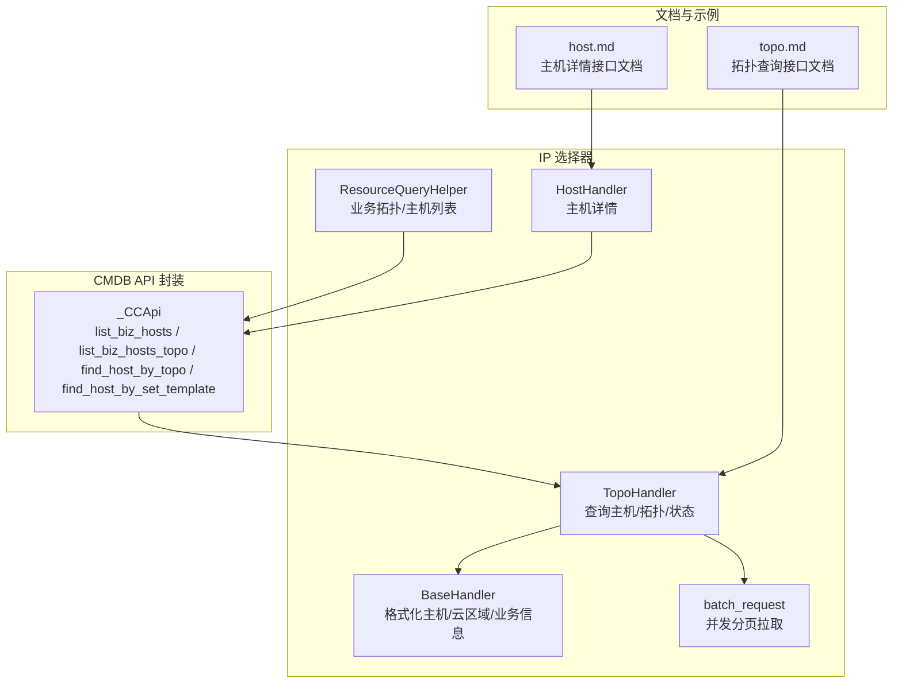
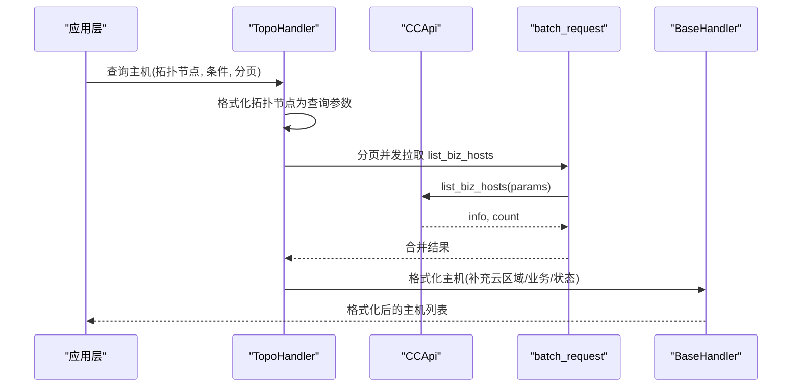
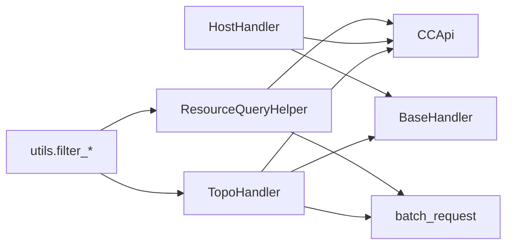

# 主机管理

<cite>
**本文引用的文件**
- [cc.py](file://bklog/apps/api/modules/cc.py)
- [utils.py](file://bklog/apps/api/modules/utils.py)
- [resource.py](file://bklog/bkm_ipchooser/query/resource.py)
- [topo_handler.py](file://bklog/bkm_ipchooser/handlers/topo_handler.py)
- [base.py](file://bklog/bkm_ipchooser/handlers/base.py)
- [host_handler.py](file://bklog/bkm_ipchooser/handlers/host_handler.py)
- [batch_request.py](file://bklog/bkm_ipchooser/tools/batch_request.py)
- [topo.md](file://bklog/bkm_ipchooser/docs/apidocs/topo.md)
- [host.md](file://bklog/bkm_ipchooser/docs/apidocs/host.md)
- [explorer.py](file://bklog/apps/log_extract/handlers/explorer.py)
- [biz.py](file://bklog/apps/log_search/handlers/biz.py)
- [ipchooser.py](file://bklog/apps/utils/ipchooser.py)
</cite>

## 目录
1. [简介](#简介)
2. [项目结构](#项目结构)
3. [核心组件](#核心组件)
4. [架构总览](#架构总览)
5. [详细组件分析](#详细组件分析)
6. [依赖分析](#依赖分析)
7. [性能考量](#性能考量)
8. [故障排查指南](#故障排查指南)
9. [结论](#结论)
10. [附录](#附录)

## 简介
本文件围绕主机管理能力，系统性介绍以下接口与流程：
- list_biz_hosts：查询业务下的主机列表
- list_biz_hosts_topo：查询业务下的主机及其拓扑关系
- find_host_by_topo：按拓扑节点查询主机
- find_host_by_set_template：按集群模板查询主机
- get_host_base_info：获取主机基础信息（通过IP选择器详情接口）

并结合 IP 选择器与 CMDB API 的封装，说明主机定位、批量操作与属性查询的最佳实践。

## 项目结构
主机管理相关代码主要分布在如下模块：
- CMDB API 封装：apps/api/modules/cc.py
- CMDB 接口增强与过滤：apps/api/modules/utils.py
- IP 选择器查询与格式化：bkm_ipchooser/handlers/*、bkm_ipchooser/query/resource.py
- 批量请求工具：bkm_ipchooser/tools/batch_request.py
- 文档与示例：bkm_ipchooser/docs/apidocs/*

图表来源
- [cc.py](file://bklog/apps/api/modules/cc.py#L144-L280)
- [topo_handler.py](file://bklog/bkm_ipchooser/handlers/topo_handler.py#L102-L178)
- [base.py](file://bklog/bkm_ipchooser/handlers/base.py#L51-L79)
- [host_handler.py](file://bklog/bkm_ipchooser/handlers/host_handler.py#L110-L135)
- [resource.py](file://bklog/bkm_ipchooser/query/resource.py#L33-L121)
- [batch_request.py](file://bklog/bkm_ipchooser/tools/batch_request.py#L40-L96)
- [topo.md](file://bklog/bkm_ipchooser/docs/apidocs/topo.md#L173-L240)
- [host.md](file://bklog/bkm_ipchooser/docs/apidocs/host.md#L75-L89)

章节来源
- [cc.py](file://bklog/apps/api/modules/cc.py#L144-L280)
- [topo_handler.py](file://bklog/bkm_ipchooser/handlers/topo_handler.py#L102-L178)
- [resource.py](file://bklog/bkm_ipchooser/query/resource.py#L33-L121)

## 核心组件
- CMDB 接口封装（_CCApi）：提供 list_biz_hosts、list_biz_hosts_topo、find_host_by_topo、find_host_by_set_template 等接口声明与多租户参数注入。
- IP 选择器处理器（TopoHandler）：负责将拓扑节点转换为查询参数，分页并发拉取主机，补充 Agent 状态与云区域名称，并格式化输出。
- 主机详情处理器（HostHandler）：根据 host_id 或 ip+cloud_id 组合构造查询规则，调用底层接口获取主机详情。
- 资源查询助手（ResourceQueryHelper）：封装业务拓扑树、主机拓扑关系、业务主机列表的批量拉取逻辑。
- 批量请求工具（batch_request）：统一处理分页、并发、限流与拆参策略，提升大规模数据拉取效率。

章节来源
- [cc.py](file://bklog/apps/api/modules/cc.py#L144-L280)
- [topo_handler.py](file://bklog/bkm_ipchooser/handlers/topo_handler.py#L102-L178)
- [host_handler.py](file://bklog/bkm_ipchooser/handlers/host_handler.py#L110-L135)
- [resource.py](file://bklog/bkm_ipchooser/query/resource.py#L33-L121)
- [batch_request.py](file://bklog/bkm_ipchooser/tools/batch_request.py#L40-L96)

## 架构总览
主机管理的整体调用链路如下：
- 应用层通过 TopoHandler 或 HostHandler 发起查询
- TopoHandler 将拓扑节点转换为 CMDB 查询参数，调用 list_biz_hosts 或 list_biz_hosts_topo
- 若需主机详情，HostHandler 构造 host_property_filter 条件后调用 list_biz_hosts
- ResourceQueryHelper 提供业务拓扑树与主机拓扑关系的辅助查询
- 批量请求工具负责并发分页与拆参，确保大范围查询的稳定性与性能

图表来源
- [topo_handler.py](file://bklog/bkm_ipchooser/handlers/topo_handler.py#L102-L178)
- [batch_request.py](file://bklog/bkm_ipchooser/tools/batch_request.py#L40-L96)
- [base.py](file://bklog/bkm_ipchooser/handlers/base.py#L51-L79)

## 详细组件分析

### list_biz_hosts 与 list_biz_hosts_topo
- list_biz_hosts：查询业务下的主机列表，支持字段选择、分页与主机属性过滤。
- list_biz_hosts_topo：在 list_biz_hosts 基础上，同时返回主机与其拓扑关系，便于前端渲染拓扑树与主机绑定。

最佳实践
- 使用字段白名单控制返回字段大小，减少网络与序列化开销
- 对于大范围查询，配合分页与并发拉取，避免单次请求过大
- 在需要拓扑信息时优先使用 list_biz_hosts_topo，减少二次查询

章节来源
- [cc.py](file://bklog/apps/api/modules/cc.py#L144-L172)
- [utils.py](file://bklog/apps/api/modules/utils.py#L277-L344)
- [explorer.py](file://bklog/apps/log_extract/handlers/explorer.py#L636-L646)

### find_host_by_topo 与 find_host_by_set_template
- find_host_by_topo：按拓扑节点（如 set/module）查询其包含的主机，适合“从拓扑到主机”的定位场景
- find_host_by_set_template：按集群模板查询主机，适合模板驱动的主机批量定位

最佳实践
- 结合拓扑树与节点类型判断，合理选择查询入口
- 对模板类查询，建议先获取模板列表，再按模板 ID 过滤

章节来源
- [cc.py](file://bklog/apps/api/modules/cc.py#L220-L241)
- [cc.py](file://bklog/apps/api/modules/cc.py#L272-L280)

### get_host_base_info（主机详情）
- 通过 IP 选择器的 details 接口，根据 host_id 或 ip+cloud_id 组合获取主机基础信息
- 该流程由 HostHandler 统一封装，自动构造 host_property_filter 规则

最佳实践
- 优先使用 host_id 查询，若无则使用 ip+cloud_id 组合
- 对批量详情查询，建议合并为 OR 规则，减少多次往返

章节来源
- [host_handler.py](file://bklog/bkm_ipchooser/handlers/host_handler.py#L110-L135)
- [host.md](file://bklog/bkm_ipchooser/docs/apidocs/host.md#L75-L89)

### 主机定位与拓扑关系
- 拓扑树构建：ResourceQueryHelper 提供业务拓扑树与空闲机拓扑的组合
- 主机拓扑关系：通过 find_host_topo_relation 获取主机与模块的映射，用于统计与填充

最佳实践
- 先获取业务拓扑树，再按节点筛选主机
- 使用主机拓扑关系进行统计或缓存，降低重复查询成本

章节来源
- [resource.py](file://bklog/bkm_ipchooser/query/resource.py#L33-L67)
- [resource.py](file://bklog/bkm_ipchooser/query/resource.py#L70-L76)

### 批量操作与属性查询
- 批量请求：batch_request 统一处理并发、分页与拆参，支持大范围查询
- 属性查询：通过 search_object_attribute 获取主机属性元数据，指导字段选择与过滤

最佳实践
- 对模块 ID 超过阈值的场景，启用 split_params 自动拆分参数
- 使用 host_property_filter 组合 AND/OR 规则，实现灵活属性查询
- 对频繁查询的拓扑关系进行缓存，避免重复拉取

章节来源
- [batch_request.py](file://bklog/bkm_ipchooser/tools/batch_request.py#L40-L96)
- [batch_request.py](file://bklog/bkm_ipchooser/tools/batch_request.py#L126-L146)
- [biz.py](file://bklog/apps/log_search/handlers/biz.py#L1030-L1053)
- [ipchooser.py](file://bklog/apps/utils/ipchooser.py#L277-L289)

## 依赖分析
- TopoHandler 依赖 CMDB 接口（list_biz_hosts/list_biz_hosts_topo）、批量请求工具与格式化处理器
- HostHandler 依赖 CMDB 接口与 BaseHandler 的格式化能力
- ResourceQueryHelper 依赖 CMDB 接口与批量请求工具，提供业务拓扑与主机关系的辅助查询
- utils 中的过滤函数用于清洗异常 IP 与空 IP 主机，保障下游数据质量

图表来源
- [topo_handler.py](file://bklog/bkm_ipchooser/handlers/topo_handler.py#L102-L178)
- [host_handler.py](file://bklog/bkm_ipchooser/handlers/host_handler.py#L110-L135)
- [resource.py](file://bklog/bkm_ipchooser/query/resource.py#L33-L121)
- [utils.py](file://bklog/apps/api/modules/utils.py#L277-L344)

章节来源
- [topo_handler.py](file://bklog/bkm_ipchooser/handlers/topo_handler.py#L102-L178)
- [host_handler.py](file://bklog/bkm_ipchooser/handlers/host_handler.py#L110-L135)
- [resource.py](file://bklog/bkm_ipchooser/query/resource.py#L33-L121)
- [utils.py](file://bklog/apps/api/modules/utils.py#L277-L344)

## 性能考量
- 并发与分页：批量请求工具默认并发数与分页大小可调，建议根据业务规模与 CMDB 限流策略调整
- 拆参优化：当模块 ID 数量超过阈值时自动拆分参数，避免单次请求过大
- 缓存策略：拓扑关系与拓扑树可缓存，减少重复查询
- 字段裁剪：仅返回必要字段，降低网络与序列化开销
- 过滤前置：在上游阶段剔除空 IP 与异常 IP，减少无效数据传输

章节来源
- [batch_request.py](file://bklog/bkm_ipchooser/tools/batch_request.py#L40-L96)
- [utils.py](file://bklog/apps/api/modules/utils.py#L277-L344)

## 故障排查指南
- 空 IP/异常 IP：使用 utils 中的过滤函数，确保返回数据中不含空 IP 或异常格式
- 超出选择范围：当模块 ID 数量超过阈值时抛出异常，需拆分参数或缩小范围
- 无拓扑数据：业务拓扑不存在时抛出异常，需检查业务是否存在有效拓扑
- 详情查询失败：确认 host_id 或 ip+cloud_id 组合是否正确，或尝试 OR 规则合并

章节来源
- [utils.py](file://bklog/apps/api/modules/utils.py#L277-L344)
- [topo_handler.py](file://bklog/bkm_ipchooser/handlers/topo_handler.py#L322-L337)
- [resource.py](file://bklog/bkm_ipchooser/query/resource.py#L56-L66)

## 结论
通过 CMDB API 封装与 IP 选择器处理器的协同，系统提供了从“拓扑到主机”、“模板到主机”、“主机到详情”的完整主机管理能力。结合批量请求工具与过滤增强，可在保证性能的同时满足复杂场景下的主机定位与属性查询需求。

## 附录
- 接口文档参考
  - 拓扑查询接口文档：[topo.md](file://bklog/bkm_ipchooser/docs/apidocs/topo.md#L173-L240)
  - 主机详情接口文档：[host.md](file://bklog/bkm_ipchooser/docs/apidocs/host.md#L75-L89)