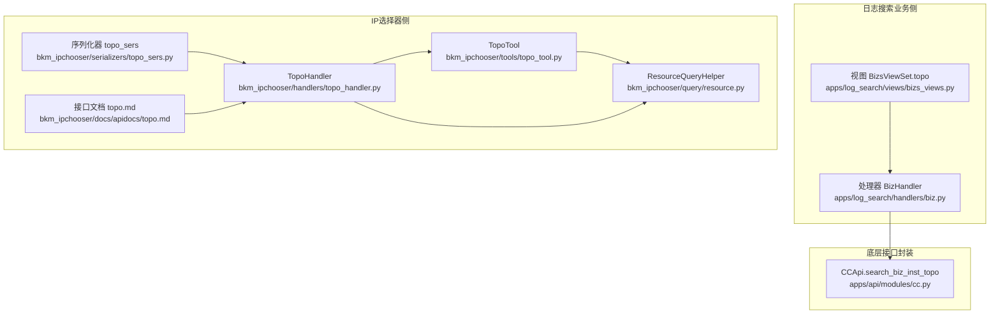
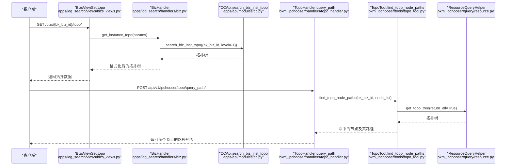
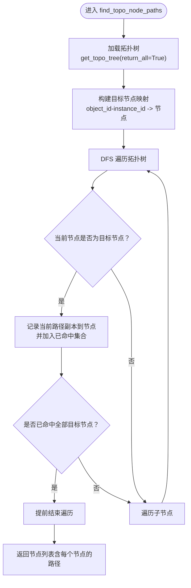
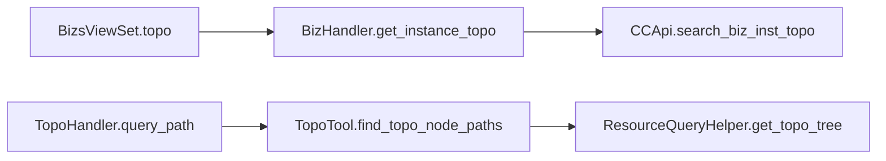

# 拓扑管理

<cite>
**本文引用的文件**
- [apps/log_search/handlers/biz.py](file://apps/log_search/handlers/biz.py)
- [apps/log_search/views/bizs_views.py](file://apps/log_search/views/bizs_views.py)
- [bkm_ipchooser/handlers/topo_handler.py](file://bkm_ipchooser/handlers/topo_handler.py)
- [bkm_ipchooser/tools/topo_tool.py](file://bkm_ipchooser/tools/topo_tool.py)
- [bkm_ipchooser/query/resource.py](file://bkm_ipchooser/query/resource.py)
- [bkm_ipchooser/serializers/topo_sers.py](file://bkm_ipchooser/serializers/topo_sers.py)
- [bkm_ipchooser/docs/apidocs/topo.md](file://bkm_ipchooser/docs/apidocs/topo.md)
- [apps/api/modules/cc.py](file://apps/api/modules/cc.py)
</cite>

## 目录
1. [简介](#简介)
2. [项目结构](#项目结构)
3. [核心组件](#核心组件)
4. [架构总览](#架构总览)
5. [详细组件分析](#详细组件分析)
6. [依赖分析](#依赖分析)
7. [性能考虑](#性能考虑)
8. [故障排查指南](#故障排查指南)
9. [结论](#结论)
10. [附录](#附录)

## 简介
本文件聚焦于“业务拓扑”能力，围绕以下目标展开：
- 说明 search_biz_inst_topo 接口查询业务 TOPO 结构的使用方法与返回数据结构
- 解释节点层级、实例关系与拓扑路径的表示方式
- 结合 find_topo_node_paths 接口，说明如何获取拓扑节点的完整路径信息
- 提供解析多层级拓扑数据的思路与前端树形展示的数据处理逻辑建议

## 项目结构
围绕拓扑管理的关键模块分布如下：
- 日志搜索业务侧：提供业务拓扑查询与格式化、路径映射、静态拓扑补空闲机池等能力
- IP选择器侧：提供拓扑树构建、节点路径查询、主机查询等能力
- API封装：对底层 CC/CMDB 接口进行封装，统一对外暴露

图表来源
- [apps/log_search/views/bizs_views.py](file://apps/log_search/views/bizs_views.py#L106-L178)
- [apps/log_search/handlers/biz.py](file://apps/log_search/handlers/biz.py#L153-L188)
- [bkm_ipchooser/handlers/topo_handler.py](file://bkm_ipchooser/handlers/topo_handler.py#L63-L100)
- [bkm_ipchooser/tools/topo_tool.py](file://bkm_ipchooser/tools/topo_tool.py#L21-L45)
- [bkm_ipchooser/query/resource.py](file://bkm_ipchooser/query/resource.py#L56-L85)
- [bkm_ipchooser/serializers/topo_sers.py](file://bkm_ipchooser/serializers/topo_sers.py#L17-L27)
- [bkm_ipchooser/docs/apidocs/topo.md](file://bkm_ipchooser/docs/apidocs/topo.md#L100-L156)
- [apps/api/modules/cc.py](file://apps/api/modules/cc.py#L97-L104)

章节来源
- [apps/log_search/views/bizs_views.py](file://apps/log_search/views/bizs_views.py#L106-L178)
- [apps/log_search/handlers/biz.py](file://apps/log_search/handlers/biz.py#L153-L188)
- [bkm_ipchooser/handlers/topo_handler.py](file://bkm_ipchooser/handlers/topo_handler.py#L63-L100)
- [bkm_ipchooser/tools/topo_tool.py](file://bkm_ipchooser/tools/topo_tool.py#L21-L45)
- [bkm_ipchooser/query/resource.py](file://bkm_ipchooser/query/resource.py#L56-L85)
- [bkm_ipchooser/serializers/topo_sers.py](file://bkm_ipchooser/serializers/topo_sers.py#L17-L27)
- [bkm_ipchooser/docs/apidocs/topo.md](file://bkm_ipchooser/docs/apidocs/topo.md#L100-L156)
- [apps/api/modules/cc.py](file://apps/api/modules/cc.py#L97-L104)

## 核心组件
- search_biz_inst_topo 接口
  - 作用：查询业务实例拓扑，返回多层级节点树
  - 使用：由 BizHandler.get_biz_inst_topo 直接调用，或通过视图 BizsViewSet.topo 暴露
  - 关键参数：bk_biz_id、level=-1（表示拉取全量层级）
- find_topo_node_paths 接口
  - 作用：基于拓扑树，查找指定节点的完整路径（从根到该节点）
  - 使用：TopoTool.find_topo_node_paths 在拓扑树上进行深度优先搜索，记录命中节点的路径
- 节点与路径数据结构
  - 节点字段：bk_obj_id、bk_inst_id、bk_inst_name、child 等
  - 路径：由若干节点组成的有序列表，表示从根到目标节点的祖先链

章节来源
- [apps/api/modules/cc.py](file://apps/api/modules/cc.py#L97-L104)
- [apps/log_search/handlers/biz.py](file://apps/log_search/handlers/biz.py#L168-L188)
- [bkm_ipchooser/tools/topo_tool.py](file://bkm_ipchooser/tools/topo_tool.py#L21-L45)
- [bkm_ipchooser/handlers/topo_handler.py](file://bkm_ipchooser/handlers/topo_handler.py#L63-L100)

## 架构总览
下面的序列图展示了“业务拓扑查询”到“节点路径查询”的关键流程。

图表来源
- [apps/log_search/views/bizs_views.py](file://apps/log_search/views/bizs_views.py#L106-L178)
- [apps/log_search/handlers/biz.py](file://apps/log_search/handlers/biz.py#L153-L188)
- [apps/api/modules/cc.py](file://apps/api/modules/cc.py#L97-L104)
- [bkm_ipchooser/handlers/topo_handler.py](file://bkm_ipchooser/handlers/topo_handler.py#L63-L100)
- [bkm_ipchooser/tools/topo_tool.py](file://bkm_ipchooser/tools/topo_tool.py#L21-L45)
- [bkm_ipchooser/query/resource.py](file://bkm_ipchooser/query/resource.py#L56-L85)

## 详细组件分析

### search_biz_inst_topo 接口与返回结构
- 接口来源
  - 视图层：BizsViewSet.topo 将请求参数校验后交由 BizHandler 处理
  - 处理层：BizHandler.get_instance_topo 调用 get_biz_inst_topo 并进行兼容性处理、中文名补全、空节点移除等
  - 底层封装：CCApi.search_biz_inst_topo 通过 DataAPI 封装调用
- 返回结构要点
  - 节点字段：bk_obj_id、bk_inst_id、bk_inst_name、child 等
  - 展示字段：name（用于前端渲染）
  - 层级：支持多层级嵌套，child 可能存在任意深度
  - 静态拓扑补充：当传入 instance_type=host 且 remove_empty_nodes=true 时，会移除空节点并填充主机信息
- 关键实现参考
  - 视图接口文档与示例：参见 [apps/log_search/views/bizs_views.py](file://apps/log_search/views/bizs_views.py#L106-L178)
  - 处理逻辑：参见 [apps/log_search/handlers/biz.py](file://apps/log_search/handlers/biz.py#L153-L188)
  - 底层封装：参见 [apps/api/modules/cc.py](file://apps/api/modules/cc.py#L97-L104)

章节来源
- [apps/log_search/views/bizs_views.py](file://apps/log_search/views/bizs_views.py#L106-L178)
- [apps/log_search/handlers/biz.py](file://apps/log_search/handlers/biz.py#L153-L188)
- [apps/api/modules/cc.py](file://apps/api/modules/cc.py#L97-L104)

### 节点层级、实例关系与拓扑路径
- 节点层级
  - 业务（biz）→ 集群（set）→ 模块（module）→ 主机（host）等，层级通过 child 字段串联
- 实例关系
  - 通过 bk_obj_id 与 bk_inst_id 唯一标识实例；父节点的 child 列表包含子节点
- 拓扑路径
  - 从根节点到目标节点的祖先链，通常以节点列表形式返回
  - 在 IP选择器侧，TopoTool.find_topo_node_paths 会在整棵树上进行 DFS，命中目标节点时记录当前路径

章节来源
- [bkm_ipchooser/tools/topo_tool.py](file://bkm_ipchooser/tools/topo_tool.py#L21-L45)
- [bkm_ipchooser/handlers/topo_handler.py](file://bkm_ipchooser/handlers/topo_handler.py#L63-L100)

### find_topo_node_paths 接口与使用
- 接口用途
  - 输入：业务 ID 与节点列表（object_id + instance_id）
  - 输出：每个节点对应的完整路径（从根到该节点）
- 实现要点
  - 从 ResourceQueryHelper.get_topo_tree 获取完整拓扑树
  - 使用 DFS 遍历，命中目标节点时记录当前路径副本
  - 命中全部目标节点后可提前结束遍历
- 返回数据
  - 每个节点携带其路径（path），路径元素包含对象类型、实例 ID、实例名称等

章节来源
- [bkm_ipchooser/handlers/topo_handler.py](file://bkm_ipchooser/handlers/topo_handler.py#L63-L100)
- [bkm_ipchooser/tools/topo_tool.py](file://bkm_ipchooser/tools/topo_tool.py#L21-L45)
- [bkm_ipchooser/docs/apidocs/topo.md](file://bkm_ipchooser/docs/apidocs/topo.md#L100-L156)

### 解析多层级拓扑数据与前端树形展示
- 解析思路
  - 递归遍历 child 字段，逐层构建树结构
  - 为每个节点补充前端展示字段（如 name），并可附加 count、meta 等
- 前端树形处理建议
  - 使用“展开/折叠”控制节点可见性
  - 节点点击时可触发路径查询（query_path）以高亮路径
  - 节点可带计数（count）用于展示主机数量等
- 参考接口文档
  - trees/query_hosts/query_host_id_infos/agent_statistics 等接口文档，了解返回字段与示例

章节来源
- [bkm_ipchooser/handlers/topo_handler.py](file://bkm_ipchooser/handlers/topo_handler.py#L14-L55)
- [bkm_ipchooser/docs/apidocs/topo.md](file://bkm_ipchooser/docs/apidocs/topo.md#L1-L96)
- [bkm_ipchooser/docs/apidocs/topo.md](file://bkm_ipchooser/docs/apidocs/topo.md#L158-L225)
- [bkm_ipchooser/docs/apidocs/topo.md](file://bkm_ipchooser/docs/apidocs/topo.md#L228-L334)

### 代码级流程图（节点路径查找）

图表来源
- [bkm_ipchooser/tools/topo_tool.py](file://bkm_ipchooser/tools/topo_tool.py#L21-L45)
- [bkm_ipchooser/query/resource.py](file://bkm_ipchooser/query/resource.py#L56-L85)

## 依赖分析
- 组件耦合
  - BizsViewSet.topo 依赖 BizHandler.get_instance_topo，后者依赖 CCApi.search_biz_inst_topo
  - TopoHandler.query_path 依赖 TopoTool.find_topo_node_paths，后者依赖 ResourceQueryHelper.get_topo_tree
- 外部依赖
  - CC/CMDB 的 search_biz_inst_topo 接口封装在 DataAPI 中
- 潜在风险
  - 深度遍历的复杂度与拓扑规模相关，建议在命中全部目标节点后提前终止
  - 静态拓扑场景下，空节点移除与主机填充会影响路径与计数

图表来源
- [apps/log_search/views/bizs_views.py](file://apps/log_search/views/bizs_views.py#L106-L178)
- [apps/log_search/handlers/biz.py](file://apps/log_search/handlers/biz.py#L153-L188)
- [apps/api/modules/cc.py](file://apps/api/modules/cc.py#L97-L104)
- [bkm_ipchooser/handlers/topo_handler.py](file://bkm_ipchooser/handlers/topo_handler.py#L63-L100)
- [bkm_ipchooser/tools/topo_tool.py](file://bkm_ipchooser/tools/topo_tool.py#L21-L45)
- [bkm_ipchooser/query/resource.py](file://bkm_ipchooser/query/resource.py#L56-L85)

章节来源
- [apps/log_search/views/bizs_views.py](file://apps/log_search/views/bizs_views.py#L106-L178)
- [apps/log_search/handlers/biz.py](file://apps/log_search/handlers/biz.py#L153-L188)
- [apps/api/modules/cc.py](file://apps/api/modules/cc.py#L97-L104)
- [bkm_ipchooser/handlers/topo_handler.py](file://bkm_ipchooser/handlers/topo_handler.py#L63-L100)
- [bkm_ipchooser/tools/topo_tool.py](file://bkm_ipchooser/tools/topo_tool.py#L21-L45)
- [bkm_ipchooser/query/resource.py](file://bkm_ipchooser/query/resource.py#L56-L85)

## 性能考虑
- 遍历优化
  - 命中全部目标节点后提前结束 DFS，避免无谓遍历
  - 使用路径副本记录，避免重复构造路径
- 缓存策略
  - BizHandler.get_biz_inst_topo 对业务拓扑做了缓存装饰
  - TopoTool.get_topo_tree_with_count 对主机拓扑关系做了缓存
- 分页与限制
  - 主机查询支持分页与参数拆分，避免超限
  - 静态拓扑场景下可移除空节点以降低渲染成本

章节来源
- [apps/log_search/handlers/biz.py](file://apps/log_search/handlers/biz.py#L168-L188)
- [bkm_ipchooser/tools/topo_tool.py](file://bkm_ipchooser/tools/topo_tool.py#L62-L85)
- [bkm_ipchooser/handlers/topo_handler.py](file://bkm_ipchooser/handlers/topo_handler.py#L276-L344)

## 故障排查指南
- 业务拓扑为空
  - 检查 CCApi.search_biz_inst_topo 返回是否为空
  - 确认业务 ID 是否正确，是否存在内部空闲机池并被正确拼接
- 节点路径为空
  - 确认传入的 object_id/instance_id 是否存在于拓扑树中
  - 确认 get_topo_tree 是否正确返回了包含空闲机池的完整拓扑树
- 主机查询异常
  - 检查模块/集群 ID 数量是否超过限制，必要时启用参数拆分
  - 检查主机字段过滤条件是否合理

章节来源
- [apps/log_search/handlers/biz.py](file://apps/log_search/handlers/biz.py#L168-L188)
- [bkm_ipchooser/handlers/topo_handler.py](file://bkm_ipchooser/handlers/topo_handler.py#L276-L344)
- [bkm_ipchooser/query/resource.py](file://bkm_ipchooser/query/resource.py#L56-L85)

## 结论
- search_biz_inst_topo 提供了业务 TOPO 的全量层级结构，适合用于前端树形展示与路径查询
- find_topo_node_paths 基于拓扑树进行 DFS，能够高效返回节点的完整祖先链
- 在静态拓扑场景下，可通过移除空节点与填充主机信息提升用户体验
- 建议在路径查询与主机查询中结合缓存与分页策略，确保大规模拓扑场景下的性能与稳定性

## 附录
- 接口文档与示例
  - 业务拓扑接口文档与示例：参见 [apps/log_search/views/bizs_views.py](file://apps/log_search/views/bizs_views.py#L106-L178)
  - 节点路径查询接口文档与示例：参见 [bkm_ipchooser/docs/apidocs/topo.md](file://bkm_ipchooser/docs/apidocs/topo.md#L100-L156)
  - 拓扑树构建与主机查询接口文档与示例：参见 [bkm_ipchooser/docs/apidocs/topo.md](file://bkm_ipchooser/docs/apidocs/topo.md#L1-L96)、[bkm_ipchooser/docs/apidocs/topo.md](file://bkm_ipchooser/docs/apidocs/topo.md#L158-L225)、[bkm_ipchooser/docs/apidocs/topo.md](file://bkm_ipchooser/docs/apidocs/topo.md#L228-L334)