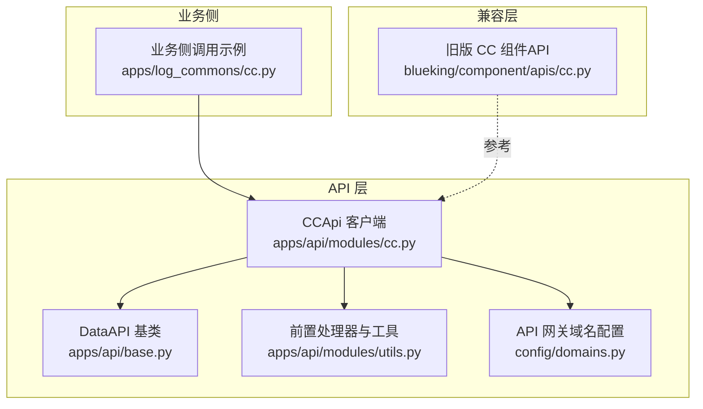
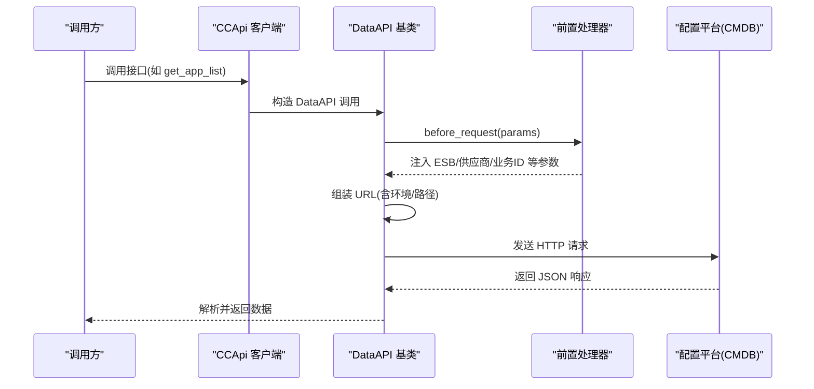
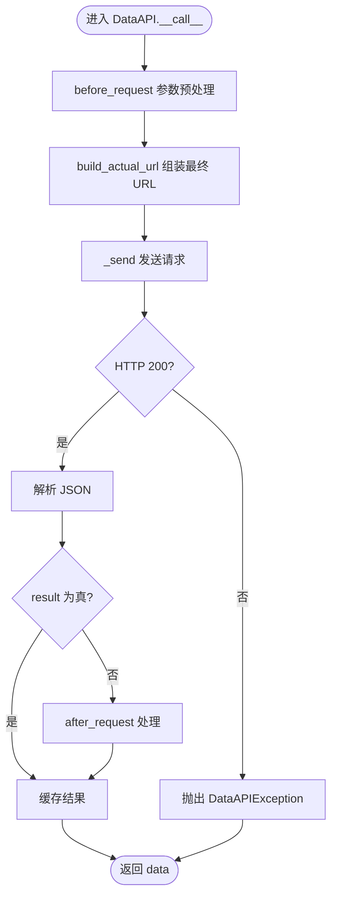
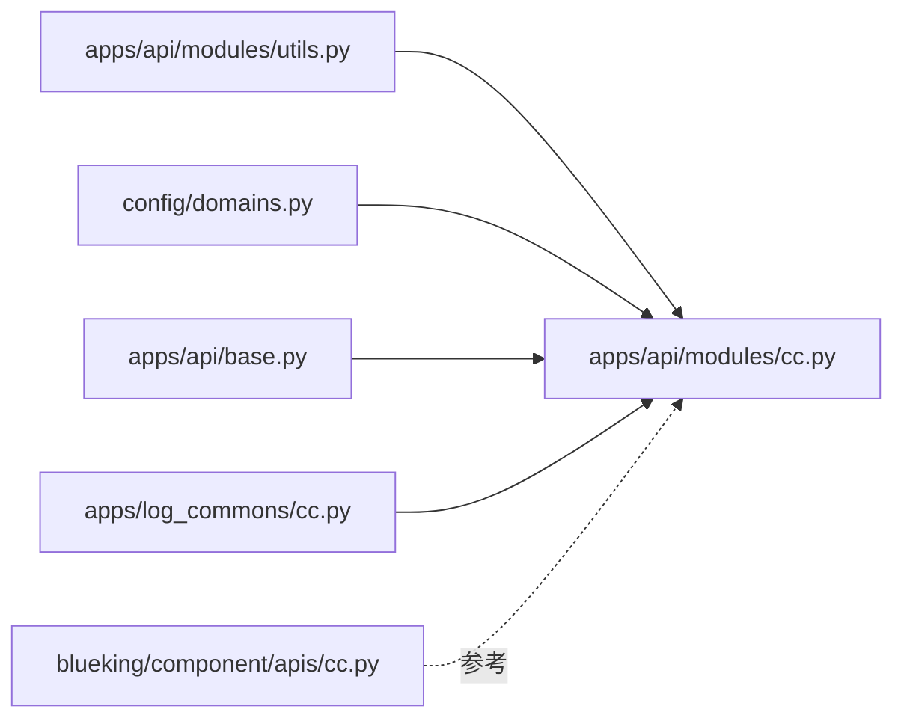

# 配置平台(CC)集成

<cite>
**本文引用的文件**
- [apps/api/modules/cc.py](file://bklog/apps/api/modules/cc.py)
- [apps/api/base.py](file://bklog/apps/api/base.py)
- [apps/api/modules/utils.py](file://bklog/apps/api/modules/utils.py)
- [config/domains.py](file://config/domains.py)
- [apps/log_commons/cc.py](file://apps/log_commons/cc.py)
- [blueking/component/apis/cc.py](file://bklog/blueking/component/apis/cc.py)
</cite>

## 目录
1. [简介](#简介)
2. [项目结构](#项目结构)
3. [核心组件](#核心组件)
4. [架构总览](#架构总览)
5. [详细组件分析](#详细组件分析)
6. [依赖分析](#依赖分析)
7. [性能考虑](#性能考虑)
8. [故障排查指南](#故障排查指南)
9. [结论](#结论)
10. [附录](#附录)

## 简介
本文件面向配置平台（蓝鲸配置平台 CC）集成，系统性说明本项目与 CC 的对接机制与关键能力，包括：
- 业务列表查询
- 业务拓扑结构获取
- 主机信息查询与同步
- 模块与集群管理相关接口
- 关键接口 get_app_list、search_biz_inst_topo、list_biz_hosts 的调用方式、参数说明与返回数据结构
- _build_url 方法如何根据 APIGW 配置动态生成请求地址
- get_supplier_account_before 等前置处理器如何处理供应商账户信息
- 在业务逻辑中如何调用 CCApi 进行拓扑数据同步与主机查询

## 项目结构
与 CC 集成相关的核心代码位于以下模块：
- apps/api/modules/cc.py：定义 CC API 客户端，封装业务、拓扑、主机、模块、集群等接口
- apps/api/base.py：DataAPI 基类，负责统一请求发送、鉴权、重试、缓存、日志等
- apps/api/modules/utils.py：通用前置处理器与工具函数（如供应商账户、ESB 信息注入、业务ID适配）
- config/domains.py：加载各平台 API 网关根域名配置
- apps/log_commons/cc.py：业务侧使用 CCApi 的示例（如查询业务维护人）
- blueking/component/apis/cc.py：旧版 ComponentAPI 定义（兼容或参考）

图表来源
- [apps/api/modules/cc.py](file://bklog/apps/api/modules/cc.py#L60-L317)
- [apps/api/base.py](file://bklog/apps/api/base.py#L191-L600)
- [apps/api/modules/utils.py](file://bklog/apps/api/modules/utils.py#L1-L200)
- [config/domains.py](file://config/domains.py#L1-L83)
- [apps/log_commons/cc.py](file://apps/log_commons/cc.py#L1-L37)
- [blueking/component/apis/cc.py](file://bklog/blueking/component/apis/cc.py#L1-L736)

章节来源
- [apps/api/modules/cc.py](file://bklog/apps/api/modules/cc.py#L60-L317)
- [apps/api/base.py](file://bklog/apps/api/base.py#L191-L600)
- [apps/api/modules/utils.py](file://bklog/apps/api/modules/utils.py#L1-L200)
- [config/domains.py](file://config/domains.py#L1-L83)
- [apps/log_commons/cc.py](file://apps/log_commons/cc.py#L1-L37)
- [blueking/component/apis/cc.py](file://bklog/blueking/component/apis/cc.py#L1-L736)

## 核心组件
- CCApi 客户端：集中定义 CC 的各类接口，如业务查询、拓扑查询、主机查询、模块/集群查询、动态分组、服务模板等
- DataAPI 基类：封装统一的请求发送、鉴权、重试、缓存、日志、分页批量请求等能力
- 前置处理器：如 get_supplier_account_before、add_supplier_account_and_set_id_before、filter_bk_field_prefix_before 等，负责注入 ESB 信息、供应商账户、参数过滤等
- 域名配置：通过 config.domains 加载 CC API 网关根域名，支持 APIGW 与旧版直连两种模式

章节来源
- [apps/api/modules/cc.py](file://bklog/apps/api/modules/cc.py#L60-L317)
- [apps/api/base.py](file://bklog/apps/api/base.py#L191-L600)
- [apps/api/modules/utils.py](file://bklog/apps/api/modules/utils.py#L1-L200)
- [config/domains.py](file://config/domains.py#L1-L83)

## 架构总览
CC 集成采用“客户端 + 基类 + 前置处理器 + 配置”的分层设计：
- 客户端层：CCApi 定义具体接口，使用 DataAPI 包装
- 基类层：DataAPI 统一处理请求、鉴权、缓存、重试、日志
- 处理器层：前置处理器在请求前注入必要参数（如 ESB 用户、供应商账户、业务ID适配）
- 配置层：根据 USE_APIGW 选择 APIGW 或旧版直连路径；PAAS_API_HOST/ENVIRONMENT 组装新路径

图表来源
- [apps/api/modules/cc.py](file://bklog/apps/api/modules/cc.py#L60-L317)
- [apps/api/base.py](file://bklog/apps/api/base.py#L277-L600)
- [apps/api/modules/utils.py](file://bklog/apps/api/modules/utils.py#L1-L200)

## 详细组件分析

### CCApi 客户端与关键接口
- 业务列表查询：get_app_list
- 业务拓扑查询：search_biz_inst_topo
- 主机查询：list_biz_hosts、list_biz_hosts_topo、list_hosts_without_biz、find_host_topo_relation、find_host_by_topo、list_host_total_mainline_topo
- 模块与集群：search_module、get_host_info、search_set、get_biz_internal_module、find_module_with_relation
- 动态分组与模板：search_dynamic_group、execute_dynamic_group、list_service_template、list_set_template、find_host_by_service_template、find_host_by_set_template
- 云区域与对象属性：search_cloud_area、search_object_attribute
- 拓扑路径：find_topo_node_paths

章节来源
- [apps/api/modules/cc.py](file://bklog/apps/api/modules/cc.py#L74-L317)

#### get_app_list（业务列表查询）
- 作用：查询业务列表
- 调用方式：CCApi.get_app_list(params, request_cookies=False)
- 参数要点：
  - params.biz_property_filter：业务属性过滤条件
  - params.fields：返回字段列表
  - params.no_request：后台/超级用户模式
- 返回数据结构（示意）：
  - result：布尔，请求是否成功
  - data/info：业务列表数组
  - data/info[].bk_biz_id、bk_biz_name、bk_biz_maintainer 等

章节来源
- [apps/api/modules/cc.py](file://bklog/apps/api/modules/cc.py#L74-L84)
- [apps/log_commons/cc.py](file://apps/log_commons/cc.py#L8-L37)

#### search_biz_inst_topo（业务拓扑查询）
- 作用：查询业务实例拓扑，显示各级节点
- 调用方式：CCApi.search_biz_inst_topo(params)
- 参数要点：
  - params：查询条件（如业务ID、对象ID等）
- 返回数据结构（示意）：
  - result：布尔
  - data：拓扑树/节点列表

章节来源
- [apps/api/modules/cc.py](file://bklog/apps/api/modules/cc.py#L97-L106)

#### list_biz_hosts（业务主机查询）
- 作用：查询某个业务下的主机
- 调用方式：CCApi.list_biz_hosts(params)
- 参数要点：
  - params：查询条件（如分页、主机属性过滤）
- 返回数据结构（示意）：
  - result：布尔
  - data/info：主机列表

章节来源
- [apps/api/modules/cc.py](file://bklog/apps/api/modules/cc.py#L145-L154)

#### 模块与集群管理
- 查询模块：search_module
- 查询集群：search_set
- 获取业务内部模块：get_biz_internal_module
- 模块与关系：find_module_with_relation
- 主机与拓扑关系：find_host_topo_relation

章节来源
- [apps/api/modules/cc.py](file://bklog/apps/api/modules/cc.py#L107-L136)

### _build_url 动态地址生成
- 作用：根据 USE_APIGW 与配置决定请求路径
- 逻辑：
  - 若 USE_APIGW 为真：拼接 PAAS_API_HOST/ENVIRONMENT/new_path
  - 否则：使用 CC_APIGATEWAY_ROOT_V2/old_path
- 影响范围：所有 CC 接口的 URL 组装均受此影响

章节来源
- [apps/api/modules/cc.py](file://bklog/apps/api/modules/cc.py#L67-L72)
- [config/domains.py](file://config/domains.py#L1-L83)

### 前置处理器与供应商账户
- get_supplier_account_before：
  - 注入 ESB 信息（bk_username/operator）
  - 适配非 CC 业务（将非 CC 业务映射为关联的 CC 业务）
  - 若设置 BK_SUPPLIER_ACCOUNT，则注入到请求参数
- add_supplier_account_and_set_id_before：
  - 在需要 bk_set_id 的接口中，确保参数包含 bk_set_id（默认 0）
- filter_bk_field_prefix_before：
  - 仅保留以 bk_ 开头的参数，剔除无关参数

章节来源
- [apps/api/modules/utils.py](file://bklog/apps/api/modules/utils.py#L1-L200)
- [apps/api/modules/cc.py](file://bklog/apps/api/modules/cc.py#L30-L58)

### DataAPI 统一处理流程
- 请求前：before_request 回调（注入 ESB/租户/供应商/业务ID）
- URL 组装：build_actual_url（替换 url_keys 占位符）
- 发送请求：_send（设置 X-Bkapi-Authorization、X-Bk-Tenant-Id、Content-Type 等）
- 结果处理：解析 JSON、after_request、缓存、日志
- 错误处理：异常捕获、重试、抛出统一错误

图表来源
- [apps/api/base.py](file://bklog/apps/api/base.py#L277-L600)

章节来源
- [apps/api/base.py](file://bklog/apps/api/base.py#L277-L600)

### 业务逻辑中的调用示例
- 查询业务维护人：通过 CCApi.get_app_list 获取业务信息，提取维护人字段
- 说明：调用时设置 request_cookies=False 与 no_request=True，走超级用户模式

章节来源
- [apps/log_commons/cc.py](file://apps/log_commons/cc.py#L8-L37)

## 依赖分析
- CCApi 依赖 DataAPI 提供统一请求能力
- CCApi 依赖前置处理器注入 ESB/供应商/业务ID
- CCApi 依赖 config.domains 提供 API 网关域名
- 业务侧通过 CCApi 调用 CC 接口，实现拓扑与主机数据同步

图表来源
- [apps/api/modules/cc.py](file://bklog/apps/api/modules/cc.py#L60-L317)
- [apps/api/base.py](file://bklog/apps/api/base.py#L191-L600)
- [apps/api/modules/utils.py](file://bklog/apps/api/modules/utils.py#L1-L200)
- [config/domains.py](file://config/domains.py#L1-L83)
- [apps/log_commons/cc.py](file://apps/log_commons/cc.py#L1-L37)
- [blueking/component/apis/cc.py](file://bklog/blueking/component/apis/cc.py#L1-L736)

章节来源
- [apps/api/modules/cc.py](file://bklog/apps/api/modules/cc.py#L60-L317)
- [apps/api/base.py](file://bklog/apps/api/base.py#L191-L600)
- [apps/api/modules/utils.py](file://bklog/apps/api/modules/utils.py#L1-L200)
- [config/domains.py](file://config/domains.py#L1-L83)
- [apps/log_commons/cc.py](file://apps/log_commons/cc.py#L1-L37)
- [blueking/component/apis/cc.py](file://bklog/blueking/component/apis/cc.py#L1-L736)

## 性能考虑
- 缓存：部分接口定义了 cache_time，DataAPI 内部会基于参数构建缓存键并缓存结果，减少重复请求
- 批量与分页：DataAPI 提供 batch_request 与 bulk_request，支持切片与分页并发拉取，降低单次请求压力
- 重试策略：可通过 DataApiRetryClass 自定义重试次数与等待区间，提升稳定性
- 超级用户模式：use_superuser=True 时自动关闭 cookies 透传并设置 no_request，避免权限问题与用户态开销

章节来源
- [apps/api/modules/cc.py](file://bklog/apps/api/modules/cc.py#L74-L120)
- [apps/api/base.py](file://bklog/apps/api/base.py#L633-L741)

## 故障排查指南
- 请求失败：DataAPI 在 raise_exception=True 时会抛出 ApiResultError，包含 message/code/errors
- HTTP 非 200：抛出 DataAPIException，并记录详细日志
- 返回格式非 JSON：抛出 DataAPIException，提示返回数据格式不正确
- 参数校验：before_request 中可能对参数进行过滤或补充（如仅保留以 bk_ 开头的参数）
- 供应商账户：若未设置 BK_SUPPLIER_ACCOUNT，可能影响跨供应商数据访问
- 网关路径：USE_APIGW 与 PAAS_API_HOST/ENVIRONMENT 配置错误会导致请求路径异常

章节来源
- [apps/api/base.py](file://bklog/apps/api/base.py#L312-L481)
- [apps/api/modules/utils.py](file://bklog/apps/api/modules/utils.py#L1-L200)
- [apps/api/modules/cc.py](file://bklog/apps/api/modules/cc.py#L67-L72)

## 结论
本项目通过 CCApi 客户端与 DataAPI 基类实现了对配置平台 CC 的稳定集成，覆盖业务、拓扑、主机、模块与集群等核心能力。通过统一的前置处理器与配置加载，系统能够在 APIGW 与旧版直连之间灵活切换，并在性能与可靠性方面具备良好的工程化实践。业务侧可直接通过 CCApi 调用关键接口，实现拓扑数据同步与主机查询。

## 附录

### 关键接口一览与调用要点
- get_app_list（业务列表）
  - 调用：CCApi.get_app_list(params, request_cookies=False)
  - 参数：biz_property_filter、fields、no_request
  - 返回：业务列表数组
- search_biz_inst_topo（业务拓扑）
  - 调用：CCApi.search_biz_inst_topo(params)
  - 参数：按需传入业务ID、对象ID等
  - 返回：拓扑树/节点列表
- list_biz_hosts（业务主机）
  - 调用：CCApi.list_biz_hosts(params)
  - 参数：查询条件、分页
  - 返回：主机列表

章节来源
- [apps/api/modules/cc.py](file://bklog/apps/api/modules/cc.py#L74-L154)
- [apps/log_commons/cc.py](file://apps/log_commons/cc.py#L8-L37)