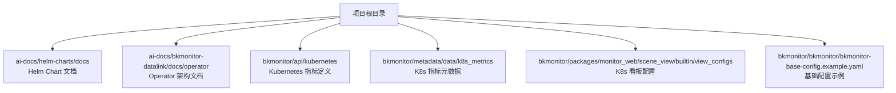
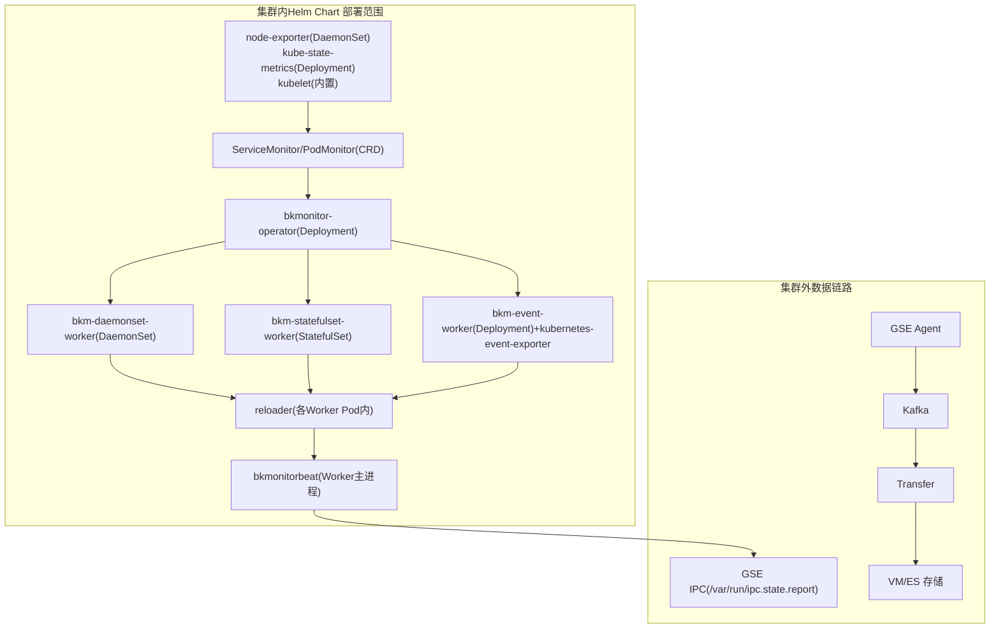
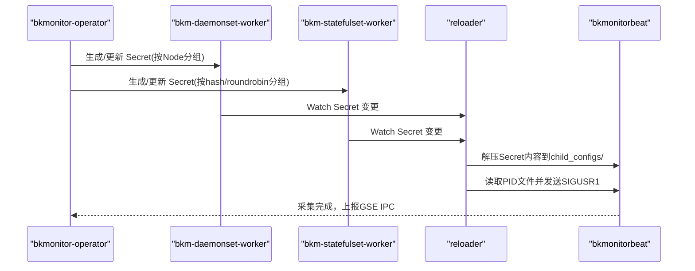
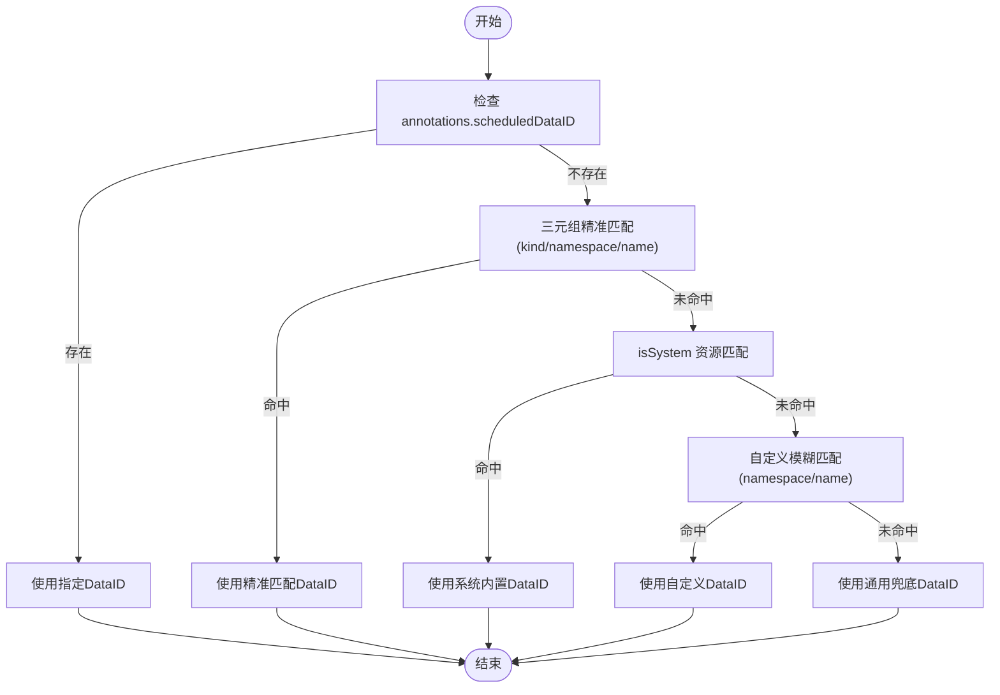
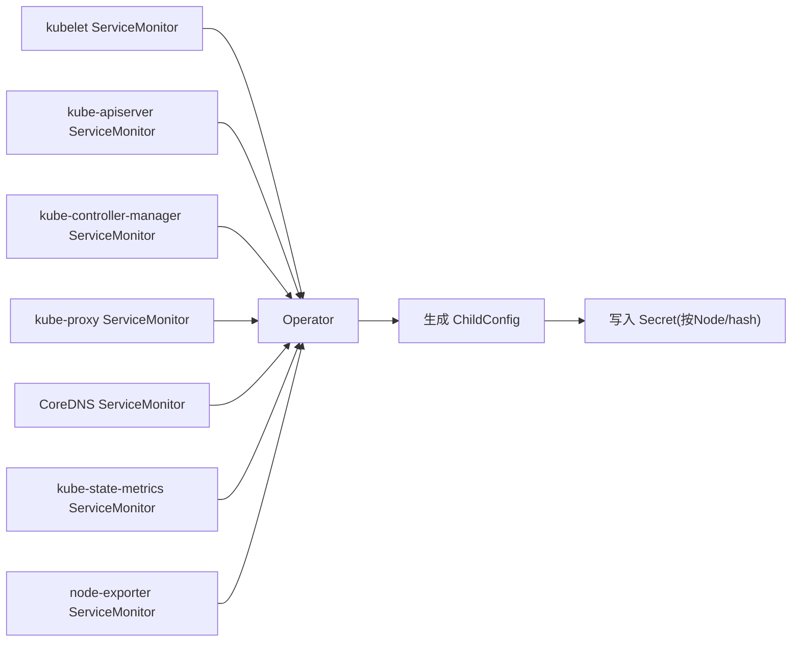
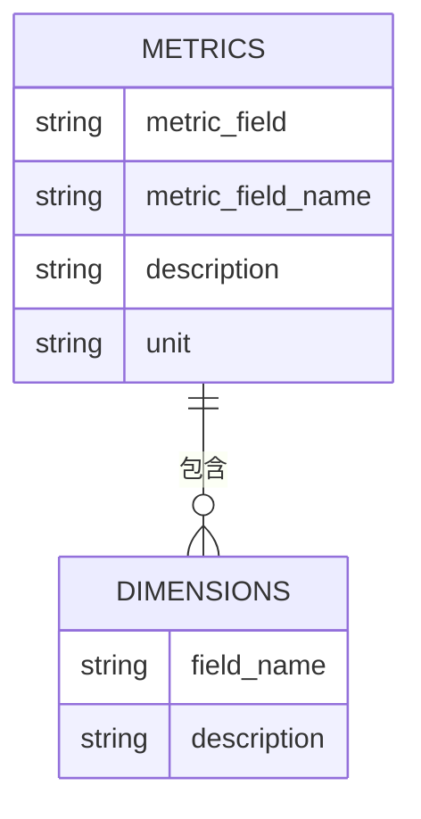
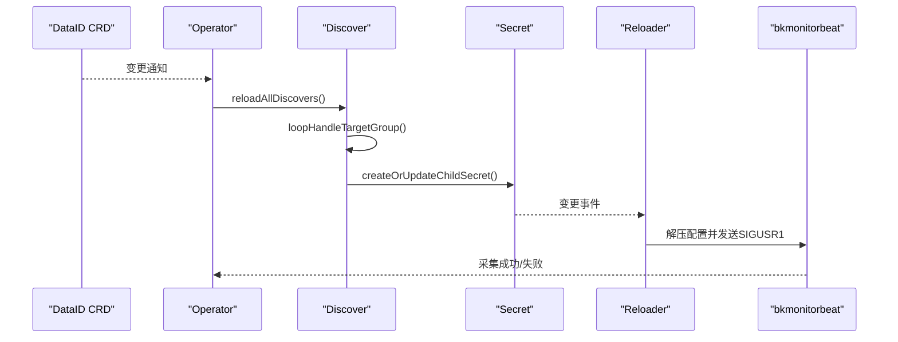
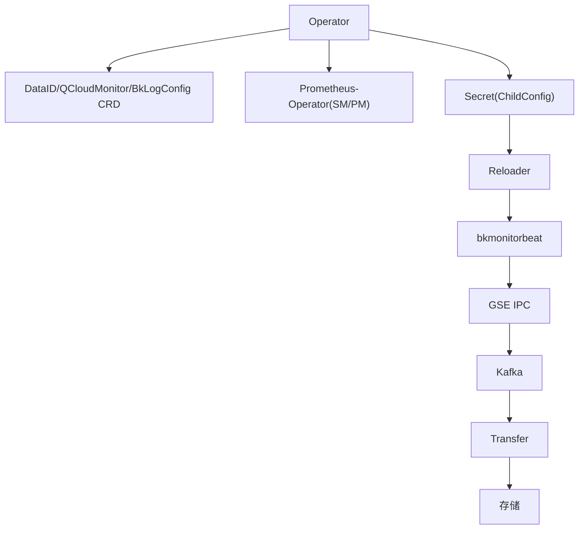

# Kubernetes集群管理

<cite>
**本文档引用的文件**
- [README.md](file://README.md)
- [helm-chart-k8s采集配置详解.md](file://ai-docs/helm-charts/docs/helm-chart-k8s采集配置详解.md)
- [architecture.md](file://ai-docs/bkmonitor-datalink/docs/operator/architecture.md)
- [kubernetes_metrics_define.json](file://bkmonitor/api/kubernetes/kubernetes_metrics_define.json)
- [kubernetes.yaml](file://bkmonitor/metadata/data/k8s_metrics/kubernetes.yaml)
- [kubernetes-cluster.json](file://bkmonitor/packages/monitor_web/scene_view/builtin/view_configs/kubernetes-cluster.json)
- [kubernetes-node.json](file://bkmonitor/packages/monitor_web/scene_view/builtin/view_configs/kubernetes-node.json)
- [kubernetes-pod.json](file://bkmonitor/packages/monitor_web/scene_view/builtin/view_configs/kubernetes-pod.json)
- [bk-monitor-base-config.example.yaml](file://bkmonitor/bkmonitor/bkmonitor-base-config.example.yaml)
</cite>

## 目录
1. [简介](#简介)
2. [项目结构](#项目结构)
3. [核心组件](#核心组件)
4. [架构总览](#架构总览)
5. [详细组件分析](#详细组件分析)
6. [依赖关系分析](#依赖关系分析)
7. [性能考量](#性能考量)
8. [故障排查指南](#故障排查指南)
9. [结论](#结论)
10. [附录](#附录)

## 简介
本指南围绕蓝鲸监控平台在Kubernetes集群中的管理与运维展开，重点覆盖集群部署架构、节点配置与资源调度策略；涵盖Deployment、Service、ConfigMap、Secret等Kubernetes资源的配置与管理；介绍Ingress控制器配置、负载均衡与TLS证书管理；提供HPA自动扩缩容、Pod就绪探针和存活探针配置；并包含集群监控、日志收集与故障诊断方法。文档内容基于仓库内的helm图表文档、operator架构文档、Kubernetes指标定义与前端看板配置等资料整理而成。

## 项目结构
本项目包含蓝鲸监控平台的后端、前端、数据链路与文档。与Kubernetes集群管理直接相关的关键位置包括：
- Helm Charts 文档：bkmonitor-operator-stack 的安装与采集配置说明
- Operator 架构文档：DataID CRD、Discover、ChildConfig、Reloader 等核心组件
- 指标定义：kubernetes_metrics_define.json 与 kubernetes.yaml
- 前端看板：kubernetes-cluster.json、kubernetes-node.json、kubernetes-pod.json
- 基础配置示例：bk-monitor-base-config.example.yaml

**章节来源**
- [README.md:1-52](file://README.md#L1-L52)

## 核心组件
- Helm Chart（bkmonitor-operator-stack）
  - Umbrella Chart，包含 CRD、exporters、bkmonitor-operator、bkmonitorbeat、event worker 等子组件
  - 内置系统级 ServiceMonitor/PodMonitor（如 kubelet、kube-state-metrics、node-exporter 等）
  - 提供 Worker（DaemonSet/StatefulSet/Deployment）与 Reloader 的配置与调度
- Operator（bkmonitor-operator）
  - Watch DataID CRD 与 ServiceMonitor/PodMonitor，生成 ChildConfig 并写入 Secret
  - 支持 relabelRule 机制，实现标签增强与维度关联
- Reloader（Worker Pod 内）
  - Watch 对应 Secret，解压写入 child_configs，触发 bkmonitorbeat 热重载
- 指标体系
  - kubernetes_metrics_define.json 定义容器、节点、Pod、工作负载等指标字段
  - kubernetes.yaml 描述指标标签维度
- 前端看板
  - kubernetes-cluster.json、kubernetes-node.json、kubernetes-pod.json 提供集群、节点、Pod 的可视化面板

**章节来源**
- [helm-chart-k8s采集配置详解.md:11-48](file://ai-docs/helm-charts/docs/helm-chart-k8s采集配置详解.md#L11-L48)
- [architecture.md:7-43](file://ai-docs/bkmonitor-datalink/docs/operator/architecture.md#L7-L43)
- [kubernetes_metrics_define.json:1-278](file://bkmonitor/api/kubernetes/kubernetes_metrics_define.json#L1-L278)
- [kubernetes.yaml:1-27](file://bkmonitor/metadata/data/k8s_metrics/kubernetes.yaml#L1-L27)
- [kubernetes-cluster.json:1-800](file://bkmonitor/packages/monitor_web/scene_view/builtin/view_configs/kubernetes-cluster.json#L1-L800)
- [kubernetes-node.json:1-64](file://bkmonitor/packages/monitor_web/scene_view/builtin/view_configs/kubernetes-node.json#L1-L64)
- [kubernetes-pod.json:1-65](file://bkmonitor/packages/monitor_web/scene_view/builtin/view_configs/kubernetes-pod.json#L1-L65)

## 架构总览
下图展示从集群内 exporters 到数据上报与存储的整体链路，以及 Operator 与 Reloader 的协作关系。

**图表来源**
- [helm-chart-k8s采集配置详解.md:515-561](file://ai-docs/helm-charts/docs/helm-chart-k8s采集配置详解.md#L515-L561)
- [architecture.md:129-181](file://ai-docs/bkmonitor-datalink/docs/operator/architecture.md#L129-L181)

**章节来源**
- [helm-chart-k8s采集配置详解.md:515-561](file://ai-docs/helm-charts/docs/helm-chart-k8s采集配置详解.md#L515-L561)
- [architecture.md:129-181](file://ai-docs/bkmonitor-datalink/docs/operator/architecture.md#L129-L181)

## 详细组件分析

### Helm Chart 部署架构与Worker调度
- Worker 类型与职责
  - bkm-daemonset-worker：每节点1个Pod，负责节点本地采集（kubelet等）
  - bkm-statefulset-worker：按任务量水平扩展，支持 HPA
  - bkm-event-worker：采集K8s事件
- Worker 容器组成
  - initContainer：GSE IPC连通性检查（可选）
  - container：bkmonitorbeat（采集主进程）
  - sidecar：reloader（配置热重载）
- 共享PID命名空间
  - shareProcessNamespace: true，使 reloader 能通过 PID 文件向 bkmonitorbeat 发送信号触发热重载
- StatefulSet Worker HPA
  - 可配置每 Worker 最大任务数、最小/最大副本数、调度算法（hash/roundrobin）

**图表来源**
- [helm-chart-k8s采集配置详解.md:539-551](file://ai-docs/helm-charts/docs/helm-chart-k8s采集配置详解.md#L539-L551)
- [architecture.md:168-181](file://ai-docs/bkmonitor-datalink/docs/operator/architecture.md#L168-L181)

**章节来源**
- [helm-chart-k8s采集配置详解.md:52-100](file://ai-docs/helm-charts/docs/helm-chart-k8s采集配置详解.md#L52-L100)
- [helm-chart-k8s采集配置详解.md:539-551](file://ai-docs/helm-charts/docs/helm-chart-k8s采集配置详解.md#L539-L551)
- [architecture.md:168-181](file://ai-docs/bkmonitor-datalink/docs/operator/architecture.md#L168-L181)

### Operator 控制器与DataID匹配
- CRD：DataID（monitoring.bk.tencent.com/v1beta1）
  - 关联 ServiceMonitor/PodMonitor 等监控资源
  - 支持 labels、metricReplace、dimensionReplace 等字段
- DataID 匹配优先级（4步）
  1) annotations.scheduledDataID（最高优先级）
  2) 三元组精准匹配（kind/namespace/name）
  3) isSystem 资源匹配（系统内置DataID）
  4) 自定义模糊匹配（namespace/name）→ 通用兜底 DataID
- Discover 与 ChildConfig
  - Discover 负责从 ServiceMonitor/PodMonitor 拉取 TargetGroups，经 relabel 生成 ChildConfig
  - ChildConfig 写入对应 Secret，触发 Worker 热重载

**图表来源**
- [helm-chart-k8s采集配置详解.md:608-724](file://ai-docs/helm-charts/docs/helm-chart-k8s采集配置详解.md#L608-L724)
- [architecture.md:81-98](file://ai-docs/bkmonitor-datalink/docs/operator/architecture.md#L81-L98)
- [architecture.md:107-126](file://ai-docs/bkmonitor-datalink/docs/operator/architecture.md#L107-L126)

**章节来源**
- [helm-chart-k8s采集配置详解.md:608-724](file://ai-docs/helm-charts/docs/helm-chart-k8s采集配置详解.md#L608-L724)
- [architecture.md:81-126](file://ai-docs/bkmonitor-datalink/docs/operator/architecture.md#L81-L126)

### 内置系统级采集目标
- kubelet（ServiceMonitor/PodMonitor）
  - 端点：/metrics、/metrics/cadvisor、/metrics/probes、/metrics/resource（可选）
  - TLS：Bearer Token + CA校验
  - 指标白名单与重命名、drop 无主容器指标（k8s>=1.22 保留 container_network_*）
- kube-apiserver、kube-controller-manager、kube-proxy、CoreDNS、kube-state-metrics、node-exporter 等
  - 通过 ServiceMonitor 自动发现，支持 relabelRule 与 metricRelabelings
- Windows Exporter（containerd 模式）需额外配置 hostProcess 与 relabelRule

**图表来源**
- [helm-chart-k8s采集配置详解.md:146-416](file://ai-docs/helm-charts/docs/helm-chart-k8s采集配置详解.md#L146-L416)

**章节来源**
- [helm-chart-k8s采集配置详解.md:146-416](file://ai-docs/helm-charts/docs/helm-chart-k8s采集配置详解.md#L146-L416)

### 指标体系与维度
- 容器与节点指标
  - CPU、内存、网络、文件系统、文件描述符、进程/线程等
  - kubelet、kube-state-metrics、node-exporter 提供不同层面指标
- 指标白名单与重命名
  - 通过 metricRelabelings 保留关键指标，避免噪声
- 指标定义与维度
  - kubernetes_metrics_define.json 提供指标字段说明与单位
  - kubernetes.yaml 描述指标标签维度（如 service、namespace、pod、instance 等）

**图表来源**
- [kubernetes_metrics_define.json:1-278](file://bkmonitor/api/kubernetes/kubernetes_metrics_define.json#L1-L278)
- [kubernetes.yaml:1-27](file://bkmonitor/metadata/data/k8s_metrics/kubernetes.yaml#L1-L27)

**章节来源**
- [kubernetes_metrics_define.json:1-278](file://bkmonitor/api/kubernetes/kubernetes_metrics_define.json#L1-L278)
- [kubernetes.yaml:1-27](file://bkmonitor/metadata/data/k8s_metrics/kubernetes.yaml#L1-L27)

### 前端看板与监控视图
- 集群看板（kubernetes-cluster.json）
  - 展示集群对象数量、CPU/内存/流量使用率、节点资源TopN、工作负载状态等
- 节点看板（kubernetes-node.json）
  - 节点列表、节点详情与排序筛选
- Pod看板（kubernetes-pod.json）
  - Pod列表、Pod详情与排序筛选

**图表来源**
- [kubernetes-cluster.json:1-800](file://bkmonitor/packages/monitor_web/scene_view/builtin/view_configs/kubernetes-cluster.json#L1-L800)
- [kubernetes-node.json:1-64](file://bkmonitor/packages/monitor_web/scene_view/builtin/view_configs/kubernetes-node.json#L1-L64)
- [kubernetes-pod.json:1-65](file://bkmonitor/packages/monitor_web/scene_view/builtin/view_configs/kubernetes-pod.json#L1-L65)

**章节来源**
- [kubernetes-cluster.json:1-800](file://bkmonitor/packages/monitor_web/scene_view/builtin/view_configs/kubernetes-cluster.json#L1-L800)
- [kubernetes-node.json:1-64](file://bkmonitor/packages/monitor_web/scene_view/builtin/view_configs/kubernetes-node.json#L1-L64)
- [kubernetes-pod.json:1-65](file://bkmonitor/packages/monitor_web/scene_view/builtin/view_configs/kubernetes-pod.json#L1-L65)

### Deployment、Service、ConfigMap、Secret 配置要点
- Deployment
  - 通过 replicas、strategy、template.spec.containers、resources 等定义工作负载
  - 与 Service 通过 selector 关联
- Service
  - ClusterIP/NodePort/LoadBalancer，选择器与端口映射
  - 与 ServiceMonitor/PodMonitor 的自动发现配合
- ConfigMap
  - 用于 Worker Pod 的配置挂载（如 bkm-daemonset-worker、bkm-statefulset-worker 的配置目录）
- Secret
  - 由 Operator 生成并写入，包含子配置（child_configs）与任务分发信息
  - Reloader Watch Secret 变更并触发热重载

**章节来源**
- [helm-chart-k8s采集配置详解.md:62-83](file://ai-docs/helm-charts/docs/helm-chart-k8s采集配置详解.md#L62-L83)
- [helm-chart-k8s采集配置详解.md:534-537](file://ai-docs/helm-charts/docs/helm-chart-k8s采集配置详解.md#L534-L537)

### Ingress 控制器、负载均衡与TLS证书
- Ingress 控制器
  - 通过 Ingress 资源暴露服务，结合注解实现路径转发、重写与安全策略
- 负载均衡
  - Service 类型为 LoadBalancer 时，由云厂商或 MetalLB 提供外部IP
- TLS 证书
  - 通过 Ingress 注解或 Secret 管理 TLS 证书，实现 HTTPS 终止
- 与监控的关系
  - Ingress 作为入口层，需纳入监控与告警范围（如连接数、延迟、错误率）

[本节为概念性说明，不直接分析具体文件，故无“章节来源”]

### HPA 自动扩缩容、探针配置
- HPA
  - StatefulSet Worker 支持 HPA，可通过副本数与任务密度因子控制扩缩容
- 探针
  - 就绪探针（Readiness Probe）：确保容器启动完成后再接收流量
  - 存活探针（Liveness Probe）：检测容器健康状态，异常时重启
- 与采集的关系
  - Worker 扩缩容会影响任务分发与指标采集规模，需结合资源限制与批量上报参数进行优化

**章节来源**
- [helm-chart-k8s采集配置详解.md:89-99](file://ai-docs/helm-charts/docs/helm-chart-k8s采集配置详解.md#L89-L99)
- [helm-chart-k8s采集配置详解.md:586-598](file://ai-docs/helm-charts/docs/helm-chart-k8s采集配置详解.md#L586-L598)

### 集群监控、日志收集与故障诊断
- 集群监控
  - 通过 node-exporter、kube-state-metrics、kubelet 指标构建集群健康画像
  - 前端看板提供集群、节点、Pod 的可视化面板
- 日志收集
  - Helm Chart 提供日志采集配置（BkLogConfig CRD），支持按工作负载、命名空间、容器等维度匹配
- 故障诊断
  - Operator/Reloader 工作流：Watch CRD/Secret → 生成 ChildConfig → 写 Secret → 触发热重载
  - 诊断工具：scraper 直接 HTTP 抓取目标指标行，辅助定位采集问题

**图表来源**
- [architecture.md:129-181](file://ai-docs/bkmonitor-datalink/docs/operator/architecture.md#L129-L181)

**章节来源**
- [architecture.md:129-181](file://ai-docs/bkmonitor-datalink/docs/operator/architecture.md#L129-L181)

## 依赖关系分析
- 组件耦合
  - Operator 依赖 CRD（DataID、QCloudMonitor、BkLogConfig）与 prometheus-operator（ServiceMonitor/PodMonitor）
  - Worker 依赖 Secret 与 reloader 的热重载机制
- 外部依赖
  - GSE IPC：Worker 通过 hostPath 写入 IPC 文件，由 GSE Agent 上报
  - Kafka/Transfer/存储：数据链路下游组件

**图表来源**
- [architecture.md:56-79](file://ai-docs/bkmonitor-datalink/docs/operator/architecture.md#L56-L79)
- [helm-chart-k8s采集配置详解.md:515-561](file://ai-docs/helm-charts/docs/helm-chart-k8s采集配置详解.md#L515-L561)

**章节来源**
- [architecture.md:56-79](file://ai-docs/bkmonitor-datalink/docs/operator/architecture.md#L56-L79)
- [helm-chart-k8s采集配置详解.md:515-561](file://ai-docs/helm-charts/docs/helm-chart-k8s采集配置详解.md#L515-L561)

## 性能考量
- 批量上报参数
  - 单次采集最多批次与每批次指标数限制，理论批量上限可达数百万级指标行/次
- 资源限制
  - 各组件 CPU/Memory 限制，避免过度占用集群资源
- 指标白名单与重命名
  - 降低指标风暴与维度膨胀，提升采集与存储效率
- HPA 与调度
  - 通过副本数与任务密度因子平衡采集负载，结合节点亲和与容忍策略

**章节来源**
- [helm-chart-k8s采集配置详解.md:128-143](file://ai-docs/helm-charts/docs/helm-chart-k8s采集配置详解.md#L128-L143)
- [helm-chart-k8s采集配置详解.md:586-598](file://ai-docs/helm-charts/docs/helm-chart-k8s采集配置详解.md#L586-L598)
- [helm-chart-k8s采集配置详解.md:565-584](file://ai-docs/helm-charts/docs/helm-chart-k8s采集配置详解.md#L565-L584)

## 故障排查指南
- 采集未生效
  - 检查 ServiceMonitor/PodMonitor 是否带有 isSystem 或 scheduledDataID 注解
  - 确认 DataID CRD 是否存在且匹配优先级正确
- Worker 未热重载
  - 检查 Secret 是否更新、reloader 是否 Watch 到变更、PID 文件是否存在
- 指标缺失
  - 核对 metricRelabelings 白名单与 drop 规则，确认 k8s 版本差异处理
- 数据上报异常
  - 检查 GSE IPC 文件权限与路径、Kafka/Transfer 连通性

**章节来源**
- [helm-chart-k8s采集配置详解.md:608-724](file://ai-docs/helm-charts/docs/helm-chart-k8s采集配置详解.md#L608-L724)
- [architecture.md:168-181](file://ai-docs/bkmonitor-datalink/docs/operator/architecture.md#L168-L181)

## 结论
本指南基于仓库内的 Helm Chart 文档、Operator 架构与指标定义，系统梳理了Kubernetes集群管理的关键环节：从部署架构、Worker 调度与热重载，到 DataID 匹配与指标白名单策略；并结合前端看板与数据链路，提供了监控、日志与故障诊断的实践路径。建议在生产环境中结合 HPA、探针与资源限制，持续优化采集规模与稳定性。

## 附录
- 基础配置示例
  - 蓝鲸应用与数据库配置示例，便于理解平台配置结构

**章节来源**
- [bk-monitor-base-config.example.yaml:1-50](file://bkmonitor/bkmonitor/bkmonitor-base-config.example.yaml#L1-L50)