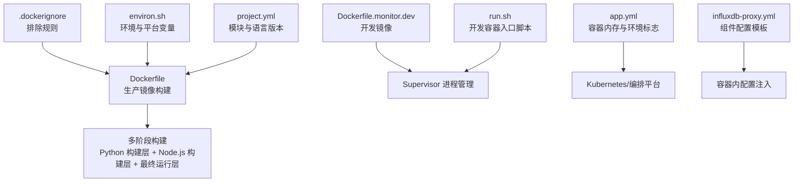
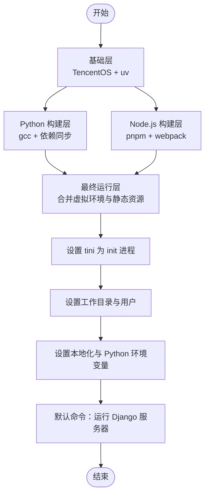
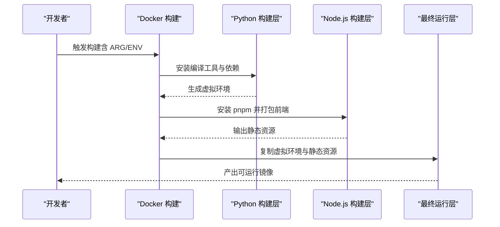
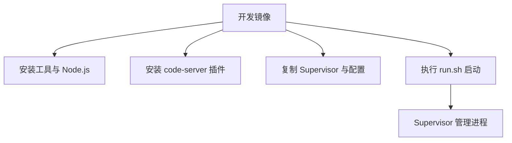
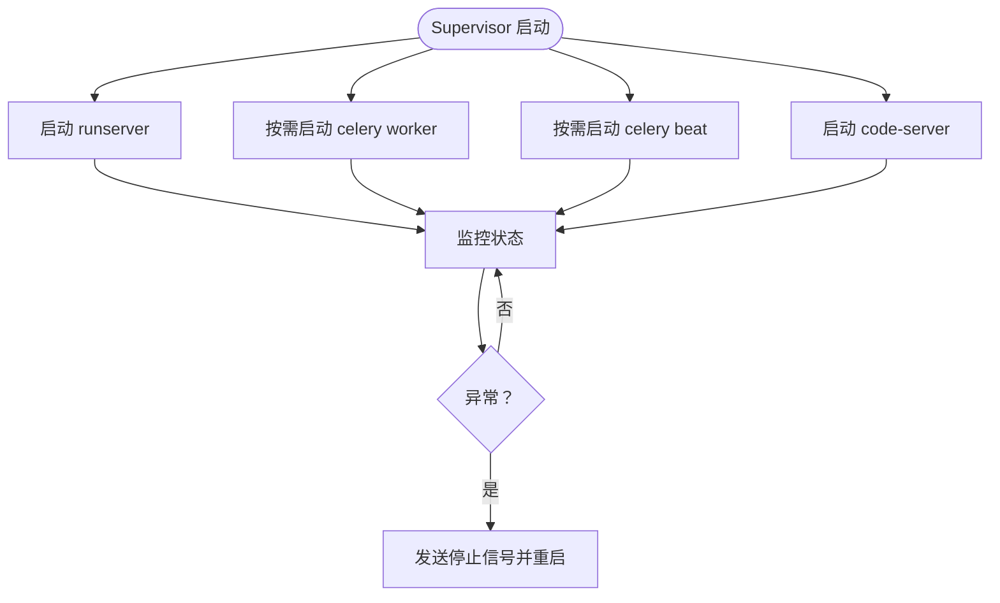
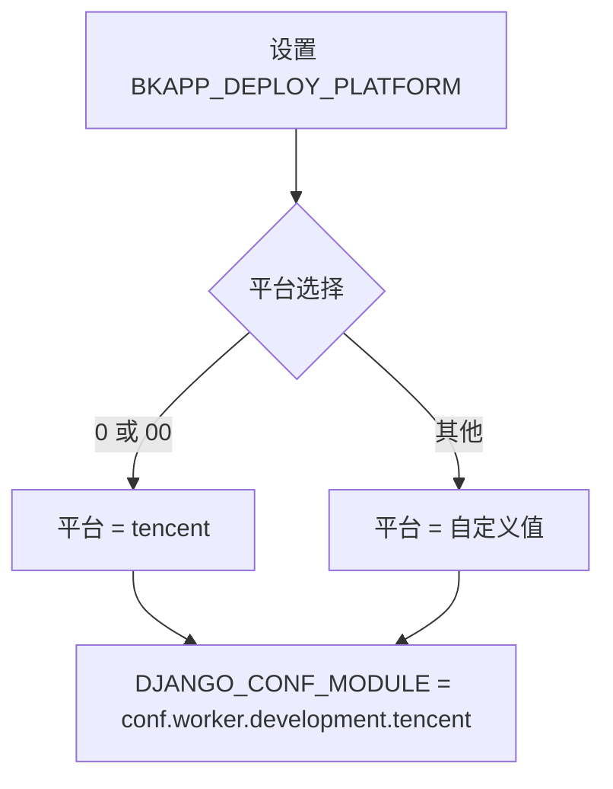
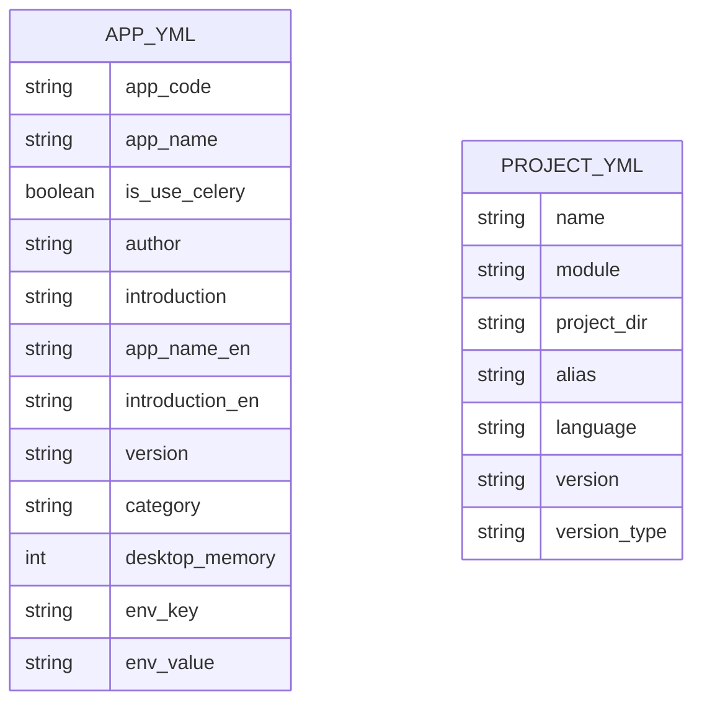
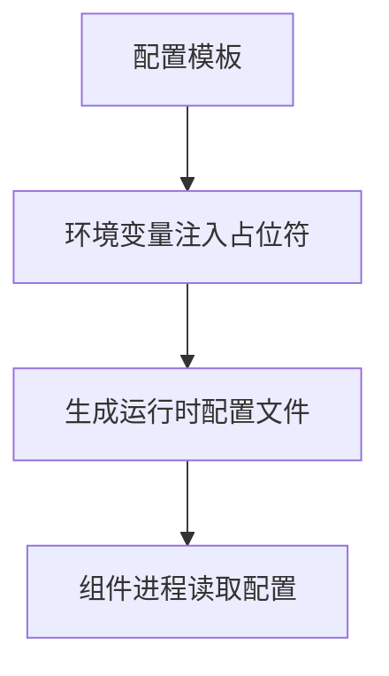
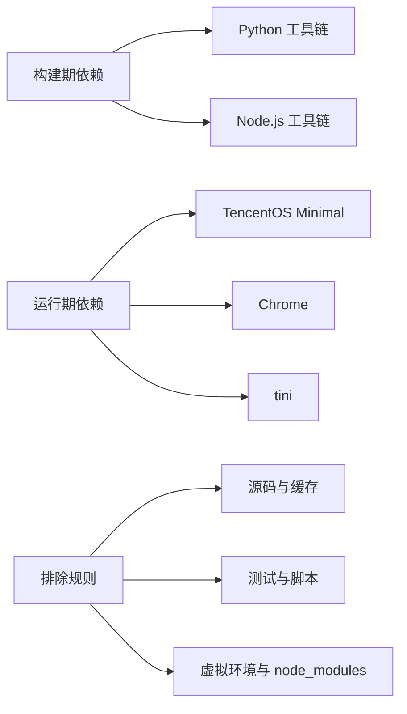

# 容器化部署

<cite>
**本文引用的文件**
- [Dockerfile](file://bkmonitor/Dockerfile)
- [.dockerignore](file://bkmonitor/.dockerignore)
- [Dockerfile.monitor.dev](file://Dockerfile.monitor.dev)
- [run.sh](file://bkmonitor/scripts/dev/run.sh)
- [supervisord.conf](file://bkmonitor/scripts/dev/supervisord.conf)
- [environ.sh](file://bkmonitor/bin/environ.sh)
- [app.yml](file://bkmonitor/version/app.yml)
- [project.yml](file://bkmonitor/version/project.yml)
- [influxdb-proxy.yml](file://bkmonitor/support-files/templates/influxdb-proxy#etc#influxdb-proxy.yml)
</cite>

## 目录
1. [简介](#简介)
2. [项目结构](#项目结构)
3. [核心组件](#核心组件)
4. [架构总览](#架构总览)
5. [详细组件分析](#详细组件分析)
6. [依赖分析](#依赖分析)
7. [性能考虑](#性能考虑)
8. [故障排查指南](#故障排查指南)
9. [结论](#结论)
10. [附录](#附录)

## 简介
本指南面向蓝鲸监控平台（bk-monitor）的容器化部署，覆盖镜像构建流程、Dockerfile 配置选项与多阶段构建优化、容器运行参数与环境变量、数据卷挂载、健康检查与资源限制、重启策略、容器编排最佳实践、网络与存储管理，以及开发与生产环境的差异化部署策略。内容基于仓库中的 Dockerfile、开发容器镜像、Supervisor 进程管理、版本与部署元数据等文件整理而成。

## 项目结构
与容器化部署直接相关的文件主要集中在以下位置：
- 生产镜像：bkmonitor/Dockerfile、bkmonitor/.dockerignore
- 开发镜像：Dockerfile.monitor.dev 及其配套脚本与配置
- 运行时进程管理：bkmonitor/scripts/dev/supervisord.conf、bkmonitor/scripts/dev/run.sh
- 环境变量与部署平台：bkmonitor/bin/environ.sh
- 版本与容器元数据：bkmonitor/version/app.yml、bkmonitor/version/project.yml
- 组件配置模板示例：bkmonitor/support-files/templates/influxdb-proxy#etc#influxdb-proxy.yml

图表来源
- [Dockerfile:1-86](file://bkmonitor/Dockerfile#L1-L86)
- [.dockerignore:1-18](file://bkmonitor/.dockerignore#L1-L18)
- [Dockerfile.monitor.dev:1-48](file://Dockerfile.monitor.dev#L1-L48)
- [run.sh:1-10](file://bkmonitor/scripts/dev/run.sh#L1-L10)
- [supervisord.conf:1-72](file://bkmonitor/scripts/dev/supervisord.conf#L1-L72)
- [environ.sh:1-13](file://bkmonitor/bin/environ.sh#L1-L13)
- [app.yml:1-17](file://bkmonitor/version/app.yml#L1-L17)
- [project.yml:1-8](file://bkmonitor/version/project.yml#L1-L8)
- [influxdb-proxy.yml:1-33](file://bkmonitor/support-files/templates/influxdb-proxy#etc#influxdb-proxy.yml#L1-L33)

章节来源
- [Dockerfile:1-86](file://bkmonitor/Dockerfile#L1-L86)
- [.dockerignore:1-18](file://bkmonitor/.dockerignore#L1-L18)
- [Dockerfile.monitor.dev:1-48](file://Dockerfile.monitor.dev#L1-L48)
- [run.sh:1-10](file://bkmonitor/scripts/dev/run.sh#L1-L10)
- [supervisord.conf:1-72](file://bkmonitor/scripts/dev/supervisord.conf#L1-L72)
- [environ.sh:1-13](file://bkmonitor/bin/environ.sh#L1-L13)
- [app.yml:1-17](file://bkmonitor/version/app.yml#L1-L17)
- [project.yml:1-8](file://bkmonitor/version/project.yml#L1-L8)
- [influxdb-proxy.yml:1-33](file://bkmonitor/support-files/templates/influxdb-proxy#etc#influxdb-proxy.yml#L1-L33)

## 核心组件
- 多阶段构建镜像（生产）
  - Python 基础层：使用 TencentOS Server Minimal 基础镜像，配合 uv 工具加速虚拟环境与依赖安装。
  - Node.js 构建层：使用 node:20-bullseye-slim，通过 pnpm 打包前端静态资源。
  - 最终运行层：合并 Python 虚拟环境与前端静态资源，设置非 root 用户与工作目录，启用 tini 作为 init 进程，设置 UTF-8 本地化与 Python 路径。
- 开发镜像（本地开发）
  - 基于 python:3.6.15，安装常用工具、npm、code-server，复制 Supervisor 与 code-server 配置，提供一键启动脚本。
- 进程管理（开发）
  - 使用 Supervisor 管理 Django 开发服务器、Celery 工作进程与定时任务，支持条件开启与自动重启。
- 环境变量与平台选择
  - 通过环境变量选择部署平台与 Django 配置模块，便于在不同环境加载对应配置。
- 版本与容器元数据
  - app.yml 提供容器内存建议与共享存储开关；project.yml 描述模块语言与版本类型。
- 组件配置模板
  - 提供 influxdb-proxy 的配置模板，便于在容器中注入环境变量完成运行时替换。

章节来源
- [Dockerfile:1-86](file://bkmonitor/Dockerfile#L1-L86)
- [Dockerfile.monitor.dev:1-48](file://Dockerfile.monitor.dev#L1-L48)
- [supervisord.conf:1-72](file://bkmonitor/scripts/dev/supervisord.conf#L1-L72)
- [environ.sh:1-13](file://bkmonitor/bin/environ.sh#L1-L13)
- [app.yml:1-17](file://bkmonitor/version/app.yml#L1-L17)
- [project.yml:1-8](file://bkmonitor/version/project.yml#L1-L8)
- [influxdb-proxy.yml:1-33](file://bkmonitor/support-files/templates/influxdb-proxy#etc#influxdb-proxy.yml#L1-L33)

## 架构总览
下图展示生产镜像构建与运行的整体流程，包括多阶段构建、依赖安装、前端打包、最终镜像产物与运行时入口。

图表来源
- [Dockerfile:1-86](file://bkmonitor/Dockerfile#L1-L86)

章节来源
- [Dockerfile:1-86](file://bkmonitor/Dockerfile#L1-L86)

## 详细组件分析

### 生产镜像构建（Dockerfile）
- 多阶段构建
  - Python 构建层：安装编译工具链，使用 uv 同步锁定的生产依赖，避免重复安装与缓存污染。
  - Node.js 构建层：使用 pnpm 安装依赖并执行生产打包，输出静态资源到 /app/dist。
  - 最终运行层：复制 Python 虚拟环境与前端静态资源，设置非 root 用户与持久化目录权限。
- 依赖与工具
  - 使用 uv 与缓存挂载减少构建时间与网络开销。
  - 安装 Chrome 以支持截图或无头渲染场景。
- 字体与本地化
  - 下载并安装思源系列中文字体，确保中文显示正常。
- 入口与命令
  - 使用 tini 作为 init 进程，保证信号正确传递。
  - 设置 UTF-8 本地化与 Python 虚拟环境路径。
  - 默认 CMD 运行 Django 开发服务器（生产建议由编排平台管理进程与端口映射）。

图表来源
- [Dockerfile:24-86](file://bkmonitor/Dockerfile#L24-L86)

章节来源
- [Dockerfile:1-86](file://bkmonitor/Dockerfile#L1-L86)

### 开发镜像（Dockerfile.monitor.dev）
- 基础镜像与工具
  - 使用 python:3.6.15，安装 curl、wget、git、vim、supervisor、code-server 与 Node.js 18。
- 开发体验
  - 安装常用 VS Code 插件，配置 npm 与 pnpm，提供一键启动脚本。
- 进程管理
  - 通过 supervisord 启动 Django 开发服务器与 code-server，便于本地联调。

图表来源
- [Dockerfile.monitor.dev:1-48](file://Dockerfile.monitor.dev#L1-L48)
- [run.sh:1-10](file://bkmonitor/scripts/dev/run.sh#L1-L10)
- [supervisord.conf:1-72](file://bkmonitor/scripts/dev/supervisord.conf#L1-L72)

章节来源
- [Dockerfile.monitor.dev:1-48](file://Dockerfile.monitor.dev#L1-L48)
- [run.sh:1-10](file://bkmonitor/scripts/dev/run.sh#L1-L10)
- [supervisord.conf:1-72](file://bkmonitor/scripts/dev/supervisord.conf#L1-L72)

### 进程管理（Supervisor）
- 管理目标
  - runserver：Django 开发服务器，标准输出日志重定向，自动重启。
  - celery worker/beat：按需启用，支持不同队列与并发配置。
  - code-server：提供在线 IDE 访问。
- 控制方式
  - 通过 autostart=false 的配置实现按需启动，结合编排平台的健康检查与重启策略。

图表来源
- [supervisord.conf:16-72](file://bkmonitor/scripts/dev/supervisord.conf#L16-L72)

章节来源
- [supervisord.conf:1-72](file://bkmonitor/scripts/dev/supervisord.conf#L1-L72)

### 环境变量与平台选择
- 环境变量
  - BKAPP_DEPLOY_PLATFORM：决定部署平台（如 tencent），进而影响 Django 配置模块。
  - DJANGO_CONF_MODULE：指向 conf.worker.development.<platform>。
- 应用建议
  - 在编排平台（如 Kubernetes）中通过 ConfigMap/Secret 注入上述变量，实现环境隔离。

图表来源
- [environ.sh:4-12](file://bkmonitor/bin/environ.sh#L4-L12)

章节来源
- [environ.sh:1-13](file://bkmonitor/bin/environ.sh#L1-L13)

### 版本与容器元数据
- app.yml
  - 容器内存建议：4096（MB）
  - 启用共享存储标志：BKAPP_ENABLE_SHARED_FS=1
- project.yml
  - 模块名与语言：python/3.6
  - 版本号与发布环境类型：${VERSION}、${RELEASE_ENV}

图表来源
- [app.yml:1-17](file://bkmonitor/version/app.yml#L1-L17)
- [project.yml:1-8](file://bkmonitor/version/project.yml#L1-L8)

章节来源
- [app.yml:1-17](file://bkmonitor/version/app.yml#L1-L17)
- [project.yml:1-8](file://bkmonitor/version/project.yml#L1-L8)

### 组件配置模板（以 influxdb-proxy 为例）
- 模板字段
  - http.listen/port：监听地址与端口
  - kafka.address/port/topic_prefix/version：Kafka 连接与主题前缀
  - consul.prefix/address/health：Consul 服务注册与健康检查
  - logger.level/out.options：日志级别与轮转策略
- 注入方式
  - 在容器启动时通过环境变量替换模板中的占位符，实现运行时配置注入。

图表来源
- [influxdb-proxy.yml:1-33](file://bkmonitor/support-files/templates/influxdb-proxy#etc#influxdb-proxy.yml#L1-L33)

章节来源
- [influxdb-proxy.yml:1-33](file://bkmonitor/support-files/templates/influxdb-proxy#etc#influxdb-proxy.yml#L1-L33)

## 依赖分析
- 构建期依赖
  - Python：uv、gcc、python3-devel、mysql-devel
  - Node.js：pnpm、webpack（生产打包）
- 运行期依赖
  - TencentOS Server Minimal 基础镜像、Chrome、tini、字体文件
- 排除规则
  - .dockerignore 明确排除测试、脚本、版本、venv、node_modules 等，缩小镜像体积并提升构建安全。

图表来源
- [Dockerfile:11-22](file://bkmonitor/Dockerfile#L11-L22)
- [Dockerfile:29-36](file://bkmonitor/Dockerfile#L29-L36)
- [.dockerignore:1-18](file://bkmonitor/.dockerignore#L1-L18)

章节来源
- [Dockerfile:1-86](file://bkmonitor/Dockerfile#L1-L86)
- [.dockerignore:1-18](file://bkmonitor/.dockerignore#L1-L18)

## 性能考虑
- 多阶段构建与缓存
  - 使用 uv 与缓存挂载（/root/.cache/uv）减少重复安装时间。
  - 使用 --mount=type=cache 挂载字体缓存目录，避免重复下载。
- 依赖锁定
  - 通过 uv.lock 锁定依赖版本，确保构建一致性。
- 前端构建
  - 使用 pnpm 与生产打包，减少包体积与启动时间。
- 运行时优化
  - 非 root 用户运行，降低权限风险；设置 UTF-8 本地化避免字符集问题。

章节来源
- [Dockerfile:32-36](file://bkmonitor/Dockerfile#L32-L36)
- [Dockerfile:14-22](file://bkmonitor/Dockerfile#L14-L22)
- [Dockerfile:42-49](file://bkmonitor/Dockerfile#L42-L49)

## 故障排查指南
- 构建失败
  - 检查网络与镜像源可用性，确认 uv 与 pnpm 安装是否成功。
  - 确认 uv.lock 与 pyproject.toml 是否存在且版本匹配。
- 进程异常
  - 查看 Supervisor 日志（runserver、celery、beat、code-server）定位问题。
  - 确认 autostart=false 的程序是否按需启动。
- 端口与网络
  - 生产镜像默认命令运行在 80 端口，需由编排平台进行端口映射与暴露。
- 字体与中文显示
  - 确认中文字体已正确下载并安装到 /usr/share/fonts/truetype。
- 配置注入
  - 确保模板中的占位符在容器启动时被环境变量替换。

章节来源
- [Dockerfile:83-86](file://bkmonitor/Dockerfile#L83-L86)
- [supervisord.conf:16-72](file://bkmonitor/scripts/dev/supervisord.conf#L16-L72)
- [Dockerfile:14-22](file://bkmonitor/Dockerfile#L14-L22)
- [influxdb-proxy.yml:1-33](file://bkmonitor/support-files/templates/influxdb-proxy#etc#influxdb-proxy.yml#L1-L33)

## 结论
本指南基于仓库现有文件，梳理了蓝鲸监控平台的容器化构建与运行要点。生产镜像采用多阶段构建与 uv 缓存，兼顾体积与构建效率；开发镜像提供一体化本地开发体验；通过 Supervisor 实现多进程管理；借助版本与配置模板实现环境隔离与运行时注入。建议在生产环境中结合编排平台完善健康检查、资源限制与重启策略，并通过 ConfigMap/Secret 注入环境变量与配置文件。

## 附录

### 容器运行参数与环境变量清单
- 环境变量
  - BKAPP_DEPLOY_PLATFORM：部署平台标识
  - DJANGO_CONF_MODULE：Django 配置模块路径
  - BKAPP_ENABLE_SHARED_FS：启用共享存储（来自 app.yml）
- 端口
  - 80：Django 服务端口（默认命令）
- 数据卷
  - /data/：持久化数据目录（来自最终运行层）
  - /app/code/static/：前端静态资源目录（来自最终运行层）

章节来源
- [environ.sh:4-12](file://bkmonitor/bin/environ.sh#L4-L12)
- [Dockerfile:55-73](file://bkmonitor/Dockerfile#L55-L73)
- [Dockerfile:83-86](file://bkmonitor/Dockerfile#L83-L86)
- [app.yml:13-16](file://bkmonitor/version/app.yml#L13-L16)

### 健康检查、资源限制与重启策略（编排建议）
- 健康检查
  - HTTP GET / 或 /healthz（根据实际健康端点调整）
- 资源限制
  - 内存：参考 app.yml 中的 desktop.memory（4096 MB）
  - CPU：按业务峰值与并发需求设定 requests/limits
- 重启策略
  - Always（开发镜像）；生产镜像建议由编排平台控制，结合健康检查与探针

章节来源
- [app.yml:13-16](file://bkmonitor/version/app.yml#L13-L16)

### 开发与生产环境差异
- 开发环境
  - 使用 Dockerfile.monitor.dev，内置 Supervisor 与 code-server，适合本地联调。
- 生产环境
  - 使用 bkmonitor/Dockerfile，多阶段构建与非 root 运行，适合编排平台部署。

章节来源
- [Dockerfile.monitor.dev:1-48](file://Dockerfile.monitor.dev#L1-L48)
- [Dockerfile:1-86](file://bkmonitor/Dockerfile#L1-L86)