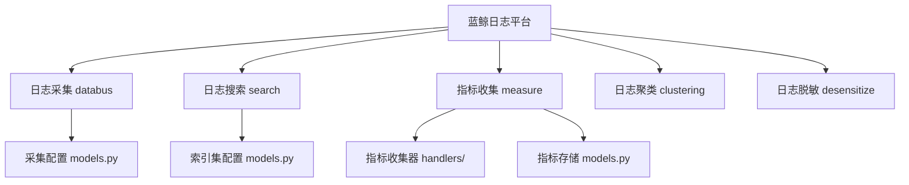
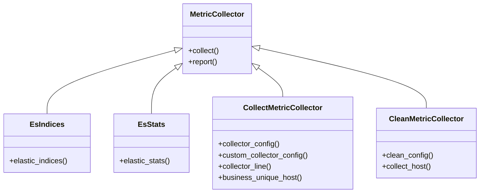
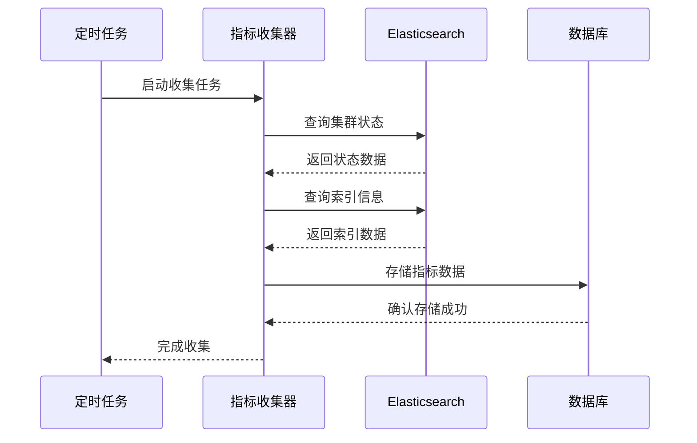
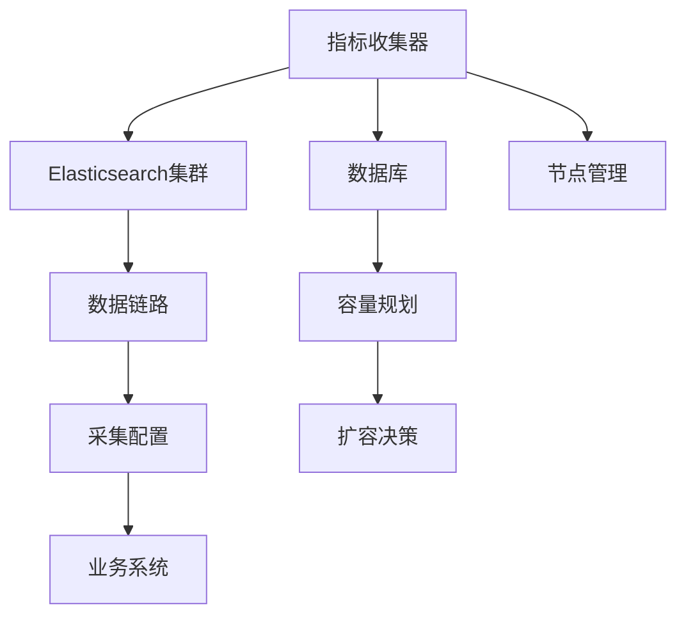

# 容量规划

<cite>
**本文档引用的文件**   
- [es_indices.py](file://bklog/apps/log_measure/handlers/metric_collectors/es_indices.py)
- [es_stats.py](file://bklog/apps/log_measure/handlers/metric_collectors/es_stats.py)
- [log_databus.py](file://bklog/apps/log_measure/handlers/metric_collectors/log_databus.py)
- [metric.py](file://bklog/apps/log_measure/utils/metric.py)
- [models.py](file://bklog/apps/log_databus/models.py)
- [constants.py](file://bklog/apps/log_databus/constants.py)
- [report.py](file://bklog/apps/log_measure/tasks/report.py)
</cite>

## 目录
1. [引言](#引言)
2. [项目结构](#项目结构)
3. [核心组件](#核心组件)
4. [架构概述](#架构概述)
5. [详细组件分析](#详细组件分析)
6. [依赖分析](#依赖分析)
7. [性能考虑](#性能考虑)
8. [故障排除指南](#故障排除指南)
9. [结论](#结论)
10. [附录](#附录) (如有必要)

## 引言
本文档旨在为蓝鲸日志平台制定全面的容量规划方案，确保系统长期稳定运行。通过分析log_measure模块中的指标收集器，结合databus的数据采集配置和search的索引集配置，建立科学的资源预测和规划指导。方案涵盖Elasticsearch集群的分片策略、副本设置、硬件资源配置以及可扩展的架构设计，同时包含成本效益分析和容量预警机制，为业务增长提供有力支持。

## 项目结构
蓝鲸日志平台的项目结构清晰，主要模块包括日志采集(databus)、日志搜索(search)、指标收集(measure)等。核心配置和模型定义分布在各个应用的models.py文件中，而指标收集逻辑则集中在log_measure模块。

**Diagram sources**
- [models.py](file://bklog/apps/log_databus/models.py)
- [models.py](file://bklog/apps/log_search/models.py)
- [es_indices.py](file://bklog/apps/log_measure/handlers/metric_collectors/es_indices.py)

**Section sources**
- [models.py](file://bklog/apps/log_databus/models.py)
- [models.py](file://bklog/apps/log_search/models.py)
- [es_indices.py](file://bklog/apps/log_measure/handlers/metric_collectors/es_indices.py)

## 核心组件
系统的核心组件包括日志采集配置、索引集管理和指标收集。采集配置定义了日志来源和处理方式，索引集管理日志数据的存储和检索，而指标收集器则负责监控系统性能和资源使用情况。

**Section sources**
- [models.py](file://bklog/apps/log_databus/models.py#L101-L200)
- [models.py](file://bklog/apps/log_search/models.py#L336-L400)

## 架构概述
系统采用分布式架构，通过数据链路(datalink)将日志从采集端传输到Elasticsearch集群进行存储和分析。指标收集器定期从各个组件收集性能数据，为容量规划提供依据。

**Diagram sources**
- [models.py](file://bklog/apps/log_databus/models.py#L435-L462)
- [es_stats.py](file://bklog/apps/log_measure/handlers/metric_collectors/es_stats.py)

## 详细组件分析

### 指标收集器分析
指标收集器是容量规划的核心，它通过多种方式收集系统性能数据。

#### 指标收集器类图

**Diagram sources**
- [es_indices.py](file://bklog/apps/log_measure/handlers/metric_collectors/es_indices.py)
- [es_stats.py](file://bklog/apps/log_measure/handlers/metric_collectors/es_stats.py)
- [log_databus.py](file://bklog/apps/log_measure/handlers/metric_collectors/log_databus.py)

#### 指标收集流程

**Diagram sources**
- [report.py](file://bklog/apps/log_measure/tasks/report.py)
- [metric.py](file://bklog/apps/log_measure/utils/metric.py)

### 数据存储配置分析
数据存储配置定义了Elasticsearch集群的关键参数，直接影响存储容量和性能。

#### 存储配置参数表
| 参数 | 描述 | 默认值 | 最大值 |
|------|------|--------|--------|
| retention_days_default | 默认数据保留天数 | 14 | 由ES_PUBLIC_STORAGE_DURATION定义 |
| number_of_replicas_default | 默认副本数 | 由ES_REPLICAS定义 | 由ES_REPLICAS定义 |
| es_shards_default | 默认分片数 | 由ES_SHARDS定义 | 由ES_SHARDS_MAX定义 |

**Diagram sources**
- [storage.py](file://bklog/apps/log_databus/handlers/storage.py#L266-L282)

**Section sources**
- [storage.py](file://bklog/apps/log_databus/handlers/storage.py#L266-L282)
- [constants.py](file://bklog/apps/log_databus/constants.py#L47)

## 依赖分析
系统各组件之间存在紧密的依赖关系，理解这些依赖对于容量规划至关重要。

**Diagram sources**
- [models.py](file://bklog/apps/log_databus/models.py)
- [models.py](file://bklog/apps/log_search/models.py)
- [metric.py](file://bklog/apps/log_measure/utils/metric.py)

**Section sources**
- [models.py](file://bklog/apps/log_databus/models.py)
- [models.py](file://bklog/apps/log_search/models.py)
- [metric.py](file://bklog/apps/log_measure/utils/metric.py)

## 性能考虑
在进行容量规划时，需要考虑多个性能因素，包括数据增长率、查询负载和存储效率。

### 容量增长模型
基于历史性能数据，可以建立线性或指数增长模型来预测未来的资源需求。通过分析`MetricDataHistory`模型中的历史数据，计算日均增长率，从而预测未来6个月或1年的存储需求。

### 分片策略
Elasticsearch的分片策略对性能有重大影响。建议根据数据量和查询模式合理设置分片数。对于日增量在10GB以上的索引，建议分片数设置为数据量(GB)除以30，单个分片大小控制在10-50GB之间。

### 副本设置
副本数设置需要在数据可靠性和存储成本之间取得平衡。生产环境建议至少设置1个副本，对于关键业务可以设置2个副本。副本数增加会线性增加存储成本，但能提高查询性能和容错能力。

## 故障排除指南
在容量规划和执行过程中可能遇到各种问题，以下是一些常见问题的解决方案。

**Section sources**
- [exceptions.py](file://bklog/apps/log_measure/exceptions.py#L36-L48)
- [metric.py](file://bklog/apps/log_measure/utils/metric.py#L120)

## 结论
本文档提供了蓝鲸日志平台的全面容量规划方案。通过分析指标收集器、数据采集配置和索引集配置，建立了科学的资源预测模型。建议定期执行容量评估，根据业务增长趋势及时调整资源配置，确保系统稳定高效运行。

## 附录
### 配置参数说明
- **ES_PUBLIC_STORAGE_DURATION**: 公共ES集群默认数据保留天数
- **ES_REPLICAS**: ES副本数配置
- **ES_SHARDS**: ES默认分片数
- **ES_SHARDS_MAX**: ES最大分片数

这些参数在系统配置中定义，直接影响存储容量规划。