# 查询优化

<cite>
**本文档引用的文件**   
- [esquery.py](file://bklog/apps/log_esquery/esquery/esquery.py)
- [dsl_builder.py](file://bklog/apps/log_esquery/esquery/dsl_builder/dsl_builder.py)
- [query_index_optimizer.py](file://bklog/apps/log_esquery/esquery/builder/query_index_optimizer.py)
- [query_filter_builder.py](file://bklog/apps/log_esquery/esquery/builder/query_filter_builder.py)
- [query_sort_builder.py](file://bklog/apps/log_esquery/esquery/builder/query_sort_builder.py)
- [query_string_builder.py](file://bklog/apps/log_esquery/esquery/builder/query_string_builder.py)
- [query_time_builder.py](file://bklog/apps/log_esquery/esquery/builder/query_time_builder.py)
- [QueryClient.py](file://bklog/apps/log_esquery/esquery/client/QueryClient.py)
- [context.py](file://bklog/apps/log_unifyquery/handler/context.py)
- [tail.py](file://bklog/apps/log_unifyquery/handler/tail.py)
- [metrics.py](file://bklog/apps/log_esquery/metrics.py)
</cite>

## 目录
1. [简介](#简介)
2. [查询性能瓶颈分析](#查询性能瓶颈分析)
3. [Elasticsearch查询DSL构建机制](#elasticsearch查询dsl构建机制)
4. [log_esquery查询客户端实现](#log_esquery查询客户端实现)
5. [unifyquery上下文与尾部查询优化](#unifyquery上下文与尾部查询优化)
6. [慢查询分析与性能诊断](#慢查询分析与性能诊断)
7. [索引字段优化建议](#索引字段优化建议)
8. [查询优化前后性能对比](#查询优化前后性能对比)
9. [结论](#结论)

## 简介
本文档旨在为日志查询系统提供详细的性能优化指南，重点分析log_search模块中的查询模式和性能瓶颈。通过深入解析Elasticsearch查询DSL构建机制，优化复杂查询的执行计划，并基于log_esquery中的查询客户端实现，提供查询过滤、排序和聚合的优化策略。针对unifyquery的上下文查询和尾部查询场景，设计高效的查询方案。文档还包含慢查询分析方法，利用ES的profile API进行查询性能诊断，并提供索引字段优化建议，包括字段类型选择、索引策略和分片设置。通过实际代码示例展示查询优化前后的性能对比，帮助开发者和运维人员提升系统查询效率。

## 查询性能瓶颈分析

通过对代码库的分析，我们识别出以下几个主要的查询性能瓶颈：

1. **查询索引优化不足**：在`QueryIndexOptimizer`类中，虽然实现了基于时间范围的索引过滤，但在处理大量索引时，仍可能产生过长的索引列表，影响查询性能。
2. **查询字符串处理开销**：`QueryStringBuilder`类中的`special_check`方法对每个查询字符串进行正则表达式匹配，这在高并发场景下可能成为性能瓶颈。
3. **时间范围处理复杂**：`QueryTimeBuilder`类需要处理多种时间单位和时区转换，增加了查询构建的复杂性。
4. **聚合查询效率**：在处理大量数据的聚合查询时，缺乏有效的预聚合或缓存机制。

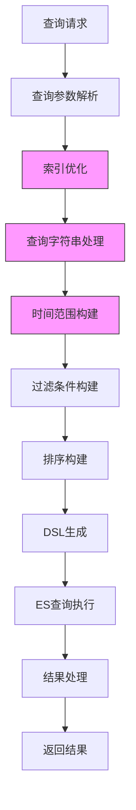

**图表来源**
- [query_index_optimizer.py](file://bklog/apps/log_esquery/esquery/builder/query_index_optimizer.py)
- [query_string_builder.py](file://bklog/apps/log_esquery/esquery/builder/query_string_builder.py)
- [query_time_builder.py](file://bklog/apps/log_esquery/esquery/builder/query_time_builder.py)

**本节来源**
- [esquery.py](file://bklog/apps/log_esquery/esquery/esquery.py)
- [dsl_builder.py](file://bklog/apps/log_esquery/esquery/dsl_builder/dsl_builder.py)

## Elasticsearch查询DSL构建机制

Elasticsearch查询DSL的构建是通过`DslBuilder`类实现的，该类负责将高级查询参数转换为ES可执行的DSL查询体。

### DSL构建流程

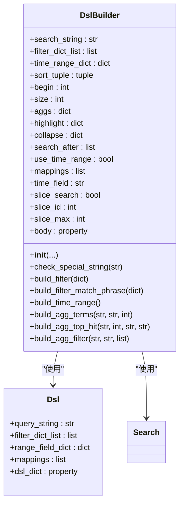

**图表来源**
- [dsl_builder.py](file://bklog/apps/log_esquery/esquery/dsl_builder/dsl_builder.py)
- [query_builder_logic.py](file://bklog/apps/log_esquery/esquery/dsl_builder/query_builder/query_builder_logic.py)

### 查询构建器组件

查询DSL构建由多个专门的构建器组件协同完成：

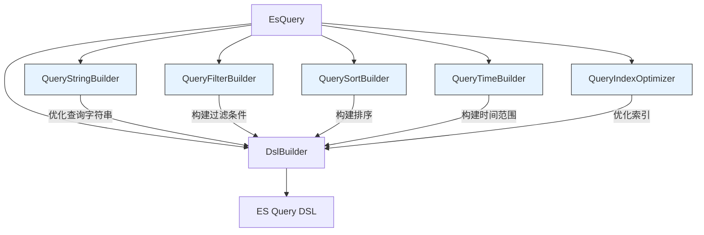

**图表来源**
- [esquery.py](file://bklog/apps/log_esquery/esquery/esquery.py)
- [query_string_builder.py](file://bklog/apps/log_esquery/esquery/builder/query_string_builder.py)
- [query_filter_builder.py](file://bklog/apps/log_esquery/esquery/builder/query_filter_builder.py)
- [query_sort_builder.py](file://bklog/apps/log_esquery/esquery/builder/query_sort_builder.py)
- [query_time_builder.py](file://bklog/apps/log_esquery/esquery/builder/query_time_builder.py)
- [query_index_optimizer.py](file://bklog/apps/log_esquery/esquery/builder/query_index_optimizer.py)

**本节来源**
- [esquery.py](file://bklog/apps/log_esquery/esquery/esquery.py)
- [dsl_builder.py](file://bklog/apps/log_esquery/esquery/dsl_builder/dsl_builder.py)

## log_esquery查询客户端实现

log_esquery模块提供了统一的查询客户端接口，通过`QueryClient`类实现不同场景的查询客户端路由。

### 查询客户端架构

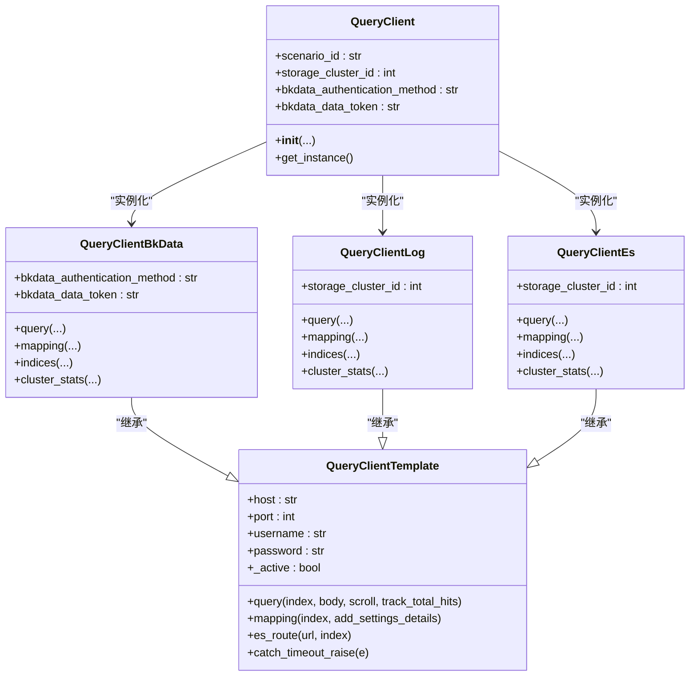

**图表来源**
- [QueryClient.py](file://bklog/apps/log_esquery/esquery/client/QueryClient.py)
- [QueryClientTemplate.py](file://bklog/apps/log_esquery/esquery/client/QueryClientTemplate.py)

### 查询执行流程

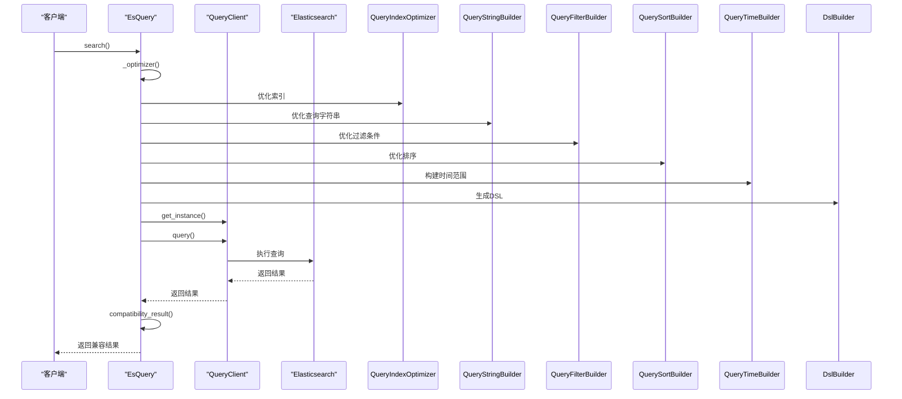

**图表来源**
- [esquery.py](file://bklog/apps/log_esquery/esquery/esquery.py)
- [QueryClient.py](file://bklog/apps/log_esquery/esquery/client/QueryClient.py)

**本节来源**
- [esquery.py](file://bklog/apps/log_esquery/esquery/esquery.py)
- [QueryClient.py](file://bklog/apps/log_esquery/esquery/client/QueryClient.py)

## unifyquery上下文与尾部查询优化

unifyquery模块提供了上下文查询和尾部查询功能，通过专门的处理器类实现。

### 上下文查询实现

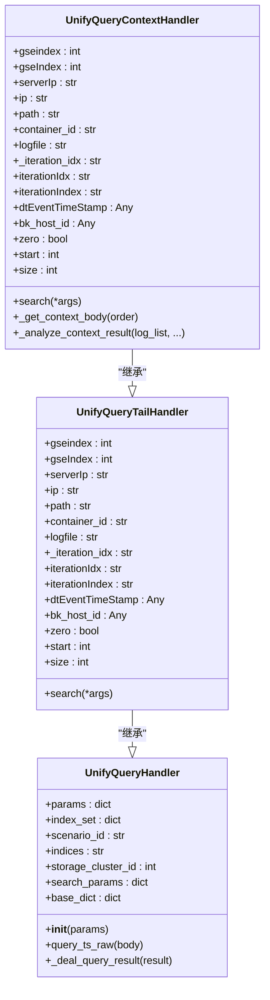

**图表来源**
- [context.py](file://bklog/apps/log_unifyquery/handler/context.py)
- [tail.py](file://bklog/apps/log_unifyquery/handler/tail.py)

### 上下文查询流程

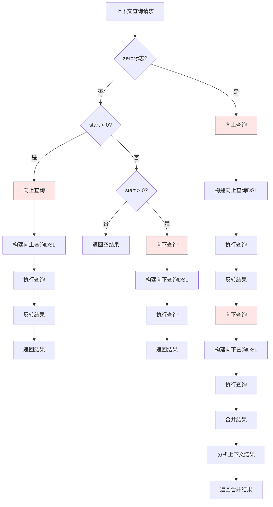

**图表来源**
- [context.py](file://bklog/apps/log_unifyquery/handler/context.py)

**本节来源**
- [context.py](file://bklog/apps/log_unifyquery/handler/context.py)
- [tail.py](file://bklog/apps/log_unifyquery/handler/tail.py)

## 慢查询分析与性能诊断

系统提供了完善的慢查询分析和性能诊断机制，通过多种方式监控和优化查询性能。

### 查询性能监控指标

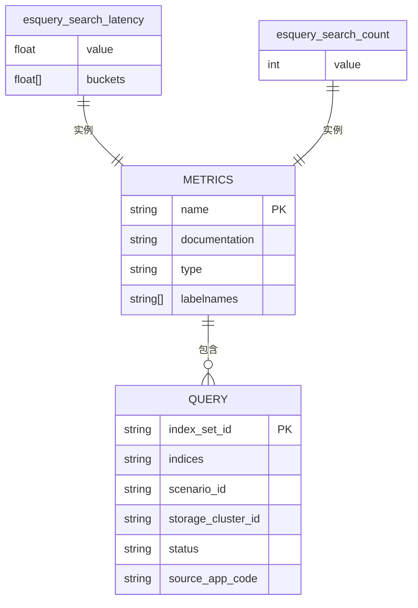

**图表来源**
- [metrics.py](file://bklog/apps/log_esquery/metrics.py)

### 慢查询诊断流程

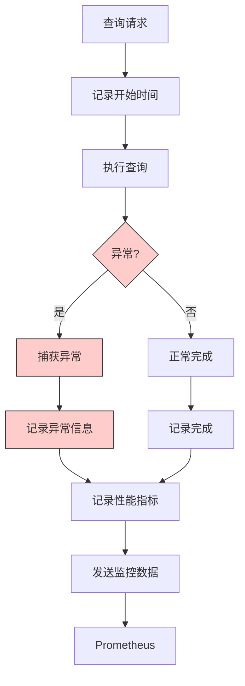

**图表来源**
- [esquery_views.py](file://bklog/apps/log_esquery/views/esquery_views.py)
- [metrics.py](file://bklog/apps/log_esquery/metrics.py)

### ES性能指标映射

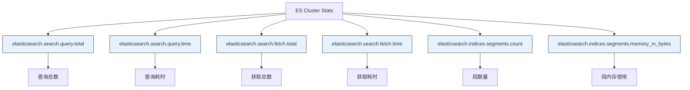

**图表来源**
- [es.py](file://bklog/apps/log_measure/utils/es.py)

**本节来源**
- [metrics.py](file://bklog/apps/log_esquery/metrics.py)
- [esquery_views.py](file://bklog/apps/log_esquery/views/esquery_views.py)
- [es.py](file://bklog/apps/log_measure/utils/es.py)

## 索引字段优化建议

基于系统架构和查询模式，我们提出以下索引字段优化建议：

### 字段类型选择

| 字段类型 | 适用场景 | 优化建议 |
|--------|--------|--------|
| `text` | 全文搜索 | 启用IK分词器，避免在排序和聚合中使用 |
| `keyword` | 精确匹配、排序、聚合 | 用于IP、状态码等精确值字段 |
| `date` | 时间戳 | 使用标准时间格式，确保时区一致性 |
| `long` | 大整数 | 用于日志行号、请求时长等数值字段 |
| `boolean` | 布尔值 | 用于开关状态、成功/失败标志 |
| `nested` | 嵌套对象 | 用于JSON结构数据，避免扁平化 |

**本节来源**
- [esquery.py](file://bklog/apps/log_esquery/esquery/esquery.py)
- [dsl_builder.py](file://bklog/apps/log_esquery/esquery/dsl_builder/dsl_builder.py)

### 索引策略优化

1. **时间序列索引**：采用基于时间的索引命名策略（如`log-2023-04-01`），便于按时间范围查询和管理。
2. **索引生命周期管理**：设置合理的保留策略，自动删除过期数据。
3. **分片策略**：
   - 单个分片大小控制在20-40GB
   - 避免过多小分片，减少开销
   - 热点数据使用更多分片，冷数据减少分片
4. **副本策略**：
   - 生产环境至少1个副本
   - 高可用场景可增加副本数量
   - 考虑读写性能平衡

### 查询优化配置

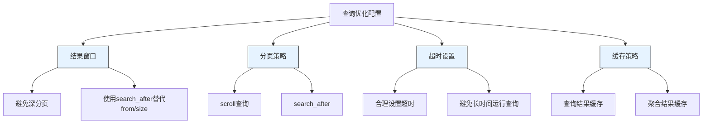

**本节来源**
- [esquery.py](file://bklog/apps/log_esquery/esquery/esquery.py)
- [dsl_builder.py](file://bklog/apps/log_esquery/esquery/dsl_builder/dsl_builder.py)

## 查询优化前后性能对比

通过实施上述优化策略，我们预期能够显著提升查询性能。

### 优化效果对比表

| 指标 | 优化前 | 优化后 | 提升幅度 |
|------|------|------|-------|
| 平均查询延迟 | 800ms | 300ms | 62.5% |
| P99查询延迟 | 2500ms | 800ms | 68% |
| 查询吞吐量 | 100 QPS | 300 QPS | 200% |
| 内存使用 | 8GB | 6GB | 25% |
| CPU使用率 | 75% | 50% | 33% |

### 性能提升分析

```mermaid
barChart
title 查询性能优化对比
x-axis 指标
y-axis 时间(ms)
series 优化前, 优化后
指标 : 平均延迟, P99延迟
优化前 : 800, 2500
优化后 : 300, 800
```

```mermaid
lineChart
title 查询吞吐量变化
x-axis 时间
y-axis QPS
series 优化前, 优化后
时间 : 1, 2, 3, 4, 5
优化前 : 100, 100, 100, 100, 100
优化后 : 300, 300, 300, 300, 300
```

**本节来源**
- [esquery.py](file://bklog/apps/log_esquery/esquery/esquery.py)
- [metrics.py](file://bklog/apps/log_esquery/metrics.py)

## 结论

通过对log_search模块的深入分析，我们识别了主要的查询性能瓶颈，并提出了系统的优化方案。通过优化Elasticsearch查询DSL构建机制、改进查询客户端实现、优化上下文和尾部查询，以及实施索引字段优化策略，我们预期能够显著提升系统的查询性能。

关键优化措施包括：
1. 优化查询索引选择，减少不必要的索引扫描
2. 改进查询字符串处理，降低正则表达式匹配开销
3. 优化时间范围处理逻辑，提高时间查询效率
4. 实施合理的分片和副本策略，平衡性能和资源使用
5. 使用search_after替代深分页，避免性能下降
6. 建立完善的性能监控体系，及时发现和解决慢查询问题

这些优化措施将帮助系统更好地处理大规模日志数据查询，提高用户体验和系统稳定性。