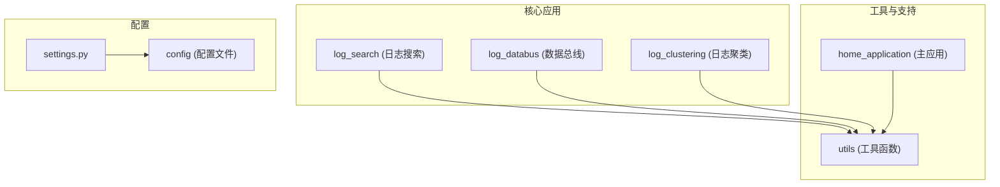
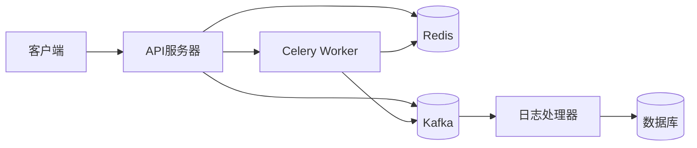
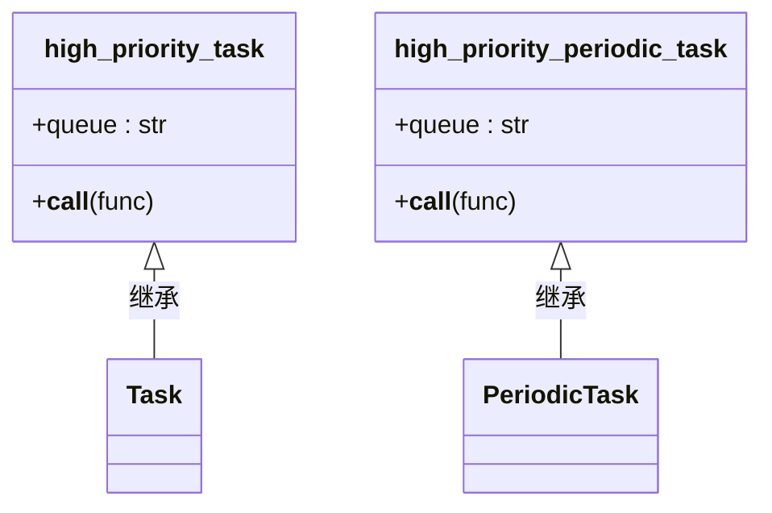
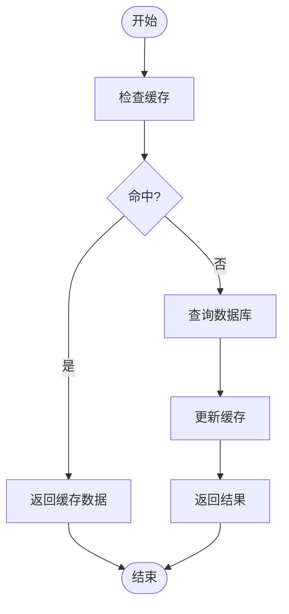
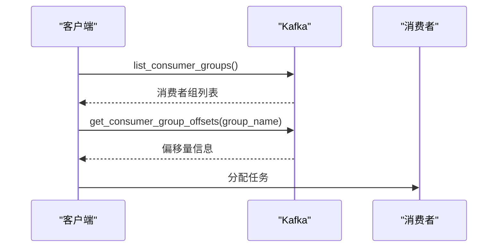
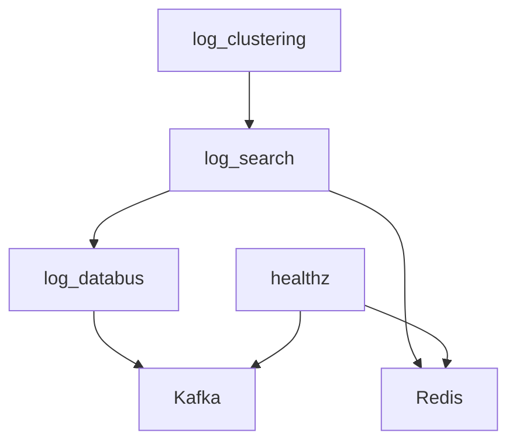

# 资源调优

<cite>
**本文档引用的文件**   
- [default.py](file://bklog/config/default.py)
- [task.py](file://bklog/apps/utils/task.py)
- [kafka.py](file://bklog/home_application/utils/kafka.py)
- [redis.py](file://bklog/home_application/handlers/healthz_metrics/redis.py)
- [kafka.py](file://bklog/home_application/handlers/healthz_metrics/kafka.py)
- [mysql.py](file://bklog/home_application/handlers/healthz_metrics/mysql.py)
- [metrics.py](file://bklog/home_application/handlers/metrics.py)
- [sentinel.py](file://bklog/apps/utils/sentinel.py)
- [kafka_checker.py](file://bklog/apps/log_databus/handlers/check_collector/checker/kafka_checker.py)
- [kafka.py](file://bklog/apps/log_databus/handlers/kafka.py)
</cite>

## 目录
1. [引言](#引言)
2. [项目结构](#项目结构)
3. [核心组件](#核心组件)
4. [架构概述](#架构概述)
5. [详细组件分析](#详细组件分析)
6. [依赖分析](#依赖分析)
7. [性能考量](#性能考量)
8. [故障排除指南](#故障排除指南)
9. [结论](#结论)

## 引言
本文档旨在提供一个系统性的资源调优指南，以优化蓝鲸日志平台的各项资源配置。通过分析Celery任务队列、log_clustering模块中的定时任务执行模式、healthz健康检查模块的监控指标以及Redis缓存和Kafka消费者组配置，我们将为系统级监控指标解读提供指导，并提出具体的优化建议。

## 项目结构
蓝鲸日志平台的代码库遵循典型的Django应用结构，其中包含了多个子应用（apps），每个子应用负责特定的功能领域。关键的应用包括`log_search`、`log_databus`、`log_clustering`等，它们分别处理日志搜索、数据总线和日志聚类功能。此外，`home_application`包含了一些通用的处理逻辑和健康检查机制。

**图源**
- [default.py](file://bklog/config/default.py)
- [settings.py](file://bklog/settings.py)

**节源**
- [default.py](file://bklog/config/default.py)
- [settings.py](file://bklog/settings.py)

## 核心组件
本节将深入分析几个关键组件：Celery任务队列、Redis缓存、Kafka消息队列以及healthz健康检查模块。

**节源**
- [default.py](file://bklog/config/default.py)
- [task.py](file://bklog/apps/utils/task.py)
- [redis.py](file://bklog/home_application/handlers/healthz_metrics/redis.py)
- [kafka.py](file://bklog/home_application/utils/kafka.py)

## 架构概述
整个系统的架构围绕着微服务设计原则构建，各个组件通过API进行通信。Celery作为异步任务调度器，负责执行后台任务；Redis用作缓存层，提高读取速度；Kafka则作为消息中间件，确保数据流的可靠传输。

**图源**
- [default.py](file://bklog/config/default.py)
- [task.py](file://bklog/apps/utils/task.py)
- [kafka.py](file://bklog/home_application/utils/kafka.py)

## 详细组件分析

### Celery任务队列优化
Celery是该系统中用于处理异步任务的关键组件。根据`config/default.py`中的配置，可以通过环境变量`BK_CELERYD_CONCURRENCY`来调整并发数，默认值为2。为了优化性能，可以根据实际负载情况动态调整此参数。

#### 高优先级任务
在`apps/utils/task.py`中定义了高优先级任务装饰器`high_priority_task`，它允许指定不同的队列，从而实现任务的优先级划分。

**图源**
- [task.py](file://bklog/apps/utils/task.py)

**节源**
- [task.py](file://bklog/apps/utils/task.py)
- [default.py](file://bklog/config/default.py)

### Redis缓存配置优化
Redis在系统中扮演着缓存的角色，其配置位于`config/default.py`。默认情况下，如果启用了Redis（USE_REDIS=True），则会使用Redis作为默认缓存后端。

#### 缓存策略
- **内存策略**：建议采用LRU（Least Recently Used）淘汰策略，以保证最常访问的数据保留在内存中。
- **连接池设置**：合理配置连接池大小，避免过多的连接导致资源浪费。
- **缓存失效机制**：利用TTL（Time To Live）特性自动清理过期数据。

**图源**
- [default.py](file://bklog/config/default.py)
- [redis.py](file://bklog/home_application/handlers/healthz_metrics/redis.py)

**节源**
- [default.py](file://bklog/config/default.py)
- [redis.py](file://bklog/home_application/handlers/healthz_metrics/redis.py)

### Kafka消费者组配置优化
Kafka作为消息中间件，在`home_application/utils/kafka.py`中有详细的客户端实现。通过`KafkaAdminClient`可以管理消费者组和获取偏移量信息。

#### 消费者组监控
定期检查消费者组的滞后情况，确保没有积压的消息。可以通过`get_consumer_group_offsets`方法获取特定消费者组的偏移量。

**图源**
- [kafka.py](file://bklog/home_application/utils/kafka.py)
- [kafka.py](file://bklog/home_application/handlers/healthz_metrics/kafka.py)

**节源**
- [kafka.py](file://bklog/home_application/utils/kafka.py)
- [kafka.py](file://bklog/home_application/handlers/healthz_metrics/kafka.py)

## 依赖分析
系统内部各组件之间存在紧密的依赖关系。例如，`log_search`依赖于`log_databus`提供的数据流，而`log_clustering`又依赖于`log_search`的结果。外部依赖如Redis和Kafka也需要稳定运行。

**图源**
- [default.py](file://bklog/config/default.py)
- [kafka.py](file://bklog/home_application/utils/kafka.py)
- [redis.py](file://bklog/home_application/handlers/healthz_metrics/redis.py)

**节源**
- [default.py](file://bklog/config/default.py)
- [kafka.py](file://bklog/home_application/utils/kafka.py)
- [redis.py](file://bklog/home_application/handlers/healthz_metrics/redis.py)

## 性能考量
针对CPU、内存、I/O使用情况进行监控，结合`healthz`模块提供的健康检查指标，可以建立资源使用的基线并识别异常模式。例如，当Redis命中率下降或Kafka消费者滞后增加时，应及时调整资源配置。

## 故障排除指南
当遇到性能问题时，首先应检查以下几点：
- Celery worker是否正常工作
- Redis缓存命中率是否正常
- Kafka消费者是否有大量未消费的消息
- MySQL数据库连接是否稳定

**节源**
- [mysql.py](file://bklog/home_application/handlers/healthz_metrics/mysql.py)
- [redis.py](file://bklog/home_application/handlers/healthz_metrics/redis.py)
- [kafka.py](file://bklog/home_application/handlers/healthz_metrics/kafka.py)

## 结论
通过对Celery任务队列、Redis缓存、Kafka消息队列及healthz健康检查模块的综合分析，我们能够系统性地优化系统资源配置。建议定期审查这些组件的状态，并根据实际负载动态调整配置参数，以确保系统的高效稳定运行。