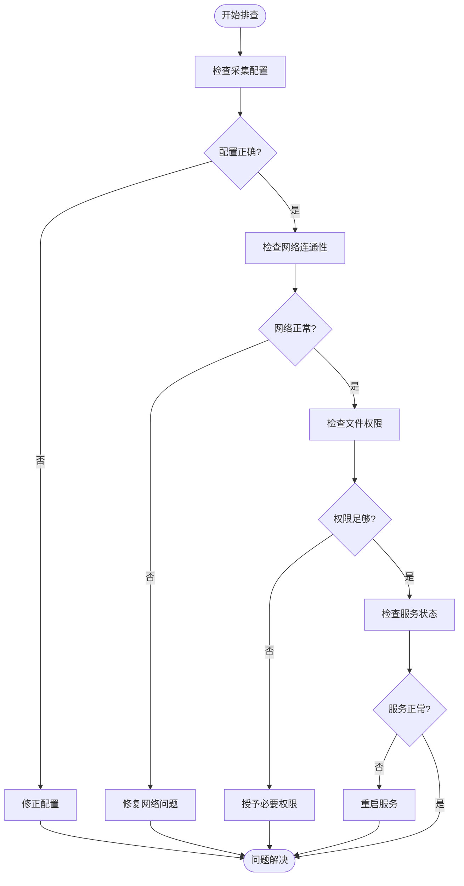
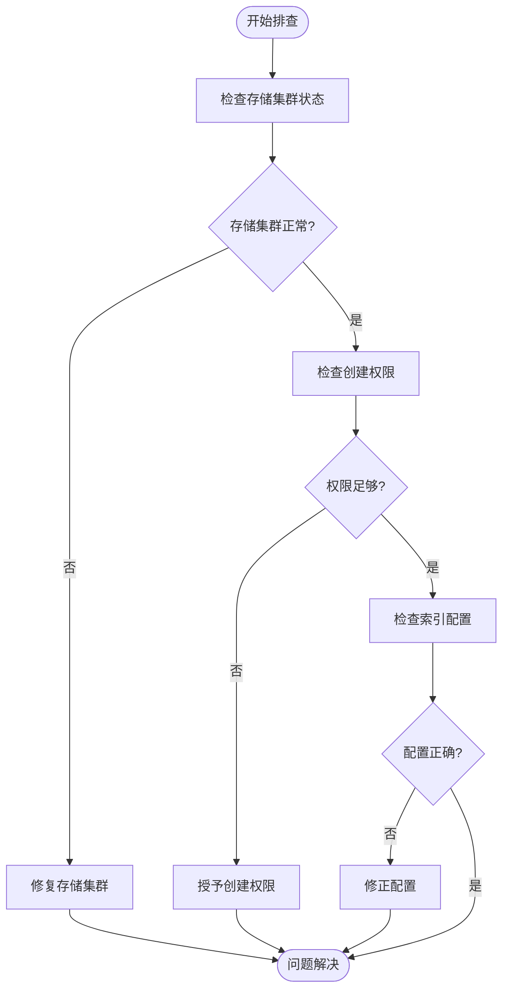
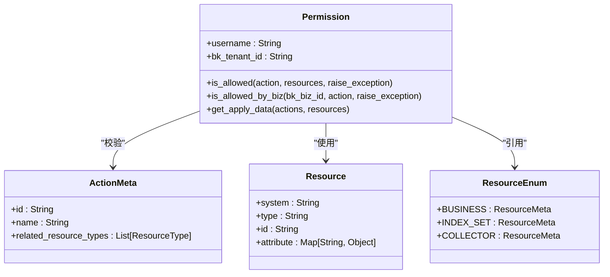
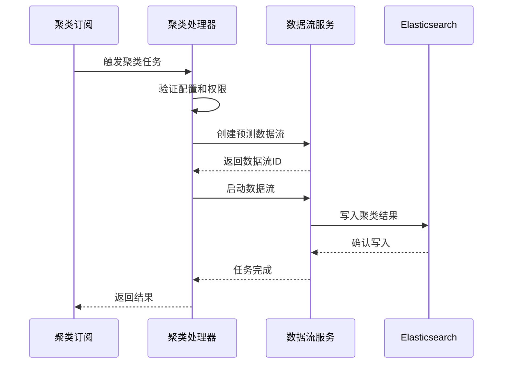
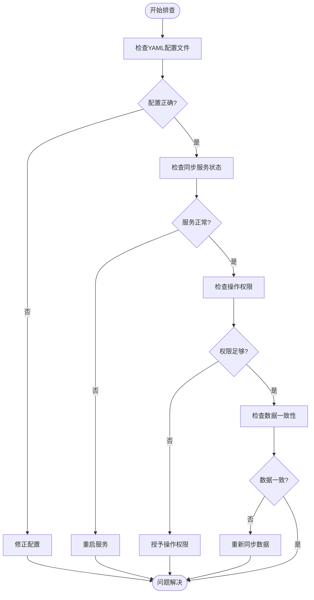

# 常见问题

<cite>
**本文档引用的文件**   
- [sync_built_in_platform_collect.py](file://bklog/apps/log_databus/management/commands/sync_built_in_platform_collect.py)
- [subscription.py](file://bklog/apps/log_clustering/tasks/subscription.py)
- [permission.py](file://bklog/apps/iam/handlers/permission.py)
- [collector_views.py](file://bklog/apps/log_databus/views/collector_views.py)
- [models.py](file://bklog/apps/log_databus/models.py)
- [clustering_config.py](file://bklog/apps/log_clustering/handlers/clustering_config.py)
- [dataflow_handler.py](file://bklog/apps/log_clustering/handlers/dataflow/dataflow_handler.py)
</cite>

## 目录
1. [日志采集失败](#日志采集失败)
2. [索引创建异常](#索引创建异常)
3. [权限校验错误](#权限校验错误)
4. [聚类任务卡顿](#聚类任务卡顿)
5. [数据同步失败](#数据同步失败)

## 日志采集失败

日志采集失败是监控系统中最常见的问题之一，通常表现为无法从目标主机收集日志数据。该问题可能由多种原因引起，包括配置错误、网络隔离、权限不足等。

**现象**：
- 采集项状态显示为失败或未运行
- 无法查看实时日志数据
- 任务执行详情中显示错误信息

**可能原因**：
1. **配置错误**：采集路径、过滤条件等配置不正确
2. **网络隔离**：采集器与目标主机之间存在网络隔离
3. **权限不足**：采集器没有足够的权限访问日志文件
4. **服务异常**：节点管理服务或GSE服务异常

**解决方案**：
1. 检查采集配置是否正确，特别是日志路径和过滤条件
2. 验证网络连通性，确保采集器能够访问目标主机
3. 检查文件权限，确保采集器有读取日志文件的权限
4. 查看服务状态，确认节点管理服务和GSE服务正常运行

**检查清单**：
- 服务状态：节点管理、GSE、采集器
- 配置一致性：采集路径、过滤条件
- 依赖组件健康度：网络连通性、文件权限

**Diagram sources**
- [sync_built_in_platform_collect.py](file://bklog/apps/log_databus/management/commands/sync_built_in_platform_collect.py#L69-L104)
- [collector_views.py](file://bklog/apps/log_databus/views/collector_views.py#L873-L893)

**Section sources**
- [sync_built_in_platform_collect.py](file://bklog/apps/log_databus/management/commands/sync_built_in_platform_collect.py#L69-L104)
- [collector_views.py](file://bklog/apps/log_databus/views/collector_views.py#L873-L893)

## 索引创建异常

索引创建异常通常发生在日志数据入库过程中，导致无法在Elasticsearch中创建相应的索引。

**现象**：
- 索引集创建失败
- 数据无法查询
- 存储配置异常

**可能原因**：
1. **存储集群异常**：ES集群不可用或配置错误
2. **权限问题**：没有足够的权限创建索引
3. **配置冲突**：索引名称冲突或配置参数不匹配

**解决方案**：
1. 检查存储集群状态，确保ES集群正常运行
2. 验证权限配置，确保有足够的权限创建索引
3. 检查索引配置，避免名称冲突和参数错误

**检查清单**：
- 服务状态：ES集群、存储服务
- 配置一致性：索引名称、分片配置
- 依赖组件健康度：磁盘空间、内存使用

**Diagram sources**
- [sync_built_in_platform_collect.py](file://bklog/apps/log_databus/management/commands/sync_built_in_platform_collect.py#L168-L193)
- [models.py](file://bklog/apps/log_databus/models.py#L149-L150)

**Section sources**
- [sync_built_in_platform_collect.py](file://bklog/apps/log_databus/management/commands/sync_built_in_platform_collect.py#L168-L193)
- [models.py](file://bklog/apps/log_databus/models.py#L149-L150)

## 权限校验错误

权限校验错误是由于用户或系统没有足够的权限执行特定操作而导致的。

**现象**：
- 操作被拒绝
- 提示权限不足
- 无法访问特定资源

**可能原因**：
1. **权限配置错误**：用户角色或权限组配置不正确
2. **权限中心异常**：IAM服务异常或配置错误
3. **临时权限失效**：Token过期或权限临时失效

**解决方案**：
1. 检查用户角色和权限组配置
2. 验证权限中心服务状态
3. 重新获取权限Token

**检查清单**：
- 服务状态：IAM服务
- 配置一致性：用户角色、权限组
- 依赖组件健康度：认证服务、Token服务

**Diagram sources**
- [permission.py](file://bklog/apps/iam/handlers/permission.py#L57-L293)
- [models.py](file://bklog/apps/log_databus/models.py#L121-L193)

**Section sources**
- [permission.py](file://bklog/apps/iam/handlers/permission.py#L57-L293)
- [models.py](file://bklog/apps/log_databus/models.py#L121-L193)

## 聚类任务卡顿

聚类任务卡顿是指日志聚类分析任务执行缓慢或停滞不前。

**现象**：
- 聚类任务长时间运行
- 任务进度停滞
- 系统资源占用高

**可能原因**：
1. **数据量过大**：待处理日志数据量超出处理能力
2. **资源不足**：计算资源或存储资源不足
3. **配置不当**：聚类参数配置不合理

**解决方案**：
1. 优化数据采样策略，减少处理数据量
2. 增加计算资源，提高处理能力
3. 调整聚类参数，优化处理效率

**检查清单**：
- 服务状态：计算服务、存储服务
- 配置一致性：聚类参数、资源配额
- 依赖组件健康度：CPU、内存、磁盘

**Diagram sources**
- [clustering_config.py](file://bklog/apps/log_clustering/handlers/clustering_config.py#L101-L132)
- [dataflow_handler.py](file://bklog/apps/log_clustering/handlers/dataflow/dataflow_handler.py#L1409-L1563)

**Section sources**
- [clustering_config.py](file://bklog/apps/log_clustering/handlers/clustering_config.py#L101-L132)
- [dataflow_handler.py](file://bklog/apps/log_clustering/handlers/dataflow/dataflow_handler.py#L1409-L1563)

## 数据同步失败

数据同步失败涉及平台内置采集项和聚类订阅的数据同步问题。

**现象**：
- 内置采集项未创建
- 聚类订阅未触发
- 数据不一致

**可能原因**：
1. **配置文件错误**：YAML配置文件格式或内容错误
2. **服务异常**：同步服务或依赖服务异常
3. **权限不足**：缺少必要的操作权限

**解决方案**：
1. 检查YAML配置文件，确保格式和内容正确
2. 验证服务状态，确保同步服务正常运行
3. 检查权限配置，确保有足够的操作权限

**检查清单**：
- 服务状态：同步服务、依赖服务
- 配置一致性：YAML配置、环境变量
- 依赖组件健康度：数据库、消息队列

**Diagram sources**
- [sync_built_in_platform_collect.py](file://bklog/apps/log_databus/management/commands/sync_built_in_platform_collect.py#L69-L104)
- [subscription.py](file://bklog/apps/log_clustering/tasks/subscription.py#L397-L439)

**Section sources**
- [sync_built_in_platform_collect.py](file://bklog/apps/log_databus/management/commands/sync_built_in_platform_collect.py#L69-L104)
- [subscription.py](file://bklog/apps/log_clustering/tasks/subscription.py#L397-L439)