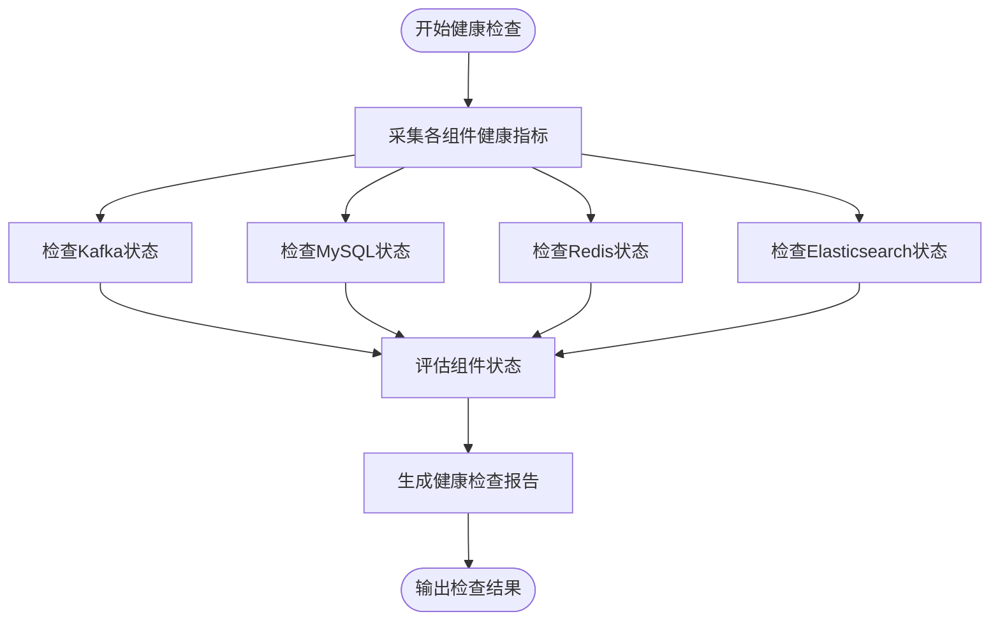
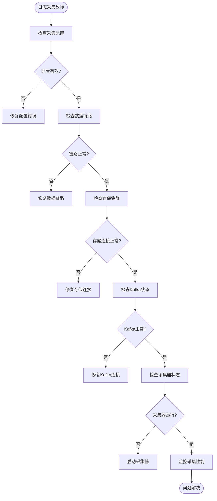
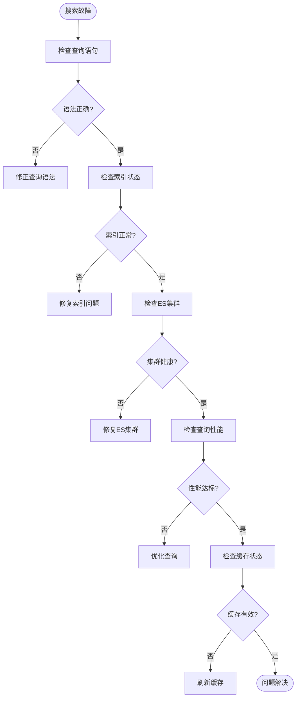
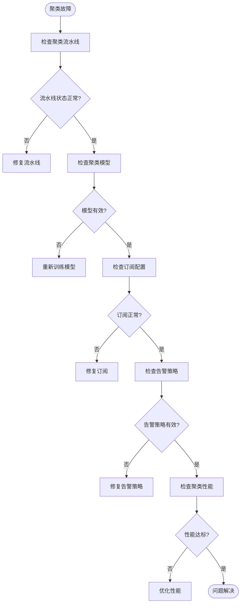

# 故障排查

<cite>
**本文档引用的文件**  
- [healthz.py](file://bklog/home_application/management/commands/healthz.py)
- [healthz.py](file://bklog/home_application/handlers/healthz.py)
- [metrics.py](file://bklog/home_application/handlers/metrics.py)
- [healthz_metrics/kafka.py](file://bklog/home_application/handlers/healthz_metrics/kafka.py)
- [healthz_metrics/mysql.py](file://bklog/home_application/handlers/healthz_metrics/mysql.py)
- [log_databus/exceptions.py](file://bklog/apps/log_databus/exceptions.py)
- [log_esquery/metrics.py](file://bklog/apps/log_esquery/metrics.py)
- [log_clustering/constants.py](file://bklog/apps/log_clustering/constants.py)
- [log_clustering/handlers/clustering_monitor.py](file://bklog/apps/log_clustering/handlers/clustering_monitor.py)
- [log_search/handlers/alert_strategy.py](file://bklog/apps/log_search/handlers/alert_strategy.py)
- [log_extract/handlers/tasks.py](file://bklog/apps/log_extract/handlers/tasks.py)
- [log_clustering/views/clustering_config_views.py](file://bklog/apps/log_clustering/views/clustering_config_views.py)
- [log_measure/utils/es.py](file://bklog/apps/log_measure/utils/es.py)
</cite>

## 目录
1. [简介](#简介)
2. [系统健康检查](#系统健康检查)
3. [核心模块故障排查](#核心模块故障排查)
4. [关键监控指标与告警阈值](#关键监控指标与告警阈值)
5. [故障案例库](#故障案例库)
6. [管理命令诊断工具](#管理命令诊断工具)

## 简介
本手册旨在为蓝鲸日志平台（BK-LOG）提供全面的故障排查指南，涵盖服务不可用、性能下降、数据同步失败等典型故障场景。通过详细的排查流程、诊断工具使用方法和历史故障案例，帮助运维人员快速定位和解决系统问题。

## 系统健康检查

蓝鲸日志平台提供了全面的健康检查机制，通过`healthz`命令可以检查系统各个组件的运行状态。该机制通过采集多个命名空间的健康指标，提供系统整体健康状况的评估。



**图表来源**
- [healthz.py](file://bklog/home_application/management/commands/healthz.py#L28-L49)
- [healthz.py](file://bklog/home_application/handlers/healthz.py#L29-L120)
- [metrics.py](file://bklog/home_application/handlers/metrics.py#L103-L123)

**本节来源**
- [healthz.py](file://bklog/home_application/management/commands/healthz.py#L28-L49)
- [healthz.py](file://bklog/home_application/handlers/healthz.py#L29-L120)

## 核心模块故障排查

### 日志采集模块排查

日志采集模块是蓝鲸日志平台的核心组件之一，负责从各种数据源收集日志数据。常见故障包括采集配置异常、数据链路问题和存储集群连接失败。



**图表来源**
- [log_databus/exceptions.py](file://bklog/apps/log_databus/exceptions.py#L30-L424)
- [log_databus/serializers.py](file://bklog/apps/log_databus/serializers.py#L1602-L1632)

**本节来源**
- [log_databus/exceptions.py](file://bklog/apps/log_databus/exceptions.py#L30-L424)
- [log_databus/serializers.py](file://bklog/apps/log_databus/serializers.py#L1602-L1632)

### 搜索模块排查

搜索模块负责处理用户的日志查询请求，常见故障包括查询超时、结果不准确和性能下降。



**图表来源**
- [log_esquery/metrics.py](file://bklog/apps/log_esquery/metrics.py#L7-L21)
- [log_esquery/esquery/esquery.py](file://bklog/apps/log_esquery/esquery/esquery.py#L272-L298)

**本节来源**
- [log_esquery/metrics.py](file://bklog/apps/log_esquery/metrics.py#L7-L21)
- [log_esquery/esquery/esquery.py](file://bklog/apps/log_esquery/esquery/esquery.py#L272-L298)

### 聚类模块排查

聚类模块负责对日志进行智能分析和模式识别，常见故障包括聚类任务失败、新类识别异常和告警策略失效。



**图表来源**
- [log_clustering/views/clustering_config_views.py](file://bklog/apps/log_clustering/views/clustering_config_views.py#L104-L125)
- [log_clustering/handlers/pattern.py](file://bklog/apps/log_clustering/handlers/pattern.py#L85-L441)
- [log_clustering/tasks/subscription.py](file://bklog/apps/log_clustering/tasks/subscription.py#L187-L218)

**本节来源**
- [log_clustering/views/clustering_config_views.py](file://bklog/apps/log_clustering/views/clustering_config_views.py#L104-L125)
- [log_clustering/handlers/pattern.py](file://bklog/apps/log_clustering/handlers/pattern.py#L85-L441)
- [log_clustering/tasks/subscription.py](file://bklog/apps/log_clustering/tasks/subscription.py#L187-L218)

## 关键监控指标与告警阈值

### 核心监控指标

| 指标名称 | 指标描述 | 数据来源 | 告警阈值 | 处理建议 |
|--------|--------|--------|--------|--------|
| esquery_search_latency | ES查询延迟 | log_esquery模块 | >10秒持续5分钟 | 优化查询语句，检查ES集群性能 |
| esquery_search_count | ES查询次数 | log_esquery模块 | 异常突增 | 检查是否有异常查询行为 |
| consumer_offsets | Kafka消费者偏移量 | Kafka组件 | 偏移量持续增长 | 检查消费者处理能力 |
| mysql_status | MySQL状态 | MySQL组件 | 连接失败 | 检查MySQL服务状态 |
| elasticsearch.primaries.search.query.time | ES查询时间 | Elasticsearch组件 | >5000ms | 优化索引和查询 |
| elasticsearch.primaries.refresh.external.total.time | ES刷新时间 | Elasticsearch组件 | >10000ms | 调整刷新间隔 |

**本节来源**
- [log_esquery/metrics.py](file://bklog/apps/log_esquery/metrics.py#L7-L21)
- [log_measure/utils/es.py](file://bklog/apps/log_measure/utils/es.py#L79-L756)
- [healthz_metrics/kafka.py](file://bklog/home_application/handlers/healthz_metrics/kafka.py#L60-L86)
- [healthz_metrics/mysql.py](file://bklog/home_application/handlers/healthz_metrics/mysql.py#L73-L85)

## 故障案例库

### 案例1：日志采集中断

**问题现象**：某业务的日志采集突然中断，新日志无法进入系统。

**排查流程**：
1. 检查采集配置状态
2. 验证数据链路连接
3. 检查存储集群状态
4. 查看Kafka消费者偏移量

**根因分析**：存储集群连接异常，由于ES集群节点故障导致。

**解决方案**：
1. 重启ES集群节点
2. 重新部署采集配置
3. 验证采集恢复正常

**本节来源**
- [log_databus/exceptions.py](file://bklog/apps/log_databus/exceptions.py#L171-L173)
- [log_databus/tasks/collector.py](file://bklog/apps/log_databus/tasks/collector.py#L378-L416)

### 案例2：搜索性能下降

**问题现象**：用户反映日志搜索响应时间变长，部分查询超时。

**排查流程**：
1. 检查ES集群健康状态
2. 分析慢查询日志
3. 检查索引分片情况
4. 监控系统资源使用率

**根因分析**：索引分片过多导致查询性能下降。

**解决方案**：
1. 优化索引分片策略
2. 实施冷热数据分离
3. 调整查询缓存配置

**本节来源**
- [log_esquery/metrics.py](file://bklog/apps/log_esquery/metrics.py#L7-L21)
- [log_measure/utils/es.py](file://bklog/apps/log_measure/utils/es.py#L79-L756)

### 案例3：聚类任务失败

**问题现象**：聚类任务执行失败，无法生成新的日志模式。

**排查流程**：
1. 检查聚类流水线状态
2. 验证模型配置
3. 检查订阅配置
4. 查看任务执行日志

**根因分析**：聚类流水线中的某个节点配置错误。

**解决方案**：
1. 修复流水线节点配置
2. 重新启动聚类任务
3. 验证聚类结果

**本节来源**
- [log_clustering/views/clustering_config_views.py](file://bklog/apps/log_clustering/views/clustering_config_views.py#L104-L125)
- [log_extract/handlers/tasks.py](file://bklog/apps/log_extract/handlers/tasks.py#L255-L349)

## 管理命令诊断工具

### healthz健康检查命令

`healthz`命令是系统自带的健康检查工具，可以全面检查系统各个组件的运行状态。

**使用方法**：
```bash
python manage.py healthz [--include <namespaces>] [--exclude <namespaces>]
```

**参数说明**：
- `--include`: 指定要检查的命名空间，多个用逗号分隔
- `--exclude`: 指定要排除的命名空间，多个用逗号分隔

**输出格式**：
- 控制台格式：带颜色的文本输出，便于人工阅读
- JSON格式：结构化数据，便于程序处理
- Kubernetes格式：符合Kubernetes探针规范

**本节来源**
- [healthz.py](file://bklog/home_application/management/commands/healthz.py#L28-L49)
- [healthz.py](file://bklog/home_application/handlers/healthz.py#L29-L120)

### 其他诊断命令

系统还提供了其他管理命令用于诊断和修复：

| 命令名称 | 功能描述 | 使用场景 |
|--------|--------|--------|
| create_dashboard | 创建仪表盘 | 快速创建监控视图 |
| manage_extract_config | 管理提取配置 | 修复字段提取问题 |
| check_bkunifylogbeat | 检查日志采集器 | 验证采集器状态 |

**本节来源**
- [config/default.py](file://bklog/config/default.py#L650-L687)
- [support-files/iam/legacy.json](file://bklog/support-files/iam/legacy.json#L428-L465)