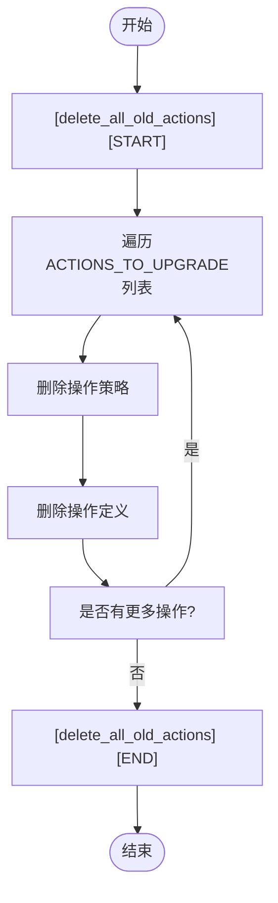

# 诊断工具

<cite>
**本文档引用的文件**
- [init_data_link.py](file://bklog/apps/log_databus/management/commands/init_data_link.py)
- [iam_delete_action_v1.py](file://bklog/apps/iam/management/commands/iam_delete_action_v1.py)
- [sync_pattern.py](file://bklog/apps/log_clustering/tasks/sync_pattern.py)
- [DataLinkConfig](file://bklog/apps/log_databus/models.py#L201-L230)
- [CollectorConfig](file://bklog/apps/log_databus/models.py#L101-L200)
</cite>

## 目录
1. [引言](#引言)
2. [核心诊断工具概述](#核心诊断工具概述)
3. [数据链路初始化修复工具](#数据链路初始化修复工具)
4. [权限模型清理工具](#权限模型清理工具)
5. [聚类模式同步工具](#聚类模式同步工具)
6. [日志分析与执行结果验证](#日志分析与执行结果验证)
7. [典型故障场景处理流程](#典型故障场景处理流程)
8. [操作风险与回滚方案](#操作风险与回滚方案)

## 引言
本文档详细说明蓝鲸日志平台系统内置的管理命令和任务作为诊断工具的使用方法。重点介绍在数据链路初始化异常、权限模型损坏和聚类模式同步失败等场景下的修复机制，提供各命令的参数说明、执行时机和预期输出，以及结合日志输出分析命令执行结果的方法。

## 核心诊断工具概述
系统提供了三个关键的诊断工具，分别用于解决数据链路、权限模型和聚类模式相关的故障：

1. **init_data_link.py**：用于修复数据链路初始化异常
2. **iam_delete_action_v1.py**：用于清理损坏的权限模型
3. **sync_pattern.py**：用于手动触发聚类模式同步

这些工具作为系统维护和故障排除的重要手段，能够在特定场景下恢复系统正常功能。

**Section sources**
- [init_data_link.py](file://bklog/apps/log_databus/management/commands/init_data_link.py)
- [iam_delete_action_v1.py](file://bklog/apps/iam/management/commands/iam_delete_action_v1.py)
- [sync_pattern.py](file://bklog/apps/log_clustering/tasks/sync_pattern.py)

## 数据链路初始化修复工具

### 功能说明
`init_data_link.py` 命令用于在数据链路初始化异常时进行修复。当系统部署后数据未同步时，该工具可以初始化默认的数据链路配置，确保采集数据能够正常传输和存储。

### 参数说明
- `--es_cluster_id`：Elasticsearch集群ID（可选，多个ID用空格分隔）
- `--kafka_cluster_id`：Kafka集群ID（可选）
- `--transfer_cluster_id`：Transfer集群ID（可选）
- `--bk_tenant_id`：租户ID（可选，默认使用系统配置）

### 执行时机
- 系统首次部署后
- 数据链路配置丢失或损坏时
- 新增采集配置但无法正常传输数据时

### 预期输出
```
[Init Default Data Link] operate SUCCESS!DataLinkConfig item exist. SKIP.
```
或
```
[Init Default Data Link] operate SUCCESS!
```
或在失败时：
```
[Init Default Data Link] operate FAILED!details: [具体错误信息]
```

### 工作机制
1. 检查是否已存在数据链路配置，若存在则跳过
2. 若未指定参数，则自动获取默认的ES、Kafka和Transfer集群
3. 创建默认数据链路配置
4. 将存量采集配置切换至默认链路


**Diagram sources**
- [init_data_link.py](file://bklog/apps/log_databus/management/commands/init_data_link.py#L46-L95)
- [DataLinkConfig](file://bklog/apps/log_databus/models.py#L201-L230)

**Section sources**
- [init_data_link.py](file://bklog/apps/log_databus/management/commands/init_data_link.py)
- [DataLinkConfig](file://bklog/apps/log_databus/models.py#L201-L230)

## 权限模型清理工具

### 功能说明
`iam_delete_action_v1.py` 命令用于在权限模型损坏时进行清理。当权限策略未生效或出现权限冲突时，该工具可以删除旧版本的IAM操作定义和策略，恢复权限系统的正常状态。

### 参数说明
该命令无参数，执行时会自动处理所有需要升级的权限操作。

### 执行时机
- 权限策略未生效时
- 升级后出现权限冲突时
- IAM模型损坏需要清理时

### 预期输出
```
[delete_all_old_actions] [START]
delete iam action policy [view_business], result: (True, '')
delete iam action [view_business], result: True
delete iam action policy [search_log], result: (True, '')
delete iam action [search_log], result: True
...
[delete_all_old_actions] [END]
```

### 清理机制
1. 遍历所有需要升级的权限操作
2. 删除每个操作的策略
3. 删除每个操作的定义
4. 输出清理结果



**Diagram sources**
- [iam_delete_action_v1.py](file://bklog/apps/iam/management/commands/iam_delete_action_v1.py#L57-L61)
- [iam_delete_action_v1.py](file://bklog/apps/iam/management/commands/iam_delete_action_v1.py#L68-L71)

**Section sources**
- [iam_delete_action_v1.py](file://bklog/apps/iam/management/commands/iam_delete_action_v1.py)

## 聚类模式同步工具

### 功能说明
`sync_pattern.py` 任务用于在聚类模式同步失败时手动触发同步。当聚类分析结果未及时更新时，该工具可以强制同步最新的聚类模式。

### 参数说明
- `model_id`：模型ID（可选）
- `model_output_rt`：模型输出结果表（可选）

### 执行时机
- 聚类模式同步任务失败时
- 需要手动触发模式同步时
- 模型更新后需要立即同步时

### 预期输出
正常执行时无直接输出，但会在日志中记录同步过程。失败时会因异常而中断。

### 同步流程
1. 获取模型最新发布的版本
2. 获取模型文件内容
3. 解码pickle格式的内容
4. 提取聚类模式
5. 创建或更新签名对象
6. 批量保存到数据库


**Diagram sources**
- [sync_pattern.py](file://bklog/apps/log_clustering/tasks/sync_pattern.py#L68-L94)
- [sync_pattern.py](file://bklog/apps/log_clustering/tasks/sync_pattern.py#L86-L87)

**Section sources**
- [sync_pattern.py](file://bklog/apps/log_clustering/tasks/sync_pattern.py)

## 日志分析与执行结果验证

### 日志输出分析
各诊断工具的执行结果可以通过以下方式分析：

1. **init_data_link.py**：查看输出中的SUCCESS/FAILED标记和具体错误信息
2. **iam_delete_action_v1.py**：检查每个操作的删除结果是否为True
3. **sync_pattern.py**：通过数据库查询验证AiopsSignatureAndPattern表的更新情况

### 结果验证方法
- 检查相关数据库表是否已正确更新
- 验证系统功能是否恢复正常
- 监控相关服务的运行状态

**Section sources**
- [init_data_link.py](file://bklog/apps/log_databus/management/commands/init_data_link.py)
- [iam_delete_action_v1.py](file://bklog/apps/iam/management/commands/iam_delete_action_v1.py)
- [sync_pattern.py](file://bklog/apps/log_clustering/tasks/sync_pattern.py)

## 典型故障场景处理流程

### 服务部署后数据未同步


### 权限策略未生效


**Diagram sources**
- [init_data_link.py](file://bklog/apps/log_databus/management/commands/init_data_link.py)
- [iam_delete_action_v1.py](file://bklog/apps/iam/management/commands/iam_delete_action_v1.py)

**Section sources**
- [init_data_link.py](file://bklog/apps/log_databus/management/commands/init_data_link.py)
- [iam_delete_action_v1.py](file://bklog/apps/iam/management/commands/iam_delete_action_v1.py)

## 操作风险与回滚方案

### 操作风险
1. **init_data_link.py**：可能影响现有采集配置的链路设置
2. **iam_delete_action_v1.py**：高危操作，可能导致权限丢失
3. **sync_pattern.py**：可能影响聚类分析的准确性

### 回滚方案
1. **数据链路**：备份DataLinkConfig表，出错时恢复备份
2. **权限模型**：在执行前导出权限配置，出错时重新导入
3. **聚类模式**：保留之前的AiopsSignatureAndPattern数据，出错时恢复

### 安全建议
- 在执行高危操作前务必备份相关数据
- 在非生产环境先进行测试
- 记录操作前后的系统状态
- 执行后立即验证系统功能

**Section sources**
- [init_data_link.py](file://bklog/apps/log_databus/management/commands/init_data_link.py)
- [iam_delete_action_v1.py](file://bklog/apps/iam/management/commands/iam_delete_action_v1.py)
- [sync_pattern.py](file://bklog/apps/log_clustering/tasks/sync_pattern.py)