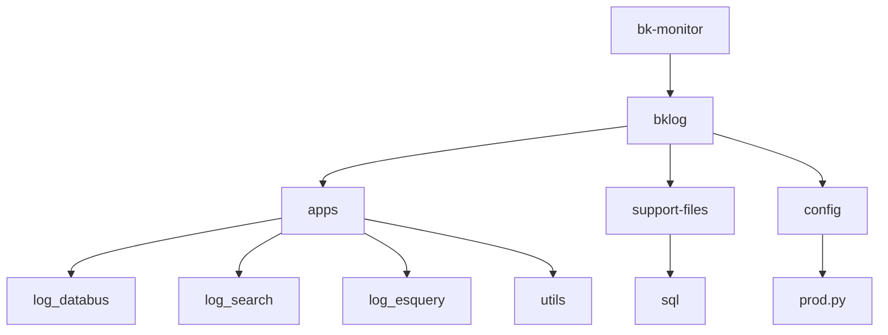
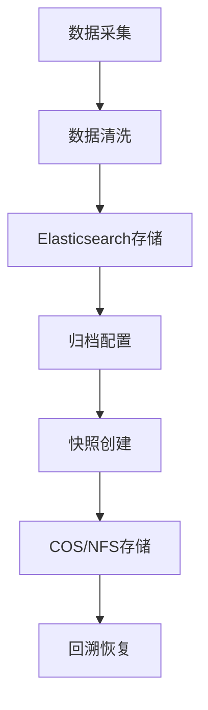
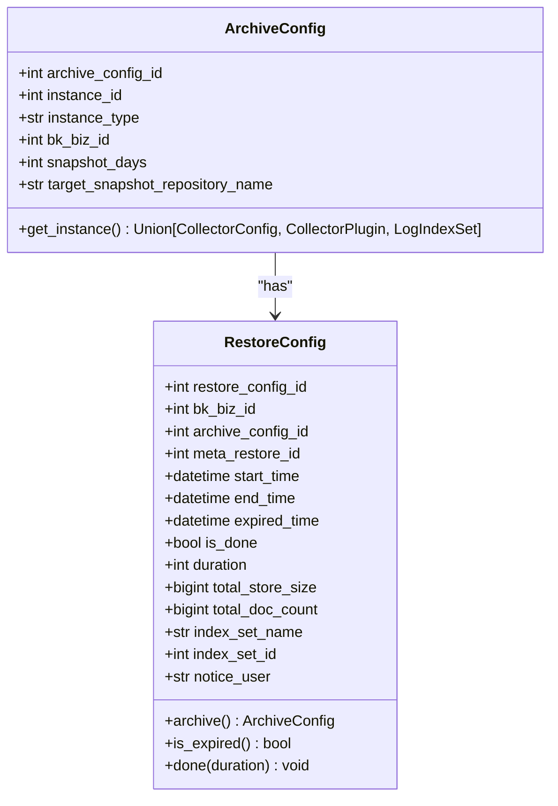
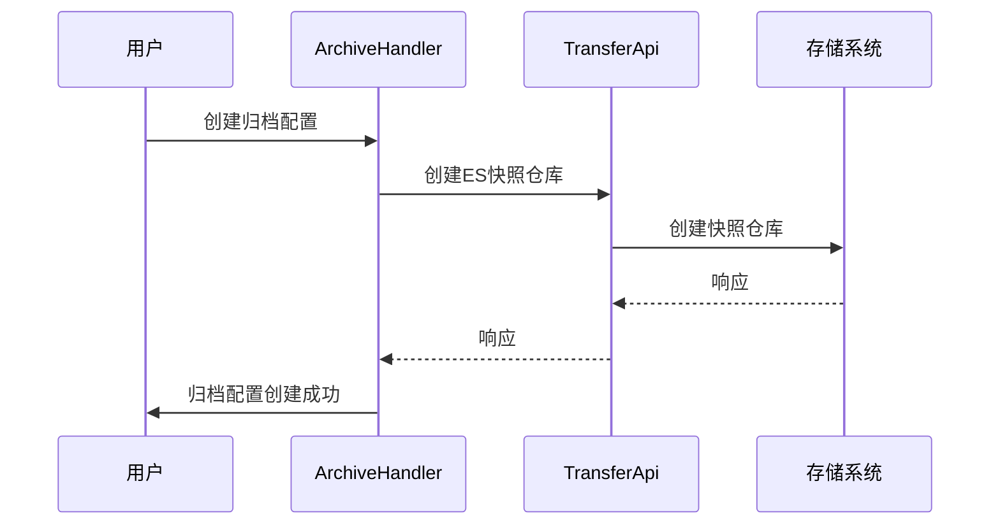
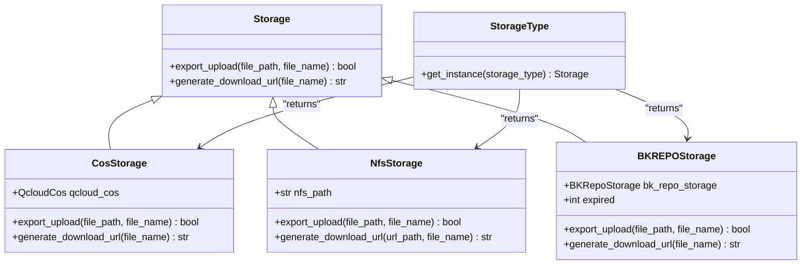
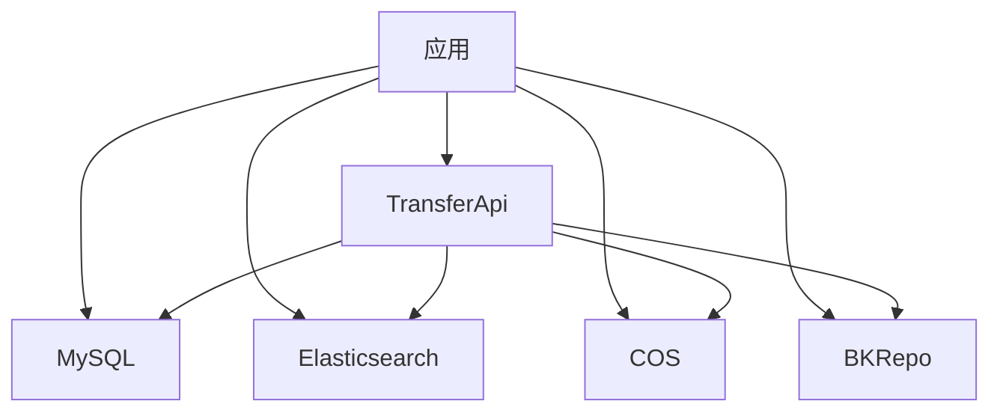

# 备份策略

<cite>
**本文档引用的文件**  
- [archive.py](file://bklog/apps/log_databus/tasks/archive.py)
- [archive.py](file://bklog/apps/log_databus/handlers/archive.py)
- [models.py](file://bklog/apps/log_databus/models.py)
- [storage.py](file://bklog/apps/log_databus/handlers/storage.py)
- [transfer.py](file://bklog/apps/api/modules/transfer.py)
- [cos.py](file://bklog/apps/utils/cos.py)
- [remote_storage.py](file://bklog/apps/utils/remote_storage.py)
- [async_export.py](file://bklog/apps/log_search/tasks/async_export.py)
- [prod.py](file://bklog/config/prod.py)
- [mysql.py](file://bklog/home_application/utils/mysql.py)
- [settings.py](file://bklog/settings.py)
- [0001_grafana_20201113-0000_mysql.sql](file://bklog/support-files/sql/0001_grafana_20201113-0000_mysql.sql)
</cite>

## 目录
1. [引言](#引言)
2. [项目结构](#项目结构)
3. [核心组件](#核心组件)
4. [架构概述](#架构概述)
5. [详细组件分析](#详细组件分析)
6. [依赖分析](#依赖分析)
7. [性能考虑](#性能考虑)
8. [故障排除指南](#故障排除指南)
9. [结论](#结论)

## 引言
本文档详细描述了基于Django管理命令的自动化数据备份策略，涵盖全量备份与增量备份的实施方法。重点说明了数据库（MySQL）、Elasticsearch索引、配置文件和关键业务数据的备份方案。根据support-files/sql中的表结构定义，确保所有核心数据模型都被纳入备份范围。文档还提供了备份频率建议、存储位置配置（如本地磁盘、COS对象存储）、文件命名规范和保留周期策略，以及性能优化建议。

## 项目结构
项目结构显示了多个应用程序和模块，其中`bklog`目录包含了主要的业务逻辑。`log_databus`、`log_search`和`log_esquery`等应用负责数据采集、搜索和查询功能。`support-files/sql`目录包含数据库初始化脚本，`config`目录包含不同环境的配置文件。

**图表来源**
- [prod.py](file://bklog/config/prod.py)
- [0001_grafana_20201113-0000_mysql.sql](file://bklog/support-files/sql/0001_grafana_20201113-0000_mysql.sql)

**章节来源**
- [prod.py](file://bklog/config/prod.py)
- [0001_grafana_20201113-0000_mysql.sql](file://bklog/support-files/sql/0001_grafana_20201113-0000_mysql.sql)

## 核心组件
核心组件包括`ArchiveConfig`和`RestoreConfig`模型，用于管理归档和回溯配置。`ArchiveHandler`和`StorageHandler`类提供了归档和存储操作的接口。`TransferApi`用于与外部系统交互，执行快照创建和验证等操作。

**章节来源**
- [models.py](file://bklog/apps/log_databus/models.py)
- [archive.py](file://bklog/apps/log_databus/handlers/archive.py)
- [storage.py](file://bklog/apps/log_databus/handlers/storage.py)

## 架构概述
系统架构包括数据采集、清洗、存储和归档四个主要部分。数据通过采集器收集，经过清洗后存储在Elasticsearch中。归档功能通过创建快照将数据备份到指定的存储仓库，支持COS对象存储和本地NFS存储。

**图表来源**
- [models.py](file://bklog/apps/log_databus/models.py)
- [archive.py](file://bklog/apps/log_databus/handlers/archive.py)
- [remote_storage.py](file://bklog/apps/utils/remote_storage.py)

## 详细组件分析
### 归档组件分析
归档功能通过`ArchiveConfig`模型定义归档配置，包括实例ID、实例类型、业务ID、快照天数和目标快照仓库名称。`RestoreConfig`模型用于管理回溯配置，包括开始时间、结束时间、过期时间、是否完成、耗时、总存储大小、文档数量、索引集名称、索引集ID和通知用户。

#### 类图

**图表来源**
- [models.py](file://bklog/apps/log_databus/models.py)

#### 序列图

**图表来源**
- [archive.py](file://bklog/apps/log_databus/handlers/archive.py)
- [transfer.py](file://bklog/apps/api/modules/transfer.py)

### 存储组件分析
存储功能通过`StorageHandler`类管理存储仓库，支持COS和NFS两种存储类型。`StorageType`类根据配置返回相应的存储实例。

#### 类图

**图表来源**
- [remote_storage.py](file://bklog/apps/utils/remote_storage.py)
- [cos.py](file://bklog/apps/utils/cos.py)

**章节来源**
- [remote_storage.py](file://bklog/apps/utils/remote_storage.py)
- [cos.py](file://bklog/apps/utils/cos.py)

## 依赖分析
系统依赖于多个外部服务和库，包括MySQL数据库、Elasticsearch、COS对象存储和BKRepo存储。`TransferApi`模块提供了与这些外部系统的接口，`QcloudCos`类封装了腾讯云COS的API调用。

**图表来源**
- [transfer.py](file://bklog/apps/api/modules/transfer.py)
- [remote_storage.py](file://bklog/apps/utils/remote_storage.py)

**章节来源**
- [transfer.py](file://bklog/apps/api/modules/transfer.py)
- [remote_storage.py](file://bklog/apps/utils/remote_storage.py)

## 性能考虑
为了优化备份性能，建议在低峰时段执行备份任务，避免影响正常业务。使用压缩策略减少存储空间占用，并通过资源隔离确保备份任务不会耗尽系统资源。定期清理过期的备份数据，保持存储系统的高效运行。

## 故障排除指南
当备份任务失败时，首先检查`TransferApi`的调用日志，确认外部系统是否正常响应。检查存储系统的可用性和网络连接。对于COS存储，确保密钥和配置正确无误。对于NFS存储，检查挂载点和权限设置。

**章节来源**
- [archive.py](file://bklog/apps/log_databus/tasks/archive.py)
- [remote_storage.py](file://bklog/apps/utils/remote_storage.py)

## 结论
本文档详细描述了基于Django管理命令的自动化数据备份策略，涵盖了全量备份与增量备份的实施方法。通过合理的配置和优化，可以确保数据的安全性和系统的稳定性。建议定期审查和更新备份策略，以适应业务发展的需求。