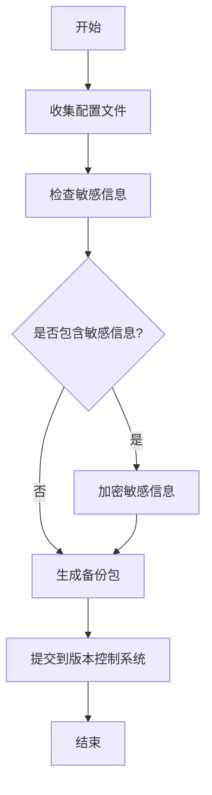
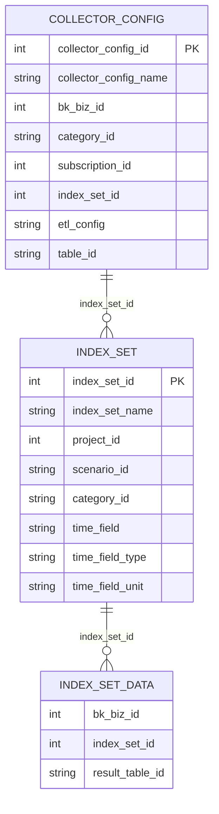
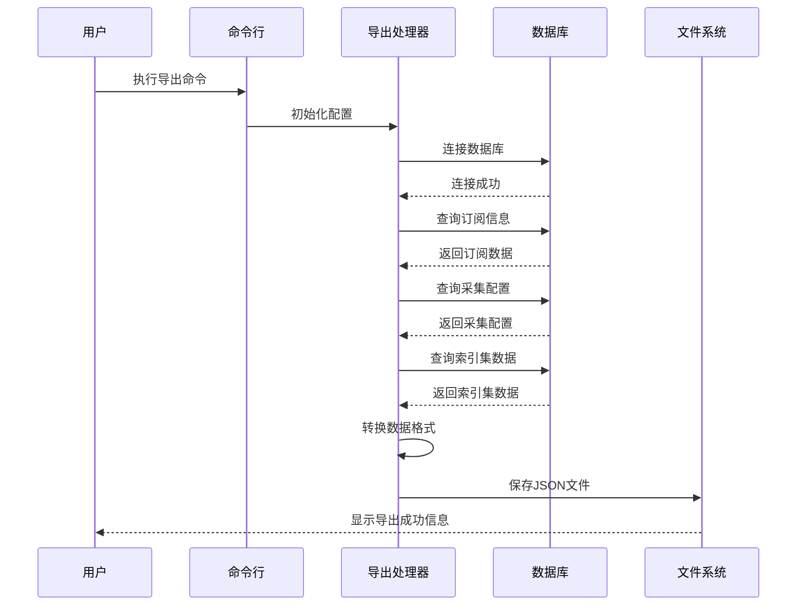
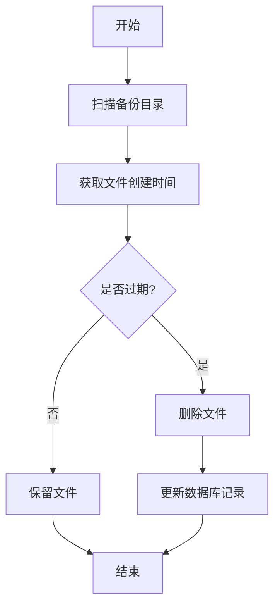
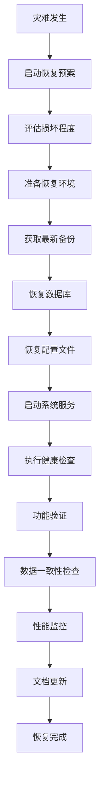
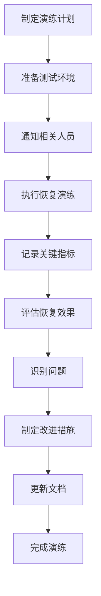

# 数据备份与恢复

<cite>
**本文档引用的文件**  
- [export.py](file://bklog/scripts/export.py)
- [export.md](file://bklog/scripts/export.md)
- [async_export_handlers.py](file://bklog/apps/log_search/handlers/search/async_export_handlers.py)
- [async_export.py](file://bklog/apps/log_search/tasks/async_export.py)
- [migrate_tool.py](file://bklog/home_application/management/commands/migrate_tool.py)
- [migrate_tool.md](file://bklog/home_application/management/commands/migrate_tool.md)
- [0001_grafana_20201113-0000_mysql.sql](file://bklog/support-files/sql/0001_grafana_20201113-0000_mysql.sql)
- [0007_set_k8s_deploy_default_storage_20230712.py](file://bklog/apps/feature_toggle/migrations/0007_set_k8s_deploy_default_storage_20230712.py)
- [0002_auto_20210714_1040.py](file://bklog/apps/feature_toggle/migrations/0002_auto_20210714_1040.py)
</cite>

## 目录
1. [引言](#引言)
2. [备份策略](#备份策略)
3. [数据库备份](#数据库备份)
4. [配置文件备份](#配置文件备份)
5. [关键数据备份](#关键数据备份)
6. [自定义命令数据导出导入](#自定义命令数据导出导入)
7. [备份文件存储与命名](#备份文件存储与命名)
8. [灾难恢复流程](#灾难恢复流程)
9. [备份完整性验证](#备份完整性验证)
10. [定期演练建议](#定期演练建议)
11. [附录](#附录)

## 引言
本操作手册旨在为蓝鲸日志平台提供全面的数据备份与恢复解决方案。文档详细描述了全量备份和增量备份的策略与实施方法，涵盖了数据库、配置文件和关键数据的备份方案。通过分析代码库中的相关功能，本手册提供了基于自定义管理命令的数据导出导入操作指南，并说明了备份文件的存储位置、命名规范和保留策略。此外，文档还包含了从备份介质恢复系统的完整灾难恢复流程，以及备份完整性验证方法和定期演练建议。

## 备份策略
蓝鲸日志平台采用多层次的备份策略，确保数据的完整性和可恢复性。系统主要采用全量备份策略，结合异步导出机制实现关键数据的定期备份。

全量备份策略通过脚本工具定期导出核心数据库表的数据，包括采集配置、索引集信息等关键业务数据。增量备份则通过异步导出任务实现，当用户执行日志检索并选择导出功能时，系统会创建异步导出任务，将指定时间范围内的检索结果保存为备份文件。

系统通过功能开关（Feature Toggle）机制控制备份行为，包括导出存储类型、通知方式等配置。备份策略的设计考虑了数据一致性、存储效率和恢复速度等因素，确保在发生故障时能够快速恢复系统到正常运行状态。

**Section sources**
- [export.py](file://bklog/scripts/export.py#L1-L316)
- [async_export.py](file://bklog/apps/log_search/tasks/async_export.py#L1-L901)

## 数据库备份
数据库备份是数据保护的核心环节。系统主要涉及两个数据库：`bk_nodeman`（节点管理）和`bk_log_search`（日志搜索），通过专用的导出工具实现数据备份。

### 核心备份表
根据系统架构，以下数据库表包含关键业务数据，需要定期备份：

- **节点管理模块**：
  - `node_man_subscriptionstep`：存储节点管理的订阅步骤信息

- **日志平台模块**：
  - `log_databus_collectorconfig`：日志采集配置表
  - `log_search_projectinfo`：项目信息表
  - `log_search_logindexset`：日志索引集表
  - `log_search_logindexsetdata`：索引集数据表

### 备份实施方法
数据库备份可通过两种方式实施：

1. **直接数据库导出**：使用`mysqldump`工具直接从数据库导出数据
```bash
mysqldump -h [host] -P [port] -u [username] -p [password] --databases bk_nodeman --tables node_man_subscriptionstep > bk_nodeman.sql
mysqldump -h [host] -P [port] -u [username] -p [password] --databases bk_log_search --tables log_databus_collectorconfig log_search_projectinfo log_search_logindexset log_search_logindexsetdata > bk_log_search.sql
```

2. **使用专用导出工具**：通过Python脚本工具导出数据，该工具会处理数据间的关联关系，确保备份数据的一致性。

**Section sources**
- [export.py](file://bklog/scripts/export.py#L1-L316)
- [export.md](file://bklog/scripts/export.md#L1-L46)
- [0001_grafana_20201113-0000_mysql.sql](file://bklog/support-files/sql/0001_grafana_20201113-0000_mysql.sql#L1-L2)

## 配置文件备份
配置文件备份是确保系统可恢复性的重要组成部分。系统需要备份的配置文件包括数据库连接配置、功能开关配置和存储配置等。

### 核心配置文件
- **数据库配置文件** (`config.yaml`)：包含连接`bk_nodeman`和`bk_log_search`数据库所需的连接信息，包括主机地址、端口、用户名、密码等。

- **功能开关配置**：通过Django迁移文件中的`FeatureToggle`对象配置异步导出功能，包括存储类型、通知方式等。

- **存储配置**：定义备份文件的存储位置和访问权限。

### 配置文件备份方法
配置文件备份应采用版本控制方式管理，建议使用Git等版本控制系统进行定期提交。对于敏感信息（如数据库密码），应使用环境变量或加密存储，避免明文存储在配置文件中。

配置文件备份应与代码部署同步进行，确保在系统升级或迁移时能够快速恢复正确的配置状态。



**Diagram sources**
- [export.py](file://bklog/scripts/export.py#L36-L49)
- [export.md](file://bklog/scripts/export.md#L18-L35)
- [0002_auto_20210714_1040.py](file://bklog/apps/feature_toggle/migrations/0002_auto_20210714_1040.py#L23-L48)

**Section sources**
- [export.py](file://bklog/scripts/export.py#L36-L49)
- [export.md](file://bklog/scripts/export.md#L18-L35)

## 关键数据备份
关键数据备份主要针对系统运行过程中产生的核心业务数据，包括采集配置、索引集配置和用户操作记录等。

### 采集配置备份
采集配置是日志平台的核心数据之一，包含日志采集项的详细配置信息。通过`LogDatabusCollectorConfig`类实现采集配置的查询和导出，备份时会关联节点管理的订阅信息，确保配置的完整性。

### 索引集配置备份
索引集配置定义了日志数据的索引规则和存储位置。`LogSearchLogIndexSet`类负责索引集数据的查询和转换，备份时会将旧版项目ID映射为新版业务ID，确保数据在不同环境间迁移时的一致性。

### 备份数据结构
备份数据以JSON格式存储，每个表对应一个JSON文件，文件结构如下：
- 数组形式存储表的所有记录
- 每条记录为一个JSON对象，包含字段名和值
- 保留原始数据库的字段类型和约束



**Diagram sources**
- [export.py](file://bklog/scripts/export.py#L179-L289)
- [export.py](file://bklog/scripts/export.py#L242-L289)

**Section sources**
- [export.py](file://bklog/scripts/export.py#L179-L289)

## 自定义命令数据导出导入
系统提供了基于Django管理命令的自定义数据导出导入功能，通过`management/commands`目录下的命令实现数据迁移和备份。

### 数据导出命令
`export.py`脚本是主要的数据导出工具，通过命令行参数指定配置文件路径执行导出操作：

```bash
python export.py --config config.yaml
```

该命令会连接配置文件中指定的数据库，查询关键表的数据并导出为JSON文件。导出过程包括：
1. 初始化数据库连接
2. 查询节点管理订阅信息
3. 查询日志采集配置
4. 查询索引集及关联数据
5. 将数据转换为JSON格式并保存到文件

### 数据迁移命令
`migrate_tool.py`是系统提供的数据迁移工具，支持在不同环境间迁移采集配置和索引集。该命令支持多种参数配置：

```bash
python manage.py migrate_tool --env=env_name --collector_config_data=log_databus_collectorconfig.json --mysql_host=127.0.0.1 --mysql_password=mysql_password
```

迁移工具的主要功能包括：
- 环境映射处理：将源环境的业务ID映射为目标环境的业务ID
- 采集配置迁移：迁移日志采集配置到目标环境
- 索引集迁移：迁移索引集配置并处理存储集群关联

### 命令执行流程


**Diagram sources**
- [export.py](file://bklog/scripts/export.py#L291-L316)
- [migrate_tool.py](file://bklog/home_application/management/commands/migrate_tool.py#L241-L249)

**Section sources**
- [export.py](file://bklog/scripts/export.py#L291-L316)
- [migrate_tool.py](file://bklog/home_application/management/commands/migrate_tool.py#L241-L249)
- [migrate_tool.md](file://bklog/home_application/management/commands/migrate_tool.md#L61-L65)

## 备份文件存储与命名
备份文件的存储位置、命名规范和保留策略是备份管理的重要组成部分，直接影响备份的可管理性和恢复效率。

### 存储位置
系统支持多种备份存储类型，通过功能开关配置：
- **NFS存储**：默认的网络文件系统存储
- **蓝鲸制品库(BKREPO)**：基于蓝鲸平台的制品库存储
- **腾讯云COS**：云对象存储服务

备份文件默认存储在`ASYNC_DIR`目录下，该目录由系统配置决定。对于NFS存储，文件会定期清理以释放空间；对于云存储，文件会设置过期时间自动删除。

### 命名规范
备份文件采用统一的命名规范，确保文件的可识别性和唯一性：

- **异步导出文件**：`{应用代码}_{索引集ID}_{时间戳}_{随机哈希}.tar.gz`
- **全量导出文件**：`{表名}.json`

其中时间戳格式为`YYYYMMDDHHmmss`，随机哈希为10位随机字符串，确保文件名的唯一性。

### 保留策略
系统通过定时任务实现备份文件的自动清理：

- **成功导出文件**：保留`ASYNC_EXPORT_FILE_EXPIRED_DAYS`天（默认2天）
- **失败导出文件**：立即清理或保留1天用于故障排查
- **临时文件**：导出完成后立即删除

清理任务每天凌晨3点执行，通过`clean_expired_task`定时任务扫描过期文件并删除。



**Diagram sources**
- [async_export.py](file://bklog/apps/log_search/tasks/async_export.py#L297-L320)
- [0007_set_k8s_deploy_default_storage_20230712.py](file://bklog/apps/feature_toggle/migrations/0007_set_k8s_deploy_default_storage_20230712.py#L30-L39)

**Section sources**
- [async_export.py](file://bklog/apps/log_search/tasks/async_export.py#L297-L320)
- [0007_set_k8s_deploy_default_storage_20230712.py](file://bklog/apps/feature_toggle/migrations/0007_set_k8s_deploy_default_storage_20230712.py#L30-L39)

## 灾难恢复流程
灾难恢复流程是从备份介质恢复系统到正常运行状态的完整步骤，确保在发生严重故障时能够快速恢复业务。

### 恢复准备
1. **评估损坏程度**：确定需要恢复的数据范围和系统组件
2. **准备恢复环境**：确保目标环境的硬件、网络和基础软件已准备就绪
3. **获取最新备份**：从备份存储中获取最新的完整备份文件

### 数据库恢复
1. **恢复基础数据库**：
   ```bash
   mysql -h [host] -P [port] -u [username] -p [password] bk_nodeman < bk_nodeman.sql
   mysql -h [host] -P [port] -u [username] -p [password] bk_log_search < bk_log_search.sql
   ```

2. **验证数据完整性**：检查关键表的记录数和数据一致性

3. **恢复索引和约束**：确保数据库的索引和外键约束已正确创建

### 配置文件恢复
1. **恢复配置文件**：将备份的配置文件复制到相应目录
2. **更新环境特定配置**：根据目标环境调整数据库连接、存储路径等配置
3. **验证配置有效性**：通过测试命令验证配置文件的正确性

### 系统启动与验证
1. **启动服务**：按顺序启动数据库、消息队列、应用服务等组件
2. **执行健康检查**：通过健康检查接口验证系统各组件的运行状态
3. **功能验证**：执行关键业务流程验证系统功能的完整性

### 恢复后操作
1. **数据一致性检查**：比对恢复前后关键数据的一致性
2. **性能监控**：监控系统性能指标，确保恢复后系统运行正常
3. **文档更新**：更新系统文档，记录恢复过程和经验教训



**Section sources**
- [export.py](file://bklog/scripts/export.py#L1-L316)
- [async_export.py](file://bklog/apps/log_search/tasks/async_export.py#L297-L320)

## 备份完整性验证
备份完整性验证是确保备份数据可用性和正确性的关键步骤，防止在需要恢复时发现备份文件损坏或不完整。

### 验证方法
1. **文件完整性检查**：
   - 验证文件大小是否合理
   - 检查文件哈希值（如MD5、SHA256）是否与记录一致
   - 验证文件格式是否正确（如JSON文件语法正确性）

2. **数据内容验证**：
   - 检查关键表是否包含预期数量的记录
   - 验证关键字段的值是否在合理范围内
   - 检查数据间的关联关系是否完整

3. **恢复测试验证**：
   - 在测试环境中执行恢复操作
   - 验证恢复后的系统功能是否正常
   - 比对恢复前后数据的一致性

### 自动化验证脚本
系统可配置自动化验证脚本，定期执行备份完整性检查：

```python
def validate_backup(backup_file):
    # 检查文件是否存在
    if not os.path.exists(backup_file):
        return False, "文件不存在"
    
    # 检查文件大小
    file_size = os.path.getsize(backup_file)
    if file_size == 0:
        return False, "文件大小为0"
    
    # 验证JSON格式
    try:
        with open(backup_file, 'r') as f:
            data = json.load(f)
            if not isinstance(data, list):
                return False, "数据格式错误，应为数组"
    except json.JSONDecodeError as e:
        return False, f"JSON解析错误: {e}"
    
    return True, "验证通过"
```

### 验证频率
- **每次备份后**：立即执行基本完整性检查
- **每日**：执行全面的数据内容验证
- **每月**：执行完整的恢复测试验证

**Section sources**
- [export.py](file://bklog/scripts/export.py#L51-L57)
- [async_export.py](file://bklog/apps/log_search/tasks/async_export.py#L111-L121)

## 定期演练建议
定期演练是确保备份恢复方案有效性的关键措施，通过模拟真实故障场景验证恢复流程的可行性和效率。

### 演练目标
- 验证备份数据的可恢复性
- 测试恢复流程的完整性和效率
- 评估恢复时间目标(RTO)和恢复点目标(RPO)
- 提高团队的应急响应能力

### 演练频率
- **季度演练**：每季度执行一次完整的灾难恢复演练
- **年度演练**：每年执行一次全面的业务连续性演练
- **重大变更后**：在系统架构重大变更后立即执行恢复演练

### 演练流程
1. **演练准备**：
   - 制定详细的演练计划
   - 通知相关团队和人员
   - 准备测试环境和工具

2. **演练执行**：
   - 模拟特定故障场景
   - 按照恢复流程执行恢复操作
   - 记录关键时间节点和操作步骤

3. **演练评估**：
   - 评估恢复时间是否满足RTO要求
   - 检查数据丢失量是否在RPO范围内
   - 识别流程中的瓶颈和问题

4. **改进措施**：
   - 根据演练结果优化恢复流程
   - 更新应急预案和操作手册
   - 培训相关人员

### 演练记录
每次演练应详细记录以下信息：
- 演练日期和参与人员
- 模拟的故障场景
- 实际恢复时间
- 发现的问题和改进建议
- 演练结论和后续行动计划



**Section sources**
- [async_export.py](file://bklog/apps/log_search/tasks/async_export.py#L286-L295)

## 附录
### 附录A：配置文件示例
```yaml
bk_nodeman:
  db: bk_nodeman
  host: 127.0.0.1
  port: 3306
  user: root
  password: password
  charset: utf8

bk_log_search:
  db: bk_log_search
  host: 127.0.0.1
  port: 3306
  user: root
  password: password
  charset: utf8
```

### 附录B：常用命令参考
- **导出数据**：`python export.py --config config.yaml`
- **迁移数据**：`python manage.py migrate_tool --env=env_name --collector_config_data=data.json --mysql_host=127.0.0.1 --mysql_password=password`
- **检查备份完整性**：`python validate_backup.py /path/to/backup/file`

### 附录C：错误处理
当备份或恢复过程中遇到错误时，应按照以下步骤处理：
1. 记录错误信息和时间戳
2. 检查系统日志获取详细错误原因
3. 根据错误类型采取相应措施
4. 如无法解决，联系技术支持团队