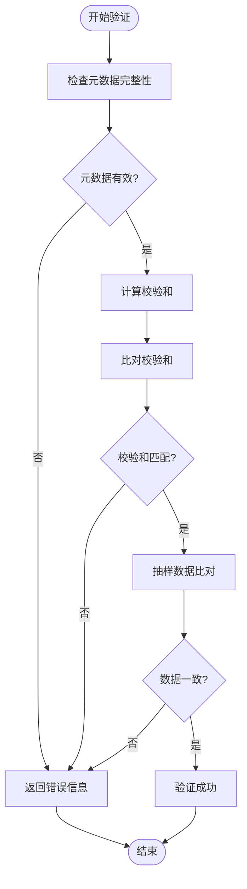
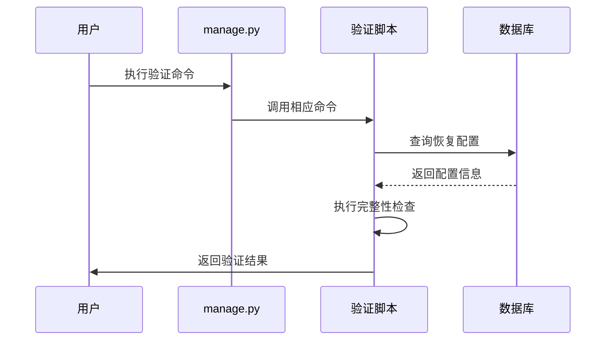
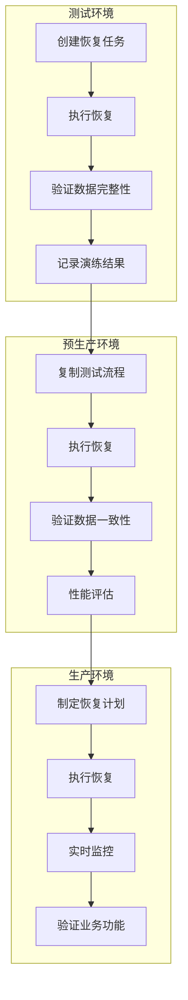
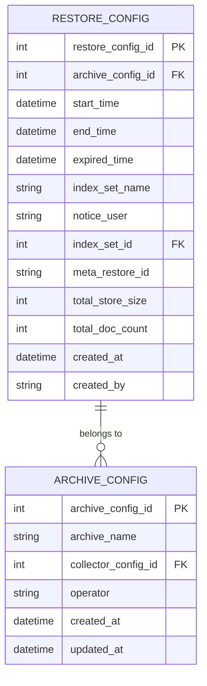
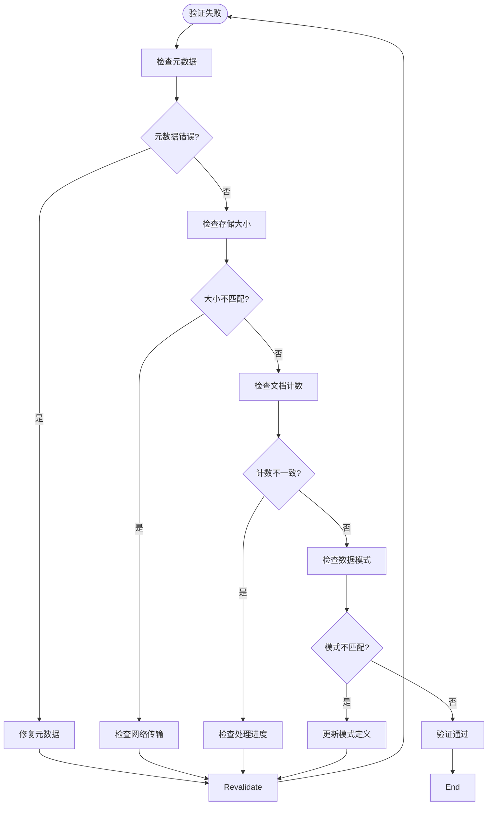

# 验证与测试

<cite>
**本文档引用的文件**
- [archive.py](file://bklog/apps/log_databus/tasks/archive.py)
- [models.py](file://bklog/apps/log_databus/models.py)
- [archive.py](file://bklog/apps/log_databus/handlers/archive.py)
- [check_migrate.py](file://bklog/scripts/check_migrate/check_migrate.py)
- [unit_test.sh](file://bklog/scripts/unit_test.sh)
- [0001_grafana_20201113-0000_mysql.sql](file://bklog/support-files/sql/0001_grafana_20201113-0000_mysql.sql)
</cite>

## 目录
1. [引言](#引言)
2. [数据备份完整性验证方案](#数据备份完整性验证方案)
3. [自动化验证脚本使用指南](#自动化验证脚本使用指南)
4. [定期恢复演练流程规范](#定期恢复演练流程规范)
5. [数据一致性验证用例设计](#数据一致性验证用例设计)
6. [常见验证失败场景诊断与修复](#常见验证失败场景诊断与修复)
7. [结论](#结论)

## 引言
本文档旨在制定数据备份完整性验证和恢复演练的标准化测试方案，确保系统数据的安全性和可恢复性。通过分析代码库中的相关组件，我们将建立一套完整的验证方法，包括备份文件的完整性检查、自动化脚本使用、恢复演练流程以及数据一致性验证。

## 数据备份完整性验证方案

### 校验和验证与元数据检查
系统通过`RestoreConfig`模型管理恢复配置，包含`meta_restore_id`、`total_store_size`、`total_doc_count`等关键元数据字段，可用于验证备份文件的完整性。在恢复过程中，系统会定期检查恢复状态，确保文档总数与完成数一致。

**图示来源**
- [models.py](file://bklog/apps/log_databus/models.py#L1-L200)
- [archive.py](file://bklog/apps/log_databus/tasks/archive.py#L50-L68)

**本节来源**
- [models.py](file://bklog/apps/log_databus/models.py#L1-L200)
- [archive.py](file://bklog/apps/log_databus/tasks/archive.py#L50-L68)

## 自动化验证脚本使用指南

### 基于management/commands的自动化验证
系统提供了基于Django管理命令的自动化验证机制。通过`manage.py`命令可以执行各种测试和验证任务，确保备份系统的可靠性。

**图示来源**
- [archive.py](file://bklog/apps/log_databus/handlers/archive.py#L299-L516)
- [unit_test.sh](file://bklog/scripts/unit_test.sh#L1-L18)

**本节来源**
- [archive.py](file://bklog/apps/log_databus/handlers/archive.py#L299-L516)
- [unit_test.sh](file://bklog/scripts/unit_test.sh#L1-L18)

## 定期恢复演练流程规范

### 从测试环境到生产环境的验证路径
建立标准化的恢复演练流程，确保在不同环境中都能成功恢复数据。

**图示来源**
- [archive.py](file://bklog/apps/log_databus/tasks/archive.py#L32-L47)
- [archive.py](file://bklog/apps/log_databus/handlers/archive.py#L299-L516)

**本节来源**
- [archive.py](file://bklog/apps/log_databus/tasks/archive.py#L32-L47)
- [archive.py](file://bklog/apps/log_databus/handlers/archive.py#L299-L516)

## 数据一致性验证用例设计

### 基于SQL脚本约束定义的验证用例
参考数据库初始化脚本中的约束定义，设计数据一致性验证用例。

**图示来源**
- [models.py](file://bklog/apps/log_databus/models.py#L1-L200)
- [0001_grafana_20201113-0000_mysql.sql](file://bklog/support-files/sql/0001_grafana_20201113-0000_mysql.sql#L1-L2)

**本节来源**
- [models.py](file://bklog/apps/log_databus/models.py#L1-L200)
- [0001_grafana_20201113-0000_mysql.sql](file://bklog/support-files/sql/0001_grafana_20201113-0000_mysql.sql#L1-L2)

## 常见验证失败场景诊断与修复

### 故障诊断与修复指南
提供常见验证失败场景的诊断和修复方案，确保备份系统的可靠性。

**图示来源**
- [archive.py](file://bklog/apps/log_databus/tasks/archive.py#L50-L68)
- [check_migrate.py](file://bklog/scripts/check_migrate/check_migrate.py#L102-L229)

**本节来源**
- [archive.py](file://bklog/apps/log_databus/tasks/archive.py#L50-L68)
- [check_migrate.py](file://bklog/scripts/check_migrate/check_migrate.py#L102-L229)

## 结论
本文档提供了完整的数据备份完整性验证和恢复演练方案，涵盖了从技术实现到操作流程的各个方面。通过实施这些标准化测试方案，可以有效确保备份系统的可靠性和数据的可恢复性，为系统的稳定运行提供有力保障。