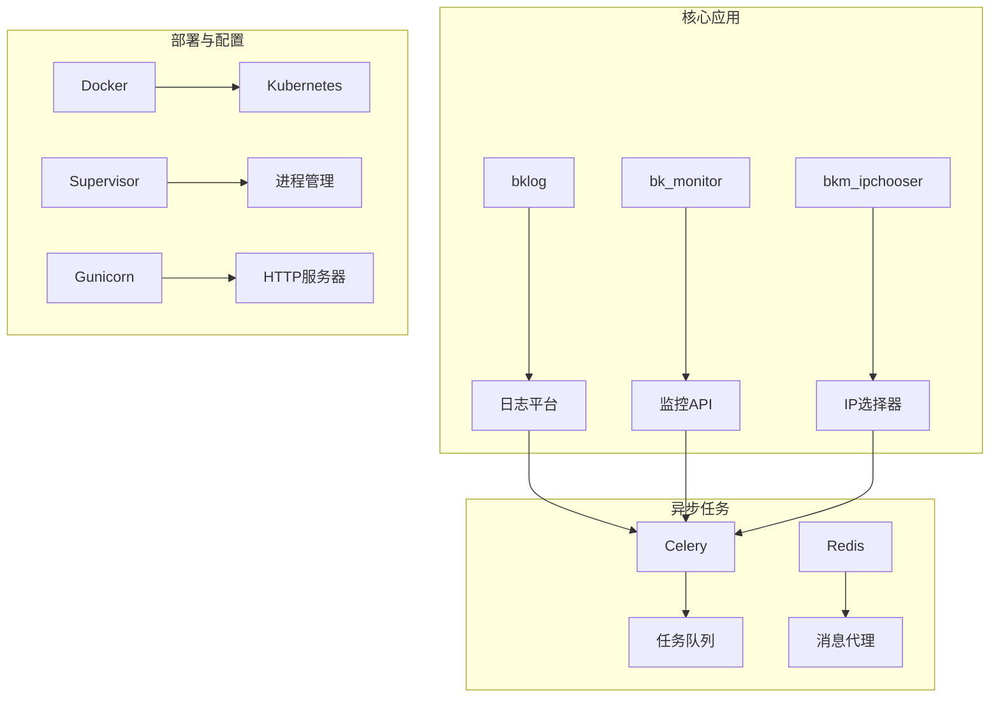
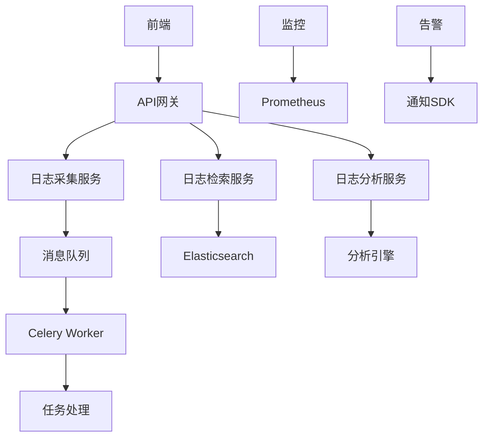
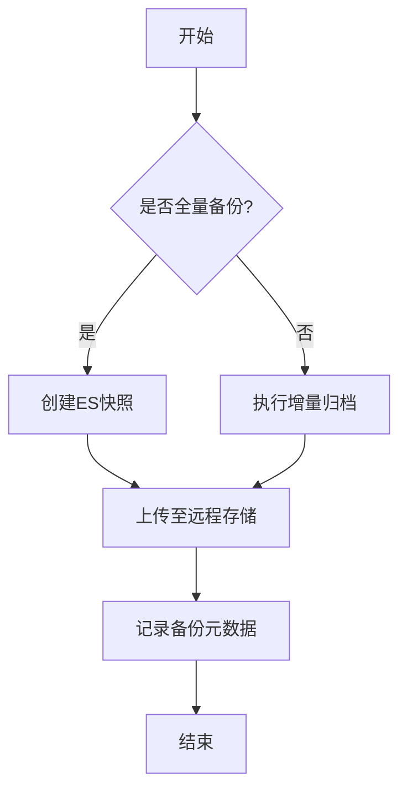
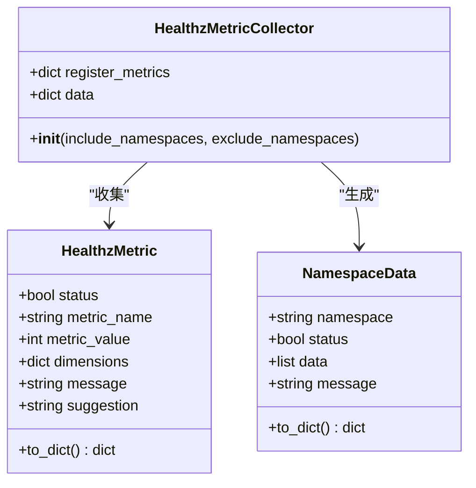
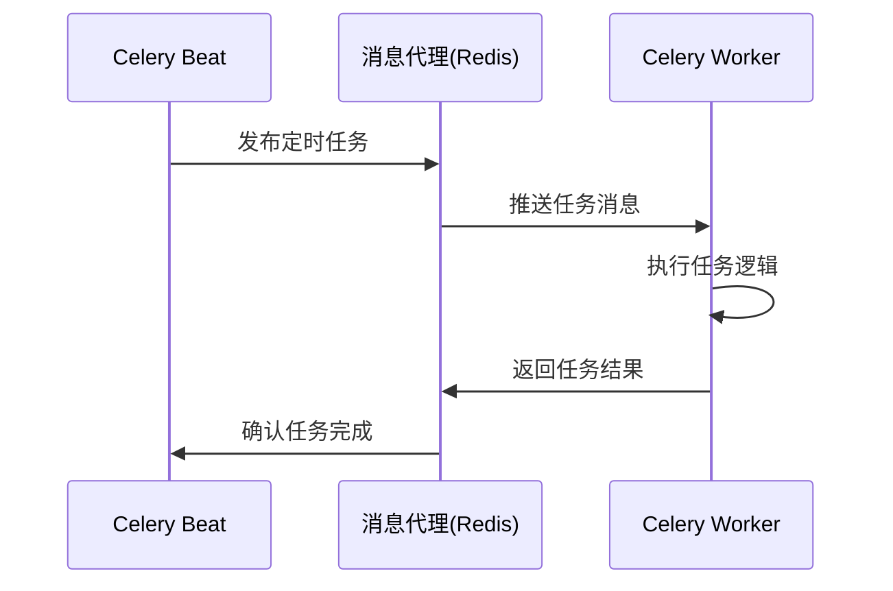
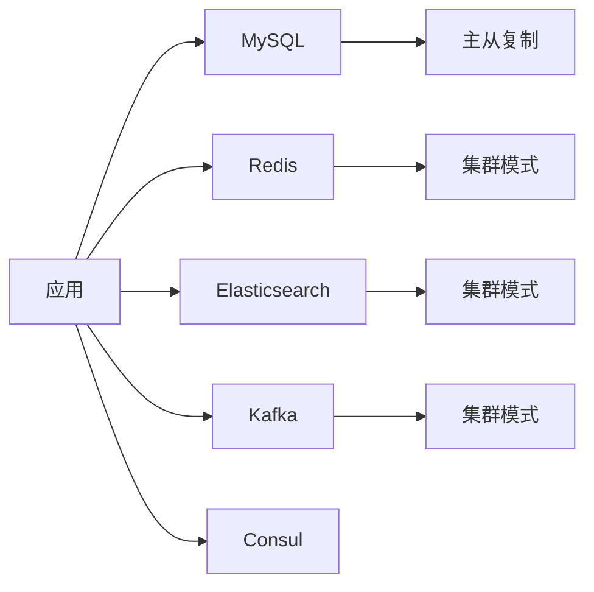

# 日常运维

<cite>
**本文档引用文件**   
- [README.md](file://README.md)
- [app.yml](file://bklog/app.yml)
- [supervisord.conf](file://bklog/support-files/supervisord.conf)
- [gunicorn_config.py](file://bklog/gunicorn_config.py)
- [default.py](file://bklog/config/default.py)
- [prod.py](file://bklog/config/prod.py)
- [stag.py](file://bklog/config/stag.py)
- [requirements.txt](file://bklog/requirements.txt)
- [settings.py](file://bklog/settings.py)
</cite>

## 目录
1. [简介](#简介)
2. [项目结构](#项目结构)
3. [核心组件](#核心组件)
4. [架构概述](#架构概述)
5. [详细组件分析](#详细组件分析)
6. [依赖分析](#依赖分析)
7. [性能考量](#性能考量)
8. [故障排查指南](#故障排查指南)
9. [结论](#结论)

## 简介
蓝鲸智云监控平台（BK-MONITOR）是一款由蓝鲸智云官方推出的监控平台产品，具备强大的数据采集和大规模数据处理能力。该平台依托于蓝鲸PaaS，能够形成完整的监控闭环，致力于满足不同监控场景的需求，提升监控的及时性、准确性和智能化水平，为在线业务提供全面保障。

## 项目结构
本项目采用模块化设计，主要包含日志平台（bklog）、监控API（bk_monitor）、IP选择器（bkm_ipchooser）等核心组件。系统通过Docker和Kubernetes进行部署，使用Supervisor管理进程，Gunicorn作为WSGI HTTP服务器，并通过Celery实现异步任务调度。配置文件按环境分离（dev、stag、prod），支持灵活的环境适配。

**图示来源**
- [app.yml](file://bklog/app.yml)
- [supervisord.conf](file://bklog/support-files/supervisord.conf)
- [gunicorn_config.py](file://bklog/gunicorn_config.py)

**本节来源**
- [README.md](file://README.md)
- [app.yml](file://bklog/app.yml)

## 核心组件
系统核心由日志平台（bklog）构成，包含日志采集、搜索、归档、脱敏等多个功能模块。通过Celery实现异步任务处理，支持定时任务调度和高并发处理。系统使用MySQL作为主数据库，Redis作为缓存和消息队列，Elasticsearch作为日志存储和检索引擎。

**本节来源**
- [app.yml](file://bklog/app.yml)
- [requirements.txt](file://bklog/requirements.txt)

## 架构概述
系统采用微服务架构，前端通过API网关访问后端服务。后端服务包括日志采集、存储、检索、分析等多个独立模块，通过消息队列进行通信。监控数据通过Prometheus进行采集，告警通过蓝鲸通知SDK发送。系统支持多环境部署，可通过配置文件灵活切换。

**图示来源**
- [supervisord.conf](file://bklog/support-files/supervisord.conf)
- [gunicorn_config.py](file://bklog/gunicorn_config.py)

## 详细组件分析

### 版本升级流程
系统升级需遵循严格的流程：首先进行全量备份，然后停止服务，执行数据库迁移，部署新版本代码，最后进行功能验证。升级过程中需监控系统日志，确保各组件正常启动。

**本节来源**
- [README.md](file://README.md)
- [app.yml](file://bklog/app.yml)

### 数据迁移与备份恢复
系统支持全量备份和增量备份策略。全量备份通过Elasticsearch快照功能实现，增量备份通过日志归档任务定期执行。备份数据存储在远程存储中，可通过管理界面进行恢复操作。

#### 备份策略配置

**图示来源**
- [default.py](file://bklog/config/default.py)
- [prod.py](file://bklog/config/prod.py)

### 故障排查流程
系统提供完善的健康检查机制，可通过/healthz接口获取各组件状态。常见问题包括数据库连接失败、Redis连接超时、Elasticsearch集群异常等。排查时应首先检查日志，然后验证各依赖服务的可用性。

#### 健康检查组件

**图示来源**
- [home_application/handlers/metrics.py](file://bklog/home_application/handlers/metrics.py)
- [home_application/handlers/healthz_metrics/mysql.py](file://bklog/home_application/handlers/healthz_metrics/mysql.py)

### 定时任务管理
系统使用Celery Beat进行定时任务调度，配置在CELERY_IMPORTS中定义。主要任务包括日志归档、数据同步、报告生成等。任务优先级可通过BK_LOG_HIGH_PRIORITY_QUEUE配置。

#### Celery任务调度

**图示来源**
- [default.py](file://bklog/config/default.py)
- [supervisord.conf](file://bklog/support-files/supervisord.conf)

## 依赖分析
系统依赖多个外部服务，包括MySQL数据库、Redis缓存、Elasticsearch搜索引擎、Kafka消息队列等。这些依赖通过配置文件进行管理，支持环境变量覆盖。系统使用Supervisor管理进程依赖，确保服务按正确顺序启动。

**图示来源**
- [requirements.txt](file://bklog/requirements.txt)
- [default.py](file://bklog/config/default.py)

**本节来源**
- [requirements.txt](file://bklog/requirements.txt)
- [default.py](file://bklog/config/default.py)

## 性能考量
系统性能受多个因素影响，包括数据库连接池大小、Redis并发数、Elasticsearch分片数量等。生产环境建议配置足够的资源，监控关键指标如CPU使用率、内存占用、磁盘IO等。可通过Prometheus和Grafana进行性能监控。

**本节来源**
- [app.yml](file://bklog/app.yml)
- [default.py](file://bklog/config/default.py)

## 故障排查指南
当系统出现异常时，应按以下步骤进行排查：首先检查应用日志，定位错误信息；然后验证数据库连接；接着检查Redis和Elasticsearch服务状态；最后查看系统资源使用情况。常见错误代码和解决方案记录在异常处理模块中。

**本节来源**
- [apps/log_measure/exceptions.py](file://bklog/apps/log_measure/exceptions.py)
- [home_application/handlers/healthz_metrics/](file://bklog/home_application/handlers/healthz_metrics/)

## 结论
蓝鲸智云监控平台提供了完整的运维解决方案，包括版本升级、数据备份恢复、故障排查、定时任务管理等功能。系统架构合理，组件职责清晰，具备良好的可维护性和扩展性。通过遵循本文档的运维指南，可以有效保障系统的稳定运行。