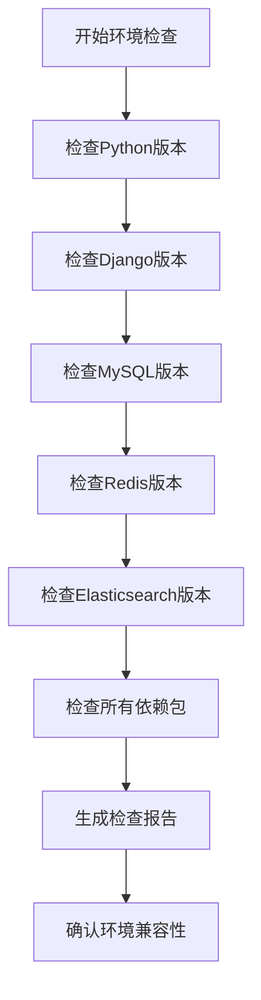
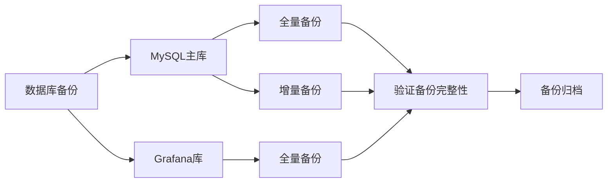
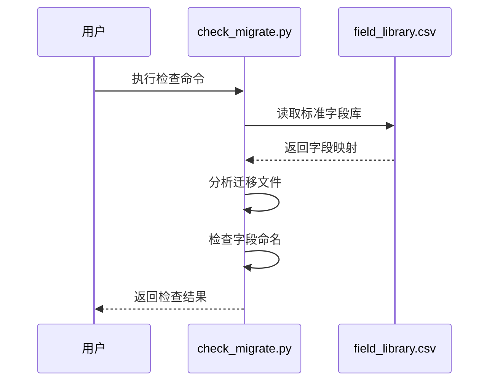
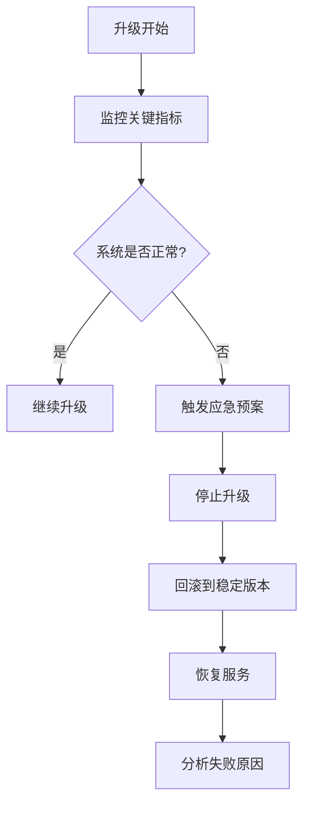
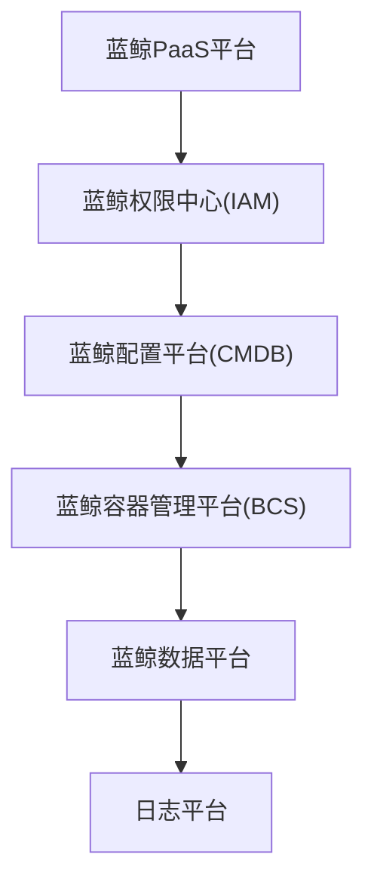

# 升级准备

<cite>
**本文档引用的文件**  
- [check_migrate.py](file://bklog/scripts/check_migrate/check_migrate.py)
- [requirements.txt](file://bklog/requirements.txt)
- [requirements_dev.txt](file://bklog/requirements_dev.txt)
- [settings.py](file://bklog/settings.py)
- [default.py](file://bklog/config/default.py)
- [prod.py](file://bklog/config/prod.py)
- [stag.py](file://bklog/config/stag.py)
- [dev.py](file://bklog/config/dev.py)
- [0001_grafana_20201113-0000_mysql.sql](file://bklog/support-files/sql/0001_grafana_20201113-0000_mysql.sql)
</cite>

## 目录
1. [环境检查](#环境检查)
2. [数据备份](#数据备份)
3. [迁移前自动检查](#迁移前自动检查)
4. [风险评估与应急预案](#风险评估与应急预案)
5. [升级窗口选择](#升级窗口选择)
6. [蓝鲸生态系统组件依赖](#蓝鲸生态系统组件依赖)

## 环境检查

在进行系统升级前，必须对运行环境进行全面检查，确保所有组件版本兼容并满足升级要求。

### Python版本检查
根据项目配置文件分析，系统需要检查Python版本是否满足Django 4.2.22的要求。建议使用Python 3.8或更高版本以确保兼容性。

### Django版本检查
从requirements.txt文件中可以确认，当前系统使用的Django版本为4.2.22。升级前需要验证新版本与现有代码的兼容性，特别是中间件和URL配置的变化。

### 数据库版本检查
系统使用MySQL作为主要数据库。从配置文件中可以看到，生产环境通过环境变量配置数据库连接参数。需要确保MySQL版本不低于5.7，推荐使用8.0版本以获得更好的性能和安全性。



**Diagram sources**
- [requirements.txt](file://bklog/requirements.txt)
- [prod.py](file://bklog/config/prod.py)

### 依赖包兼容性验证
通过分析requirements.txt文件，系统依赖多个关键包，包括：
- ujson==5.9.0
- Django==4.2.22
- celery==5.4.0
- redis==4.4.4
- elasticsearch==7.17.9
- kafka-python==2.0.2

需要逐一验证这些依赖包的版本是否与新系统版本兼容，特别是Elasticsearch和Kafka等外部服务的客户端库。

**Section sources**
- [requirements.txt](file://bklog/requirements.txt)
- [requirements_dev.txt](file://bklog/requirements_dev.txt)

## 数据备份

### 数据库备份
系统使用MySQL存储核心数据，包括采集配置、索引集、用户权限等。备份步骤如下：

1. 备份主数据库：bklog
2. 备份Grafana专用数据库：bklog_grafana
3. 备份Redis缓存数据

```sql
-- 创建Grafana数据库
create database if not exists bklog_grafana default character set utf8 collate utf8_general_ci;
```

### 配置文件备份
需要备份的关键配置文件包括：
- config/default.py：系统默认配置
- config/prod.py：生产环境配置
- config/stag.py：预发布环境配置
- config/dev.py：开发环境配置

### 关键数据导出
除了数据库备份，还需要导出以下关键数据：
- 用户权限配置
- 采集策略配置
- 告警规则
- 仪表盘配置
- 自定义字段库



**Diagram sources**
- [0001_grafana_20201113-0000_mysql.sql](file://bklog/support-files/sql/0001_grafana_20201113-0000_mysql.sql)
- [prod.py](file://bklog/config/prod.py)

**Section sources**
- [prod.py](file://bklog/config/prod.py)
- [stag.py](file://bklog/config/stag.py)
- [dev.py](file://bklog/config/dev.py)

## 迁移前自动检查

### check_migrate.py脚本使用
系统提供了check_migrate.py脚本用于迁移前的自动检查，主要功能包括：

1. 检查数据库迁移文件中的字段命名规范
2. 验证模型字段变更的合规性
3. 检测潜在的兼容性问题

使用方法：
```bash
python scripts/check_migrate/check_migrate.py <migration_file_path>
```

### 检查流程
1. 读取field_library.csv中的标准字段库
2. 分析迁移文件中的CreateModel、AddField、AlterField、RenameField操作
3. 检查新字段是否符合命名规范
4. 生成检查报告并记录异常字段



**Diagram sources**
- [check_migrate.py](file://bklog/scripts/check_migrate/check_migrate.py)

**Section sources**
- [check_migrate.py](file://bklog/scripts/check_migrate/check_migrate.py)

## 风险评估与应急预案

### 风险评估
升级过程中可能遇到的主要风险包括：
- 数据库迁移失败导致数据丢失
- 依赖包版本冲突导致服务不可用
- 配置文件变更导致功能异常
- 权限系统变更导致访问控制问题

### 应急预案
1. **回滚计划**：准备完整的回滚方案，包括数据库回滚和代码回滚
2. **服务降级**：在升级失败时能够快速切换到旧版本服务
3. **数据恢复**：确保备份数据可快速恢复
4. **监控告警**：升级期间加强系统监控，设置关键指标告警



**Diagram sources**
- [settings.py](file://bklog/settings.py)
- [default.py](file://bklog/config/default.py)

## 升级窗口选择

### 最佳升级时间
建议选择业务低峰期进行升级，具体考虑因素包括：
- 用户活跃度最低的时间段
- 避开重要业务活动
- 考虑运维团队的工作时间

### 升级时长预估
根据系统复杂度，预估升级时长为2-4小时，包括：
- 环境准备：30分钟
- 数据备份：30分钟
- 系统升级：60-90分钟
- 功能验证：30-60分钟

### 通知计划
提前至少72小时通知相关方，包括：
- 业务部门
- 运维团队
- 开发团队
- 最终用户

## 蓝鲸生态系统组件依赖

### 组件依赖关系
系统与蓝鲸生态系统的多个组件存在依赖关系，升级顺序至关重要：

1. **蓝鲸PaaS平台**：作为基础平台，必须首先确保其稳定
2. **蓝鲸配置平台(CMDB)**：依赖其进行主机和服务拓扑管理
3. **蓝鲸容器管理平台(BCS)**：如果使用容器化部署，需要先升级BCS
4. **蓝鲸权限中心(IAM)**：权限系统升级可能影响访问控制
5. **蓝鲸数据平台**：日志分析功能依赖数据平台

### 升级顺序建议


**Diagram sources**
- [default.py](file://bklog/config/default.py)
- [settings.py](file://bklog/settings.py)

**Section sources**
- [default.py](file://bklog/config/default.py)