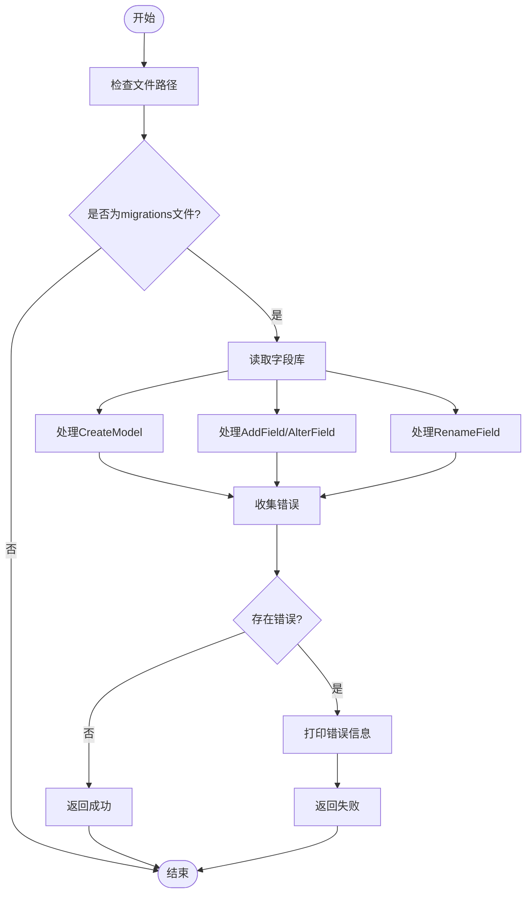
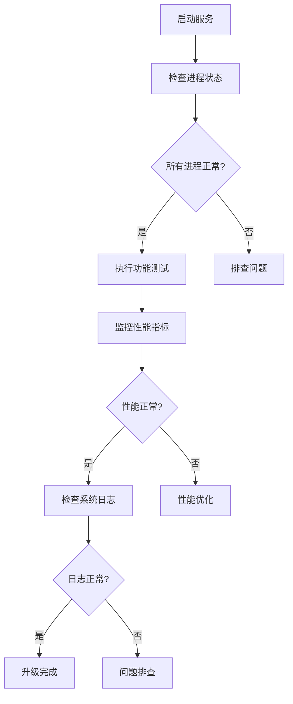

# 版本升级

<cite>
**本文档引用的文件**
- [check_migrate.py](file://bklog/scripts/check_migrate/check_migrate.py)
- [field_library.csv](file://bklog/scripts/check_migrate/field_library.csv)
- [migrate_tool.py](file://bklog/home_application/management/commands/migrate_tool.py)
- [migrate_grafana.py](file://bklog/apps/log_databus/management/commands/migrate_grafana.py)
- [default.py](file://bklog/config/default.py)
- [supervisord.conf](file://bklog/support-files/supervisord.conf)
- [version-guideline.md](file://docs/wiki/version-guideline.md)
- [V4.6.3_20230620.md](file://bklog/version_logs_md/zh-cn/V4.6.3_20230620.md)
</cite>

## 目录
1. [简介](#简介)
2. [升级前准备](#升级前准备)
3. [升级操作流程](#升级操作流程)
4. [数据库迁移](#数据库迁移)
5. [升级后验证](#升级后验证)
6. [常见问题与解决方案](#常见问题与解决方案)
7. [蓝鲸生态系统特殊要求](#蓝鲸生态系统特殊要求)
8. [回滚方案](#回滚方案)
9. [结论](#结论)

## 简介
本文档提供了从旧版本到新版本的完整升级操作指南，涵盖了升级前的准备工作、升级操作步骤、升级后验证以及回滚方案。文档特别关注数据库迁移脚本的执行顺序和检查机制，并提供了常见升级问题的解决方案。

## 升级前准备

在执行版本升级之前，必须完成以下准备工作：

1. **环境检查**：确保目标环境满足新版本的系统要求，包括操作系统版本、Python版本、数据库版本等。
2. **数据备份**：对所有关键数据进行完整备份，包括数据库、配置文件和日志数据。
3. **兼容性验证**：验证新版本与现有系统组件的兼容性，特别是与蓝鲸生态系统的其他组件的集成。
4. **停机计划**：制定详细的停机维护计划，通知所有相关方升级时间和预期影响。

**Section sources**
- [default.py](file://bklog/config/default.py#L290-L328)
- [supervisord.conf](file://bklog/support-files/supervisord.conf#L1-L30)

## 升级操作流程

### 停机维护
1. 通知所有用户系统将进行维护
2. 停止所有相关服务，包括Web服务器、Celery工作进程等
3. 确认所有正在进行的任务已完成或已暂停

### 代码部署
1. 获取新版本代码
2. 执行代码部署
3. 更新依赖包

### 配置文件更新
1. 比较新旧版本的配置文件差异
2. 根据新版本要求更新配置参数
3. 验证配置文件的正确性

**Section sources**
- [supervisord.conf](file://bklog/support-files/supervisord.conf#L16-L30)
- [default.py](file://bklog/config/default.py#L290-L328)

## 数据库迁移

### 迁移检查机制
系统提供了`check_migrate.py`脚本用于检查数据库迁移脚本的规范性。该脚本会验证迁移文件中的字段命名是否符合标准。

**Diagram sources**
- [check_migrate.py](file://bklog/scripts/check_migrate/check_migrate.py#L198-L229)

### 迁移执行顺序
1. 首先执行基础架构变更的迁移脚本
2. 然后执行业务逻辑相关的迁移脚本
3. 最后执行数据初始化脚本

**Section sources**
- [check_migrate.py](file://bklog/scripts/check_migrate/check_migrate.py#L1-L230)
- [field_library.csv](file://bklog/scripts/check_migrate/field_library.csv#L1-L186)

## 升级后验证

升级完成后，必须执行以下验证步骤：

1. **服务状态检查**：确认所有服务进程正常运行
2. **功能测试**：验证核心功能是否正常工作
3. **性能监控**：监控系统性能指标，确保没有性能下降
4. **日志检查**：检查系统日志，确认没有异常错误

**Diagram sources**
- [supervisord.conf](file://bklog/support-files/supervisord.conf#L16-L30)

## 常见问题与解决方案

### 迁移冲突
**问题**：多个迁移脚本尝试修改同一数据库表
**解决方案**：
1. 检查迁移脚本的依赖关系
2. 合并冲突的迁移操作
3. 使用`check_migrate.py`验证字段命名规范

### 数据不一致
**问题**：升级后数据完整性受损
**解决方案**：
1. 使用备份数据进行恢复
2. 执行数据校验脚本
3. 重新执行数据迁移

**Section sources**
- [check_migrate.py](file://bklog/scripts/check_migrate/check_migrate.py#L1-L230)
- [migrate_tool.py](file://bklog/home_application/management/commands/migrate_tool.py#L315-L661)

## 蓝鲸生态系统特殊要求

### 空间概念支持
新版本增加了空间概念支持，需要在升级时特别注意：

1. 确保空间配置正确迁移
2. 验证跨空间访问权限
3. 检查空间相关的API调用

### IPV6支持
系统已支持IPv6主机的日志采集，升级时需要：

1. 更新网络配置
2. 验证IPv6连接性
3. 检查日志采集器配置

**Section sources**
- [V4.6.3_20230620.md](file://bklog/version_logs_md/zh-cn/V4.6.3_20230620.md#L1-L29)
- [version-guideline.md](file://docs/wiki/version-guideline.md#L13-L37)

## 回滚方案

当升级失败或出现严重问题时，应立即执行回滚操作：

1. **停止新版本服务**
2. **恢复旧版本代码**
3. **使用备份数据恢复数据库**
4. **启动旧版本服务**
5. **验证系统功能**

回滚操作必须严格按照预定流程执行，并记录所有操作步骤。

**Section sources**
- [migrate_tool.py](file://bklog/home_application/management/commands/migrate_tool.py#L315-L661)

## 结论
本文档提供了完整的版本升级操作指南，涵盖了从准备到验证的全过程。通过遵循本文档的指导，可以确保升级过程的顺利进行，最大限度地降低升级风险。特别需要注意数据库迁移的规范性和蓝鲸生态系统的特殊要求。