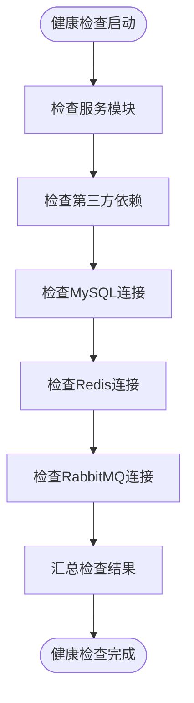
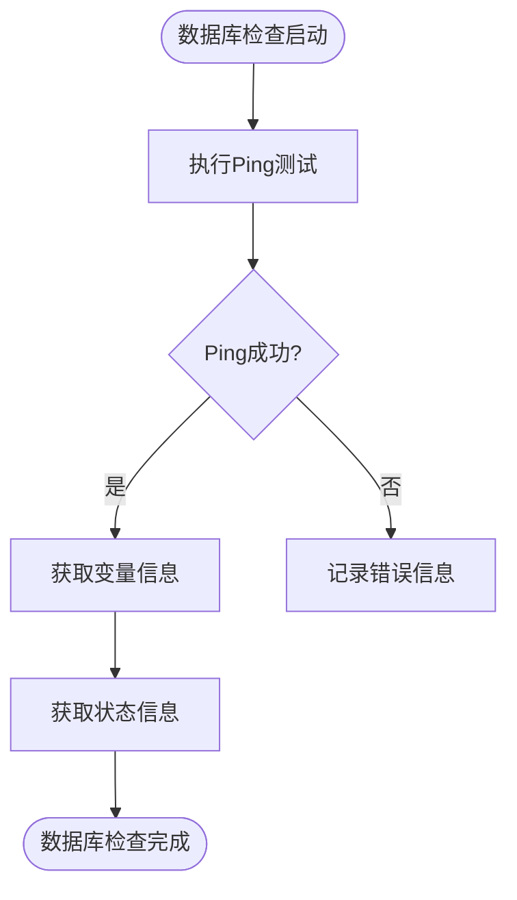
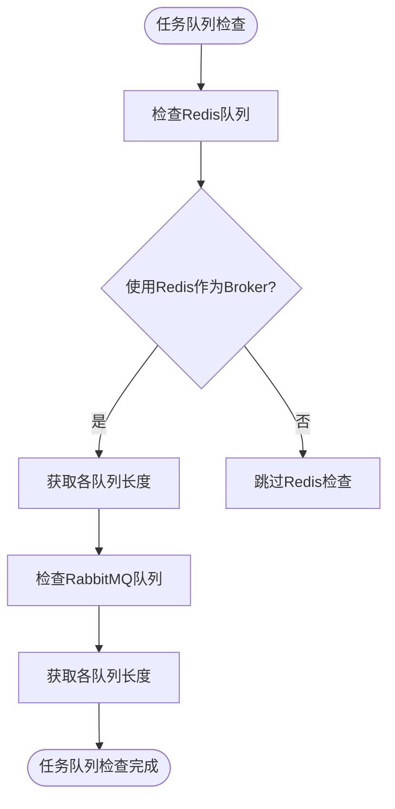
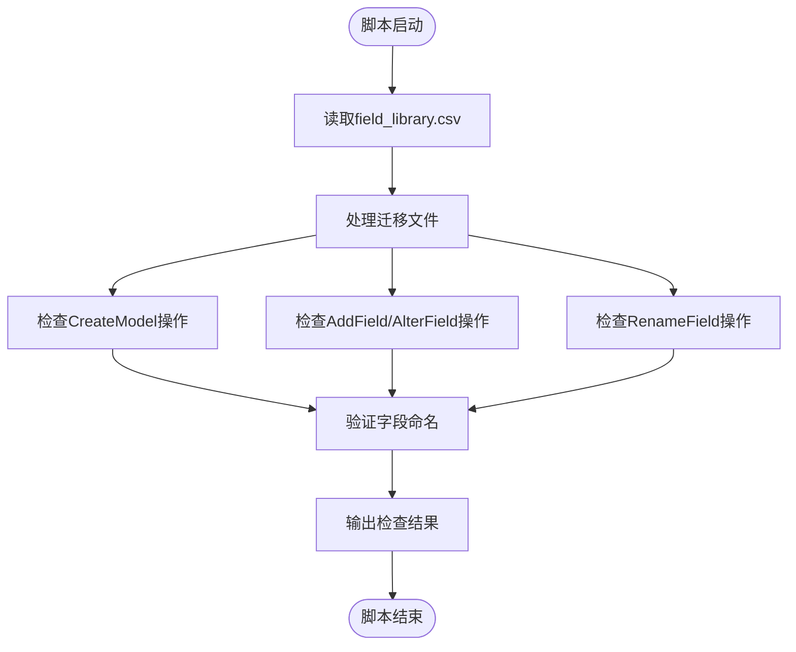
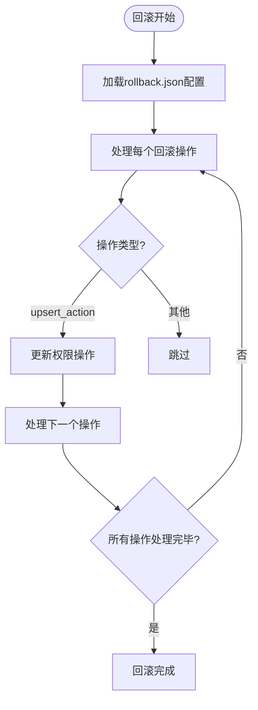

# 验证与回滚

<cite>
**本文档引用的文件**  
- [check_migrate.py](file://scripts/check_migrate/check_migrate.py)
- [healthz.py](file://home_application/management/commands/healthz.py)
- [healthz.py](file://home_application/handlers/healthz.py)
- [service_module.py](file://home_application/handlers/healthz_metrics/service_module.py)
- [third_party.py](file://home_application/utils/third_party.py)
- [mysql.py](file://home_application/handlers/healthz_metrics/mysql.py)
- [redis.py](file://home_application/handlers/healthz_metrics/redis.py)
- [rabbitmq.py](file://home_application/handlers/healthz_metrics/rabbitmq.py)
- [wsgi.py](file://wsgi.py)
- [uwsgi.ini](file://support-files/uwsgi.ini)
- [rollback.json](file://support-files/iam/rollback.json)
- [migrate_tool.py](file://home_application/management/commands/migrate_tool.py)
- [archive.py](file://apps/log_databus/handlers/archive.py)
</cite>

## 目录
1. [引言](#引言)
2. [服务验证检查清单](#服务验证检查清单)
3. [自动化验证脚本使用方法](#自动化验证脚本使用方法)
4. [回滚方案](#回滚方案)
5. [常见问题诊断与解决方案](#常见问题诊断与解决方案)
6. [蓝鲸生态系统特殊要求](#蓝鲸生态系统特殊要求)

## 引言
本文档旨在为蓝鲸监控系统的升级过程提供完整的验证与回滚方案，确保升级操作的安全性和可逆性。文档详细说明了服务验证的完整检查清单，包括API可用性、数据库连接、后台任务运行状态等关键指标。同时，文档提供了自动化验证脚本的使用方法，重点描述了回滚方案的执行步骤，并包含了常见问题的诊断方法和解决方案。特别关注了蓝鲸生态系统的回滚特殊要求和协调机制，以确保系统在升级失败时能够快速恢复到稳定状态。

## 服务验证检查清单

### API可用性验证
系统提供了全面的健康检查机制，通过`healthz`命令和相关处理器来验证API的可用性。健康检查覆盖了服务模块、第三方依赖、数据库连接和消息队列等多个方面。



**Diagram sources**
- [healthz.py](file://home_application/management/commands/healthz.py#L25-L49)
- [service_module.py](file://home_application/handlers/healthz_metrics/service_module.py#L38-L75)
- [third_party.py](file://home_application/handlers/healthz_metrics/third_party.py#L36-L78)

**Section sources**
- [healthz.py](file://home_application/management/commands/healthz.py#L25-L49)
- [service_module.py](file://home_application/handlers/healthz_metrics/service_module.py#L38-L75)

### 数据库连接验证
数据库连接的验证通过专门的MySQL检查器来实现，确保数据库服务正常运行并能够响应查询请求。



**Diagram sources**
- [mysql.py](file://home_application/handlers/healthz_metrics/mysql.py#L27-L85)

**Section sources**
- [mysql.py](file://home_application/handlers/healthz_metrics/mysql.py#L27-L85)

### 后台任务运行状态验证
后台任务的运行状态通过检查Redis和RabbitMQ的消息队列长度来验证，确保任务调度系统正常工作。



**Diagram sources**
- [redis.py](file://home_application/handlers/healthz_metrics/redis.py#L89-L113)
- [rabbitmq.py](file://home_application/handlers/healthz_metrics/rabbitmq.py#L58-L86)

**Section sources**
- [redis.py](file://home_application/handlers/healthz_metrics/redis.py#L89-L113)
- [rabbitmq.py](file://home_application/handlers/healthz_metrics/rabbitmq.py#L58-L86)

## 自动化验证脚本使用方法

### check_migrate.py脚本功能
`check_migrate.py`脚本主要用于校验数据库迁移文件中的模型字段是否符合规范。该脚本通过读取字段库配置，检查迁移文件中的字段命名是否标准。



**Diagram sources**
- [check_migrate.py](file://scripts/check_migrate/check_migrate.py#L1-L230)

**Section sources**
- [check_migrate.py](file://scripts/check_migrate/check_migrate.py#L1-L230)

### 脚本使用方法
1. 确保`field_library.csv`文件存在并包含正确的字段映射关系
2. 将需要检查的迁移文件作为参数传递给脚本
3. 脚本会自动检查文件中的字段命名是否符合规范
4. 如果发现不规范的字段命名，脚本会输出警告信息并返回非零退出码

```bash
python check_migrate.py migrations/0001_initial.py migrations/0002_add_field.py
```

## 回滚方案

### 数据库回滚脚本执行
系统提供了数据库回滚的JSON配置文件，用于恢复IAM权限配置到之前的状态。该文件包含了多个已回滚的操作定义。



**Diagram sources**
- [rollback.json](file://support-files/iam/rollback.json#L254-L465)

**Section sources**
- [rollback.json](file://support-files/iam/rollback.json#L254-L465)

### 代码版本回退
代码版本回退需要通过版本控制系统（如Git）来实现，将代码库恢复到升级前的稳定版本。

### 配置文件恢复
配置文件的恢复需要从备份中获取升级前的配置文件，并替换当前的配置文件。

## 常见问题诊断与解决方案

### 数据不一致问题
当出现数据不一致问题时，可以通过以下步骤进行诊断和解决：

1. 检查数据库连接是否正常
2. 验证数据同步任务是否正常运行
3. 检查是否有未完成的事务
4. 使用数据库备份进行数据恢复

### 服务启动失败
服务启动失败的常见原因和解决方案：

1. 检查配置文件是否正确
2. 验证依赖服务是否正常运行
3. 检查日志文件获取详细错误信息
4. 确认端口是否被占用

## 蓝鲸生态系统特殊要求

### 回滚协调机制
在蓝鲸生态系统中，回滚操作需要考虑与其他组件的协调。特别是IAM权限配置的回滚，需要确保不会影响其他系统的正常运行。

### 特殊注意事项
1. 在执行回滚操作前，必须备份当前状态
2. 回滚操作需要在维护窗口期间执行
3. 回滚后需要进行全面的验证测试
4. 记录回滚操作的详细日志，便于后续审计

**Section sources**
- [rollback.json](file://support-files/iam/rollback.json#L254-L465)
- [docs/wiki/join-bk-community.md](file://docs/wiki/join-bk-community.md#L44-L47)