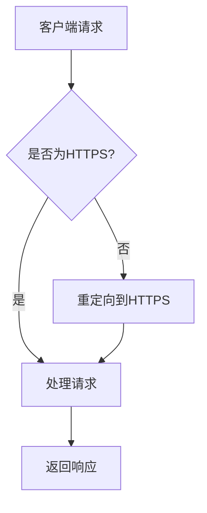
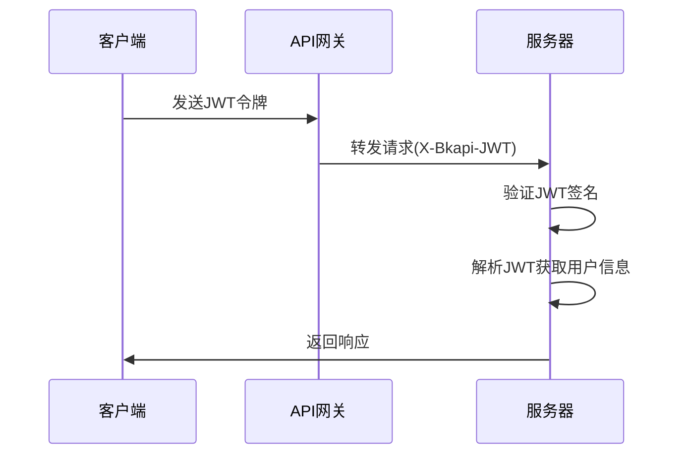
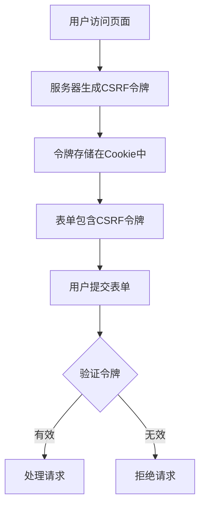
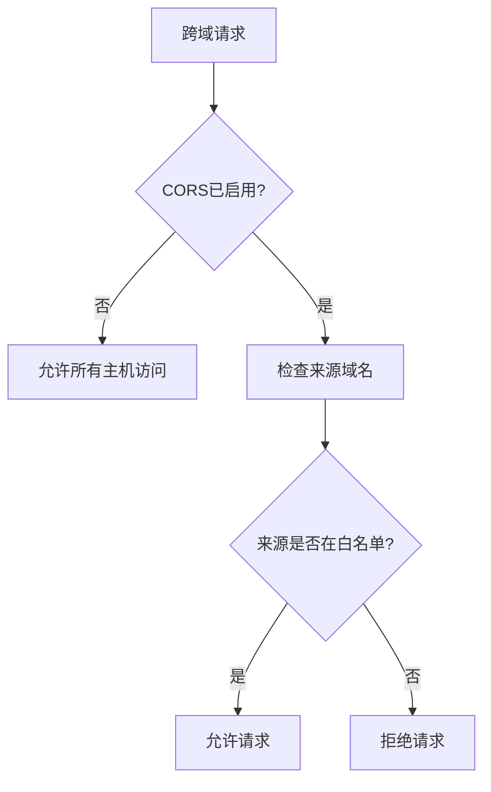
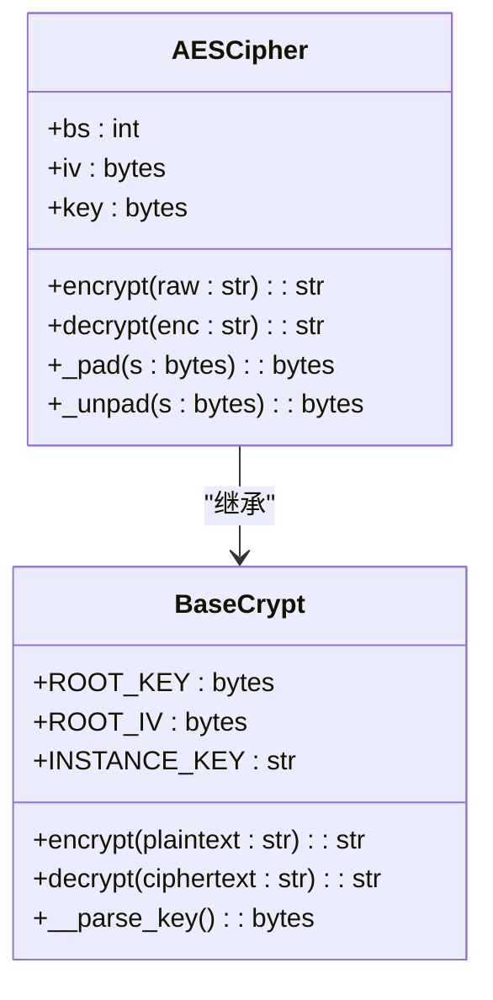
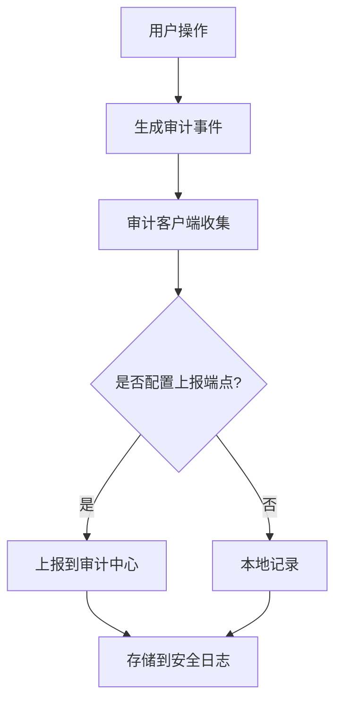
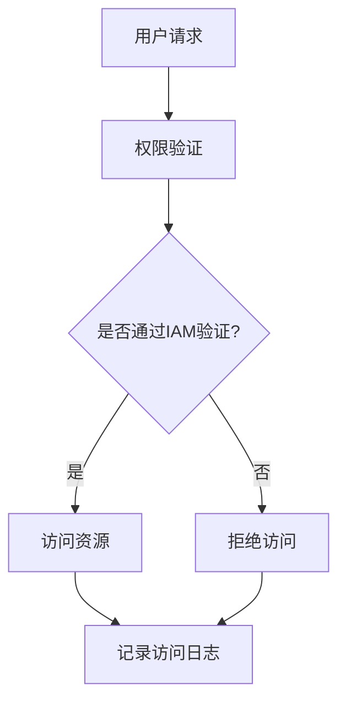

# 安全设置

<cite>
**本文档引用的文件**
- [prod.py](file://bklog/config/prod.py)
- [default.py](file://bklog/config/default.py)
- [middlewares.py](file://bklog/apps/middlewares.py)
- [apigw.py](file://bklog/apps/middleware/apigw.py)
- [aes.py](file://bklog/apps/utils/aes.py)
- [base_crypt.py](file://bklog/apps/utils/base_crypt.py)
- [consul.py](file://bklog/apps/utils/consul.py)
- [authentication.py](file://bklog/apps/grafana/authentication.py)
- [uwsgi.ini](file://bklog/support-files/uwsgi.ini)
- [log_audit/apps.py](file://bklog/apps/log_audit/apps.py)
</cite>

## 目录
1. [引言](#引言)
2. [HTTPS配置](#https配置)
3. [API网关认证机制](#api网关认证机制)
4. [跨站请求伪造(CSRF)防护](#跨站请求伪造csrf防护)
5. [跨域资源共享(CORS)策略](#跨域资源共享cors策略)
6. [敏感信息加密存储方案](#敏感信息加密存储方案)
7. [安全日志记录规范](#安全日志记录规范)
8. [IAM权限集成配置和访问控制策略](#iam权限集成配置和访问控制策略)
9. [安全漏洞扫描和渗透测试配置建议](#安全漏洞扫描和渗透测试配置建议)
10. [结论](#结论)

## 引言
本文档全面介绍了生产环境的安全防护措施，涵盖了HTTPS配置、API网关认证机制、跨站请求伪造(CSRF)防护、跨域资源共享(CORS)策略等方面。详细说明了敏感信息加密存储方案和安全日志记录规范，包括IAM权限集成配置和访问控制策略。同时提供了安全漏洞扫描和渗透测试的配置建议。

## HTTPS配置

该系统通过多种机制确保HTTPS的安全配置。在生产环境中，系统会自动将HTTP请求重定向到HTTPS，确保所有通信都通过加密通道进行。

**图示来源**
- [middlewares.py](file://bklog/apps/middlewares.py#L205-L210)
- [default.py](file://bklog/config/default.py#L1248)

**本节来源**
- [middlewares.py](file://bklog/apps/middlewares.py#L205-L210)
- [default.py](file://bklog/config/default.py#L1248)

## API网关认证机制

系统实现了基于JWT的API网关认证机制，通过公钥验证确保请求的合法性。认证流程支持内部和外部API网关的不同配置。

**图示来源**
- [apigw.py](file://bklog/apps/middleware/apigw.py#L60-L124)
- [middlewares.py](file://bklog/apps/middlewares.py#L225-L232)

**本节来源**
- [apigw.py](file://bklog/apps/middleware/apigw.py#L60-L124)

## 跨站请求伪造(CSRF)防护

系统实现了CSRF防护机制，通过CSRF令牌验证防止跨站请求伪造攻击。同时为特定场景提供了无CSRF验证的认证方式。

**图示来源**
- [authentication.py](file://bklog/apps/grafana/authentication.py#L27-L29)
- [default.py](file://bklog/config/default.py#L39)

**本节来源**
- [authentication.py](file://bklog/apps/grafana/authentication.py#L27-L29)
- [default.py](file://bklog/config/default.py#L39)

## 跨域资源共享(CORS)策略

系统配置了灵活的CORS策略，允许根据环境变量控制跨域访问权限，确保开发和生产环境的安全性。

**图示来源**
- [default.py](file://bklog/config/default.py#L1013-L1018)

**本节来源**
- [default.py](file://bklog/config/default.py#L1013-L1018)

## 敏感信息加密存储方案

系统采用AES加密算法对敏感信息进行加密存储，提供了多种加密配置选项，确保数据在存储过程中的安全性。

**图示来源**
- [aes.py](file://bklog/apps/utils/aes.py#L35-L131)
- [base_crypt.py](file://bklog/apps/utils/base_crypt.py#L31-L65)

**本节来源**
- [aes.py](file://bklog/apps/utils/aes.py#L35-L131)
- [base_crypt.py](file://bklog/apps/utils/base_crypt.py#L31-L65)

## 安全日志记录规范

系统实现了完善的安全日志记录机制，通过审计客户端收集和上报操作日志，确保所有关键操作都有迹可循。

**图示来源**
- [apps.py](file://bklog/apps/log_audit/apps.py#L35-L38)

**本节来源**
- [apps.py](file://bklog/apps/log_audit/apps.py#L35-L38)

## IAM权限集成配置和访问控制策略

系统集成了IAM权限管理，通过细粒度的访问控制策略确保资源的安全访问。权限配置支持兼容模式，确保系统升级过程中的平滑过渡。

**图示来源**
- [prod.py](file://bklog/config/prod.py#L85-L95)

**本节来源**
- [prod.py](file://bklog/config/prod.py#L85-L95)

## 安全漏洞扫描和渗透测试配置建议

为了确保系统的安全性，建议定期进行安全漏洞扫描和渗透测试。以下是一些配置建议：

1. **定期更新依赖库**：确保所有第三方库都是最新版本，避免已知漏洞
2. **配置安全扫描工具**：集成自动化安全扫描工具到CI/CD流程中
3. **定期渗透测试**：每季度进行一次全面的渗透测试
4. **安全配置审计**：定期审查安全配置，确保符合最佳实践

**本节来源**
- [uwsgi.ini](file://bklog/support-files/uwsgi.ini#L1-L33)

## 结论
本文档详细介绍了生产环境的安全防护措施，涵盖了HTTPS配置、API网关认证机制、CSRF防护、CORS策略、敏感信息加密存储、安全日志记录、IAM权限集成和访问控制策略等方面。通过实施这些安全措施，可以有效提升系统的整体安全性，保护用户数据和系统资源。