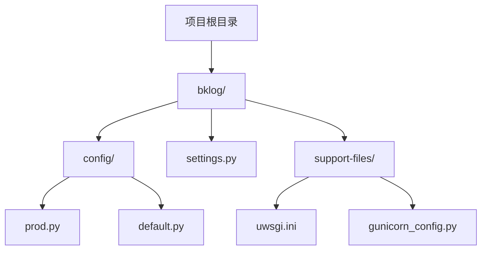
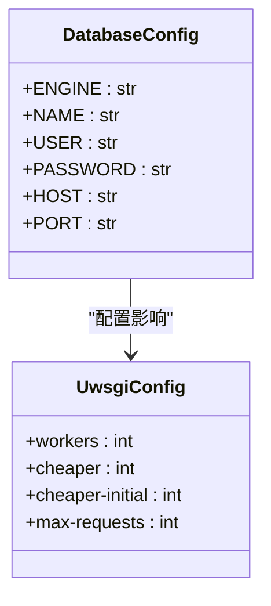
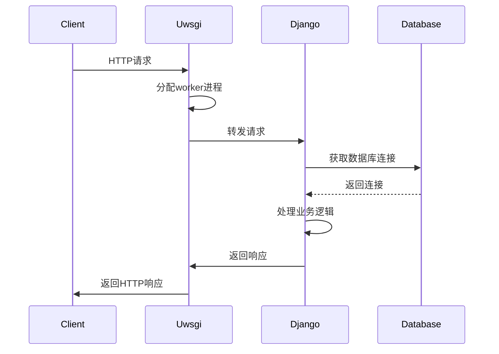
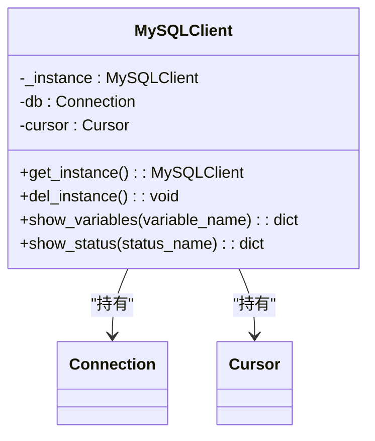
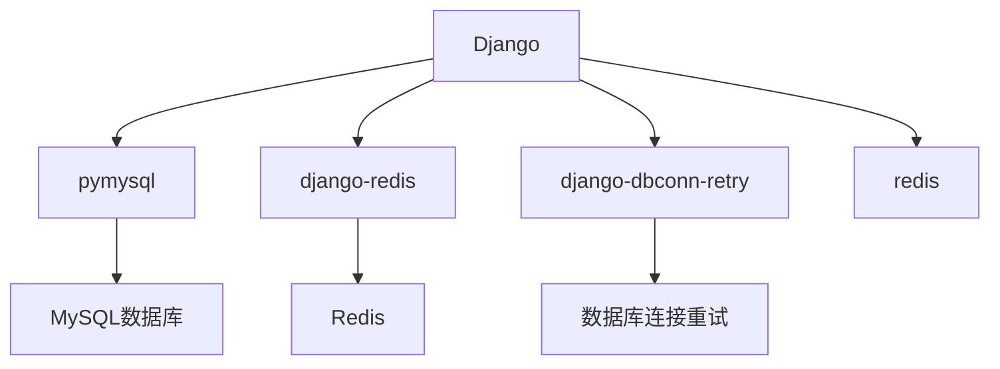
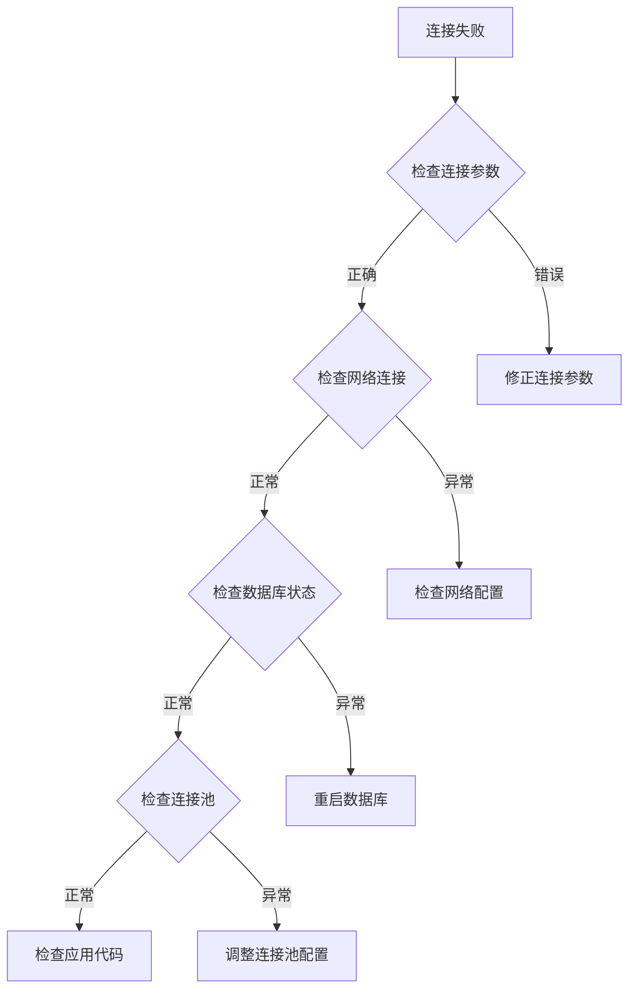

# 数据库配置

<cite>
**本文档引用的文件**
- [settings.py](file://bklog/settings.py)
- [config/prod.py](file://bklog/config/prod.py)
- [config/default.py](file://bklog/config/default.py)
- [support-files/uwsgi.ini](file://bklog/support-files/uwsgi.ini)
- [gunicorn_config.py](file://bklog/gunicorn_config.py)
- [home_application/utils/mysql.py](file://bklog/home_application/utils/mysql.py)
- [requirements.txt](file://bklog/requirements.txt)
</cite>

## 目录
1. [引言](#引言)
2. [项目结构](#项目结构)
3. [核心组件](#核心组件)
4. [架构概述](#架构概述)
5. [详细组件分析](#详细组件分析)
6. [依赖分析](#依赖分析)
7. [性能考虑](#性能考虑)
8. [故障排除指南](#故障排除指南)
9. [结论](#结论)

## 引言
本文档详细说明了蓝鲸日志平台在生产环境下的数据库配置，重点介绍数据库连接池的优化设置。文档涵盖了最大连接数、空闲连接数、连接超时时间等关键参数的配置，以及Django数据库配置与uwsgi进程模型的协同工作原理。同时提供了针对不同业务负载的配置建议和数据库连接故障排查指南。

## 项目结构
蓝鲸日志平台的项目结构遵循Django应用的标准布局，主要配置文件位于`config/`目录下，包括不同环境的配置文件。数据库相关配置主要分布在`settings.py`、`config/prod.py`和`config/default.py`文件中。

**图示来源**
- [settings.py](file://bklog/settings.py)
- [config/prod.py](file://bklog/config/prod.py)
- [config/default.py](file://bklog/config/default.py)
- [support-files/uwsgi.ini](file://bklog/support-files/uwsgi.ini)

**本节来源**
- [settings.py](file://bklog/settings.py)
- [config/prod.py](file://bklog/config/prod.py)
- [config/default.py](file://bklog/config/default.py)

## 核心组件
系统的核心数据库配置组件包括Django的数据库配置、uwsgi服务器配置和连接池管理。生产环境的数据库配置通过环境变量从外部注入，确保了配置的安全性和灵活性。

**本节来源**
- [settings.py](file://bklog/settings.py)
- [config/prod.py](file://bklog/config/prod.py)
- [config/default.py](file://bklog/config/default.py)

## 架构概述
系统采用Django框架作为Web应用的基础，通过uwsgi作为应用服务器，与MySQL数据库进行交互。数据库连接通过Django的ORM层管理，连接池配置与uwsgi的工作进程模型协同工作，以优化数据库资源的使用。

**图示来源**
- [settings.py](file://bklog/settings.py)
- [support-files/uwsgi.ini](file://bklog/support-files/uwsgi.ini)
- [config/prod.py](file://bklog/config/prod.py)

## 详细组件分析

### 数据库连接池配置分析
系统通过环境变量配置数据库连接参数，生产环境的数据库配置在`config/prod.py`文件中定义。当部署模式为Kubernetes时，数据库连接信息从环境变量中获取。

**图示来源**
- [config/prod.py](file://bklog/config/prod.py#L107-L116)
- [support-files/uwsgi.ini](file://bklog/support-files/uwsgi.ini#L19-L22)

**本节来源**
- [config/prod.py](file://bklog/config/prod.py)
- [support-files/uwsgi.ini](file://bklog/support-files/uwsgi.ini)

### Django与uwsgi协同工作原理
Django的数据库配置与uwsgi进程模型通过合理的参数设置实现协同工作。uwsgi的worker进程数与数据库连接池大小需要匹配，以避免数据库连接耗尽。

**图示来源**
- [settings.py](file://bklog/settings.py)
- [support-files/uwsgi.ini](file://bklog/support-files/uwsgi.ini)
- [gunicorn_config.py](file://bklog/gunicorn_config.py)

**本节来源**
- [settings.py](file://bklog/settings.py)
- [support-files/uwsgi.ini](file://bklog/support-files/uwsgi.ini)
- [gunicorn_config.py](file://bklog/gunicorn_config.py)

### MySQL连接管理
系统通过`home_application/utils/mysql.py`文件中的`MySQLClient`类管理MySQL连接，实现了单例模式以减少连接开销。

**图示来源**
- [home_application/utils/mysql.py](file://bklog/home_application/utils/mysql.py#L33-L66)

**本节来源**
- [home_application/utils/mysql.py](file://bklog/home_application/utils/mysql.py)

## 依赖分析
系统依赖于多个关键的Python包来管理数据库连接和性能监控，包括`pymysql`、`django-redis`和`django-dbconn-retry`等。

**图示来源**
- [requirements.txt](file://bklog/requirements.txt)
- [config/default.py](file://bklog/config/default.py)

**本节来源**
- [requirements.txt](file://bklog/requirements.txt)
- [config/default.py](file://bklog/config/default.py)

## 性能考虑
为了优化数据库性能，建议根据业务负载调整以下参数：

1. **最大连接数**: 根据uwsgi的worker数量和并发需求设置
2. **空闲连接数**: 保持适当的空闲连接以快速响应请求
3. **连接超时时间**: 设置合理的超时时间以避免连接泄漏
4. **连接池大小**: 与uwsgi worker数量相匹配

在高并发场景下，建议增加worker数量和连接池大小，同时监控数据库的连接使用情况。

**本节来源**
- [support-files/uwsgi.ini](file://bklog/support-files/uwsgi.ini)
- [config/prod.py](file://bklog/config/prod.py)

## 故障排除指南
当遇到数据库连接问题时，可以按照以下步骤进行排查：

1. 检查数据库连接参数是否正确
2. 监控数据库连接数是否达到上限
3. 检查网络连接是否正常
4. 查看应用日志中的错误信息
5. 使用`show status`和`show variables`命令检查数据库状态

**图示来源**
- [home_application/utils/mysql.py](file://bklog/home_application/utils/mysql.py#L68-L93)
- [config/prod.py](file://bklog/config/prod.py)

**本节来源**
- [home_application/utils/mysql.py](file://bklog/home_application/utils/mysql.py)
- [config/prod.py](file://bklog/config/prod.py)

## 结论
蓝鲸日志平台的数据库配置通过环境变量和配置文件的组合方式实现了灵活性和安全性。通过合理配置uwsgi工作进程和数据库连接池，系统能够在生产环境中稳定运行。建议根据实际业务负载定期评估和调整数据库连接参数，以确保系统性能和稳定性。