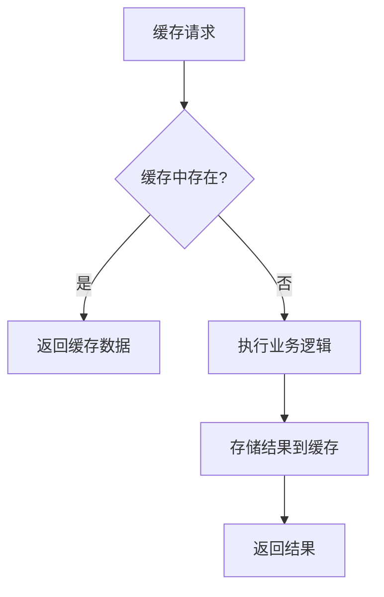
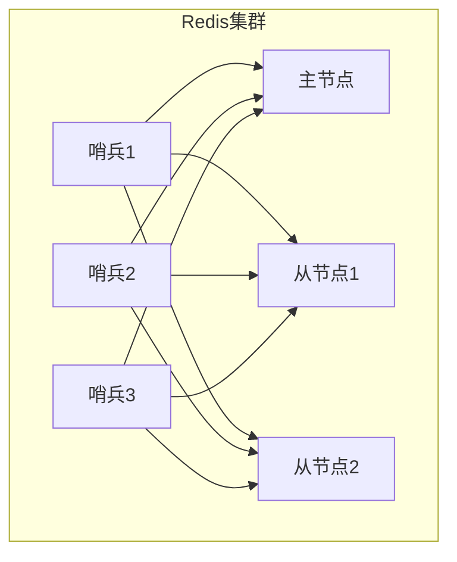
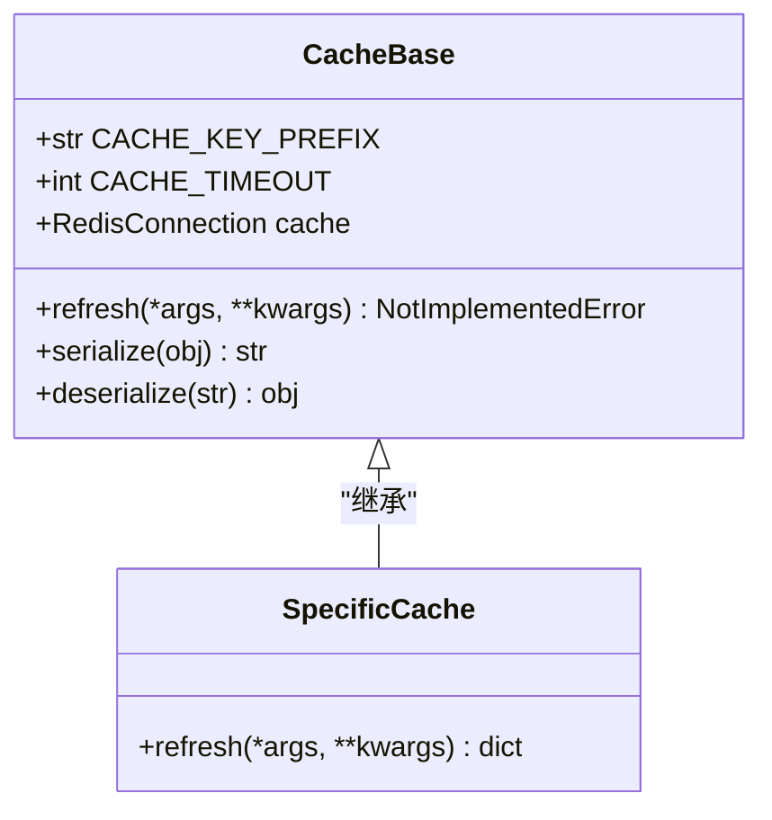
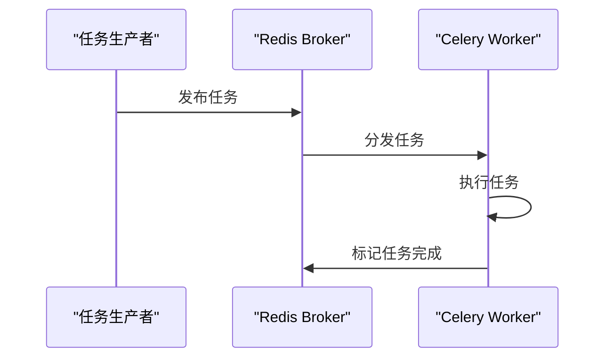
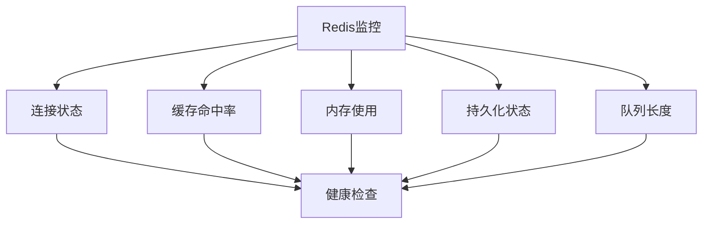

# 缓存策略

<cite>
**本文档引用文件**   
- [default.py](file://bklog/config/default.py)
- [sentinel.py](file://bklog/apps/utils/sentinel.py)
- [cache.py](file://bklog/apps/utils/cache.py)
- [cache_base.py](file://bklog/apps/utils/core/cache/cache_base.py)
- [redis.py](file://bklog/home_application/utils/redis.py)
- [healthz_metrics/redis.py](file://bklog/home_application/handlers/healthz_metrics/redis.py)
- [settings.py](file://bklog/settings.py)
</cite>

## 目录
1. [引言](#引言)
2. [Redis生产环境配置](#redis生产环境配置)
3. [Django缓存框架与Redis集成](#django缓存框架与redis集成)
4. [Celery任务队列对Redis的依赖](#celery任务队列对redis的依赖)
5. [缓存防护方案](#缓存防护方案)
6. [缓存性能监控与容量规划](#缓存性能监控与容量规划)
7. [结论](#结论)

## 引言
本文档详细阐述了在蓝鲸日志平台中Redis缓存的生产环境配置和使用模式。文档涵盖了缓存过期策略、内存淘汰机制、持久化配置和集群模式设置，以及Django缓存框架与Redis的集成方式。同时，文档还说明了Celery任务队列对Redis的依赖关系，提供了针对缓存穿透、缓存雪崩和缓存击穿的防护方案，并包含缓存性能监控和容量规划建议。

## Redis生产环境配置

### 缓存过期策略与内存淘汰机制
在生产环境中，Redis的缓存过期策略通过Django的缓存框架进行配置。系统支持多种缓存过期时间，包括半分钟、一分钟、五分钟、十分钟、一小时和一天。这些过期时间通过`using_cache`装饰器进行设置，确保缓存数据在指定时间后自动过期。



**Diagram sources**
- [cache.py](file://bklog/apps/utils/cache.py#L36-L81)

### 持久化配置
Redis的持久化配置主要通过配置文件中的环境变量进行管理。系统支持RDB和AOF两种持久化方式，具体配置取决于生产环境的需求。持久化配置确保在Redis服务重启后，缓存数据能够从磁盘恢复，避免数据丢失。

### 集群模式设置
系统支持Redis单机模式和哨兵模式（Sentinel）两种集群模式。当`REDIS_MODE`设置为"sentinel"时，系统会使用哨兵模式进行高可用配置。哨兵模式通过监控Redis主从实例，自动进行故障转移，确保缓存服务的高可用性。



**Diagram sources**
- [sentinel.py](file://bklog/apps/utils/sentinel.py#L31-L106)
- [default.py](file://bklog/config/default.py#L1204-L1224)

**Section sources**
- [default.py](file://bklog/config/default.py#L1036-L1229)
- [sentinel.py](file://bklog/apps/utils/sentinel.py#L1-L107)

## Django缓存框架与Redis集成

### 集成方式
Django缓存框架通过`django_redis`库与Redis进行集成。系统配置了多个缓存后端，包括Redis、数据库、虚拟缓存和本地内存缓存。当`USE_REDIS`设置为True时，系统会将默认缓存后端切换为Redis。

```python
CACHES = {
    "redis": {
        "BACKEND": "django_prometheus.cache.backends.redis.RedisCache",
        "LOCATION": f"redis://{REDIS_HOST}:{REDIS_PORT}/0",
        "OPTIONS": {"CLIENT_CLASS": "django_redis.client.DefaultClient", "PASSWORD": REDIS_PASSWD},
        "KEY_PREFIX": APP_CODE,
        "VERSION": REDIS_VERSION,
    },
    # 其他缓存后端配置...
}
```

**Section sources**
- [default.py](file://bklog/config/default.py#L1181-L1224)

### 缓存基类设计
系统设计了`CacheBase`抽象基类，为所有缓存操作提供统一的接口。该基类定义了缓存键前缀、默认过期时间和序列化方法，确保缓存操作的一致性和可维护性。



**Diagram sources**
- [cache_base.py](file://bklog/apps/utils/core/cache/cache_base.py#L1-L31)

## Celery任务队列对Redis的依赖

### 依赖关系
Celery任务队列使用Redis作为消息代理（broker），负责存储和传递任务消息。系统通过`BROKER_URL`配置项指定Redis作为Celery的broker，确保任务能够可靠地分发和执行。



**Diagram sources**
- [redis.py](file://bklog/home_application/utils/redis.py#L25-L70)
- [healthz_metrics/redis.py](file://bklog/home_application/handlers/healthz_metrics/redis.py#L89-L113)

### 队列监控
系统提供了Redis队列长度的监控功能，通过`RedisClient`类的`queue_len`方法获取指定队列的长度。当队列长度超过预设阈值时，系统会发出告警，提示队列积压风险。

**Section sources**
- [redis.py](file://bklog/home_application/utils/redis.py#L110-L121)
- [healthz_metrics/redis.py](file://bklog/home_application/handlers/healthz_metrics/redis.py#L89-L113)

## 缓存防护方案

### 缓存穿透防护
缓存穿透是指查询不存在的数据，导致每次请求都穿透到数据库。系统通过以下方式防护缓存穿透：
1. 对查询结果为空的情况，也进行缓存，设置较短的过期时间
2. 使用布隆过滤器（Bloom Filter）预先判断数据是否存在

### 缓存雪崩防护
缓存雪崩是指大量缓存同时过期，导致数据库压力骤增。系统通过以下方式防护缓存雪崩：
1. 为不同类型的缓存设置不同的过期时间，避免同时过期
2. 使用缓存预热机制，在系统启动或低峰期预先加载热点数据

### 缓存击穿防护
缓存击穿是指某个热点数据过期时，大量并发请求同时穿透到数据库。系统通过以下方式防护缓存击穿：
1. 使用互斥锁（Mutex Lock）机制，确保同一时间只有一个请求可以重建缓存
2. 对热点数据设置永不过期，通过后台任务定期更新

## 缓存性能监控与容量规划

### 性能监控
系统提供了全面的Redis性能监控功能，包括：
- 连接状态监控（ping）
- 缓存命中率监控
- 内存使用情况监控
- 持久化状态监控



**Diagram sources**
- [healthz_metrics/redis.py](file://bklog/home_application/handlers/healthz_metrics/redis.py#L34-L87)

### 容量规划
根据业务需求和数据增长趋势，建议的Redis容量规划如下：
1. 内存容量：根据热点数据大小的3-5倍进行规划
2. 连接数：根据并发请求量的1.5-2倍进行规划
3. 持久化策略：根据数据重要性和恢复时间要求选择合适的持久化方式
4. 高可用性：生产环境建议使用哨兵模式或集群模式

**Section sources**
- [healthz_metrics/redis.py](file://bklog/home_application/handlers/healthz_metrics/redis.py#L24-L113)

## 结论
本文档详细阐述了蓝鲸日志平台中Redis缓存的生产环境配置和使用模式。通过合理的配置和防护措施，可以确保缓存系统的高性能、高可用性和数据安全性。建议在生产环境中根据实际业务需求，灵活调整缓存策略，定期进行性能监控和容量评估，确保系统稳定运行。