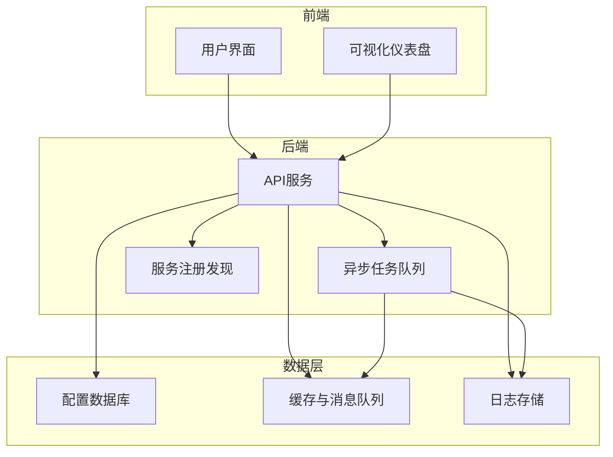
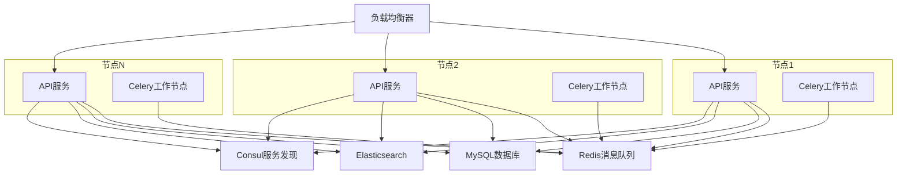
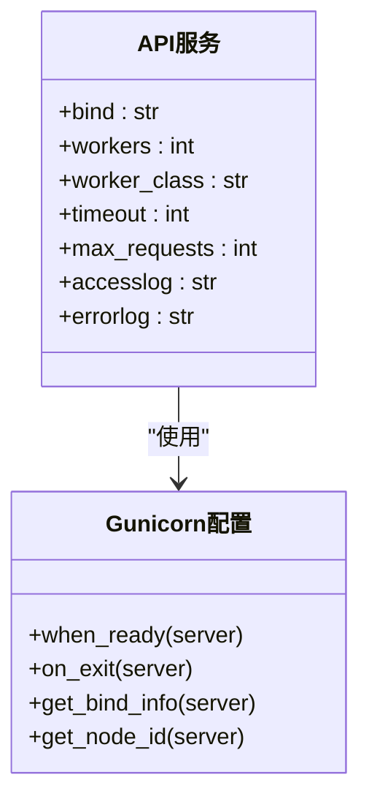
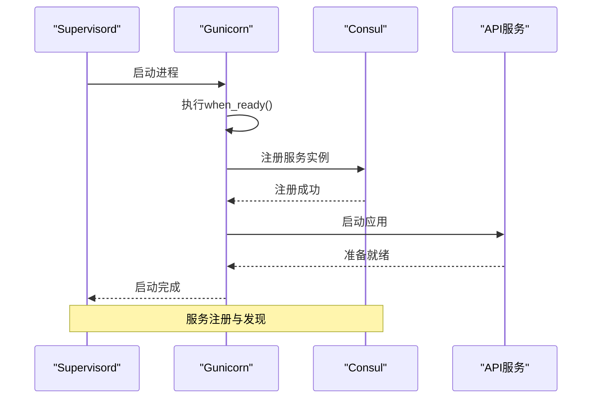
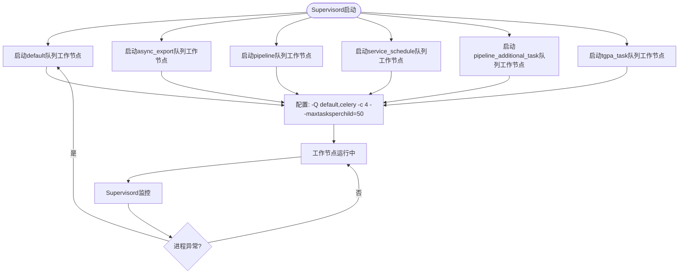
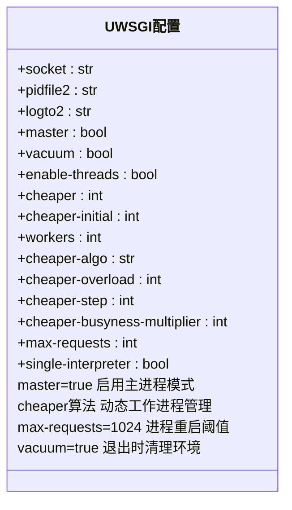

# 高可用架构

<cite>
**本文档引用的文件**  
- [supervisord.conf](file://bklog/support-files/supervisord.conf)
- [uwsgi.ini](file://bklog/support-files/uwsgi.ini)
- [gunicorn_config.py](file://bklog/gunicorn_config.py)
- [prod.py](file://bklog/config/prod.py)
- [stag.py](file://bklog/config/stag.py)
- [dev.py](file://bklog/config/dev.py)
</cite>

## 目录
1. [简介](#简介)
2. [项目结构](#项目结构)
3. [核心组件](#核心组件)
4. [架构概述](#架构概述)
5. [详细组件分析](#详细组件分析)
6. [依赖分析](#依赖分析)
7. [性能考虑](#性能考虑)
8. [故障排查指南](#故障排查指南)
9. [结论](#结论)

## 简介
本文档详细描述了蓝鲸日志平台（BK-LOG）的高可用架构设计，重点涵盖容错机制、故障恢复策略、负载均衡配置、服务监控与自动重启、故障转移方案、数据备份与恢复流程。文档还深入分析了supervisord进程管理配置和uwsgi高可用参数设置，提供了多节点部署架构和数据一致性保障方案，并包含灾难恢复预案和系统健康检查配置。

## 项目结构
蓝鲸日志平台采用模块化设计，主要功能模块包括日志采集、搜索、分析、可视化和权限管理。系统基于Django框架开发，使用Celery进行异步任务处理，通过Consul实现服务注册与发现，支持Kubernetes和传统部署模式。



**图示来源**  
- [supervisord.conf](file://bklog/support-files/supervisord.conf#L1-L75)
- [gunicorn_config.py](file://bklog/gunicorn_config.py#L41-L92)

**本节来源**  
- [bklog/](file://bklog/)

## 核心组件
系统核心组件包括API服务、Celery工作节点、异步导出服务、流水线服务和TGPA任务服务。所有组件均通过supervisord进行进程管理，确保服务的高可用性。API服务采用gunicorn或uwsgi作为WSGI服务器，支持多进程和动态工作进程管理。

**本节来源**  
- [supervisord.conf](file://bklog/support-files/supervisord.conf#L16-L75)
- [gunicorn_config.py](file://bklog/gunicorn_config.py#L41-L92)

## 架构概述
系统采用微服务架构，支持多节点部署。通过Consul实现服务注册与发现，配合负载均衡器实现流量分发。每个服务节点都包含完整的应用组件，包括API服务和多个Celery工作队列，确保单点故障不会影响整体服务。



**图示来源**  
- [gunicorn_config.py](file://bklog/gunicorn_config.py#L67-L82)
- [supervisord.conf](file://bklog/support-files/supervisord.conf#L23-L75)

## 详细组件分析

### API服务分析
API服务是系统的核心入口，负责处理所有HTTP请求。服务通过gunicorn或uwsgi部署，配置了多个工作进程以提高并发处理能力。

#### 进程管理配置


**图示来源**  
- [gunicorn_config.py](file://bklog/gunicorn_config.py#L41-L92)

#### 服务启动与注册流程


**图示来源**  
- [gunicorn_config.py](file://bklog/gunicorn_config.py#L67-L82)
- [supervisord.conf](file://bklog/support-files/supervisord.conf#L16-L21)

**本节来源**  
- [gunicorn_config.py](file://bklog/gunicorn_config.py#L41-L92)
- [supervisord.conf](file://bklog/support-files/supervisord.conf#L16-L21)

### Celery工作节点分析
系统配置了多个专用的Celery工作节点，分别处理不同类型的任务，实现任务隔离和资源优化。

#### 工作节点配置


**图示来源**  
- [supervisord.conf](file://bklog/support-files/supervisord.conf#L23-L75)

**本节来源**  
- [supervisord.conf](file://bklog/support-files/supervisord.conf#L23-L75)

### UWSGI高可用配置分析
系统提供了uwsgi作为另一种WSGI服务器选项，配置了高级的高可用特性。

#### UWSGI参数配置


**图示来源**  
- [uwsgi.ini](file://bklog/support-files/uwsgi.ini#L1-L35)

**本节来源**  
- [uwsgi.ini](file://bklog/support-files/uwsgi.ini#L1-L35)

## 依赖分析
系统依赖多个外部组件和服务，通过合理的配置实现高可用性。

```mermaid
graph TD
API[API服务] --> Redis[(Redis)]
API --> MySQL[(MySQL)]
API --> ES[(Elasticsearch)]
API --> Consul[(Consul)]
API --> BKIAM[(BK-IAM)]
Celery[异步任务] --> Redis
Celery --> ES
Grafana[可视化] --> ES
API --> Consul : 服务注册
Consul --> LB[负载均衡器] : 服务发现
style Redis fill:#f9f,stroke:#333
style MySQL fill:#f9f,stroke:#333
style ES fill:#f9f,stroke:#333
style Consul fill:#f9f,stroke:#333
style BKIAM fill:#f9f,stroke:#333
```

**图示来源**  
- [gunicorn_config.py](file://bklog/gunicorn_config.py#L35-L38)
- [prod.py](file://bklog/config/prod.py#L107-L116)
- [supervisord.conf](file://bklog/support-files/supervisord.conf#L24-L75)

**本节来源**  
- [prod.py](file://bklog/config/prod.py#L107-L120)
- [stag.py](file://bklog/config/stag.py#L48-L62)
- [dev.py](file://bklog/config/dev.py#L53-L62)

## 性能考虑
系统在设计上充分考虑了性能和资源利用效率，通过多种机制确保高并发场景下的稳定运行。

- **工作进程管理**：gunicorn配置8个工作进程，uwsgi配置16个工作进程和动态工作进程管理（cheaper算法）
- **请求限制**：配置max_requests参数，gunicorn为1000，uwsgi为1024，防止内存泄漏
- **超时设置**：65秒超时，避免长时间挂起的请求占用资源
- **任务隔离**：不同类型的Celery任务分配到专用的工作节点，避免相互影响
- **连接池**：通过数据库连接池和Redis连接池优化资源利用

**本节来源**  
- [gunicorn_config.py](file://bklog/gunicorn_config.py#L42-L50)
- [uwsgi.ini](file://bklog/support-files/uwsgi.ini#L19-L33)
- [supervisord.conf](file://bklog/support-files/supervisord.conf#L24-L75)

## 故障排查指南
系统提供了完善的监控和故障恢复机制，帮助快速定位和解决问题。

### 进程监控与自动恢复
- **Supervisord监控**：所有关键进程由supervisord管理，配置autorestart=true，确保进程异常退出后自动重启
- **日志记录**：每个进程都有独立的日志文件，便于问题追踪
- **健康检查**：通过Consul的TCP健康检查监控服务状态

### 灾难恢复预案
1. **服务恢复**：检查supervisord状态，重启异常服务
2. **数据恢复**：从备份恢复MySQL数据库和Elasticsearch索引
3. **配置恢复**：使用版本控制的配置文件恢复系统配置
4. **集群恢复**：在Kubernetes环境中，Pod异常时会自动重建

### 常见问题处理
- **API服务无响应**：检查uwsgi/gunicorn进程状态，查看日志中的错误信息
- **任务积压**：检查Celery工作节点状态，增加工作节点数量
- **数据库连接失败**：检查数据库服务状态和网络连接
- **服务注册失败**：检查Consul服务状态和网络配置

**本节来源**  
- [supervisord.conf](file://bklog/support-files/supervisord.conf#L20-L21)
- [gunicorn_config.py](file://bklog/gunicorn_config.py#L76-L82)
- [prod.py](file://bklog/config/prod.py#L107-L116)

## 结论
蓝鲸日志平台通过多层次的高可用设计，确保了系统的稳定性和可靠性。系统采用supervisord进行进程管理，实现了服务的自动监控和重启；通过gunicorn/uwsgi的多进程配置和动态工作进程管理，提高了服务的并发处理能力；利用Consul实现服务注册与发现，支持多节点部署和负载均衡；通过专用的Celery工作节点实现任务隔离和资源优化。整体架构设计合理，具备完善的容错和故障恢复机制，能够满足生产环境的高可用要求。