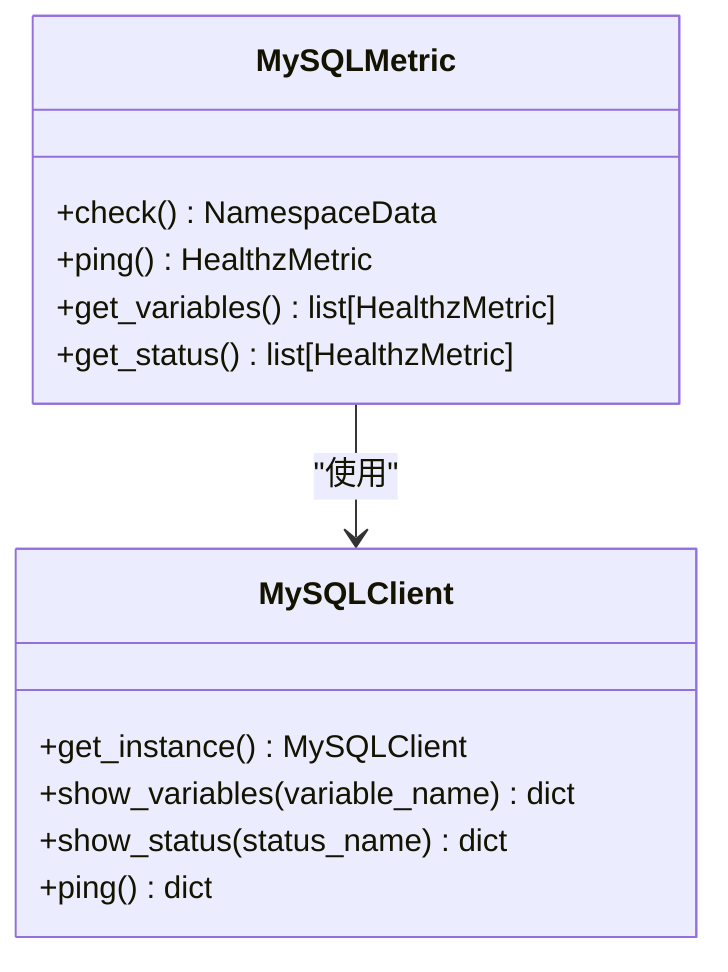
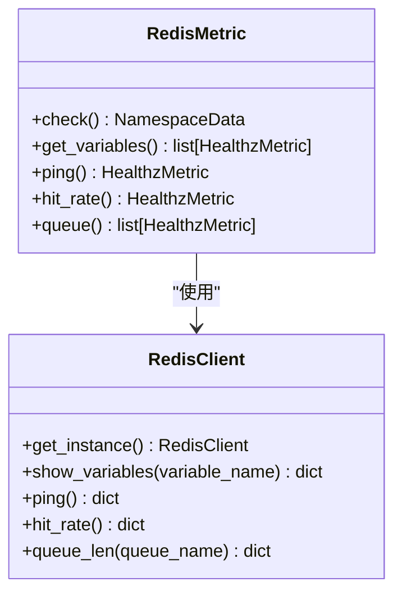
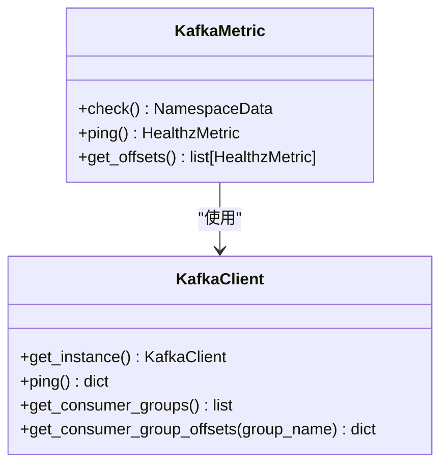
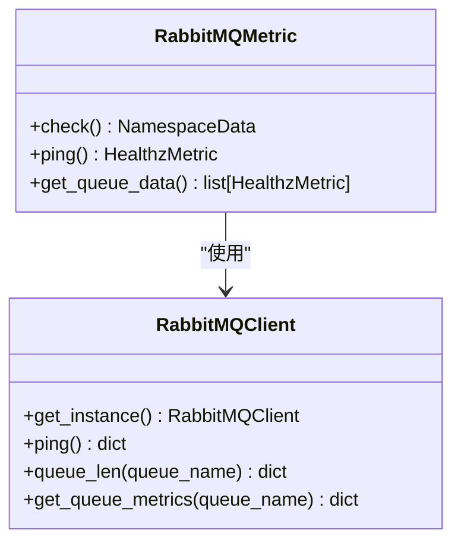
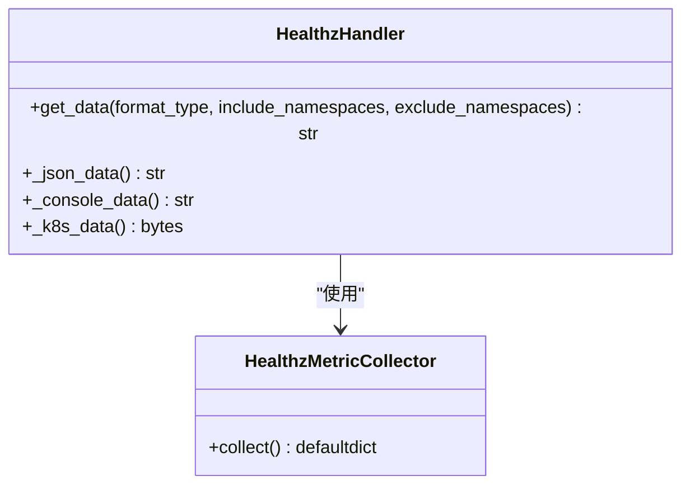
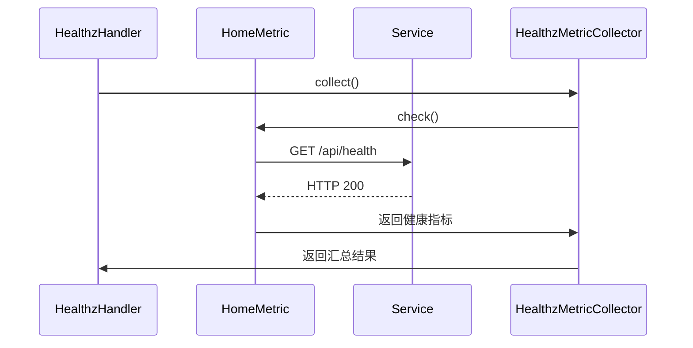
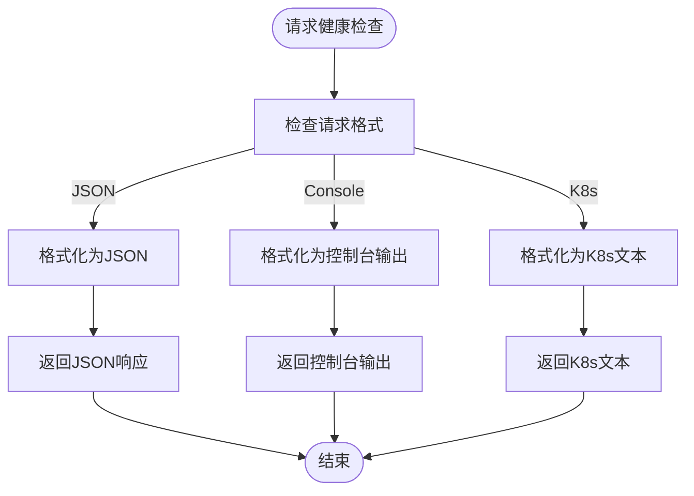
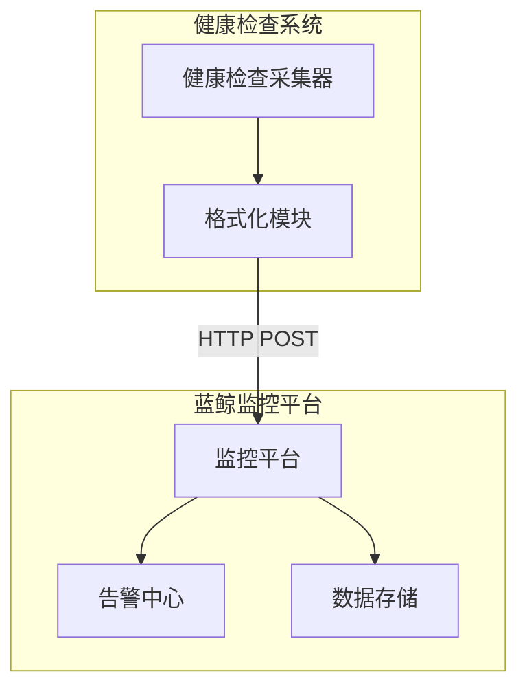
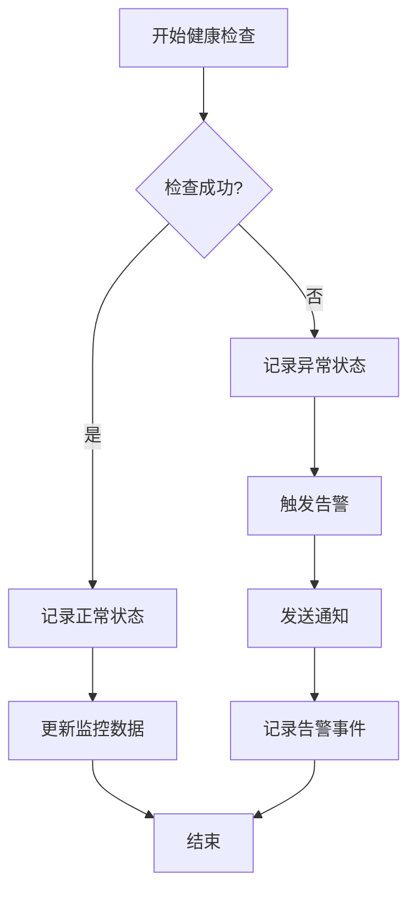

# 健康检查

<cite>
**本文档引用的文件**
- [healthz.py](file://bklog/home_application/handlers/healthz.py)
- [metrics.py](file://bklog/home_application/handlers/metrics.py)
- [mysql.py](file://bklog/home_application/handlers/healthz_metrics/mysql.py)
- [redis.py](file://bklog/home_application/handlers/healthz_metrics/redis.py)
- [kafka.py](file://bklog/home_application/handlers/healthz_metrics/kafka.py)
- [rabbitmq.py](file://bklog/home_application/handlers/healthz_metrics/rabbitmq.py)
- [third_party.py](file://bklog/home_application/handlers/healthz_metrics/third_party.py)
- [service_module.py](file://bklog/home_application/handlers/healthz_metrics/service_module.py)
- [version.py](file://bklog/home_application/handlers/healthz_metrics/version.py)
- [constants.py](file://bklog/home_application/constants.py)
- [mysql.py](file://bklog/home_application/utils/mysql.py)
- [redis.py](file://bklog/home_application/utils/redis.py)
- [kafka.py](file://bklog/home_application/utils/kafka.py)
- [rabbitmq.py](file://bklog/home_application/utils/rabbitmq.py)
- [third_party.py](file://bklog/home_application/utils/third_party.py)
</cite>

## 目录
1. [健康检查机制概述](#健康检查机制概述)
2. [核心组件健康检查实现](#核心组件健康检查实现)
3. [健康检查端点实现](#健康检查端点实现)
4. [服务模块健康状态评估](#服务模块健康状态评估)
5. [响应格式说明](#响应格式说明)
6. [自定义健康检查扩展方法](#自定义健康检查扩展方法)
7. [Kubernetes环境探针配置](#kubernetes环境探针配置)
8. [蓝鲸监控系统集成](#蓝鲸监控系统集成)
9. [监控与告警处理流程](#监控与告警处理流程)

## 健康检查机制概述

健康检查机制是蓝鲸日志平台的重要组成部分，用于监控系统各关键组件的运行状态。该机制通过定期检查核心服务的连接性和性能指标，确保系统的稳定性和可靠性。健康检查框架采用模块化设计，支持对多种关键组件的检测，包括MySQL、Redis、Kafka、RabbitMQ等。

健康检查系统的核心是`HealthzHandler`类，它负责协调各个健康检查指标的采集和格式化输出。通过`HealthzMetricCollector`采集器，系统能够收集来自不同命名空间的健康检查数据，并根据请求格式返回相应的结果。这种设计使得健康检查功能既灵活又易于扩展。

**Section sources**
- [healthz.py](file://bklog/home_application/handlers/healthz.py#L29-L120)
- [metrics.py](file://bklog/home_application/handlers/metrics.py#L103-L158)

## 核心组件健康检查实现

### MySQL健康检查

MySQL健康检查通过`MySQLMetric`类实现，主要检查数据库的连接状态和关键性能指标。检查项包括：
- 数据库连接性（ping）
- 版本信息
- 服务器ID
- 最大连接数
- 当前连接数
- 慢查询数量
- 查询总量

检查通过`MySQLClient`实例与数据库建立连接，并执行相应的SQL命令获取指标数据。如果连接失败，系统会记录错误信息并提供相应的建议。



**Diagram sources**
- [mysql.py](file://bklog/home_application/handlers/healthz_metrics/mysql.py#L27-L86)
- [mysql.py](file://bklog/home_application/utils/mysql.py#L33-L109)

### Redis健康检查

Redis健康检查通过`RedisMetric`类实现，主要检查Redis实例的连接状态、性能指标和队列长度。检查项包括：
- Redis连接性（ping）
- 版本信息
- 客户端连接数
- 每秒操作数
- 内存碎片率
- 缓存命中率
- 各队列长度

系统通过`RedisClient`与Redis实例通信，获取相关信息。对于队列长度检查，如果超过预设的告警阈值（默认10000），则标记为异常状态。



**Diagram sources**
- [redis.py](file://bklog/home_application/handlers/healthz_metrics/redis.py#L34-L114)
- [redis.py](file://bklog/home_application/utils/redis.py#L34-L122)

### Kafka健康检查

Kafka健康检查通过`KafkaMetric`类实现，主要检查Kafka集群的连接状态和消费者组偏移量。检查项包括：
- Kafka连接性（ping）
- 消费者组的分区偏移量

系统通过`KafkaClient`与Kafka集群通信，获取消费者组信息和偏移量数据。为了提高效率，系统在获取到第一个成功的结果后即停止检查。



**Diagram sources**
- [kafka.py](file://bklog/home_application/handlers/healthz_metrics/kafka.py#L32-L87)
- [kafka.py](file://bklog/home_application/utils/kafka.py#L32-L79)

### RabbitMQ健康检查

RabbitMQ健康检查通过`RabbitMQMetric`类实现，主要检查RabbitMQ实例的连接状态和队列长度。检查项包括：
- RabbitMQ连接性（ping）
- 各队列长度

系统首先检查是否使用RabbitMQ作为消息代理，然后通过`RabbitMQClient`获取队列信息。如果队列长度超过预设阈值，则标记为异常。



**Diagram sources**
- [rabbitmq.py](file://bklog/home_application/handlers/healthz_metrics/rabbitmq.py#L34-L87)
- [rabbitmq.py](file://bklog/home_application/utils/rabbitmq.py#L36-L130)

## 健康检查端点实现

健康检查端点的实现基于`HealthzHandler`类，该类负责协调所有健康检查指标的采集和格式化输出。系统通过`HealthzMetricCollector`采集器收集来自不同命名空间的健康检查数据。

健康检查端点支持多种输出格式，包括JSON、控制台格式和Kubernetes格式。`HealthzHandler`类的`get_data`方法根据请求的格式类型调用相应的格式化方法：

- `json`格式：返回JSON格式的健康检查结果
- `console`格式：返回带有颜色标记的控制台输出
- `k8s`格式：返回适合Kubernetes探针使用的文本格式



**Diagram sources**
- [healthz.py](file://bklog/home_application/handlers/healthz.py#L29-L120)
- [metrics.py](file://bklog/home_application/handlers/metrics.py#L103-L158)

## 服务模块健康状态评估

服务模块健康状态评估通过`HomeMetric`类实现，主要检查关键服务模块的可用性。评估标准包括：

1. **连接性检查**：通过HTTP请求检查服务端点的可达性
2. **响应时间**：记录请求的响应时间，用于性能评估
3. **状态码验证**：检查HTTP响应状态码是否为200
4. **综合状态**：所有检查项都通过才认为服务模块健康

系统通过`settings.BK_IAM_RESOURCE_API_HOST`配置的URL进行服务检查。如果URL未配置，则跳过检查并标记为正常。这种设计确保了在不同部署环境下的灵活性。



**Diagram sources**
- [service_module.py](file://bklog/home_application/handlers/healthz_metrics/service_module.py#L38-L76)
- [healthz.py](file://bklog/home_application/handlers/healthz.py#L29-L120)

## 响应格式说明

健康检查系统支持多种响应格式，以满足不同场景的需求：

### JSON格式
JSON格式的响应包含以下字段：
- `status`：整体健康状态（true/false）
- `data`：各命名空间的健康检查数据
- `message`：状态描述信息

### 控制台格式
控制台格式的响应使用颜色标记：
- 绿色`[+]`表示正常
- 红色`[-]`表示异常
- 黄色`[建议]`表示改进建议

### Kubernetes格式
Kubernetes格式的响应为纯文本格式，适合用作Kubernetes探针的输出。成功时返回200状态码，失败时返回500状态码。



**Diagram sources**
- [healthz.py](file://bklog/home_application/handlers/healthz.py#L54-L120)

## 自定义健康检查扩展方法

系统提供了灵活的机制来扩展自定义健康检查项。通过`register_healthz_metric`装饰器，可以轻松注册新的健康检查指标。

### 扩展步骤

1. **创建新的健康检查类**：继承基础类并实现检查逻辑
2. **注册健康检查指标**：使用`register_healthz_metric`装饰器注册
3. **添加到导入路径**：在`constants.py`中添加新的导入路径

### 示例代码结构

```python
from home_application.handlers.metrics import register_healthz_metric, HealthzMetric, NamespaceData

@register_healthz_metric(namespace="custom_service")
def check_custom_service():
    namespace_data = NamespaceData(namespace="custom_service", status=False, data=[])
    # 实现自定义检查逻辑
    result = perform_check()
    namespace_data.data.append(
        HealthzMetric(
            status=result["status"],
            metric_name="connection",
            metric_value=result["data"],
            message=result["message"],
            suggestion=result["suggestion"],
        )
    )
    namespace_data.status = result["status"]
    return namespace_data
```

系统在启动时会自动导入`HEALTHZ_METRICS_IMPORT_PATHS`列表中指定的所有模块，确保新注册的健康检查项能够被正确加载。

**Section sources**
- [metrics.py](file://bklog/home_application/handlers/metrics.py#L39-L53)
- [constants.py](file://bklog/home_application/constants.py#L24-L33)

## Kubernetes环境探针配置

在Kubernetes环境中，健康检查端点可以作为liveness和readiness探针使用。以下是典型的探针配置示例：

```yaml
livenessProbe:
  httpGet:
    path: /healthz
    port: 8000
    scheme: HTTP
  initialDelaySeconds: 30
  periodSeconds: 10
  timeoutSeconds: 5
  successThreshold: 1
  failureThreshold: 3

readinessProbe:
  httpGet:
    path: /healthz
    port: 8000
    scheme: HTTP
  initialDelaySeconds: 10
  periodSeconds: 5
  timeoutSeconds: 3
  successThreshold: 1
  failureThreshold: 3
```

### 配置说明

- **livenessProbe**：用于检测容器是否存活，如果失败则重启容器
- **readinessProbe**：用于检测容器是否准备好接收流量，如果失败则从服务端点中移除
- **initialDelaySeconds**：容器启动后等待的秒数才开始执行探针
- **periodSeconds**：执行探针的频率
- **timeoutSeconds**：探针超时时间
- **successThreshold**：探针从失败到成功的重试次数
- **failureThreshold**：探针从成功到失败的重试次数

**Section sources**
- [healthz.py](file://bklog/home_application/handlers/healthz.py#L54-L79)

## 蓝鲸监控系统集成

健康检查系统与蓝鲸监控系统深度集成，通过以下方式实现监控数据的上报和告警：

### 数据上报机制

1. **定期采集**：系统定期执行健康检查，采集各组件的状态数据
2. **指标聚合**：将分散的健康检查结果聚合为统一的监控指标
3. **数据上报**：通过蓝鲸监控API将指标数据上报到监控平台

### 集成配置

系统通过`THIRD_PARTY_CHECK_API`配置项定义了与周边系统的集成点。对于每个集成的第三方服务，系统都会执行相应的健康检查，并将结果纳入整体健康评估。



**Diagram sources**
- [third_party.py](file://bklog/home_application/handlers/healthz_metrics/third_party.py#L36-L79)
- [healthz.py](file://bklog/home_application/handlers/healthz.py#L29-L120)

## 监控与告警处理流程

健康检查结果的监控和告警处理流程如下：

### 监控流程

1. **数据采集**：定期执行健康检查，采集各组件的状态
2. **状态评估**：根据预设规则评估各组件的健康状态
3. **数据存储**：将健康检查结果存储到监控数据库
4. **可视化展示**：在监控面板上展示健康状态

### 告警处理

1. **异常检测**：当健康检查失败时触发告警
2. **告警分级**：根据异常的严重程度进行分级
3. **通知策略**：按照预设的通知策略发送告警信息
4. **自动恢复**：尝试执行预设的恢复操作

系统提供了详细的建议信息（suggestion字段），帮助运维人员快速定位和解决问题。对于持续性的健康检查失败，系统会自动升级告警级别，并通知更高级别的支持团队。



**Diagram sources**
- [healthz.py](file://bklog/home_application/handlers/healthz.py#L103-L158)
- [metrics.py](file://bklog/home_application/handlers/metrics.py#L56-L83)