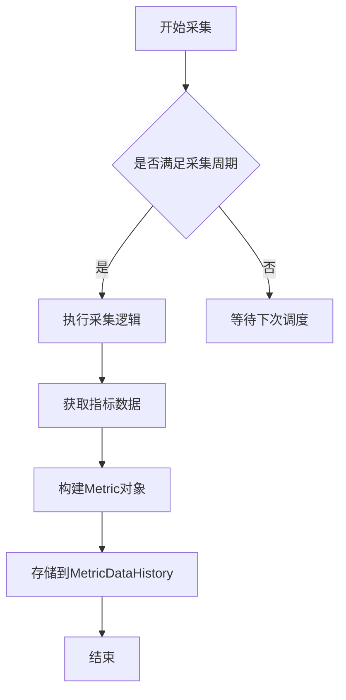
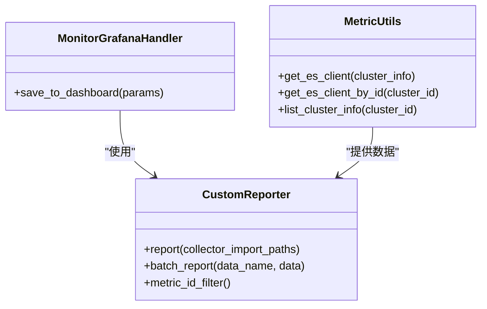
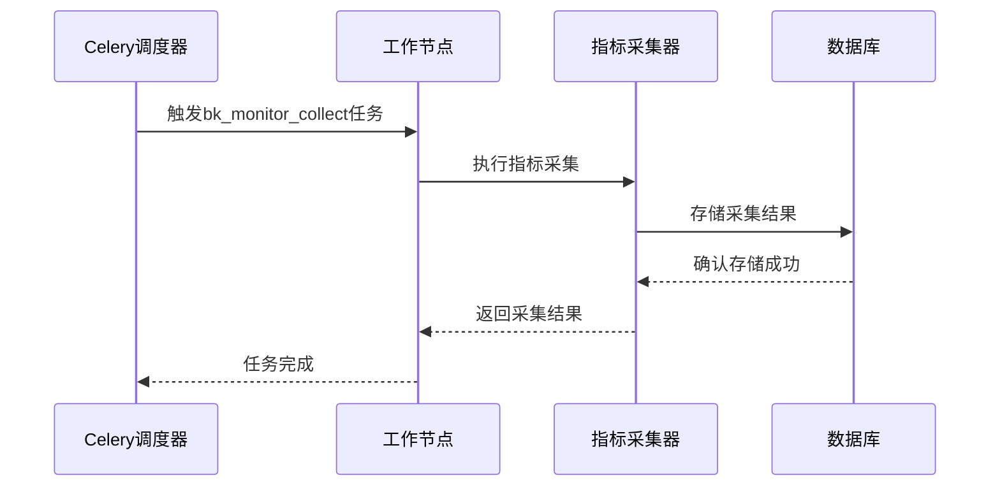
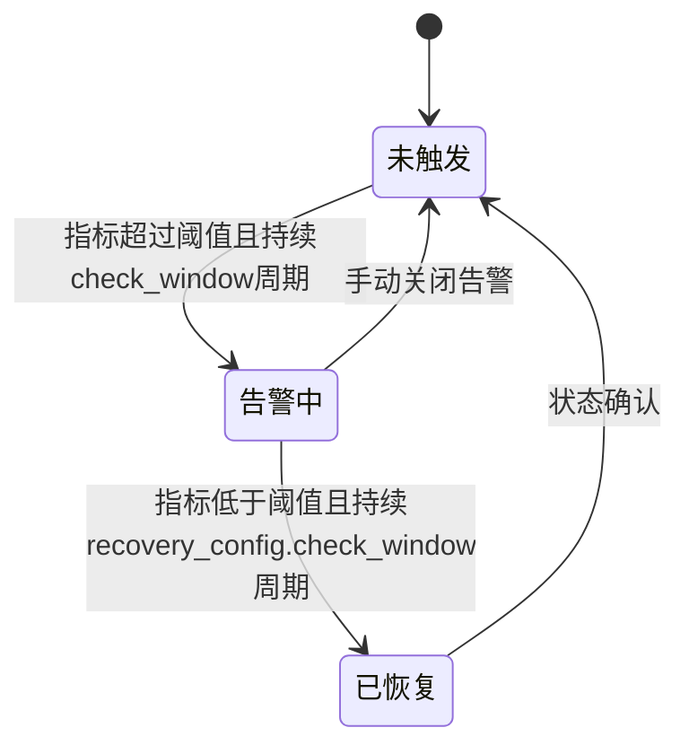
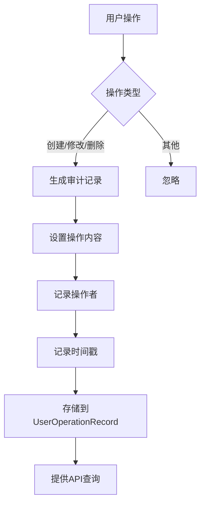
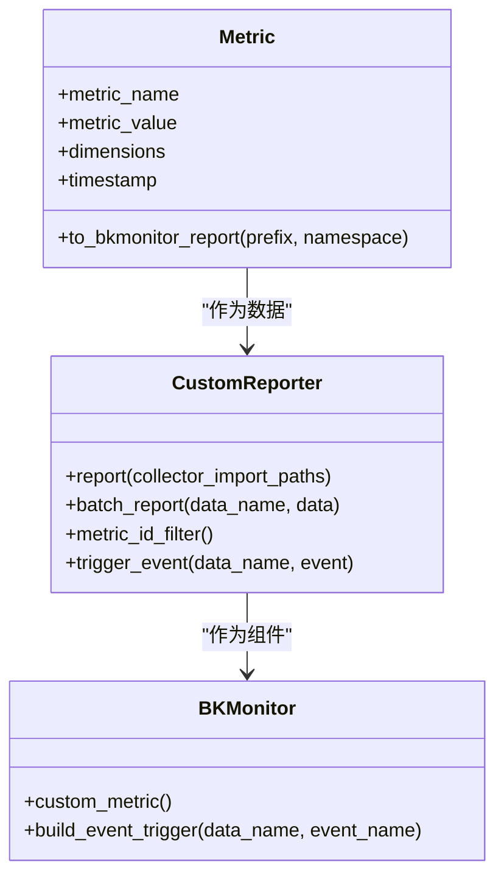

# 告警处理流程

<cite>
**本文档引用的文件**
- [metric.py](file://bklog/bk_monitor/utils/metric.py)
- [monitor.py](file://bklog/bk_monitor/handler/monitor.py)
- [es_stats.py](file://bklog/apps/log_measure/handlers/metric_collectors/es_stats.py)
- [report.py](file://bklog/apps/log_measure/tasks/report.py)
- [task.py](file://bklog/apps/utils/task.py)
- [event.py](file://bklog/bk_monitor/utils/event.py)
- [clustering_monitor.py](file://bklog/apps/log_clustering/handlers/clustering_monitor.py)
- [alert_strategy.py](file://bklog/apps/log_search/handlers/alert_strategy.py)
- [audit_record.py](file://bklog/apps/bk_log_admin/handlers/audit_record.py)
- [audit_record_views.py](file://bklog/apps/bk_log_admin/views/audit_record_views.py)
</cite>

## 目录
1. [引言](#引言)
2. [告警处理生命周期](#告警处理生命周期)
3. [指标采集与存储](#指标采集与存储)
4. [与Elasticsearch和Grafana集成](#与elasticsearch和grafana集成)
5. [规则评估与Celery调度](#规则评估与celery调度)
6. [告警状态转换逻辑](#告警状态转换逻辑)
7. [告警事件审计与追踪](#告警事件审计与追踪)
8. [核心处理逻辑分析](#核心处理逻辑分析)
9. [结论](#结论)

## 引言
本文档详细描述了监控系统中告警处理的完整生命周期，从指标采集、规则评估到告警触发的全过程。文档涵盖了监控数据的采集频率和存储方式，与Elasticsearch和Grafana的集成机制，基于Celery的任务执行周期，告警状态的转换逻辑，以及告警事件的审计记录和追踪机制。通过分析`metric.py`和`monitor.py`等核心文件，深入探讨了告警处理的核心实现细节。

## 告警处理生命周期
告警处理流程始于指标数据的采集，经过规则评估引擎的周期性检查，最终在满足触发条件时生成告警事件。整个生命周期包括以下几个关键阶段：
1. **指标采集**：系统按照预设的频率从各种数据源采集监控指标
2. **数据存储**：采集到的指标数据被存储在Elasticsearch中，供后续查询和分析
3. **规则评估**：基于Celery的调度机制，周期性地执行告警规则评估
4. **告警触发**：当监控指标满足预设的告警条件时，系统生成告警事件
5. **状态管理**：告警在"未触发"、"告警中"、"已恢复"等状态间转换
6. **审计记录**：所有告警相关的操作都被记录，便于追踪和审计

**Section sources**
- [monitor.py](file://bklog/bk_monitor/handler/monitor.py#L39-L358)
- [report.py](file://bklog/apps/log_measure/tasks/report.py#L50-L174)

## 指标采集与存储
监控系统通过定期采集各类指标数据来实现对系统状态的持续监控。指标采集的核心机制如下：

### 采集频率
系统采用灵活的采集频率配置，不同的指标可以根据其重要性和变化频率设置不同的采集周期。在代码实现中，通过`TimeFilterEnum`枚举定义了多种时间过滤选项，如每分钟、每5分钟等。

### 存储机制
采集到的指标数据通过以下流程进行存储：
1. 指标数据首先被收集到内存中的临时存储
2. 通过`MetricDataHistory`模型将数据持久化到数据库
3. 数据以JSON格式存储，包含指标名称、值、维度和时间戳等信息

**Diagram sources**
- [metric.py](file://bklog/bk_monitor/utils/metric.py#L49-L86)
- [report.py](file://bklog/apps/log_measure/tasks/report.py#L136-L174)

**Section sources**
- [metric.py](file://bklog/bk_monitor/utils/metric.py#L1-L86)
- [report.py](file://bklog/apps/log_measure/tasks/report.py#L136-L174)

## 与Elasticsearch和Grafana集成
系统通过与Elasticsearch和Grafana的深度集成，实现了高效的指标查询和可视化展示。

### Elasticsearch集成
Elasticsearch作为核心的指标存储引擎，系统通过以下方式与其集成：
- 使用`get_es_client`方法建立与Elasticsearch集群的连接
- 通过`es_socket_ping`验证连接的可用性
- 使用`get_es_metrics`函数从Elasticsearch获取指标数据
- 支持多集群配置，通过`cluster_infos`管理不同集群的连接信息

### Grafana集成
Grafana用于告警策略的可视化配置和监控面板展示，集成方式包括：
- 通过`MonitorGrafanaHandler`类处理Grafana相关的操作
- 将告警策略保存到Grafana仪表板
- 使用`save_to_dashboard`方法同步告警配置

**Diagram sources**
- [monitor.py](file://bklog/bk_monitor/handler/monitor.py#L79-L329)
- [metric.py](file://bklog/apps/log_measure/utils/metric.py#L33-L142)
- [grafana/handlers/monitor.py](file://bklog/apps/grafana/handlers/monitor.py#L7-L38)

**Section sources**
- [metric.py](file://bklog/apps/log_measure/utils/metric.py#L33-L142)
- [monitor.py](file://bklog/bk_monitor/handler/monitor.py#L79-L329)

## 规则评估与Celery调度
告警规则的评估通过Celery任务调度系统实现，确保了评估过程的可靠性和可扩展性。

### Celery调度机制
系统使用Celery作为异步任务队列，实现告警规则的周期性评估：
- 通过`@periodic_task`装饰器定义周期性任务
- 使用`crontab`表达式配置执行频率
- 高优先级任务通过`high_priority_periodic_task`装饰器标记

### 规则评估流程
规则评估的执行流程如下：
1. 调度器触发`bk_monitor_collect`任务
2. 根据当前时间判断需要执行的指标采集任务
3. 将采集任务分发给工作节点
4. 工作节点执行具体的指标采集逻辑
5. 采集结果存储到数据库供告警引擎使用

**Diagram sources**
- [report.py](file://bklog/apps/log_measure/tasks/report.py#L50-L133)
- [task.py](file://bklog/apps/utils/task.py#L11-L23)

**Section sources**
- [report.py](file://bklog/apps/log_measure/tasks/report.py#L50-L133)
- [task.py](file://bklog/apps/utils/task.py#L11-L23)

## 告警状态转换逻辑
告警系统实现了完整的状态管理机制，支持"未触发"、"告警中"、"已恢复"等状态的转换。

### 状态定义
系统定义了以下主要告警状态：
- **未触发**：监控指标未达到告警阈值
- **告警中**：指标达到告警条件，告警已激活
- **已恢复**：指标恢复正常，告警已解除

### 状态转换条件
状态转换基于以下条件判断：
- **触发条件**：当监控指标连续多个周期（由`check_window`定义）超过阈值时，状态从"未触发"转为"告警中"
- **恢复条件**：当监控指标连续多个周期（由`recovery_config.check_window`定义）低于阈值时，状态从"告警中"转为"已恢复"

### 状态管理实现
状态管理通过以下方式实现：
- 使用`TRIGGER_CONFIG`配置触发条件
- 通过`DETECTS`数组定义检测规则
- 利用`MonitorApi.search_alert`查询当前告警状态

**Diagram sources**
- [clustering_monitor.py](file://bklog/apps/log_clustering/handlers/clustering_monitor.py#L127-L614)
- [alert_strategy.py](file://bklog/apps/log_search/handlers/alert_strategy.py#L53-L86)

**Section sources**
- [clustering_monitor.py](file://bklog/apps/log_clustering/handlers/clustering_monitor.py#L127-L614)
- [alert_strategy.py](file://bklog/apps/log_search/handlers/alert_strategy.py#L53-L86)

## 告警事件审计与追踪
系统提供了完善的审计和追踪机制，确保所有告警相关操作都可追溯。

### 审计记录
审计功能通过以下组件实现：
- `AuditRecordHandler`类处理审计记录的格式化
- `AuditRecordViewSet`提供审计记录的API接口
- 每条审计记录包含操作类型、操作对象、操作内容、操作者和时间戳

### 追踪机制
告警事件的追踪通过以下方式实现：
- 记录告警策略的创建、修改和删除操作
- 关联操作人员信息到具体的变更历史
- 提供分页查询接口获取操作记录

**Diagram sources**
- [audit_record.py](file://bklog/apps/bk_log_admin/handlers/audit_record.py#L31-L48)
- [audit_record_views.py](file://bklog/apps/bk_log_admin/views/audit_record_views.py#L32-L85)

**Section sources**
- [audit_record.py](file://bklog/apps/bk_log_admin/handlers/audit_record.py#L31-L48)
- [audit_record_views.py](file://bklog/apps/bk_log_admin/views/audit_record_views.py#L32-L85)

## 核心处理逻辑分析
本节深入分析`metric.py`和`monitor.py`文件中的核心处理逻辑。

### Metric处理逻辑
`metric.py`文件定义了指标处理的核心类和方法：
- `Metric`类：表示单个监控指标，包含指标名称、值、维度和时间戳
- `register_metric`装饰器：用于注册需要采集的指标
- `build_metric_id`函数：构建唯一的指标标识符

### Monitor处理逻辑
`monitor.py`文件实现了告警处理的主要逻辑：
- `BKMonitor`类：告警处理的统一入口，管理应用配置和客户端连接
- `CustomReporter`类：负责指标的上报、查询和初始化
- `metric_id_filter`方法：根据时间过滤需要上报的指标

### 核心交互流程
两个模块的交互流程如下：
1. `metric.py`注册需要采集的指标
2. `monitor.py`在调度周期内调用已注册的采集方法
3. 采集结果通过`CustomReporter`上报到监控系统
4. 系统根据上报的指标数据评估告警规则

**Diagram sources**
- [metric.py](file://bklog/bk_monitor/utils/metric.py#L49-L86)
- [monitor.py](file://bklog/bk_monitor/handler/monitor.py#L79-L329)

**Section sources**
- [metric.py](file://bklog/bk_monitor/utils/metric.py#L1-L86)
- [monitor.py](file://bklog/bk_monitor/handler/monitor.py#L39-L358)

## 结论
本文档详细描述了监控系统告警处理的完整生命周期，涵盖了从指标采集到告警触发的各个环节。系统通过与Elasticsearch和Grafana的集成，实现了高效的指标存储和可视化。基于Celery的调度机制确保了规则评估的可靠执行。完善的告警状态管理和审计追踪机制，为系统的稳定运行提供了有力保障。通过对核心文件的分析，我们深入了解了告警处理的技术实现细节，为系统的维护和优化提供了重要参考。