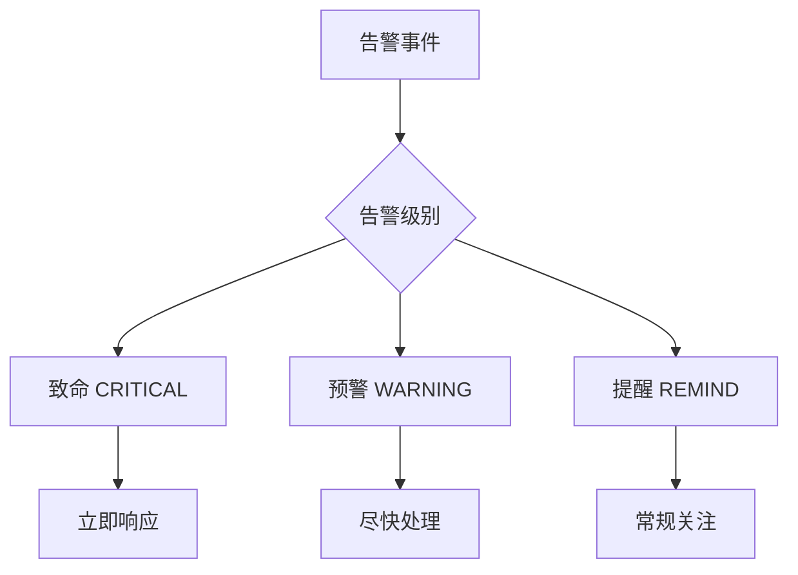
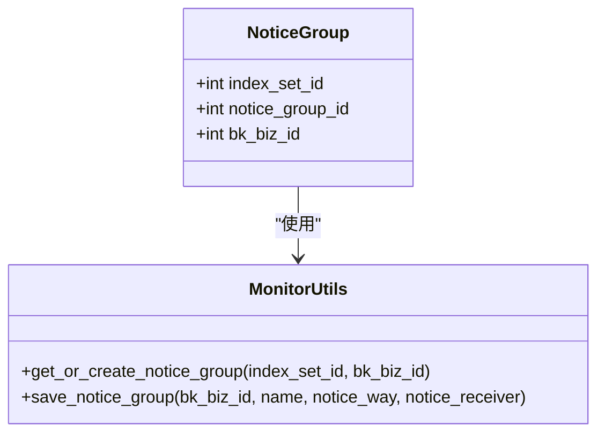
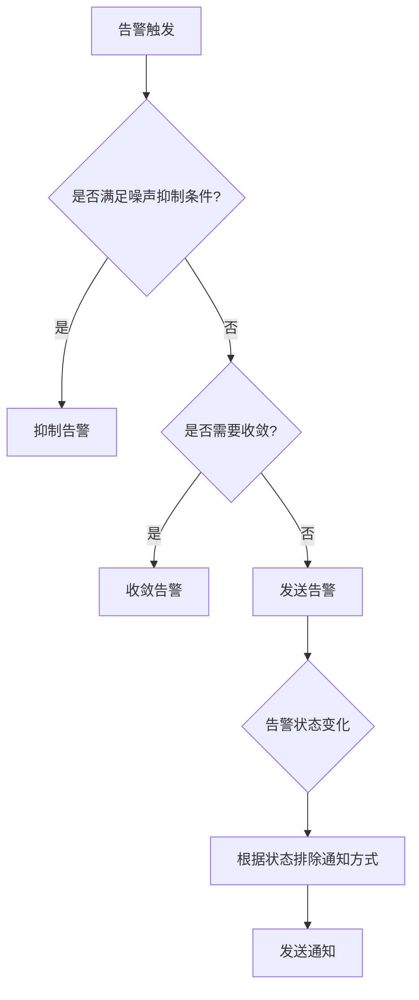
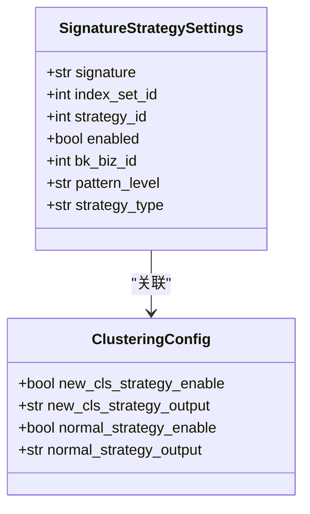
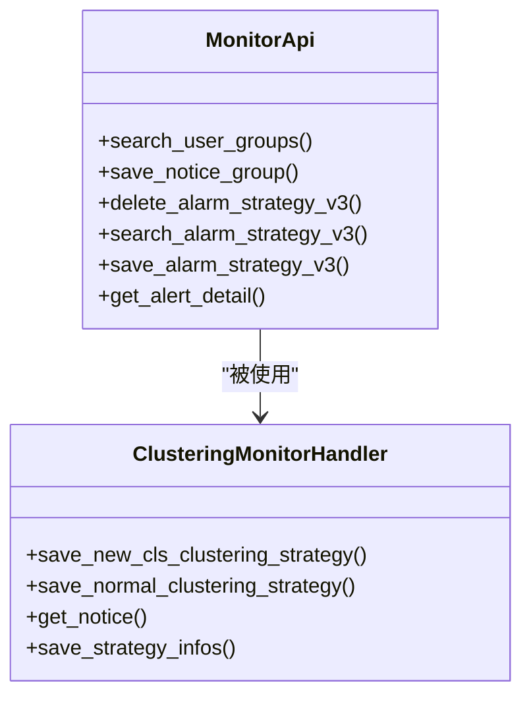
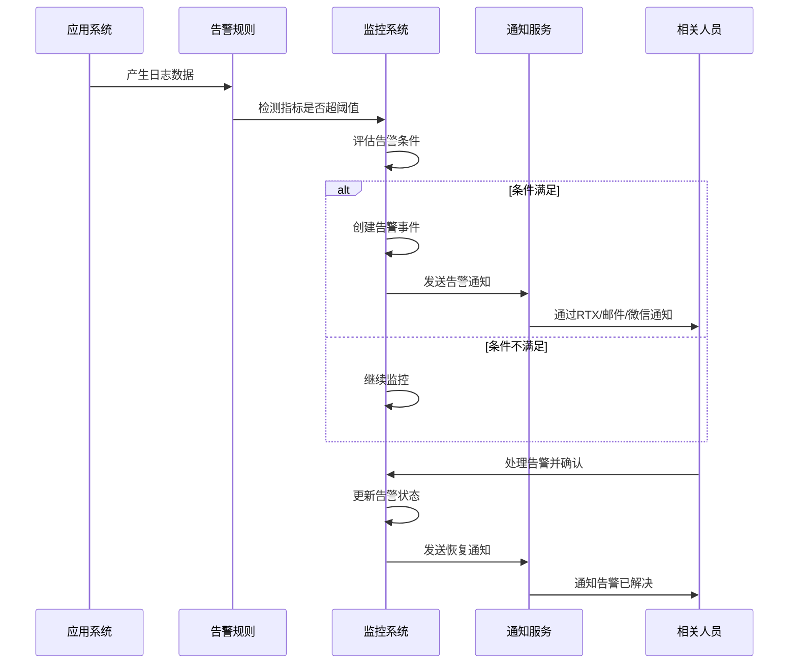

# 告警规则

<cite>
**本文档引用文件**   
- [constants.py](file://bklog/apps/log_clustering/constants.py)
- [clustering_monitor.py](file://bklog/apps/log_clustering/handlers/clustering_monitor.py)
- [monitor.py](file://bklog/apps/api/modules/monitor.py)
- [models.py](file://bklog/apps/log_clustering/models.py)
- [alert_strategy.py](file://bklog/apps/log_search/handlers/alert_strategy.py)
- [alert_strategy_view.py](file://bklog/apps/log_search/views/alert_strategy_view.py)
</cite>

## 目录
1. [告警规则结构](#告警规则结构)
2. [告警分级机制](#告警分级机制)
3. [通知渠道配置](#通知渠道配置)
4. [告警抑制与去重策略](#告警抑制与去重策略)
5. [版本管理与审计功能](#版本管理与审计功能)
6. [蓝鲸监控系统集成](#蓝鲸监控系统集成)
7. [常见告警场景配置示例](#常见告警场景配置示例)

## 告警规则结构

告警规则的结构主要由指标选择、阈值设置、评估周期和持续时间等核心要素构成。在蓝鲸监控系统中，告警规则通过`MonitorApi.save_alarm_strategy_v3`接口进行保存和管理，该接口接收包含告警策略详细信息的参数。

告警规则的核心配置包括：
- **指标选择**：通过`query_configs`字段定义，包含数据源标签、结果表ID、聚合维度和条件等信息。例如，在日志聚类场景中，使用`result_table_id`指定数据源，通过`agg_dimension`和`agg_condition`定义聚合维度和条件。
- **阈值设置**：通过`algorithms`字段配置，包含告警级别、检测类型和具体阈值参数。系统支持智能检测算法`IntelligentDetect`，可通过参数配置灵敏度、阈值等。
- **评估周期**：由`agg_interval`参数定义，表示数据聚合的时间间隔，单位为秒。默认值为60秒，可根据实际需求调整。
- **持续时间**：通过`trigger_config`中的`check_window`参数设置，表示触发告警需要连续满足条件的周期数。

告警规则的创建和更新通过`ClusteringMonitorHandler`类实现，该类提供了`save_new_cls_clustering_strategy`和`save_normal_clustering_strategy`方法，分别用于保存新类告警和数量突增告警策略。

**Section sources**
- [constants.py](file://bklog/apps/log_clustering/constants.py#L83-L123)
- [clustering_monitor.py](file://bklog/apps/log_clustering/handlers/clustering_monitor.py#L188-L217)
- [clustering_monitor.py](file://bklog/apps/log_clustering/handlers/clustering_monitor.py#L107-L134)

## 告警分级机制

系统实现了多级告警机制，通过不同的告警级别来区分问题的严重程度。告警级别在`StrategiesAlarmLevelEnum`枚举类中定义，包含三个等级：

- **致命 (CRITICAL)**：级别值为1，表示最严重的告警，需要立即处理
- **预警 (WARNING)**：级别值为2，表示需要关注的告警，可能存在潜在问题
- **提醒 (REMIND)**：级别值为3，表示一般性提醒，供参考

告警级别的配置主要在两个层面：
1. **算法级别**：在`algorithms`配置中通过`level`字段指定，决定告警触发时的严重程度
2. **通知级别**：在`DEFAULT_ALERT_NOTICE`配置中，为不同告警级别定义相应的通知方式

系统默认将新类告警和数量突增告警设置为"预警"级别（级别2），但允许通过参数`params.get("level", 2)`进行自定义配置。告警级别不仅影响通知策略，还可能影响告警处理流程和响应优先级。



**Diagram sources**
- [constants.py](file://bklog/apps/log_clustering/constants.py#L202-L211)

**Section sources**
- [constants.py](file://bklog/apps/log_clustering/constants.py#L202-L211)
- [clustering_monitor.py](file://bklog/apps/log_clustering/handlers/clustering_monitor.py#L138-L140)

## 通知渠道配置

通知渠道配置定义了告警触发时的通知方式和接收人。系统通过`notice`配置项管理通知策略，支持多种通知方式，包括RTX、邮件、微信、短信等。

### 通知组管理

通知组通过`NoticeGroup`模型进行管理，每个通知组关联一个索引集和业务ID。系统提供了`MonitorUtils.get_or_create_notice_group`方法来获取或创建默认通知组：



**Diagram sources**
- [models.py](file://bklog/apps/log_clustering/models.py#L264-L268)
- [monitor.py](file://bklog/apps/log_clustering/utils/monitor.py#L38-L82)

### 通知方式配置

系统默认配置了三种通知级别（致命、预警、提醒）对应的RTX通知方式：

```python
DEFAULT_ALERT_NOTICE = [
    {
        "time_range": "00:00:00--23:59:00",
        "notify_config": [
            {"notice_ways": [{"name": "rtx"}], "level": 3},
            {"notice_ways": [{"name": "rtx"}], "level": 2},
            {"notice_ways": [{"name": "rtx"}], "level": 1},
        ],
    }
]
```

通知配置包含以下关键字段：
- `time_range`：通知时间范围
- `notify_config`：通知配置列表，包含通知方式和对应告警级别
- `notice_ways`：具体通知方式，如"rtx"表示RTX通知

系统通过`MonitorApi.save_notice_group`接口保存通知组，支持为不同业务场景配置不同的通知策略。

**Section sources**
- [constants.py](file://bklog/apps/log_clustering/constants.py#L114-L123)
- [monitor.py](file://bklog/apps/log_clustering/utils/monitor.py#L38-L58)
- [monitor.py](file://bklog/apps/api/modules/monitor.py#L53-L61)

## 告警抑制与去重策略

系统实现了多种告警抑制和去重策略，以避免告警风暴和重复告警，提高告警的有效性和可管理性。

### 噪声抑制配置

通过`noise_reduce_config`参数实现噪声抑制，主要配置包括：
- `is_enabled`：是否启用噪声抑制
- `count`：噪声抑制阈值，当相同告警数量超过此值时进行抑制
- `dimensions`：用于噪声抑制的维度字段

在日志聚类场景中，噪声抑制默认未启用（`is_enabled: False`），但提供了配置接口，可根据实际需求开启。

### 收敛配置

系统通过`converge_config`实现告警收敛，主要配置为`need_biz_converge`，表示是否需要业务收敛。当多个相同类型的告警同时触发时，系统会将其收敛为一个告警事件，避免重复通知。

### 告警升级配置

通过`upgrade_config`实现告警升级机制：
- `is_enabled`：是否启用告警升级
- `user_groups`：告警升级后的通知组

告警升级机制允许在告警持续一段时间后，将通知范围扩大到更高级别的管理人员或团队。

### 通知排除配置

`exclude_notice_ways`配置允许排除特定状态下的通知方式，支持以下状态：
- `recovered`：恢复状态
- `closed`：关闭状态
- `ack`：确认状态



**Diagram sources**
- [clustering_monitor.py](file://bklog/apps/log_clustering/handlers/clustering_monitor.py#L282-L286)
- [clustering_monitor.py](file://bklog/apps/log_clustering/handlers/clustering_monitor.py#L564-L568)

**Section sources**
- [clustering_monitor.py](file://bklog/apps/log_clustering/handlers/clustering_monitor.py#L282-L288)
- [clustering_monitor.py](file://bklog/apps/log_clustering/handlers/clustering_monitor.py#L564-L570)

## 版本管理与审计功能

系统提供了告警规则的版本管理和审计功能，确保告警配置的可追溯性和安全性。

### 告警策略版本管理

告警策略的版本管理通过以下机制实现：
- **策略ID跟踪**：每个告警策略都有唯一的`strategy_id`，在`SignatureStrategySettings`模型中记录
- **更新机制**：当策略存在时，通过设置`request_params["id"]`实现策略更新而非创建新策略
- **状态同步**：策略的启用状态、输出结果表等信息在`ClusteringConfig`模型中同步保存



**Diagram sources**
- [models.py](file://bklog/apps/log_clustering/models.py#L240-L249)
- [models.py](file://bklog/apps/log_clustering/models.py#L163-L170)

### 审计功能

系统通过以下方式实现审计功能：
1. **操作记录**：所有告警策略的创建、更新和删除操作都会记录在数据库中
2. **状态变更**：策略的启用/禁用状态变更会被持久化存储
3. **配置快照**：关键配置信息（如策略ID、输出结果表）会被保存在模型中

当更新现有策略时，系统会先检查策略是否存在，如果存在则更新现有策略而非创建新策略：

```python
if signature_strategy_settings.strategy_id and self.get_strategy(strategy_type, signature_strategy_settings.strategy_id):
    request_params["id"] = signature_strategy_settings.strategy_id
strategy = MonitorApi.save_alarm_strategy_v3(params=request_params)
```

**Section sources**
- [clustering_monitor.py](file://bklog/apps/log_clustering/handlers/clustering_monitor.py#L315-L320)
- [models.py](file://bklog/apps/log_clustering/models.py#L240-L249)

## 蓝鲸监控系统集成

告警规则与蓝鲸监控系统的集成主要通过API接口实现，确保告警策略能够被监控系统识别和处理。

### API接口集成

系统通过`MonitorApi`类封装了与蓝鲸监控系统的交互接口：



**Diagram sources**
- [monitor.py](file://bklog/apps/api/modules/monitor.py#L40-L187)
- [clustering_monitor.py](file://bklog/apps/log_clustering/handlers/clustering_monitor.py#L68-L615)

### 告警事件处理流程

告警事件的处理流程如下：



**Diagram sources**
- [clustering_monitor.py](file://bklog/apps/log_clustering/handlers/clustering_monitor.py#L320-L321)
- [monitor.py](file://bklog/apps/api/modules/monitor.py#L80-L88)

### 集成配置

集成配置主要包括：
- **业务ID (bk_biz_id)**：标识告警所属的业务
- **场景标识 (scenario)**：默认为"other_rt"
- **标签 (labels)**：用于分类和过滤告警策略
- **策略类型 (type)**：固定为"monitor"

这些配置确保告警策略能够正确地集成到蓝鲸监控系统中，并与其他监控策略协同工作。

**Section sources**
- [clustering_monitor.py](file://bklog/apps/log_clustering/handlers/clustering_monitor.py#L156-L165)
- [monitor.py](file://bklog/apps/api/modules/monitor.py#L80-L88)

## 常见告警场景配置示例

### 高延迟告警

高延迟告警通常用于监控系统响应时间，当响应时间超过预设阈值时触发告警。

```python
# 高延迟告警配置示例
items = [
    {
        "name": "响应时间监控",
        "query_configs": [
            {
                "result_table_id": "web_performance_rt",
                "agg_interval": 60,
                "agg_dimension": ["service", "endpoint"],
                "metric_field": "response_time",
            }
        ],
        "algorithms": [
            {
                "level": 1,  # 致命级别
                "type": "Threshold",
                "config": [[{"method": "gte", "threshold": 1000}]],  # 响应时间>=1000ms
            }
        ],
    }
]
```

### 高错误率告警

高错误率告警用于监控系统错误率，当错误请求数占总请求数的比例超过阈值时触发。

```python
# 高错误率告警配置示例
items = [
    {
        "name": "错误率监控",
        "query_configs": [
            {
                "result_table_id": "api_gateway_rt",
                "agg_interval": 300,  # 5分钟聚合
                "agg_dimension": ["api", "status"],
            }
        ],
        "algorithms": [
            {
                "level": 2,  # 预警级别
                "type": "Percentage",
                "config": [[{"method": "gte", "threshold": 5}]],  # 错误率>=5%
            }
        ],
    }
]
```

### 资源耗尽告警

资源耗尽告警用于监控系统资源使用情况，如CPU、内存、磁盘等，当使用率超过安全阈值时触发。

```python
# 资源耗尽告警配置示例
items = [
    {
        "name": "内存使用率监控",
        "query_configs": [
            {
                "result_table_id": "host_resource_rt",
                "agg_interval": 60,
                "agg_dimension": ["host", "resource_type"],
                "metric_field": "memory_usage_percent",
            }
        ],
        "algorithms": [
            {
                "level": 1,  # 致命级别
                "type": "Threshold",
                "config": [[{"method": "gte", "threshold": 90}]],  # 内存使用率>=90%
            }
        ],
    }
]
```

### 日志数量突增告警

基于日志聚类的特殊告警场景，当特定类型日志的数量突然增加时触发。

```python
# 日志数量突增告警配置
items = [
    {
        "name": f"COUNT({self.index_set.index_set_name})",
        "query_configs": [
            {
                "result_table_id": table_id,
                "agg_interval": self.conf.get("agg_interval", 60),
                "agg_dimension": AGG_DIMENSION_NORMAL,
                "agg_condition": AGG_CONDITION_NORMAL,
            }
        ],
        "algorithms": [
            {
                "level": params.get("level", 2),
                "type": "IntelligentDetect",
                "config": {
                    "plan_id": self.conf.get("normal_plan_id"),
                    "visual_type": "none",
                    "args": {
                        "$alert_down": "1",
                        "$sensitivity": params.get("sensitivity", 5),
                        "$alert_upward": "1",
                        "$alert_slight_shake": "0",
                    },
                },
            }
        ],
    }
]
```

### 新类日志告警

监控系统中出现新的日志模式或异常类型时触发的告警。

```python
# 新类日志告警配置
items = [
    {
        "name": ITEM_NAME_CLUSTERING,
        "query_configs": [
            {
                "data_source_label": DEFAULT_DATA_SOURCE_LABEL_BKDATA,
                "data_type_label": DEFAULT_DATA_TYPE_LABEL_BKDATA,
                "result_table_id": table_id,
                "agg_method": DEFAULT_AGG_METHOD,
                "agg_interval": self.conf.get("agg_interval", 60),
                "agg_dimension": AGG_DIMENSION,
                "agg_condition": AGG_CONDITION,
                "metric_field": metric,
            }
        ],
        "algorithms": [
            {
                "level": params.get("level", 2),
                "type": "IntelligentDetect",
                "config": {
                    "plan_id": self.conf.get("algorithm_plan_id"),
                    "visual_type": "score",
                    "args": {
                        "$model_file_id": self.clustering_config.model_output_rt,
                        "$new_class_interval": params.get("interval", 30),
                        "$new_class_alert_th": params.get("threshold", 1),
                    },
                },
            }
        ],
    }
]
```

**Section sources**
- [clustering_monitor.py](file://bklog/apps/log_clustering/handlers/clustering_monitor.py#L198-L235)
- [clustering_monitor.py](file://bklog/apps/log_clustering/handlers/clustering_monitor.py#L108-L147)
- [constants.py](file://bklog/apps/log_clustering/constants.py#L89-L97)