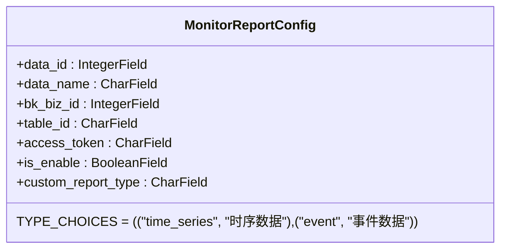
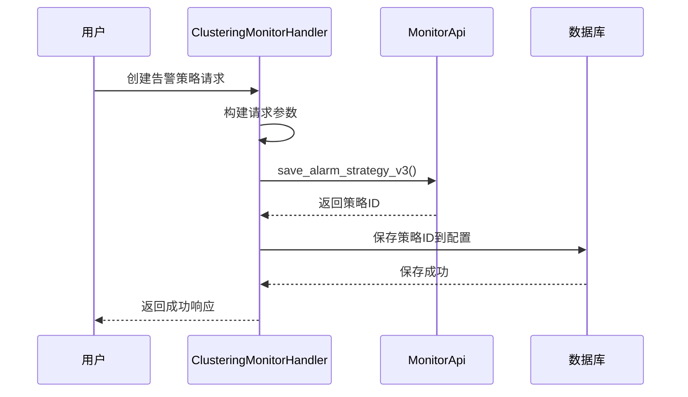
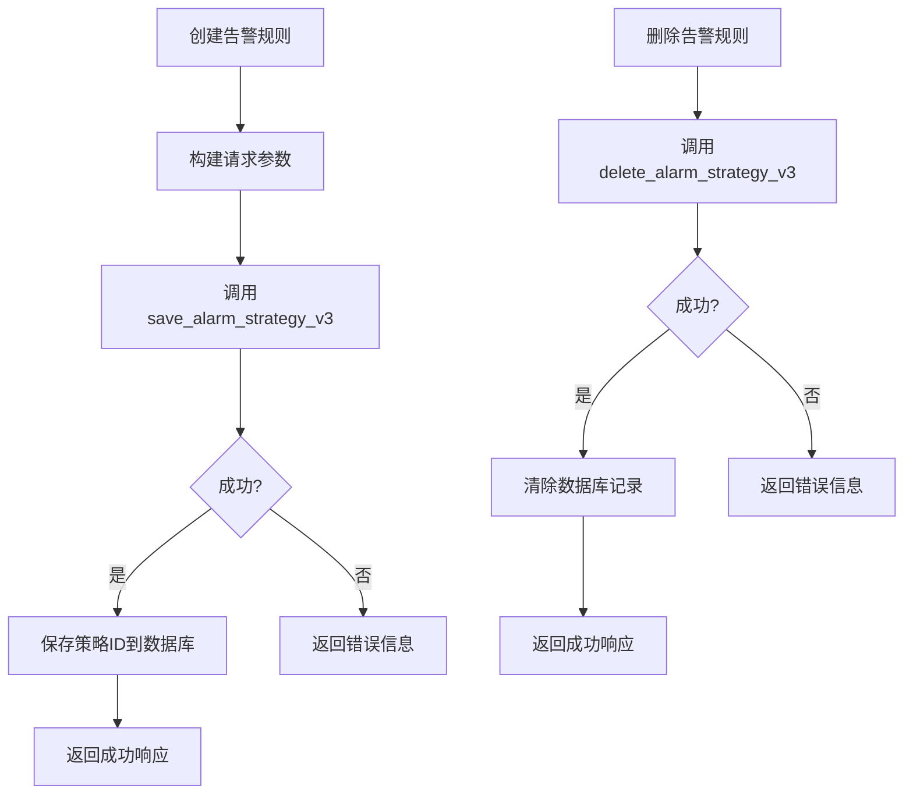
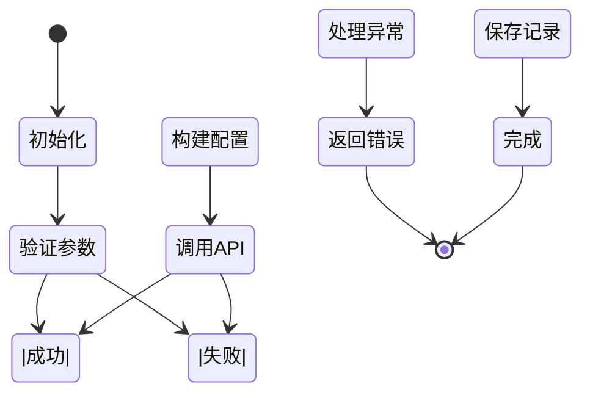

# 告警规则配置

<cite>
**本文档引用的文件**  
- [models.py](file://bklog/bk_monitor/models.py)
- [monitor.py](file://bklog/apps/log_clustering/handlers/clustering_monitor.py)
- [constants.py](file://bklog/bk_monitor/constants.py)
- [monitor.py](file://bklog/bk_monitor/handler/monitor.py)
- [0002_monitorreportconfig_custom_report_type.py](file://bklog/bk_monitor/migrations/0002_monitorreportconfig_custom_report_type.py)
- [0003_update_dataid.py](file://bklog/bk_monitor/migrations/0003_update_dataid.py)
- [api/modules/monitor.py](file://bklog/apps/api/modules/monitor.py)
- [clustering_monitor_views.py](file://bklog/apps/log_clustering/views/clustering_monitor_views.py)
- [serializers.py](file://bklog/apps/log_clustering/serializers.py)
</cite>

## 目录
1. [引言](#引言)
2. [告警规则核心模型](#告警规则核心模型)
3. [规则配置流程](#规则配置流程)
4. [核心字段说明](#核心字段说明)
5. [API接口操作](#api接口操作)
6. [配置示例](#配置示例)
7. [启用/禁用与版本控制](#启用禁用与版本控制)
8. [配置验证与错误处理](#配置验证与错误处理)

## 引言
本文档详细说明了蓝鲸日志平台中告警规则的配置机制。通过分析MonitorReportConfig模型和相关组件，阐述了告警规则的定义方式、配置流程、核心字段含义以及API操作方法。文档还提供了常见场景的配置示例，并解释了规则的启用/禁用机制和错误处理策略。

## 告警规则核心模型

告警规则配置的核心是MonitorReportConfig模型，该模型定义了监控数据上报的基本配置。模型包含数据源ID、数据源名称、业务ID、结果表名、上报token等关键字段。模型支持时序数据和事件数据两种类型，通过custom_report_type字段进行区分。



**图示来源**  
- [models.py](file://bklog/bk_monitor/models.py#L8-L26)

**本节来源**  
- [models.py](file://bklog/bk_monitor/models.py#L8-L26)
- [constants.py](file://bklog/bk_monitor/constants.py#L7-L8)

## 规则配置流程

告警规则的配置流程主要包括创建/更新配置、保存告警策略、通知组管理等步骤。系统通过MonitorApi接口与监控平台交互，实现告警策略的全生命周期管理。

配置流程从调用save_alarm_strategy_v3接口开始，传入包含告警项、检测规则、通知配置等信息的参数。系统会根据业务ID、场景类型等条件判断是创建新策略还是更新现有策略。对于聚类分析场景，系统会为新类异常和数量突增分别创建独立的告警策略。



**图示来源**  
- [monitor.py](file://bklog/apps/log_clustering/handlers/clustering_monitor.py#L303-L341)
- [api/modules/monitor.py](file://bklog/apps/api/modules/monitor.py#L80-L88)

**本节来源**  
- [monitor.py](file://bklog/apps/log_clustering/handlers/clustering_monitor.py#L303-L341)
- [api/modules/monitor.py](file://bklog/apps/api/modules/monitor.py#L80-L88)

## 核心字段说明

告警规则的核心字段包括监控指标、阈值条件、评估周期、持续时间等。这些字段在配置中以结构化方式组织，确保告警逻辑的准确表达。

- **监控指标**：通过query_configs中的metric_field字段定义，如日志数量、错误率等
- **阈值条件**：在algorithms配置中定义，包含告警级别、检测类型和具体参数
- **评估周期**：由agg_interval字段控制，单位为秒，决定数据聚合的时间窗口
- **持续时间**：在detects配置中通过trigger_config和recovery_config定义触发和恢复条件

对于新类异常告警，系统使用IntelligentDetect类型的算法，通过$new_class_interval和$new_class_alert_th参数控制告警间隔和阈值。对于数量突增告警，则通过$sensitivity参数控制检测敏感度。

**本节来源**  
- [monitor.py](file://bklog/apps/log_clustering/handlers/clustering_monitor.py#L100-L147)
- [monitor.py](file://bklog/apps/log_clustering/handlers/clustering_monitor.py#L190-L233)

## API接口操作

系统通过API模块提供告警规则的创建、修改和删除功能。主要接口包括save_alarm_strategy_v3、search_alarm_strategy_v3和delete_alarm_strategy_v3。

创建告警规则时，需要提供完整的策略配置，包括名称、业务ID、场景类型、监控项、检测规则和通知配置。查询接口支持按策略ID、业务ID等条件搜索现有规则。删除接口则用于移除不再需要的告警策略。

API调用通过DataAPI封装，自动处理ESB信息注入和租户ID映射。系统根据USE_NEW_MONITOR_APIGATEWAY配置决定使用新旧网关地址，确保接口的兼容性。



**图示来源**  
- [api/modules/monitor.py](file://bklog/apps/api/modules/monitor.py#L80-L88)
- [api/modules/monitor.py](file://bklog/apps/api/modules/monitor.py#L62-L70)

**本节来源**  
- [api/modules/monitor.py](file://bklog/apps/api/modules/monitor.py#L40-L188)

## 配置示例

以下是一些常见场景的告警规则配置示例：

### 日志量突增告警
```python
{
    "name": "日志数量突增异常告警",
    "items": [{
        "query_configs": [{
            "agg_interval": 60,
            "metric_id": "bk_log_search.index_set.{index_set_id}"
        }],
        "algorithms": [{
            "type": "IntelligentDetect",
            "config": {
                "args": {"$sensitivity": 5}
            }
        }]
    }]
}
```

### 新类异常告警
```python
{
    "name": "日志新类异常告警",
    "items": [{
        "query_configs": [{
            "result_table_id": "{table_id}",
            "metric_field": "log_count"
        }],
        "algorithms": [{
            "type": "IntelligentDetect",
            "config": {
                "args": {
                    "$new_class_interval": 30,
                    "$new_class_alert_th": 1
                }
            }
        }]
    }]
}
```

### 错误日志比例过高告警
```python
{
    "name": "错误日志比例过高告警",
    "items": [{
        "query_configs": [{
            "agg_interval": 300,
            "agg_condition": [{
                "key": "level",
                "value": ["ERROR", "CRITICAL"]
            }]
        }],
        "algorithms": [{
            "level": 2,
            "type": "Threshold",
            "config": [[{"threshold": 0.1, "method": "gt"}]]
        }]
    }]
}
```

**本节来源**  
- [monitor.py](file://bklog/apps/log_clustering/handlers/clustering_monitor.py#L86-L175)
- [monitor.py](file://bklog/apps/log_clustering/handlers/clustering_monitor.py#L178-L262)

## 启用/禁用与版本控制

告警规则的启用/禁用通过is_enabled字段控制。在聚类分析场景中，系统还通过strategy_enabled字段管理特定模式的告警开关。

系统采用策略ID进行版本控制，当更新现有规则时，使用相同的ID进行覆盖。对于已删除的规则，系统会清除数据库中的相关记录，并调用监控平台的删除接口。

通知组的管理也集成在配置流程中。如果未指定用户组，系统会自动创建默认通知组，并将策略与该组关联。这种机制确保了告警通知的可靠性。

**本节来源**  
- [monitor.py](file://bklog/apps/log_clustering/handlers/clustering_monitor.py#L422-L471)
- [monitor.py](file://bklog/apps/log_clustering/handlers/clustering_monitor.py#L370-L398)

## 配置验证与错误处理

系统在配置过程中实施严格的验证机制。在创建MonitorReportConfig记录时，会检查数据源名称是否为空，并验证必要字段的完整性。

错误处理通过ErrorEnum枚举类定义，包含参数验证错误、请求错误、响应状态错误等类型。当发生异常时，系统会记录详细日志并返回相应的错误码，便于问题排查。

对于监控平台返回的特定错误（如NOT_EXIST_MSG），系统会进行特殊处理，确保配置流程的健壮性。同时，通过事务装饰器@atomic保证数据库操作的原子性，防止部分更新导致的状态不一致。



**图示来源**  
- [handler/monitor.py](file://bklog/bk_monitor/handler/monitor.py#L93-L115)
- [constants.py](file://bklog/bk_monitor/constants.py#L21-L38)

**本节来源**  
- [handler/monitor.py](file://bklog/bk_monitor/handler/monitor.py#L93-L115)
- [constants.py](file://bklog/bk_monitor/constants.py#L21-L38)