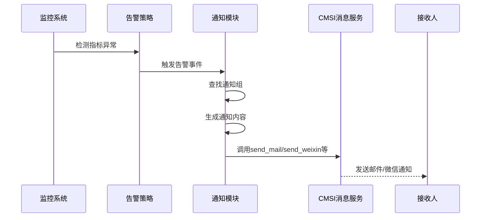

# 通知管理

<cite>
**本文档引用的文件**  
- [monitor.py](file://bklog/apps/api/modules/monitor.py)
- [notify.py](file://bklog/apps/utils/notify.py)
- [cmsi.py](file://bklog/apps/api/modules/cmsi.py)
- [clustering_monitor.py](file://bklog/apps/log_clustering/handlers/clustering_monitor.py)
- [monitor.py](file://bklog/apps/log_clustering/utils/monitor.py)
- [constants.py](file://bklog/apps/log_clustering/constants.py)
- [email_template.html](file://bklog/templates/email_template/email_template.html)
</cite>

## 目录
1. [引言](#引言)
2. [通知渠道支持](#通知渠道支持)
3. [通知配置与权限](#通知配置与权限)
4. [通知模板结构与自定义](#通知模板结构与自定义)
5. [通知抑制、去重与静默期机制](#通知抑制去重与静默期机制)
6. [通知事件生成与分发流程](#通知事件生成与分发流程)
7. [多级通知策略配置示例](#多级通知策略配置示例)
8. [结论](#结论)

## 引言

蓝鲸日志平台的通知管理模块负责在告警触发后进行通知分发，确保相关人员能够及时获知系统异常。该模块通过集成多种通知渠道（如邮件、微信、短信等），结合灵活的模板机制和多级通知策略，实现高效、精准的告警通知。本文档将详细说明通知管理模块的设计与实现，涵盖通知渠道、配置方式、模板结构、抑制机制及事件处理流程。

**本文档引用的文件**
- [monitor.py](file://bklog/apps/api/modules/monitor.py)
- [notify.py](file://bklog/apps/utils/notify.py)

## 通知渠道支持

系统支持多种通知渠道，包括邮件、企业微信、短信和语音通知。这些渠道通过CMSI（消息管理服务）接口实现，具体如下：

- **邮件**：通过`send_mail`接口发送，支持内部用户和外部邮箱地址。
- **企业微信**：通过`send_weixin`接口发送，使用企业微信消息格式。
- **短信**：通过`send_sms`接口发送，适用于紧急告警。
- **语音**：通过`send_voice_msg`接口发送，用于高优先级告警。

通知类型的获取通过`get_msg_type`接口完成，返回支持的消息类型列表，如“微信”、“邮件”、“短信”、“语音”。

**本文档引用的文件**
- [cmsi.py](file://bklog/apps/api/modules/cmsi.py)
- [clustering_monitor.py](file://bklog/apps/log_clustering/handlers/clustering_monitor.py)

## 通知配置与权限

通知配置通过`notice_type`字段统一管理，取代了早期的多个布尔字段（如`notice_mail`、`notice_sms`等）。通知组（User Group）的创建和管理由`MonitorApi.save_notice_group`接口完成，支持基于业务ID（bk_biz_id）的权限控制。

通知接收者通过`notice_receiver`字段配置，支持用户（user）和用户组（group）类型。默认情况下，通知组会包含索引集的创建者作为负责人。

**本文档引用的文件**
- [monitor.py](file://bklog/apps/api/modules/monitor.py)
- [monitor.py](file://bklog/apps/log_clustering/utils/monitor.py)

## 通知模板结构与自定义

通知模板采用Jinja2语法，支持动态变量替换。系统提供了默认模板`DEFAULT_PATTERN_MONITOR_MSG`，包含以下上下文信息：

- 告警级别（`{{content.level}}`）
- 触发时间（`{{content.begin_time}}`）
- 持续时间（`{{content.duration}}`）
- 相关业务（`{{content.biz}}`）
- 日志链接（`{{ json.loads(alarm.related_info)["bklog_link"] }}`）

模板可自定义，支持在消息中插入负责人、备注、日志示例等内容。例如，新类告警模板会显示智能模型检测到的异常类型和近似分钟内的出现次数。

**本文档引用的文件**
- [constants.py](file://bklog/apps/log_clustering/constants.py)
- [email_template.html](file://bklog/templates/email_template/email_template.html)

## 通知抑制、去重与静默期机制

系统通过以下机制避免通知风暴：

- **噪声抑制（noise_reduce_config）**：启用后，仅在维度变化时发送通知，减少重复告警。
- **收敛配置（converge_config）**：按业务维度收敛通知，避免同一业务的多个告警重复发送。
- **静默期（notify_interval）**：设置通知间隔，如`ALARM_INTERVAL_CLUSTERING`为7200秒，防止短时间内频繁通知。
- **升级通知（upgrade_config）**：当告警持续未恢复时，自动升级通知范围。

这些配置在通知策略中通过`options`字段定义，确保告警通知既及时又不过载。

**本文档引用的文件**
- [clustering_monitor.py](file://bklog/apps/log_clustering/handlers/clustering_monitor.py)
- [constants.py](file://bklog/apps/log_clustering/constants.py)

## 通知事件生成与分发流程

通知事件的生成和分发流程如下：

1. **告警策略触发**：当监控指标满足告警条件时，生成告警事件。
2. **通知组查找**：通过`MonitorApi.search_user_groups`查找配置的通知组，若未配置则创建默认组。
3. **通知内容生成**：根据模板和上下文信息生成通知内容。
4. **渠道分发**：调用CMSI接口（如`send_mail`、`send_weixin`）发送通知。
5. **状态更新**：记录通知状态，支持恢复、关闭等信号的通知。

整个流程在`ClusteringMonitorHandler`类中实现，通过`save_alarm_strategy_v3`保存告警策略，并在告警触发时自动执行通知分发。



**图源**
- [monitor.py](file://bklog/apps/api/modules/monitor.py)
- [clustering_monitor.py](file://bklog/apps/log_clustering/handlers/clustering_monitor.py)

**本文档引用的文件**
- [clustering_monitor.py](file://bklog/apps/log_clustering/handlers/clustering_monitor.py)
- [monitor.py](file://bklog/apps/api/modules/monitor.py)

## 多级通知策略配置示例

系统支持多级通知策略，可根据告警级别配置不同的通知范围：

- **首次警告**：仅通知负责人，使用`level: 3`（提醒）配置。
- **严重级别**：通知整个团队，使用`level: 1`（致命）配置，并升级通知组。

示例配置：
```python
DEFAULT_ALERT_NOTICE = [
    {
        "time_range": "00:00:00--23:59:00",
        "notify_config": [
            {"notice_ways": [{"name": "rtx"}], "level": 3},  # 提醒级：仅负责人
            {"notice_ways": [{"name": "weixin", "sms"}], "level": 1},  # 致命级：团队+短信
        ],
    }
]
```

此策略确保低级别告警不打扰团队，而高级别告警能快速响应。

**本文档引用的文件**
- [constants.py](file://bklog/apps/log_clustering/constants.py)
- [clustering_monitor.py](file://bklog/apps/log_clustering/handlers/clustering_monitor.py)

## 结论

蓝鲸日志平台的通知管理模块通过灵活的渠道支持、可定制的模板机制和智能的抑制策略，实现了高效、精准的告警通知。结合多级通知策略，系统能够在不同告警级别下自动调整通知范围，确保关键问题得到及时处理，同时避免通知过载。未来可进一步优化模板引擎，支持更多上下文变量和条件渲染，提升通知的可读性和实用性。