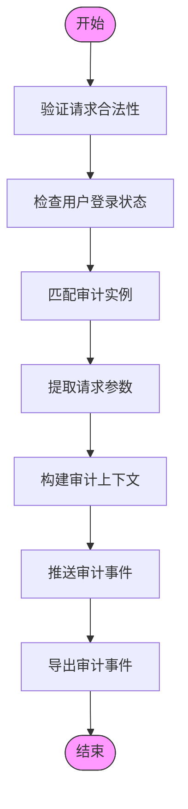

# 审计日志

<cite>
**本文档引用的文件**
- [middleware.py](file://bklog/apps/log_audit/middleware.py)
- [models.py](file://bklog/apps/log_audit/models.py)
- [client.py](file://bklog/apps/log_audit/client.py)
- [instance.py](file://bklog/apps/log_audit/instance.py)
- [apps.py](file://bklog/apps/log_audit/apps.py)
- [constants.py](file://bklog/apps/constants.py)
- [audit_record_views.py](file://bklog/apps/bk_log_admin/views/audit_record_views.py)
- [audit_record.py](file://bklog/apps/bk_log_admin/handlers/audit_record.py)
- [admin.py](file://bklog/apps/log_audit/admin.py)
</cite>

## 目录
1. [引言](#引言)
2. [审计日志数据模型](#审计日志数据模型)
3. [审计日志采集机制](#审计日志采集机制)
4. [审计日志存储与查询](#审计日志存储与查询)
5. [安全事件监控方案](#安全事件监控方案)
6. [合规性要求与保留策略](#合规性要求与保留策略)
7. [审计日志分析与可视化](#审计日志分析与可视化)
8. [第三方系统集成](#第三方系统集成)
9. [结论](#结论)

## 引言
审计日志系统是蓝鲸日志平台的关键安全组件，负责记录和监控所有关键操作和安全事件。本系统基于OpenTelemetry标准实现，通过中间件自动捕获用户操作，记录详细的审计信息，包括操作类型、操作对象、操作者和时间戳等关键字段。审计日志不仅满足合规性要求，还为安全分析和事件追溯提供了重要支持。

**审计日志数据模型**定义了记录操作日志的核心结构，包括操作时间、操作者、业务ID、操作对象类型、操作对象ID、操作方法和请求参数等字段。这些字段共同构成了完整的操作上下文，为后续的分析和查询提供了基础。

**审计日志采集机制**通过Django中间件实现，该中间件在请求处理过程中自动捕获关键操作，并根据预定义的规则将操作映射到相应的审计实例。这种无侵入式的采集方式确保了所有关键操作都能被完整记录，而无需在业务代码中添加额外的审计逻辑。

**审计日志存储与查询**功能提供了对审计记录的持久化存储和高效查询能力。系统通过专门的视图集和序列化器实现了分页查询、条件过滤和数据格式化等功能，使用户能够方便地检索和分析审计日志。

## 审计日志数据模型
审计日志的数据模型定义了记录用户操作的核心结构，存储在`UserOperationRecord`模型中。该模型包含多个关键字段，用于完整描述一次操作的上下文信息。


**数据模型来源**
- [models.py](file://bklog/apps/log_audit/models.py#L29-L42)

**数据模型字段说明**

| 字段名称 | 类型 | 描述 | 索引 |
|---------|------|------|------|
| created_at | DateTimeField | 操作时间，自动记录操作发生的时间戳 | 否 |
| created_by | CharField | 操作者，记录执行操作的用户账号 | 是 |
| bk_biz_id | IntegerField | 业务ID，标识操作所属的业务范围 | 是 |
| record_type | CharField | 操作对象类型，如采集项、存储集群、索引集等 | 是 |
| record_sub_type | CharField | 操作对象子类型，提供更细粒度的对象分类 | 否 |
| record_object_id | IntegerField | 操作对象ID，标识具体的操作目标 | 是 |
| action | CharField | 操作方法，如创建、更新、删除等 | 否 |
| params | JsonField | 请求参数，以JSON格式存储操作的详细参数 | 否 |

**数据模型来源**
- [models.py](file://bklog/apps/log_audit/models.py#L29-L42)
- [0001_initial.py](file://bklog/apps/log_audit/migrations/0001_initial.py#L35-L52)

操作对象类型（record_type）和操作方法（action）使用枚举类进行定义，确保了数据的一致性和可读性。`UserOperationTypeEnum`枚举定义了所有可能的操作对象类型，包括采集项、存储集群、索引集、检索配置等。`UserOperationActionEnum`枚举则定义了所有可能的操作方法，如创建、更新、删除、启动、停止等。


**数据模型来源**
- [constants.py](file://bklog/apps/constants.py#L65-L113)

## 审计日志采集机制
审计日志的采集通过中间件机制实现，该机制在Django请求处理流程中自动捕获关键操作并生成审计记录。`RequestProvider`中间件是审计日志采集的核心组件，它在请求处理的开始和结束阶段执行相应的操作。


**采集机制来源**
- [middleware.py](file://bklog/apps/log_audit/middleware.py#L12-L26)
- [instance.py](file://bklog/apps/log_audit/instance.py#L88-L128)

采集机制的工作流程如下：

1. **请求拦截**：`RequestProvider`中间件的`process_request`方法在请求处理开始时被调用，它将当前请求对象存储在本地线程中，为后续的审计记录提供上下文。

2. **响应处理**：`process_response`方法在请求处理完成后被调用，它调用`push_event`函数将审计事件推送到审计系统。

3. **事件推送**：`push_event`函数是审计日志采集的核心逻辑，它执行以下步骤：
   - 验证请求对象的合法性，确保包含必要的属性
   - 排除未登录状态的请求
   - 根据请求路径匹配到相应的审计实例
   - 构建审计上下文和扩展数据
   - 调用审计客户端上报审计事件



**采集机制来源**
- [instance.py](file://bklog/apps/log_audit/instance.py#L88-L128)

审计实例的匹配通过`InstanceFilter`元组实现，该元组包含一系列正则表达式和对应的审计实例类。系统遍历这个元组，找到与请求路径匹配的第一个条目，并创建相应的审计实例。

```python
InstanceFilter = (
    # 检索相关操作
    (re.compile(r"/api/v1/search/index_set/\?space_uid=\w+"), LogSearchInstance),
    (re.compile(r"/api/v1/search/index_set/\d+/search"), LogSearchInstance),
    # 日志提取相关操作
    (re.compile(r"/api/v1/log_extract/explorer/list_file"), LogExtractInstance),
    (re.compile(r"/api/v1/log_extract/explorer/strategies"), LogExtractInstance),
    # 其他操作...
)
```

**采集机制来源**
- [instance.py](file://bklog/apps/log_audit/instance.py#L131-L220)

## 审计日志存储与查询
审计日志的存储与查询功能通过Django的ModelViewSet和序列化器实现，提供了对审计记录的持久化存储和高效查询能力。系统通过专门的视图集和序列化器实现了分页查询、条件过滤和数据格式化等功能。


**存储与查询来源**
- [audit_record_views.py](file://bklog/apps/bk_log_admin/views/audit_record_views.py#L32-L85)
- [audit_record.py](file://bklog/apps/bk_log_admin/handlers/audit_record.py#L31-L48)
- [serializers.py](file://bklog/apps/bk_log_admin/serializers.py#L52-L60)

`AuditRecordViewSet`是审计日志查询的核心视图集，它继承自`ModelViewSet`，提供了标准的CRUD操作接口。该视图集的主要功能包括：

1. **模型绑定**：通过`model`属性指定`UserOperationRecord`作为数据模型，实现了与数据库表的映射。

2. **序列化器管理**：`get_serializer_class`方法根据不同的操作类型返回相应的序列化器，确保数据的正确序列化和反序列化。

3. **列表查询**：重写了`list`方法，实现了分页参数验证和响应数据格式化。在返回数据前，通过`AuditRecordHandler.response_format`方法对数据进行格式化处理。

`AuditRecordHandler`类负责审计记录的格式化处理，其`response_format`方法将原始的数据库记录转换为用户友好的格式：

```python
def response_format(data: dict):
    action = UserOperationActionEnum.get_choice_label(data["action"])
    record_type = UserOperationTypeEnum.get_choice_label(data["record_type"])
    param = json.dumps(data["params"]) if data["params"] else _("空")
    time_zone = get_local_param("time_zone")
    return {
        "id": data["id"],
        "bk_biz_id": data["bk_biz_id"],
        "content": "{} {} {}：{}".format(action, record_type, _("请求内容"), param),
        "created_by": data["created_by"],
        "created_at": arrow.get(data["created_at"]).to(tz=time_zone).strftime("%Y-%m-%d %H:%M:%S%z"),
        "result": True,
        "record_type": data["record_type"],
        "action": data["action"],
        "record_object_id": data["record_object_id"],
    }
```

**存储与查询来源**
- [audit_record.py](file://bklog/apps/bk_log_admin/handlers/audit_record.py#L31-L48)

系统还提供了Django管理界面，用于查看和管理审计记录。`UserOperationRecordAdmin`类继承自`AppModelAdmin`，配置了列表显示字段、搜索字段和权限控制。


**存储与查询来源**
- [admin.py](file://bklog/apps/log_audit/admin.py#L29-L47)

## 安全事件监控方案
安全事件监控方案基于审计日志数据，通过预定义的检测规则识别异常行为和潜在安全威胁。系统重点关注异常登录、权限变更、配置修改等关键事件，提供实时告警和事后分析能力。


**安全事件监控来源**
- [instance.py](file://bklog/apps/log_audit/instance.py#L70-L220)
- [constants.py](file://bklog/apps/constants.py#L92-L113)

系统通过以下方式实现安全事件监控：

1. **异常登录检测**：监控登录相关的操作日志，识别频繁失败的登录尝试、非常规时间的登录行为以及来自异常地理位置的登录请求。当检测到可疑的登录行为时，系统会触发相应的安全告警。

2. **权限变更监控**：跟踪所有与权限相关的操作，包括权限的分配、回收和修改。系统特别关注高权限账户的权限变更，以及批量权限分配等高风险操作。

3. **配置修改审计**：记录所有关键配置的修改操作，包括安全策略、访问控制列表和系统参数等。通过对比配置变更前后的差异，识别潜在的安全风险。

4. **操作频率分析**：分析用户操作的频率和模式，识别异常的操作行为。例如，短时间内执行大量删除操作或频繁修改关键配置等行为都会被标记为可疑。

5. **关联分析**：将多个相关的审计事件进行关联分析，识别复杂的攻击模式。例如，攻击者可能先进行信息收集，然后尝试权限提升，最后执行破坏性操作。


**安全事件监控来源**
- [instance.py](file://bklog/apps/log_audit/instance.py#L88-L128)

## 合规性要求与保留策略
审计日志系统遵循严格的合规性要求和数据保留策略，确保审计数据的完整性、可用性和安全性。这些策略不仅满足法律法规的要求，也符合企业内部的安全管理规范。


**合规性与保留策略来源**
- [models.py](file://bklog/apps/log_audit/models.py#L29-L42)
- [apps.py](file://bklog/apps/log_audit/apps.py#L35-L38)

合规性要求主要包括：

1. **数据完整性**：通过防篡改机制确保审计日志不被非法修改或删除。系统采用只读权限控制和操作记录双重保护，任何对审计日志的访问和操作都会被记录。

2. **数据可用性**：采用高可用存储架构，确保审计日志在各种故障情况下仍可访问。系统支持数据备份和恢复机制，防止数据丢失。

3. **数据安全性**：实施严格的访问控制策略，只有授权人员才能访问审计日志。系统支持基于角色的访问控制（RBAC），确保最小权限原则的实施。

4. **审计可追溯性**：记录完整的操作上下文，包括操作时间、操作者、操作对象和操作参数等信息，确保任何操作都可追溯。

保留策略包括：

1. **保留期限**：根据法律法规和业务需求，设定合理的审计日志保留期限。系统支持配置化的保留策略，可根据不同业务场景调整保留时间。

2. **归档策略**：对历史审计日志进行归档处理，采用冷热数据分离的存储方式，既保证了数据的可访问性，又优化了存储成本。

3. **清理机制**：建立自动化的日志清理机制，在保留期限到期后自动清理过期的日志数据，确保存储空间的有效利用。

4. **备份策略**：实施定期的数据备份策略，包括本地备份和异地备份，防止因硬件故障或灾难事件导致的数据丢失。

## 审计日志分析与可视化
审计日志分析与可视化功能提供了强大的数据分析和展示能力，帮助安全运营人员快速理解审计数据，发现潜在的安全威胁。系统通过多种可视化方式呈现审计日志的统计信息和趋势分析。


**分析与可视化来源**
- [audit_record_views.py](file://bklog/apps/bk_log_admin/views/audit_record_views.py#L32-L85)
- [audit_record.py](file://bklog/apps/bk_log_admin/handlers/audit_record.py#L31-L48)

分析与可视化功能的主要特点包括：

1. **操作统计**：提供按操作类型、操作对象、操作者等维度的统计图表，帮助了解系统的使用情况和操作分布。

2. **时间趋势**：展示审计事件的时间序列趋势，识别操作频率的变化规律，发现异常的时间模式。

3. **用户行为分析**：分析用户的操作行为模式，识别异常的用户行为，如频繁的失败操作或非常规的操作序列。

4. **地理分布**：如果包含地理位置信息，可以展示操作的地理分布情况，帮助识别异地登录等安全威胁。

5. **关系网络**：构建操作者、操作对象和操作类型的关系网络，发现复杂的操作模式和潜在的安全风险。

系统还支持交互式的数据探索功能，用户可以通过时间范围选择、条件过滤和数据钻取等方式，深入分析特定的审计事件。同时，提供报告导出功能，支持将分析结果导出为PDF、CSV等格式，便于分享和存档。

## 第三方系统集成
审计日志系统支持与多种第三方安全系统的集成，实现数据共享和协同防护。通过标准化的接口和协议，审计日志可以与其他安全组件无缝对接，构建统一的安全防护体系。


**第三方集成来源**
- [client.py](file://bklog/apps/log_audit/client.py#L23-L34)
- [apps.py](file://bklog/apps/log_audit/apps.py#L35-L38)

主要的集成方式包括：

1. **SIEM集成**：通过标准化的日志格式和协议，将审计日志实时推送至SIEM（安全信息与事件管理）系统，实现安全事件的集中管理和关联分析。

2. **SOAR集成**：与SOAR（安全编排、自动化与响应）平台集成，将检测到的安全事件自动转换为响应工单，触发预定义的响应流程。

3. **EDR集成**：与EDR（终端检测与响应）解决方案集成，将用户操作与终端行为关联分析，提供更全面的安全态势感知。

4. **身份管理集成**：与身份管理系统集成，同步用户身份信息和权限变更，确保审计日志中的用户信息准确无误。

5. **漏洞管理集成**：与漏洞管理系统集成，将配置修改与漏洞修复关联，跟踪安全策略的执行情况。

系统通过`bk_audit_client`客户端实现与外部系统的通信，该客户端支持多种导出器（Exporter），可以根据需要配置不同的数据推送方式。

```python
bk_audit_client = BkAudit(
    settings.APP_CODE,
    settings.SECRET_KEY,
    {"formatter": DjangoFormatter(), "exporters": [OTLogExporter()], "service_name_handler": ServiceNameHandler},
)
```

**第三方集成来源**
- [client.py](file://bklog/apps/log_audit/client.py#L30-L34)

## 结论
审计日志系统作为蓝鲸日志平台的核心安全组件，通过完善的采集、存储、分析和监控机制，为系统的安全运营提供了有力支持。系统基于OpenTelemetry标准实现，采用无侵入式的中间件采集方式，确保了所有关键操作都能被完整记录。

通过定义清晰的数据模型和采集规则，系统能够准确记录操作时间、操作者、操作对象和操作参数等关键信息，为安全分析和事件追溯提供了完整的数据基础。同时，系统提供了强大的查询和分析功能，支持对审计日志的高效检索和可视化展示。

在安全事件监控方面，系统通过预定义的检测规则，能够及时发现异常登录、权限变更和配置修改等潜在安全威胁，并提供相应的告警和响应机制。严格的合规性要求和数据保留策略，确保了审计数据的完整性、可用性和安全性。

未来，系统可以进一步增强机器学习能力，实现更智能的异常检测和行为分析。同时，通过深化与第三方安全系统的集成，构建更完善的安全防护体系，为企业的数字化转型提供坚实的安全保障。