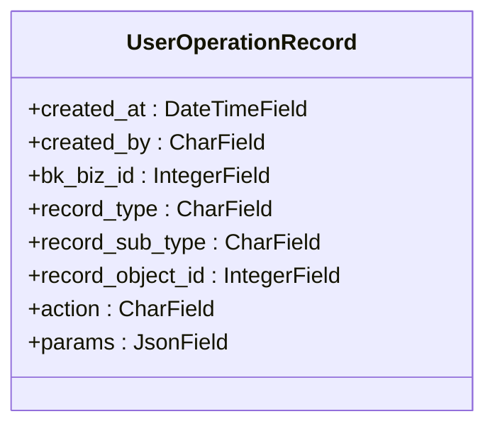
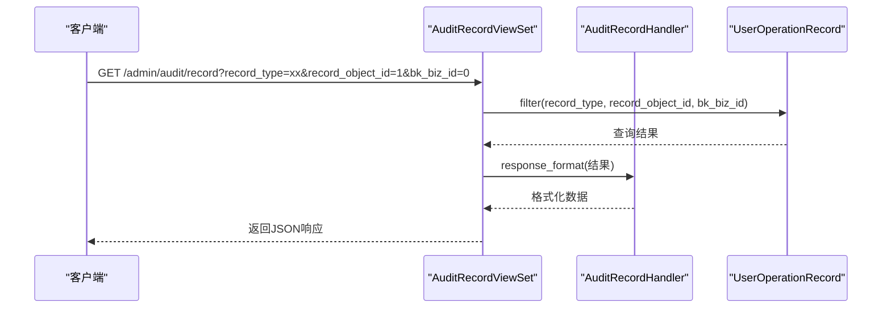
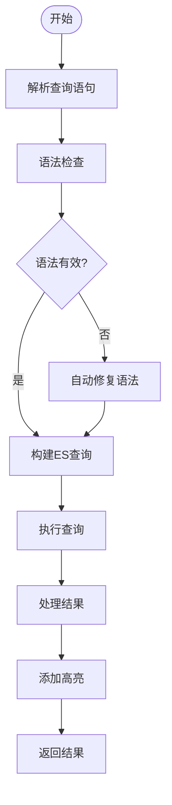
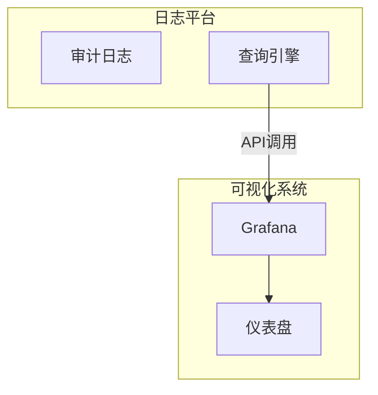

# 审计日志查询与分析

<cite>
**本文档引用的文件**   
- [models.py](file://bklog/apps/log_audit/models.py)
- [audit_record_views.py](file://bklog/apps/bk_log_admin/views/audit_record_views.py)
- [audit_record.py](file://bklog/apps/bk_log_admin/handlers/audit_record.py)
- [constants.py](file://bklog/apps/constants.py)
- [search_handlers_esquery.py](file://bklog/apps/log_search/handlers/search/search_handlers_esquery.py)
- [utils.py](file://bklog/apps/log_search/utils.py)
</cite>

## 目录
1. [简介](#简介)
2. [审计日志数据模型](#审计日志数据模型)
3. [基于Django ORM的查询接口](#基于django-orm的查询接口)
4. [高级查询功能](#高级查询功能)
5. [典型使用场景](#典型使用场景)
6. [与可视化系统的集成](#与可视化系统的集成)
7. [分析工具功能](#分析工具功能)
8. [与第三方SIEM系统的集成](#与第三方siem系统的集成)
9. [结论](#结论)

## 简介
审计日志查询与分析功能是蓝鲸日志平台的核心安全特性，用于记录和追踪系统中所有关键操作。本系统通过Django ORM和RESTful API提供强大的查询能力，支持按操作类型、操作者、时间范围等条件进行过滤。系统还提供了全文搜索、关联查询等高级功能，并能与可视化仪表盘和第三方SIEM系统集成，实现全面的安全监控和分析。

## 审计日志数据模型
审计日志的核心数据模型是`UserOperationRecord`，它记录了系统中所有重要操作的详细信息。该模型包含操作时间、操作者、业务ID、操作对象类型、操作方法和请求参数等关键字段，为后续的查询和分析提供了完整的数据基础。

**图表来源**
- [models.py](file://bklog/apps/log_audit/models.py#L29-L42)

**本节来源**
- [models.py](file://bklog/apps/log_audit/models.py#L29-L42)

## 基于Django ORM的查询接口
系统提供了基于Django ORM的查询接口，通过`AuditRecordViewSet`实现RESTful API。该接口支持多种查询条件，包括记录类型、记录对象ID、业务ID以及分页参数。查询接口返回标准化的响应格式，包含操作记录的总数和详细列表。

**图表来源**
- [audit_record_views.py](file://bklog/apps/bk_log_admin/views/audit_record_views.py#L32-L85)
- [audit_record.py](file://bklog/apps/bk_log_admin/handlers/audit_record.py#L31-L48)

**本节来源**
- [audit_record_views.py](file://bklog/apps/bk_log_admin/views/audit_record_views.py#L32-L85)
- [audit_record.py](file://bklog/apps/bk_log_admin/handlers/audit_record.py#L31-L48)

## 高级查询功能
系统支持多种高级查询功能，包括全文搜索和关联查询。全文搜索基于Lucene语法，支持复杂的查询表达式。关联查询能够将审计日志与其他系统数据（如索引集、采集配置等）进行关联分析，提供更全面的上下文信息。

### 全文搜索

**图表来源**
- [search_handlers_esquery.py](file://bklog/apps/log_search/handlers/search/search_handlers_esquery.py#L166-L200)
- [utils.py](file://bklog/apps/log_search/utils.py#L158-L215)

### 关联查询
关联查询功能通过`UserOperationTypeEnum`和`UserOperationActionEnum`枚举类型实现，能够将操作记录与具体的业务对象类型（如采集项、存储集群、索引集等）和操作方法（创建、更新、删除等）进行关联。这种设计使得查询结果不仅包含操作的基本信息，还能提供操作对象的上下文。

**本节来源**
- [constants.py](file://bklog/apps/constants.py#L65-L113)
- [search_handlers_esquery.py](file://bklog/apps/log_search/handlers/search/search_handlers_esquery.py#L166-L200)

## 典型使用场景
### 查找特定用户的操作历史
通过`created_by`字段可以轻松查询特定用户的所有操作历史。系统支持分页查询，确保在大量数据情况下仍能高效获取结果。

### 检测异常登录模式
通过分析`record_type`为"login"且`action`为"failed"的操作记录，结合时间范围和频率分析，可以检测潜在的暴力破解攻击。系统还支持将这些异常模式配置为告警规则。

**本节来源**
- [audit_record_views.py](file://bklog/apps/bk_log_admin/views/audit_record_views.py#L41-L85)
- [constants.py](file://bklog/apps/constants.py#L92-L113)

## 与可视化系统的集成
审计日志可以集成到Grafana等可视化系统中，通过仪表盘展示关键指标和趋势。系统提供了`MonitorGrafanaHandler`类，支持将查询结果保存到监控仪表盘，实现操作审计的可视化监控。

**图表来源**
- [monitor.py](file://bklog/apps/grafana/handlers/monitor.py#L7-L38)

## 分析工具功能
系统提供了丰富的分析工具功能，包括日志聚合、趋势分析和告警规则配置。日志聚合功能支持按不同维度（如操作类型、操作者、时间等）对日志进行分组统计。趋势分析能够识别操作频率的变化模式。告警规则配置允许用户定义自定义的告警条件，及时发现异常行为。

**本节来源**
- [constants.py](file://bklog/apps/constants.py#L65-L113)
- [search_handlers_esquery.py](file://bklog/apps/log_search/handlers/search/search_handlers_esquery.py#L166-L200)

## 与第三方SIEM系统的集成
系统支持与第三方SIEM系统集成，通过API接口实现日志导出和实时推送。集成方案包括批量导出和流式推送两种模式，满足不同场景的需求。系统还支持配置通知方式和存储类型，确保日志数据的安全传输和存储。

**本节来源**
- [constants.py](file://bklog/apps/constants.py#L31-L63)
- [utils.py](file://bklog/apps/log_search/utils.py#L232-L252)

## 结论
蓝鲸日志平台的审计日志查询与分析功能提供了全面的操作审计能力。通过基于Django ORM的查询接口，用户可以灵活地检索和分析日志数据。系统支持高级查询功能和多种使用场景，能够有效支持安全审计和异常检测。与可视化系统和第三方SIEM系统的集成进一步增强了系统的监控和分析能力。