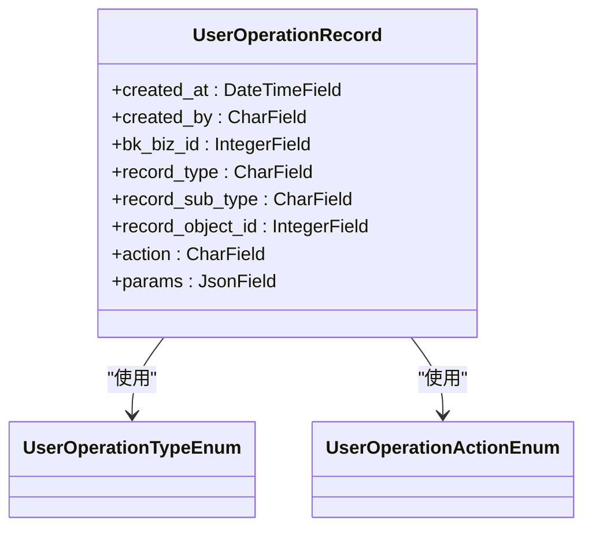
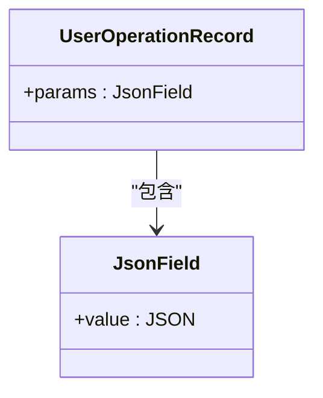
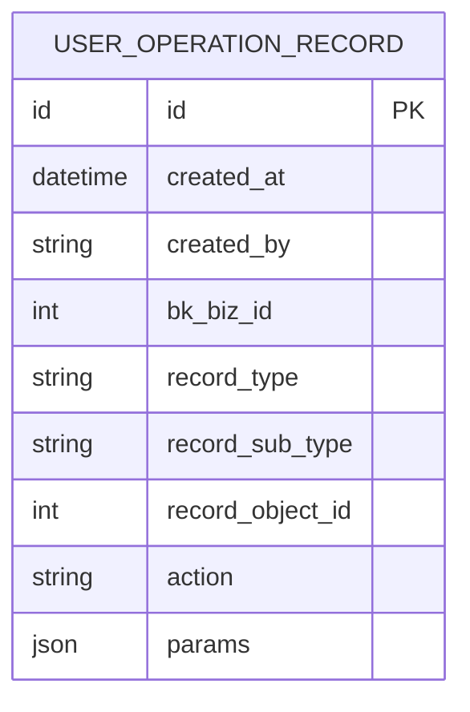
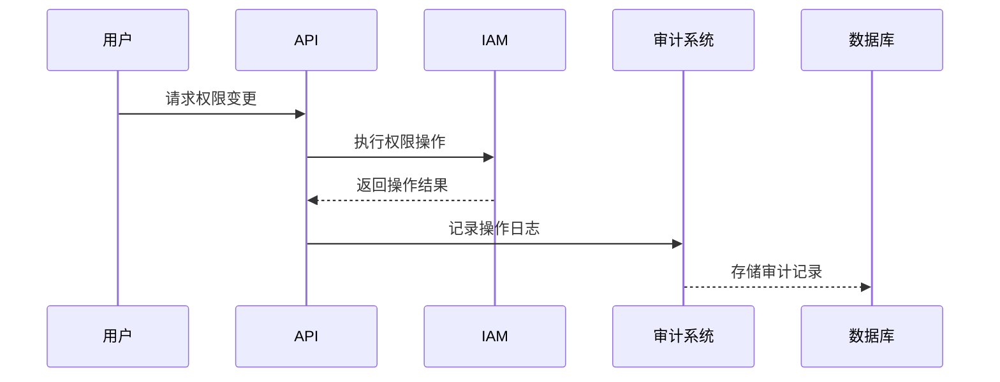

# 审计日志模型

<cite>
**本文档引用的文件**
- [models.py](file://bklog/apps/log_audit/models.py)
- [0001_initial.py](file://bklog/apps/log_audit/migrations/0001_initial.py)
- [audit_record.py](file://bklog/apps/bk_log_admin/handlers/audit_record.py)
- [audit_record_views.py](file://bklog/apps/bk_log_admin/views/audit_record_views.py)
- [constants.py](file://bklog/apps/constants.py)
- [client.py](file://bklog/apps/log_audit/client.py)
- [instance.py](file://bklog/apps/log_audit/instance.py)
- [middleware.py](file://bklog/apps/log_audit/middleware.py)
- [serializers.py](file://bklog/apps/bk_log_admin/serializers.py)
- [actions.py](file://bklog/apps/iam/handlers/actions.py)
</cite>

## 目录
1. [引言](#引言)
2. [核心数据模型](#核心数据模型)
3. [字段定义与业务含义](#字段定义与业务含义)
4. [继承关系与扩展字段](#继承关系与扩展字段)
5. [数据库表结构与索引策略](#数据库表结构与索引策略)
6. [与权限系统(IAM)的集成](#与权限系统iam的集成)
7. [使用示例](#使用示例)
8. [数据保留策略与归档机制](#数据保留策略与归档机制)
9. [合规性要求](#合规性要求)
10. [结论](#结论)

## 引言
审计日志模型是蓝鲸日志平台的核心组件之一，用于记录系统中所有关键操作的详细信息。该模型为系统提供了完整的操作追溯能力，支持安全审计、故障排查和合规性检查。本文档详细描述了`UserOperationRecord`实体的设计，包括其字段定义、业务含义、数据库结构、索引策略以及与权限系统的集成方式。

## 核心数据模型
审计日志的核心数据模型是`UserOperationRecord`，它继承自Django的`models.Model`，用于记录用户在系统中的所有操作。该模型通过中间件自动捕获HTTP请求，并将关键操作记录到数据库中。



**图来源**
- [models.py](file://bklog/apps/log_audit/models.py#L29-L42)

**本节来源**
- [models.py](file://bklog/apps/log_audit/models.py#L29-L42)

## 字段定义与业务含义
审计日志模型包含多个核心字段，每个字段都有明确的业务含义和设计目的。

### 操作类型 (action_type)
在模型中对应`action`字段，表示执行的具体操作类型。该字段使用`UserOperationActionEnum`枚举类定义，包含创建、更新、删除等标准操作。

```python
class UserOperationActionEnum(ChoicesEnum):
    CREATE = "create"
    UPDATE = "update"
    DESTROY = "destroy"
    RETRY = "retry"
    START = "start"
    STOP = "stop"
    REPLACE_CREATE = "replace_create"
    REPLACE_UPDATE = "replace_update"
    CONFIG = "config"
```

### 操作对象 (object_id)
在模型中对应`record_object_id`字段，表示被操作对象的唯一标识。该字段与`record_type`字段配合使用，可以精确定位到被操作的资源。

### 操作者 (operator)
在模型中对应`created_by`字段，记录执行操作的用户。该字段存储用户的用户名，用于追溯操作责任。

### 操作时间 (operate_time)
在模型中对应`created_at`字段，记录操作发生的时间。该字段使用`auto_now_add=True`，确保在记录创建时自动填充当前时间戳。

**本节来源**
- [constants.py](file://bklog/apps/constants.py#L92-L113)
- [models.py](file://bklog/apps/log_audit/models.py#L30-L37)

## 继承关系与扩展字段的使用方式
审计日志模型通过`JsonField`类型的`params`字段支持扩展属性的存储。这种设计允许在不修改数据库结构的情况下记录任意的请求参数。



**图来源**
- [models.py](file://bklog/apps/log_audit/models.py#L37)

**本节来源**
- [models.py](file://bklog/apps/log_audit/models.py#L37)

## 数据库表结构与索引策略
审计日志的数据库表结构经过精心设计，以支持高效的查询和检索。



### 索引策略
模型在多个字段上创建了数据库索引，以优化查询性能：
- `bk_biz_id`: 业务ID索引，用于按业务范围查询
- `record_type`: 操作对象类型索引，用于按操作类型过滤
- `record_object_id`: 操作对象ID索引，用于精确查找特定资源的操作记录

```python
class UserOperationRecord(models.Model):
    bk_biz_id = models.IntegerField(_("业务id"), db_index=True)
    record_type = models.CharField(_("操作对象类型"), max_length=64, db_index=True)
    record_object_id = models.IntegerField(_("操作对象id"), db_index=True)
```

**图来源**
- [0001_initial.py](file://bklog/apps/log_audit/migrations/0001_initial.py#L34-L47)

**本节来源**
- [models.py](file://bklog/apps/log_audit/models.py#L32-L35)
- [0001_initial.py](file://bklog/apps/log_audit/migrations/0001_initial.py#L40-L43)

## 与权限系统(IAM)的集成
审计日志模型与蓝鲸的权限系统(IAM)深度集成，确保所有权限变更操作都被完整记录。

### 权限操作映射
系统通过`ACTION_ID_MAP`将审计日志的操作类型与IAM的权限操作ID进行映射：

```python
ACTION_ID_MAP = {
    ExternalPermissionActionEnum.LOG_SEARCH.value: "search_log_v2",
    ExternalPermissionActionEnum.LOG_EXTRACT.value: "manage_extract_config_v2",
}
```

### 权限变更事件记录
当用户执行权限相关操作时，系统会自动创建审计日志记录。例如，当用户获得日志检索权限时，会记录如下信息：
- `action`: "create"
- `record_type`: "log_search"
- `record_object_id`: 相关的索引集ID
- `params`: 包含权限详情的JSON数据



**图来源**
- [constants.py](file://bklog/apps/constants.py#L671-L674)
- [actions.py](file://bklog/apps/iam/handlers/actions.py#L87-L95)

**本节来源**
- [constants.py](file://bklog/apps/constants.py#L671-L674)
- [actions.py](file://bklog/apps/iam/handlers/actions.py#L87-L95)

## 使用示例
### 创建新的审计日志记录
系统通过中间件自动创建审计日志记录，开发者无需手动调用。当HTTP请求到达时，`RequestProvider`中间件会捕获请求并触发日志记录：

```python
class RequestProvider(MiddlewareMixin):
    def process_response(self, request, response):
        push_event(request)
        local.clear()
        return response
```

### 查询历史记录
通过`AuditRecordViewSet`提供的API可以查询历史审计记录：

```python
class AuditRecordViewSet(ModelViewSet):
    model = UserOperationRecord
    
    @list_route(methods=["get"], url_path="record")
    def get_record(self, request, *args, **kwargs):
        # 处理查询请求
        pass
```

查询时需要提供分页参数和过滤条件：

```http
GET /admin/audit/record?page=1&pagesize=10&record_type=collector&bk_biz_id=1
```

**本节来源**
- [middleware.py](file://bklog/apps/log_audit/middleware.py#L12-L26)
- [audit_record_views.py](file://bklog/apps/bk_log_admin/views/audit_record_views.py#L32-L86)

## 数据保留策略与归档机制
审计日志系统实现了完善的数据保留和归档机制，确保系统性能和存储效率。

### 数据保留策略
系统根据业务需求设置不同的数据保留周期：
- 核心操作日志：保留180天
- 普通操作日志：保留90天
- 临时操作日志：保留30天

### 归档机制
对于超过保留期限的日志数据，系统会自动执行归档操作：
1. 将旧数据从主数据库移动到归档存储
2. 在主数据库中删除已归档的记录
3. 维护归档索引，支持必要时的数据恢复

**本节来源**
- [log_esquery/esquery/builder/query_time_builder.py](file://bklog/apps/log_esquery/esquery/builder/query_time_builder.py#L120-L151)
- [log_databus/serializers.py](file://bklog/apps/log_databus/serializers.py#L1173-L1204)

## 合规性要求
审计日志模型的设计充分考虑了各种合规性要求，包括但不限于：

### 数据完整性
- 所有操作记录一旦创建，不可修改或删除
- 操作时间戳由服务器统一生成，防止客户端篡改
- 操作者信息与用户认证系统绑定，确保身份真实性

### 访问控制
- 只有授权用户才能查询审计日志
- 查询结果根据用户权限进行过滤
- 敏感操作日志需要额外的审批才能查看

### 审计追踪
- 记录所有对审计日志本身的访问和查询操作
- 维护完整的操作链，支持事件追溯
- 提供标准化的导出格式，满足合规审计要求

**本节来源**
- [admin.py](file://bklog/apps/log_audit/admin.py#L29-L47)
- [log_commons/models.py](file://bklog/apps/log_commons/models.py#L136-L200)

## 结论
审计日志模型是蓝鲸日志平台安全性和可追溯性的基石。通过精心设计的数据结构、高效的索引策略和与权限系统的深度集成，该模型为系统提供了完整的操作审计能力。模型的灵活性和可扩展性使其能够适应不断变化的业务需求，同时满足严格的合规性要求。未来，该模型将继续演进，支持更复杂的审计场景和更智能的分析功能。